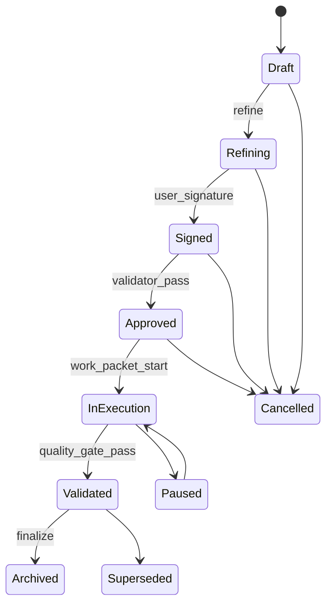

# 2. System Architecture

## 2.1 High-Level Architecture

**Why**  
Before diving into implementation details, you need a mental map of how all subsystems relate. This section provides that overview, enabling targeted deep-dives into specific layers.

**What**  
Enumerates and briefly describes the ten major architectural layers: Desktop Shell, Workspace Data Layer, Model Runtime Layer, Workflow Engine, Flight Recorder, Capability Layer, Connectors, AI UX, Taste Engine, and Dev Tools.

**Jargon**  
- **Tauri**: Rust-based framework for building lightweight desktop apps using system webview instead of bundled Chromium.
- **Rust Coordinator**: The central Rust process managing data, CRDT state, workflows, and service connections.
- **Model Runtime Layer**: Abstraction over local inference servers (Ollama, vLLM, TGI, llama.cpp, ComfyUI), accessed via HTTP/gRPC.
- **Flight Recorder**: Subsystem for logging prompts, model calls, tool invocations, and workflow steps for replay and debugging.
- **WASI-style Capability System**: Security model where each tool/agent receives explicit, scoped, time-limited permission tokens.
- **Shadow Workspace**: Background indexer that parses, chunks, embeds, and indexes workspace content for retrieval.
- **Taste Engine**: Subsystem capturing user style/preferences via embeddings and JSON descriptors.

---

At a high level, Handshake consists of the following major subsystems:

### 2.1.1 Desktop Shell & Coordinator

- **Tauri app** with a **React** front-end.
- **Rust coordinator** process managing local data, CRDT documents, workflows, and connections to local services (model runtimes, sync, etc.).

### 2.1.2 Workspace Data Layer

- **Local document store** (SQLite + CRDT data structures).
- **Knowledge graph** (embedded graph/relational engine – e.g. CozoDB or KuzuDB, or DuckDB with graph extension).
- **Shadow Workspace** for parsing, chunking, embedding, and indexing.
- **CRDT engine (Yjs or equivalent)** for real-time document/canvas/table collaboration and AI participation.

### 2.1.3 Model Runtime Layer

- Encapsulates calls from the coordinator into the local model servers described in the runtime research (Ollama, vLLM/TGI, llama.cpp, SDXL/ComfyUI, etc.), over HTTP/gRPC.


- When models or agents invoke tools (local tool calling or MCP-backed), those calls MUST flow through the Rust coordinator and the Tool Gate (capability + policy + budget + logging) defined in §6.0.2 and §11.3; tools never talk directly to the UI or filesystem.

### 2.1.4 Automation & Workflow Engine

- A **local workflow runtime** that executes typed node graphs:
  - Triggers (time, events, webhooks).
  - Workspace operations (read/write docs, canvases, tables).
  - AI nodes (LLM calls, embedding jobs, image generation).
  - Control flow (branching, loops, retries).
- Stores state and history in **SQLite**, with Temporal-inspired durable execution and resumability.

All AI work—whether editing documents, transforming spreadsheets, transcribing audio, or ingesting files—executes as **AI jobs** under a unified model.

### 2.1.5 Observability & Flight Recorder

- A **Flight Recorder** subsystem using **DuckDB** (or similar) to log every significant event:
  - Prompts, model calls, tool calls, workflow steps.
  - Errors, timeouts, resource usage snapshots.
- A replay/debugger UI to explore and reproduce "timelines" of actions.

### 2.1.6 Capability & Security Layer

- A **WASI-style capability system** controlling what each tool, agent, workflow, or plugin can interact with:
  - File system scopes.
  - Network domains.
  - Workspace entities (docs, tables, canvases, tags).
- Capability tokens are scoped, time-limited, and auditable.
- All AI jobs MUST respect these capability scopes.

### 2.1.7 Connectors & External Data Layer

- Adapters for external systems:
  - Email via **JMAP**.
  - Calendar via **CalDAV** (sync/outbox/idempotency + MCP adapter wrapping: see §10.4).
  - Generic HTTP / webhook connectors.
  - Emerging **Model Context Protocol (MCP)** tools for structured knowledge sources.
- External data is funneled into the **knowledge graph** and/or stored as RawContent with DerivedContent summarization and linking.


- MCP-based connectors:
  - When an external system exposes an MCP server, the Rust coordinator SHOULD prefer MCP over ad-hoc HTTP or custom protocols.
  - All MCP traffic from connectors MUST pass through the same MCP Gate, capability, and Flight Recorder paths as the internal Python Orchestrator (§11.3).
  - MCP connectors MUST NOT bypass capability checks or consent prompts defined in the Capabilities & Consent Model (§11.1).


### 2.1.8 AI UX & Interaction Layer

- Unified AI entry points:
  - **Command Palette** (explicit tasks).
  - **Structural Editor** (contextual refactors and transformations).
  - **Background Agents** (ongoing suggestions, linking, clustering).
- All tied to the Raw/Derived/Display semantics and the capability system.

### 2.1.9 Taste Engine & Personalisation Layer

- Models and embeddings that capture the user's style, preferences, and "visual taste".
- Represented as a **JSON taste descriptor** injected into prompts and model configuration.
- **This is where DES-001, IMG-001, and SYM-001 from the Diary integrate** — the extraction pipeline feeds the Taste Engine.

### 2.1.10 Dev Tools & Extension Platform

- An integrated terminal and scripting interface.
- Extension/plugin APIs for scripts, custom views, and AI tools.
- Sandboxed execution environments for untrusted code.

---

### 2.1.11 Hardware Context: The RTX 3090 Setup

**Why this matters:** Understanding VRAM constraints is critical for model selection and concurrent execution planning.

```
┌─────────────────────────────────────────────────────────┐
│                   YOUR SETUP                            │
├─────────────────────────────────────────────────────────┤
│  CPU:  AMD Ryzen 5950X (16 cores, 32 threads)          │
│  RAM:  128 GB DDR4                                      │
│  GPU:  NVIDIA RTX 3090 (24 GB VRAM)                    │
│  OS:   Windows                                          │
└─────────────────────────────────────────────────────────┘
```

#### 2.1.11.1 VRAM Budget

- ~1-2 GB: System/driver overhead (always used)
- Remaining: ~22 GB for models

| Configuration | VRAM Used | Remaining |
|---------------|-----------|-----------|
| Two medium models (Mistral-7B + CodeLlama-7B) | 8 GB | 14 GB free |
| One large model (Llama2-70B-4bit) | 17 GB | 5 GB (tight!) |
| Medium model + image gen (Mistral-7B + SDXL) | 11-14 GB | 8-11 GB |

#### 2.1.11.2 Speed: GPU vs CPU

âš¡ **Critical:** Running models from GPU VRAM is approximately 6x faster than running them from system RAM.

| Where Model Lives | Speed | When to Use |
|-------------------|-------|-------------|
| GPU VRAM | ~50-130 tokens/sec | Always prefer this |
| System RAM (CPU) | ~8-20 tokens/sec | Last resort / fallback |

#### 2.1.11.3 Practical Rules of Thumb

📌 **Model Size Formula:** A 7B parameter model at 4-bit quantization ≈ 4GB VRAM

📌 **Safe Concurrent Limit:** 2-3 small models (7B) OR 1-2 medium models (13B) at once

📌 **Don't Mix Heavy Workloads:** Running SDXL image generation while querying a large LLM will likely exceed VRAM

📌 **Buffer for Context:** Long conversations use extra VRAM for "context" (what the model remembers). Budget 2-4GB headroom.

---

### 2.1.12 Architecture Block Diagram

```
┌────────────────────────────────────────────────────────────────┐
│                    USER INTERFACE (Frontend)                    │
│         Documents | Boards | Spreadsheets | Chat | Settings     │
│                        [Tauri + React/Vue]                      │
└────────────────────────────────┬───────────────────────────────┘
                                 │ Commands & Events
                                 â–¼
┌────────────────────────────────────────────────────────────────┐
│                   ORCHESTRATOR (Python Backend)                 │
│  • Routes requests to appropriate AI models                     │
│  • Manages which models are loaded                              │
│  • Handles plugin execution                                     │
│  • Coordinates data sync                                        │
│  • Enforces Diary governance rules (gates, layers, modes)       │
└───────────┬──────────────────┬─────────────────┬───────────────┘
            │                  │                 │
            â–¼                  â–¼                 â–¼
┌───────────────────┐ ┌────────────────┐ ┌──────────────────────┐
│   LLM RUNTIMES    │ │  LOCAL DATA    │ │    PLUGIN SYSTEM     │
│ (Ollama, vLLM)    │ │ (SQLite+CRDT)  │ │  (Sandboxed code)    │
│                   │ │                │ │                      │
│ • Mistral-7B      │ │ • Documents    │ │ • User automations   │
│ • CodeLlama       │ │ • Boards       │ │ • AI tools           │
│ • Creative LLM    │ │ • Spreadsheets │ │ • Integrations       │
│ • SDXL (images)   │ │ • Descriptors  │ │ • Extraction helpers │
└─────────┬─────────┘ │ • Sync state   │ └──────────────────────┘
          │           └───────┬────────┘
          â–¼                   â–¼
┌───────────────────┐ ┌────────────────┐
│   RTX 3090 GPU    │ │   Hard Drive   │
│   (24GB VRAM)     │ │   (Files)      │
└───────────────────┘ └────────────────┘
```

---

**Key Takeaways**
- Architecture is a layered stack: Desktop Shell → Coordinator → Data Layer → Model Runtime → Workflow Engine → Observability → Security → Connectors → AI UX → Taste Engine → Dev Tools
- The Rust coordinator is the central orchestration point managing all inter-process communication and state
- All AI actions flow through the capability system and are logged to the Flight Recorder, making them auditable and reversible
- External data (email, calendar, webhooks) enters through Connectors and becomes part of the unified knowledge graph
- 24GB VRAM is generous but not unlimited — plan model loading carefully
- The Taste Engine integrates with Diary extraction pipeline (DES-001, IMG-001, SYM-001)

---

## 2.2 Data & Content Model

**Why**  
The data model is the foundation for all features—documents, canvases, tables, AI collaboration, sync, and search. Misunderstanding it leads to incorrect implementations and broken invariants.

**What**  
Defines core workspace entities (Workspace, Project, Document, Block, Canvas, Table, etc.), the Raw/Derived/Display content separation with formal rules, the knowledge graph schema, the Shadow Workspace indexing pipeline, the CRDT sync model treating AI as a participant, and the file-tree storage architecture.

**Jargon**  
- **Block**: Smallest atomic unit of document content (paragraph, heading, code, image, etc.).
- **Canvas Node**: A positioned element on a spatial canvas (sticky note, card, frame, image).
- **Unified Node Schema**: Logical super-type encompassing doc blocks, canvas nodes, and workflow nodes.
- **RawContent**: User-authored or canonically imported content; never silently modified by AI.
- **DerivedContent**: AI-generated or computed metadata (embeddings, summaries, tags, plans); safe to regenerate.
- **DisplayContent**: UI-rendered projection of Raw+Derived with policy/safety filters applied.
- **Knowledge Graph**: Graph-relational schema where nodes represent entities and edges represent relationships.
- **Shadow Workspace**: Background indexer using Tree-sitter parsing, chunking, and embedding for retrieval.
- **CRDT Site ID**: Unique identifier for each editing participant, including AI agents.
- **Sidecar File**: Metadata file accompanying a primary content file (e.g., storing block IDs, generation parameters).
- **DescriptorRow**: (From Diary) A structured record describing an image or creative reference — feeds the Taste Engine.

---

### 2.2.0 Tool Integration Principles

Handshake intentionally avoids separate "doc mode", "canvas mode", or "sheet mode" at the data level. All tools and views operate over the same workspace model:

- **Entities:** Workspace, Project, Document, Block, Canvas, Canvas Node, Table, Task/Event, Asset, External Resource, Workflow/Automation (Section 2.2.1).
- **Layers:** RawContent, DerivedContent, DisplayContent with their rules (Section 2.2.2).
- **Graph:** Knowledge graph and Shadow Workspace indexing (Sections 2.3.7–2.3.8).
- **Jobs:** AI Job Model and artefact-specific profiles (Sections 2.5.10 and 2.6.6).

Principles:

1. **Single workspace graph.**  
   - Mechanical integrations (Docling, ASR, converters, image tools) **MUST** read/write workspace entities via the same Raw/Derived/Display model and IDs as the UI.  
   - UI components (docs, canvases, tables) are different **projections** of this graph, not separate stores.

2. **Tool-agnostic core schema.**  
   - The unified node schema (Section 2.2.1.1) is the primary contract.  
   - Tools and views **MAY** attach extra metadata, but **MUST NOT** require tool-specific storage schemas for core behaviours.

3. **Jobs, not modes.**  
   - All non-trivial operations (import, transforms, ASR, bulk edits) **SHOULD** run as AI Jobs (Section 2.6.6) or workflow nodes, regardless of which tool initiated them.  
   - The system treats these as typed operations in the workflow engine, not as opaque per-tool pipelines.

4. **Mechanical tools as first-class citizens.**  
   - Docling, ASR engines, OCR, converters, and similar subsystems are treated as **mechanical tools** behind the Model Runtime Layer (Section 2.1.3).  
   - Their outputs **MUST** land as RawContent/DerivedContent for workspace entities so that all downstream tools can consume them.

5. **Cross-view reuse by default.**  
   - Content imported or produced in one view (e.g. Docling-imported table, ASR transcript, Docling-derived figure captions) **SHOULD** be accessible in others without copy-paste:  
     - Doc blocks appear as canvas cards.  
     - Tables participate in docs and dashboards.  
     - Transcripts and extracted tables are indexed by the Shadow Workspace and available to all agents.

6. **Explicit capability boundaries.**  
   - Tools, including OSS components, operate through the capability and policy system (Section 5.2, AI Job Model).  
   - There is no privileged "Excel-only" or "Word-only" engine; everything uses the same capability-scoped operations.

These principles are normative for all tool and integration decisions. When choosing a new library or runtime, implementers **MUST** verify that it can fit into this model without introducing parallel data silos.

---

### 2.2.1 Core Entities

At the lowest level, the workspace is a graph of entities. Key types include:

- **Workspace**: the overall root; contains projects and global resources.
- **Project**: a logical grouping of docs, canvases, tables, tasks, assets, and workflows.
- **Document**: a CRDT‑based tree or sequence of **blocks** (paragraphs, headings, lists, embeds).
- **Block**: the smallest logical unit of doc RawContent; has a type (paragraph, heading, code, image, etc.) and content.
- **LoomBlock**: a workspace-level “unit of meaning” that can wrap a Document and/or an Asset as a single object for browsing, linking, tagging, and journaling (see §2.2.1.14 and §10.12). [ADD v02.130]
- **Canvas**: a spatial layout of **nodes** and **edges**.
- **Canvas Node**: a block of content on a canvas (sticky note, group, image, frame, card).
- **Table**: a schema plus rows; rows contain cells; columns have types.
- **Chart**: a visualization entity that references an existing Table (or table-range/query) by ID; stores a user/AI-authored chart spec and renders as DisplayContent without duplicating tabular data.
- **Deck**: an ordered set of slides for presentation/export; each slide composes references to existing entities (blocks, canvas frames, charts, assets) instead of copying their RawContent.
- **Sheet**: a first-class workspace entity containing a `cells` map (`RowCol -> Cell`).
- **Cell**: The atomic unit of a sheet. `Cell { value: String, formula: Option<String>, derived_value: Option<Value> }`.
- **Task / Event**: structured entities with dates, assignees, statuses, relations.
- **Asset**: files, images, media.
- **External Resource**: emails, calendar events, files from external systems.
- **Workflow / Automation**: node graphs that operate on workspace and external resources.

Each of these entities has:

- A **global ID** (UUID).
- A set of **RawContent** properties (canonical text, binary, or structured data).
- A set of **DerivedContent** properties (embeddings, summaries, tags, plans, layouts, style vectors, etc.).
- One or more **DisplayContent** projections (UI surfaces).

#### 2.2.1.13 Sheet Entity (MEX v1.2)
- **Data Model**: `Sheet` is a first-class workspace entity.
- **Schema**: Contains a `cells` map (`RowCol -> Cell`).
- **Cell Object**: `Cell { value: String, formula: Option<String>, derived_value: Option<Value> }`.
- **Mechanical Adapter**: `engine.sheets` (MEX v1.2) handles batch evaluation and CSV conversion.
- **Diagnostics**: Formula errors (e.g., `#DIV/0!`) MUST emit `Diagnostic` objects with `surface: "sheet"` and `source: "engine"`.
- **Invariants**: `derived_value` is updated only via `engine.sheets`; user edits target `value` or `formula` only.

#### 2.2.1.1 Unified Node Schema (Logical Super-Node)

For implementation purposes, many visible elements—doc blocks, canvas cards, workflow nodes—can be treated as instances of a common **logical node** schema. This is a *logical* model defined on top of the storage and CRDT choices in the base research, not a separate database engine.

A logical node has, at minimum, the following fields:

- `id` (**UUID**): globally unique identifier; used for CRDT referencing and graph edges.
- `content` (**RichText / JSON / payload**): the RawContent payload (e.g. ProseMirror JSON for text, or a small structured record).
- `parent_id` (**UUID | null**) and `order` (**number**): hierarchical placement for linear/block views (e.g. Notion-style page → block tree).
- `graph_inputs` / `graph_outputs` (**edge refs**): references to other node IDs for workflow/dataflow views.
- `x, y, z, width, height` (**numbers**): spatial placement and size for canvas views.
- `kernel_state` (**enum | JSON**): optional execution/runtime state for nodes that participate in workflows (e.g. "idle", "running", "failed", last run metadata).

Different views read different slices of this schema:

- The **block editor** cares mostly about `content`, `parent_id`, and `order`.
- The **canvas view** cares mostly about `x, y, z, width, height` and a subset of content.
- The **workflow view** cares mostly about `graph_inputs`, `graph_outputs`, and `kernel_state`.

The physical layout (file-tree, CRDT documents, SQLite tables) and indexing remain as defined in `Project_Handshake_Research_merged_v2`; the unified node schema is a logical contract over that storage for the UI and AI systems.
These IDs and entity references also serve as the addressing basis for AI jobs. All AI operations reference entities by stable IDs (block ID, row ID, node ID, etc.), never by text offsets. See §2.6.6.2.3 for the `EntityRef` structure used by the global AI job model.

---


#### 2.2.1.14 LoomBlock Entity (Heaper-style Unit of Meaning) [ADD v02.130]

**Why**  
Handshake’s existing **Block** entity (§2.2.1) is a unit of *Document* content (paragraph, heading, code block). Loom (derived from Heaper patterns) needs a broader **unit of meaning** that can bind a binary **Asset** and a rich‑text **Document** as one object while keeping Handshake’s **Raw/Derived/Display** discipline (§2.2.2).

**What**  
`LoomBlock` is a first-class workspace entity that represents one “unit of meaning” in the Loom surface (§10.12). It may contain:
- rich text only (NOTE)
- file only (FILE)
- file + rich text context (ANNOTATED_FILE)
- a tag hub that itself has content and backlinks (TAG_HUB)
- a journal entry (JOURNAL)

```typescript
interface LoomBlock {
  block_id: UUID;
  workspace_id: UUID;

  // Content
  content_type: LoomBlockContentType;
  document_id?: UUID;          // Points to a CRDT Document for rich text (nullable)
  asset_id?: UUID;             // Points to an Asset for file content (nullable)

  // Identity
  title?: string;              // User-assigned display name (independent of filename)
  original_filename?: string;  // Preserved from import (never used for identity)
  content_hash?: SHA256Hex;    // For dedup; inherited from Asset if present

  // Organization (RawContent — user-authored)
  pinned: boolean;
  journal_date?: DateString;   // If this is a daily/weekly note (ISO date)

  // Timestamps
  created_at: Timestamp;
  updated_at: Timestamp;
  imported_at?: Timestamp;     // When file was added to loom

  // Derived metadata (DerivedContent — regenerable)
  derived: LoomBlockDerived;
}

enum LoomBlockContentType {
  NOTE = 'note',                    // Rich text only (no file)
  FILE = 'file',                    // File reference only (no annotations yet)
  ANNOTATED_FILE = 'annotated_file',// File + rich text context
  TAG_HUB = 'tag_hub',              // Tag that holds content and sub-tags
  JOURNAL = 'journal',              // Daily/weekly note
}

interface LoomBlockDerived {
  // Search
  full_text_index?: string;     // Concatenated searchable text
  embedding_id?: UUID;          // Vector embedding reference

  // AI-generated (follows §2.2.3.2 AIGeneratedMetadata pattern)
  auto_tags?: string[];
  auto_caption?: string;
  quality_score?: number;

  // Link metrics (materialized; rebuildable)
  backlink_count: number;
  mention_count: number;
  tag_count: number;

  // Media (if asset_id present)
  thumbnail_asset_id?: UUID;
  proxy_asset_id?: UUID;
  preview_status: PreviewStatus;

  generated_by?: {
    model: string;
    version: string;
    timestamp: Timestamp;
  };
}

enum PreviewStatus {
  NONE = 'none',
  PENDING = 'pending',
  GENERATED = 'generated',
  FAILED = 'failed',
}
```

**Normative requirements**

- **[LM-BLOCK-001]** LoomBlock MUST be a first-class workspace entity with a global UUID, accessible via the unified node schema (§2.2.1.1).
- **[LM-BLOCK-002]** LoomBlock MUST NOT duplicate data stored in Document or Asset entities. The `document_id` and `asset_id` fields are references, not copies. The LoomBlock is a lightweight wrapper that binds a file to its context.
- **[LM-BLOCK-003]** When a LoomBlock has both `document_id` and `asset_id`, the rich-text Document is the user’s context/annotation layer, and the Asset is the canonical file. Both are RawContent. Neither may be silently modified by AI (§2.2.2.1 rules apply).
- **[LM-BLOCK-004]** `LoomBlock.title` is independent of `Asset.original_filename`. Users MAY rename a LoomBlock without affecting the underlying file. Identity is about meaning, not filesystem naming.
- **[LM-BLOCK-005]** `LoomBlock.derived` fields are DerivedContent per §2.2.2.2 rules: versioned, attributable, prunable, and regenerable.
- **[LM-BLOCK-006]** LoomBlock creation MUST be logged as a Flight Recorder event (see §11.5.12).

---
### 2.2.2 Raw / Derived / Display: Formal Specification

#### 2.2.2.1 RawContent

**RawContent** is:

- User‑authored text, media, or structured data.
- Canonical representations of imported external content (emails, calendar events, PDFs, code files).

Rules:

1. **AI never directly edits RawContent without explicit user confirmation.**
   - For edits, AI produces a **change proposal** (diff or CRDT operations) which the user applies or rejects.
2. **Destructive operations are explicit.**
   - Deleting or overwriting RawContent requires clear user intent (e.g. selection + "delete" or "accept changes").

Examples:

- The text inside a doc paragraph.
- The body of an email stored in the workspace.
- The numeric value in a table cell.
- The pixels of an image file.

#### 2.2.2.2 DerivedContent

**DerivedContent** is any data that can be recomputed from RawContent and/or other DerivedContent. It is:

- Non‑authoritative and safe to discard or regenerate.
- Often produced by AI models or deterministic processors.

Common types:

- Embeddings (text, image, multimodal).
- Summaries, bullet‑point outlines, interpretation notes.
- Topic tags, category labels, entities, links.
- Layouts: cluster memberships, auto‑generated canvas groupings, graph structures.
- "Plans" and "diffs": JSON plans for workflows; patch sets to apply to documents.
- Taste descriptors: user style vectors, tonal preferences.

Rules:

1. **DerivedContent is versioned and attributable.**
   - Each Derived item records which model/agent produced it and when.
2. **DerivedContent may be pruned or regenerated at any time.**
   - Storage compaction can drop old Derived entries while retaining Raw; indexes can be rebuilt.
3. **AI typically reads Raw + existing Derived, and outputs new Derived, not Raw mutations.**

#### 2.2.2.3 DisplayContent

**DisplayContent** is:

- The user‑facing rendering and transformation of Raw + Derived.
- The place where **policy, safety filters, redactions, and formatting** are applied.

Examples:

- The text you see in the editor, with or without certain Derived annotations.
- An on‑screen summary of a violent email that hides details but preserves a link to RawContent.
- A simplified table view that hides certain Derived columns.

Rules:

1. **Policy and safety are applied only at Display/Export.**
   - Raw and Derived always retain the full unredacted information (subject to user privacy choices).
2. **DisplayContent may hide or transform content without destroying Raw or Derived.**
3. **Exports (PDF, DOCX, screenshots) are derived from Display.**
   - Export policies (e.g. no minors in output images) are enforced here.

---


#### 2.2.3 Content Sensitivity, Consent, and NSFW Handling

**Why**  
Handshake is intended to work over mixed SFW/NSFW corpora without silently rewriting user data. The data model must preserve full fidelity for all lawful content while still supporting safety, policy, and external terms-of-service constraints at the boundaries.

**What**  
Defines how content sensitivity and consent metadata are represented in the workspace and how NSFW material (including explicit sexual content) interacts with the Raw/Derived/Display model and AI Jobs.

**Jargon**  
- **content_sensitivity** – Per-entity sensitivity classification for workspace viewing.  
- **WorkspaceCategory** – Workspace-level default content envelope (SFW / mixed / adult-only).  
- **consent_class** – User-declared provenance of consent for a given artefact.  
- **consent_profile_id** – Higher-level consent and governance profile applied to AI Jobs (Section 2.6.6).  

##### 2.2.3.1 Content Sensitivity Fields

All first-class artefacts (documents, canvases, sheets, media assets, diary-linked entities) **SHOULD** expose the following metadata fields in the workspace model:

| Field | Type | Required | Description |
|-------|------|----------|-------------|
| `content_sensitivity` | enum | ✓ | `sfw`, `mixed`, or `nsfw_adult_only`. Governs default visibility and filtering in views. |
| `sensitivity_tags` | [Tag] | | Optional fine-grained tags (e.g. `nudity`, `sexual_context`, `graphic_violence`). |
| `consent_class` | enum | ✓ for `nsfw_adult_only` | Provenance of consent for depicted or referenced subjects. |
| `source_kind` | enum | ✓ | High-level origin (e.g. `user_owned`, `licensed_stock`, `contracted_performer`, `third_party_unverified`). |

**Rules**  

1. `content_sensitivity` **MUST NOT** be inferred in ways that modify RawContent or DerivedContent. It is metadata for filtering, not a rewrite mechanism.  
2. Entities marked `nsfw_adult_only` **MUST** also carry a non-null `consent_class` and `source_kind`.  
3. Implementations **MUST** provide user-visible controls to inspect and override `content_sensitivity` on a per-entity and per-workspace basis.  
4. Internal helpers (Docling, descriptor pipelines, Taste Engine, Diary RIDs such as DES-001/IMG-001/SYM-001) **MAY** set or refine `content_sensitivity` and `sensitivity_tags`, but **MUST NOT** drop or euphemise RawContent or DerivedContent when doing so.

##### 2.2.3.2 Workspace Categories

Each workspace **SHOULD** have a configurable `workspace_category` and `default_content_sensitivity`:

| Field | Type | Values | Description |
|-------|------|--------|-------------|
| `workspace_category` | WorkspaceCategory | `sfw` \| `mixed` \| `nsfw_adult_only` | Declares the intended envelope of content for that workspace. |
| `default_content_sensitivity` | enum | as above | Default applied to new entities created in this workspace. |

Behaviour:

1. In **SFW** workspaces, UI and AI defaults **SHOULD** hide or down-rank entities labelled `nsfw_adult_only` unless explicitly requested.  
2. In **NSFW adult-only** workspaces, UI and AI defaults **MAY** treat `nsfw_adult_only` as the default for new entities while still allowing SFW content.  
3. In **mixed** workspaces, SFW and NSFW entities **MAY** co-exist; `content_sensitivity` is the primary mechanism for per-entity filtering.  
4. Workspace-level settings **SHOULD** be honoured by AI Job configuration (e.g. default `consent_profile_id` and `safety_mode`), avoiding repeated consent prompts for the same workspace while still making configuration inspectable.

##### 2.2.3.3 Consent and Adult-Only Material

For NSFW entities and workspaces, consent metadata is explicit and user-controlled:

1. `consent_class` **SHOULD** be drawn from a small, well-defined enum, for example:  
   - `user_owned` – Assets created and fully controlled by the user (including renders).  
   - `licensed_stock` – Assets covered by an external stock or licence agreement.  
   - `contracted_performer` – Assets created with explicit contracts or releases from adult performers.  
   - `third_party_unverified` – Assets where provenance is unknown or cannot be verified.  
2. For entities with `content_sensitivity = nsfw_adult_only`, implementations **SHOULD** treat `third_party_unverified` as high risk:  
   - Ingestion **MAY** require explicit user override.  
   - Certain exports or external model calls **MAY** be disabled or downgraded by policy.  
3. AI Jobs working over NSFW content **MUST** carry a `consent_profile_id` in their configuration (Section 2.6.6.2.2). This profile:  
   - Encodes workspace-level assumptions and legal/ethical constraints.  
   - Is selected once per workspace/project and then reused, rather than prompting for consent on each operation.  
   - Does not itself modify RawContent/DerivedContent; it only steers which jobs are allowed to run and which connectors may be used.  
4. Diary-side RIDs (DES-001, IMG-001, SYM-001) and their CONFIG profiles (e.g. an `adult_only_v01` material profile) **MAY** be used to enforce additional invariants (e.g. all subjects are adults, explicit consent metadata present). Handshake **MUST NOT** weaken those RIDs; it consumes their outputs as authoritative.

##### 2.2.3.4 Interaction with Raw/Derived/Display and Export

The Raw/Derived/Display rules in Section 2.2.2 apply equally to SFW and NSFW material:

1. RawContent and DerivedContent **MUST** retain full, uncensored descriptors and content for all ingested material, subject only to user-driven deletion or privacy features. Descriptor pipelines, symbolism engines, and mechanical tools **MUST NOT** perform irreversible censorship at these layers.  
2. DisplayContent and Export are the only layers where policy and safety filters may hide, aggregate, or euphemise NSFW details (e.g. when rendering in a "SFW view" or calling an external model with stricter terms-of-service).  
3. Any redaction or obfuscation performed for external connectors or SFW views **MUST NOT** be written back into RawContent or DerivedContent. Connectors operate over filtered views, not by mutating stored values.  
4. When calling external models that disallow NSFW content, orchestrators **MAY** replace sensitive spans with neutral placeholders or higher-level descriptors in the prompt, but **MUST** keep an internal mapping so that responses can still be linked back to the original entities without leaking NSFW details to those models.  
5. Export policies (e.g. jurisdictional rules about minors, biometric data, or explicit content) remain governed by the Export layer and legal analysis sections (e.g. ASR/GDPR/BIPA coverage in Section 6.2.19). This section only fixes how sensitivity and consent are represented; it does not relax any export-time safety requirements.

---

#### 2.2.11 Skill Bank & Distillation Data Mapping
- The Skill Bank and distillation data structures in Section 9 map to the RDD model and storage/indexing pipelines defined in Section 3.
- Text-only logging is enforced: no token IDs are persisted; tokenization occurs per-engine at train time using tokenizer metadata (model/tokenizer ids, context window, precision, inference params).
- Provenance fields (file paths/hashes, selection ranges, tool invocations, spec/requirement refs, data_signature, job_ids_json) are mandatory and align with the provenance rules in Section 2.9 and the Diary clauses.
- Sensitive identifiers (user_id_hash, workspace_id) must respect the capability and consent model; export controls apply to Skill Bank artifacts (see Section 5.2/5.3).

### 2.2.3 Photo Stack Entities (Photo Studio Extension)

This section extends **§2.2.1 Core Entities** with photo-specific entities used by **Photo Studio (§10.10)** and executed via **Darkroom engine contracts (§6.3.3.6)**.

**Normative constraints:**
- All Photo Stack entities MUST be representable as **Assets** (or Asset-linked records) under the workspace model (no hidden engine-private long-term stores).
- All entities MUST be addressable by content hash / artifact handle where applicable (see §2.3.10).

#### 2.2.3.0 Entities Snapshot (Photo Stack v0.3.0)

The following is a **verbatim snapshot** of the Photo Stack entity shapes (TypeScript-style) adapted into Master Spec numbering.

#### 2.2.3.1 Asset
```typescript
interface Asset {
  asset_id: UUID;
  kind: AssetKind; // Expanded enum
  mime: string;
  original_filename?: string;
  content_hash: SHA256Hex;
  size_bytes: number;
  dimensions?: { width: number; height: number };
  color_profile?: string; // ICC profile name or embedded
  created_at: Timestamp;
  source_refs?: SourceRef[];
  classification: 'low' | 'medium' | 'high';
  exportable: boolean;
  
  // Proxy support (new)
  proxy_asset_id?: UUID;
  is_proxy_of?: UUID;
  proxy_settings?: ProxySettings;
}

enum AssetKind {
  PHOTO_RAW = 'photo_raw',
  PHOTO_DNG = 'photo_dng',
  PHOTO_RASTER = 'photo_raster',
  PHOTO_PROXY = 'photo_proxy',  // NEW
  MASK_RASTER = 'mask_raster',
  MASK_VECTOR = 'mask_vector',
  LAYER_DOC = 'layer_doc',
  PREVIEW_TILE = 'preview_tile',
  PREVIEW_SMART = 'preview_smart',
  EXPORT_IMAGE = 'export_image',
  VECTOR_DOC = 'vector_doc',
  SIDECAR_XMP = 'sidecar_xmp',
  LENS_PROFILE = 'lens_profile',
  COLOR_PROFILE = 'color_profile',
  LUT_3D = 'lut_3d',
  PRESET = 'preset',
  BUNDLE = 'bundle',
  VIDEO = 'video',  // NEW
  AUDIO = 'audio',  // NEW
  DOCUMENT = 'document',  // NEW (for Docling)
  MOODBOARD = 'moodboard'  // NEW
}
```

#### 2.2.3.2 PhotoAsset (enhanced)
```typescript
interface PhotoAsset {
  photo_id: UUID;
  source_asset: AssetHandle;
  metadata: PhotoMetadata;
  derived: PhotoDerivedState;
  
  // Library metadata
  rating: 0 | 1 | 2 | 3 | 4 | 5;
  color_label?: 'red' | 'yellow' | 'green' | 'blue' | 'purple';
  flag: 'none' | 'pick' | 'reject';
  keywords: string[];
  collections: UUID[];
  
  // Technical metadata
  capture_time?: Timestamp;
  camera_make?: string;
  camera_model?: string;
  lens_model?: string;
  focal_length?: number;
  aperture?: number;
  shutter_speed?: string;
  iso?: number;
  gps?: { lat: number; lon: number; alt?: number };
  
  // AI-generated metadata (NEW)
  ai_metadata?: AIGeneratedMetadata;
}

interface AIGeneratedMetadata {
  auto_tags?: string[];
  auto_caption?: string;
  quality_score?: number;  // 0-100
  technical_quality?: {
    sharpness: number;
    noise: number;
    exposure: number;
  };
  content_analysis?: {
    subjects: string[];
    scene_type: string;
    mood: string;
    colors: string[];
  };
  generated_by: {
    model: string;
    version: string;
    timestamp: Timestamp;
  };
}

interface PhotoDerivedState {
  current_recipe_id: UUID;
  recipe_history: UUID[];
  snapshots: Snapshot[];
  masks: MaskAsset[];
  preview_pyramid_id?: UUID;
  smart_preview_id?: UUID;
  
  // Proxy support (NEW)
  proxy_id?: UUID;
  proxy_generated_at?: Timestamp;
  proxy_settings?: ProxySettings;
}
```

#### 2.2.3.3 EditRecipe (comprehensive)
```typescript
interface EditRecipe {
  recipe_id: UUID;
  schema_version: 'edit_recipe_v3';  // Updated
  engine_id: 'photo_develop';
  engine_version: string;
  source_photo_id: UUID;
  
  // Global adjustments
  basic: BasicAdjustments;
  tone_curve?: ToneCurveSettings;
  hsl?: HSLSettings;
  color_grading?: ColorGradingSettings;
  detail?: DetailSettings;
  lens_corrections?: LensCorrectionSettings;
  transform?: TransformSettings;
  effects?: EffectsSettings;
  calibration?: CalibrationSettings;
  
  // Local adjustments
  local_adjustments: LocalAdjustment[];
  
  // Retouching
  spot_removals: SpotRemoval[];
  
  // Crop & rotation
  crop?: CropSettings;
  
  // AI-assisted adjustments (NEW)
  ai_adjustments?: AIAssistedAdjustments;
  
  // Metadata
  history_parent_recipe_id?: UUID;
  created_by_job_id: UUID;
  created_at: Timestamp;
}

interface AIAssistedAdjustments {
  // Adjustments suggested/applied via AI analysis
  suggested_by_model: string;
  applied: boolean;
  suggestions: {
    parameter: string;
    current_value: number;
    suggested_value: number;
    confidence: number;
    reasoning?: string;
  }[];
}

interface BasicAdjustments {
  white_balance: { temp: number; tint: number; preset?: WBPreset };
  exposure: number;  // EV
  contrast: number;  // -100 to 100
  highlights: number;
  shadows: number;
  whites: number;
  blacks: number;
  texture: number;
  clarity: number;
  dehaze: number;
  vibrance: number;
  saturation: number;
}

interface LocalAdjustment {
  id: UUID;
  name?: string;
  mask: MaskDefinition;
  adjustments: Partial<BasicAdjustments> & {
    // Additional local-only adjustments
    moiré?: number;
    defringe?: number;
    hue?: number;
    // Full tone curve, etc.
  };
}

interface MaskDefinition {
  type: 'brush' | 'linear_gradient' | 'radial_gradient' | 'range_luminance' | 
        'range_color' | 'ai_subject' | 'ai_sky' | 'ai_background' | 'ai_people' | 
        'ai_object' | 'compound';
  params: BrushParams | GradientParams | RangeParams | AIParams | CompoundParams;
  feather: number;
  density: number;
  invert: boolean;
  rasterized_mask_id?: UUID;  // Cached raster version
  
  // Proxy-based mask scaling (NEW)
  source_resolution?: { width: number; height: number };
  scaling_applied?: boolean;
}
```

#### 2.2.3.4 Moodboard (NEW)
```typescript
interface Moodboard {
  moodboard_id: UUID;
  name: string;
  description?: string;
  
  // Canvas settings
  canvas: {
    width: number;
    height: number;
    background_color: Color;
  };
  
  // Elements
  elements: MoodboardElement[];
  
  // AI analysis
  style_analysis?: {
    dominant_colors: string[];
    mood_keywords: string[];
    style_description: string;
    suggested_presets: UUID[];
  };
  
  created_at: Timestamp;
  modified_at: Timestamp;
}

interface MoodboardElement {
  id: UUID;
  type: 'image' | 'text' | 'shape' | 'color_swatch';
  position: { x: number; y: number };
  size: { width: number; height: number };
  rotation: number;
  
  // Type-specific data
  image_data?: {
    source: 'local' | 'web' | 'generated';
    asset_id?: UUID;
    url?: string;
    ai_enhanced?: boolean;
  };
  text_data?: {
    content: string;
    font: string;
    size: number;
    color: Color;
  };
  color_data?: {
    color: Color;
    extracted_from?: UUID;  // Image it was extracted from
  };
}
```

#### 2.2.3.5 LayerDocument (comprehensive)
```typescript
interface LayerDocument {
  document_id: UUID;
  schema_version: 'layer_doc_v2';
  
  // Document properties
  canvas: {
    width: number;
    height: number;
    resolution: number;  // PPI
    color_mode: 'rgb' | 'cmyk' | 'grayscale' | 'lab';
    bit_depth: 8 | 16 | 32;
    color_profile: string;
    background_color?: Color;
  };
  
  // Layer tree
  root_group: LayerGroup;
  
  // Document metadata
  created_by_job_id: UUID;
  created_at: Timestamp;
  modified_at: Timestamp;
}

interface LayerNode {
  id: UUID;
  name: string;
  type: LayerType;
  visible: boolean;
  locked: boolean;
  opacity: number;  // 0-100
  blend_mode: BlendMode;
  blend_ranges?: BlendRanges;
  position: { x: number; y: number };
  transform?: AffineTransform;
}

interface PixelLayer extends LayerNode {
  type: 'pixel';
  asset_id: UUID;  // Reference to raster asset
  mask?: MaskLayer;
}

interface AdjustmentLayer extends LayerNode {
  type: 'adjustment';
  adjustment_type: AdjustmentType;
  parameters: AdjustmentParameters;
  mask?: MaskLayer;
}

interface LiveFilterLayer extends LayerNode {
  type: 'live_filter';
  filter_type: FilterType;
  parameters: FilterParameters;
  mask?: MaskLayer;
}

interface LayerGroup extends LayerNode {
  type: 'group';
  children: LayerNode[];
  passthrough: boolean;
}

interface TextLayer extends LayerNode {
  type: 'text';
  text_content: FormattedText;
  // Typography settings
}

interface ShapeLayer extends LayerNode {
  type: 'shape';
  path_data: PathData;
  fill?: FillStyle;
  stroke?: StrokeStyle;
}
```

---

## 2.3 Content Integrity (Diary Part 5: COR-700)

**Why**  
Content integrity is non-negotiable. User content must never be silently censored, redacted, or diluted inside the system. Safety filters apply only at export/display time.

**What**  
Defines the content preservation rules, the export-only redaction model, and how this maps to Raw/Derived/Display.

**Jargon**  
- **In-Diary Content**: Content stored within the system (Raw + Derived).
- **Export Content**: Content leaving the system (Display layer with safety filters).
- **Redaction**: Removing or hiding content for safety/policy reasons.
- **Dilution**: Weakening content by softening language or removing detail.
- **Export Guard**: Component that applies safety filters only at export time.

---

### 2.3.1 Core Principle: No In-System Censorship

```rust
// src/validators/cor700.rs

/// C700-01: Preserve raw, explicit intent
/// C700-30: In-diary content MUST remain unredacted and undiluted
#[clause("C700-01", "Preserve raw intent")]
pub struct ContentIntegrityGuard;

impl ContentIntegrityGuard {
    /// C700-30: Validate preservation
    #[clause("C700-30", "Unredacted preservation")]
    pub fn validate_preservation(&self, before: &Content, after: &Content) -> Result<()> {
        // Check for redaction
        if after.is_redacted_version_of(before) {
            return Err(IntegrityError::new(
                "C700-30", 
                "In-diary content cannot be redacted"
            ));
        }
        
        // Check for dilution
        if after.is_diluted_version_of(before) {
            return Err(IntegrityError::new(
                "C700-30", 
                "In-diary content cannot be diluted"
            ));
        }
        
        Ok(())
    }
    
    /// C700-32: NSFW and explicit material preserved
    #[clause("C700-32", "Explicit material preserved")]
    pub fn validate_explicit_preserved(&self, content: &Content) -> Result<()> {
        // Explicit content is valid in-diary
        // No special handling needed - just don't censor it
        Ok(())
    }
}
```

### 2.3.2 Export-Only Safety

```rust
// src/export/guard.rs

/// C700-02: Export safety boundaries
/// C700-31: Redaction for export MUST occur outside via Export Guard
#[clause("C700-02", "Define export safety boundaries")]
pub struct ExportGuard {
    /// Safety rules applied at export time
    safety_rules: Vec<SafetyRule>,
}

impl ExportGuard {
    /// C700-31: Redaction only at export
    #[clause("C700-31", "Export-only redaction")]
    pub fn apply_safety(&self, content: &Content, target: ExportTarget) -> ExportedContent {
        let mut exported = content.clone();
        
        for rule in &self.safety_rules {
            if rule.applies_to(&target) {
                exported = rule.apply(exported);
            }
        }
        
        ExportedContent {
            content: exported,
            safety_applied: true,
            original_hash: content.hash(),  // Prove original preserved
        }
    }
}

/// C700-11: External constraints respected at export
#[clause("C700-11", "External constraints at export")]
pub enum ExportTarget {
    /// User's own device (minimal filtering)
    LocalFile { path: PathBuf },
    /// External platform (platform rules apply)
    Platform { name: String, rules: PlatformRules },
    /// Public sharing (maximum filtering)
    Public { audience: Audience },
}
```

### 2.3.3 Mapping to Raw/Derived/Display

```
┌─────────────────────────────────────────────────────────────┐
│                    CONTENT INTEGRITY                         │
├─────────────────────────────────────────────────────────────┤
│                                                              │
│  ┌─────────────┐     COR-700 APPLIES                        │
│  │   RAW       │◄────────────────────┐                      │
│  │  Content    │     • Never censor   │                      │
│  │             │     • Never redact   │                      │
│  │  (L1/L2)    │     • Never dilute   │                      │
│  └─────────────┘                      │                      │
│         │                             │                      │
│         ▼                             │                      │
│  ┌─────────────┐                      │                      │
│  │  DERIVED    │◄─────────────────────┤                      │
│  │  Content    │     • AI output      │                      │
│  │             │     • Preserved too  │                      │
│  │  (metadata) │                      │                      │
│  └─────────────┘                      │                      │
│         │                                                    │
│         ▼                                                    │
│  ┌─────────────┐     EXPORT GUARD                           │
│  │  DISPLAY    │◄──────────────────────                     │
│  │  Content    │     • Safety filters │                      │
│  │             │     • Platform rules │                      │
│  │  (export)   │     • ONLY here      │                      │
│  └─────────────┘                                             │
│                                                              │
└─────────────────────────────────────────────────────────────┘
```

### 2.3.4 Validator Integration

```rust
// src/validators/content.rs

/// COR-700 validator for all content operations
pub struct Cor700Validator {
    integrity_guard: ContentIntegrityGuard,
    export_guard: ExportGuard,
}

impl Validator for Cor700Validator {
    /// C700-10: Applies to all in-diary content
    #[clause("C700-10", "All in-diary content")]
    fn applies_to(&self, content: &Content) -> bool {
        content.is_in_diary()
    }
    
    fn validate(&self, op: &PlannedOperation, ctx: &Context) -> ValidationResult {
        // Only check integrity for in-diary operations
        if op.target.is_display_layer() {
            // Export operations handled by ExportGuard
            return ValidationResult::Pass;
        }
        
        // In-diary operations must preserve content
        match &op.operation_type {
            OpType::Write { before, after } => {
                self.integrity_guard.validate_preservation(before, after)?;
            }
            OpType::Delete { content } => {
                // Deletion requires explicit user action
                if !ctx.has_explicit_delete_consent() {
                    return ValidationResult::Fail {
                        clause: "C700-30",
                        reason: "Deletion requires explicit consent".into(),
                    };
                }
            }
            _ => {}
        }
        
        ValidationResult::Pass
    }
}
```

---

**Key Takeaways**
- **In-diary content is sacred**: Never censor, redact, or dilute Raw or Derived content
- **Safety at export only**: ExportGuard applies filters when content leaves the system
- **Maps to R/D/D model**: Raw + Derived = COR-700 protected; Display = safety filters allowed
- **Explicit content preserved**: NSFW/adult material is valid in-diary (user's sovereign data)
- **External constraints respected**: Platform rules apply at export, not storage
- **Deletion requires consent**: Can't silently remove content

---

### 2.3.5 Data Architecture: File-Tree Model

**Instead of a traditional database, Handshake stores data as files in folders—like how you organize documents on your computer, but structured for the application.**

#### 2.3.5.1 Jargon Glossary

| Term | Plain English | Why It Matters for Handshake |
|------|--------------|------------------------------|
| **File-Tree Architecture** | Using folders and files instead of a database | Data is human-readable, portable, git-friendly |
| **Workspace** | A project or collection of related documents | Top-level folder for a user's project |
| **Sidecar File** | A small file that travels with another file (like subtitles with a video) | Stores metadata without modifying original files |
| **SQLite** | A lightweight database in a single file | Used for indexing/search, not primary storage |
| **CRDT State** | The sync information stored alongside content | Enables conflict-free collaboration |

#### 2.3.5.2 Why Files Instead of a Database?

> **Your data should be yours, in formats you can read.**
>
> | Database Approach | File-Tree Approach |
> |-------------------|-------------------|
> | Data locked in app-specific format | Data in Markdown, JSON, CSV |
> | Need special tools to read | Open in any text editor |
> | Backup requires export | Copy folder = backup |
> | Hard to version control | Git works perfectly |
> | App dies = data access complex | App dies = files remain |

#### 2.3.5.3 The Folder Structure

```
/Handshake/
│
├── workspaces/                          # All user projects
│   │
│   ├── my-startup-project/              # One workspace
│   │   │
│   │   ├── notes/                       # Document editor content
│   │   │   ├── meeting-notes.md         # Markdown files
│   │   │   ├── product-spec.md
│   │   │   └── .meta/                   # Metadata sidecar
│   │   │       ├── meeting-notes.json   # Block IDs, timestamps
│   │   │       └── product-spec.json
│   │   │
│   │   ├── canvas/                      # Moodboard/canvas content
│   │   │   ├── brainstorm.json          # Board data
│   │   │   └── wireframes.json
│   │   │
│   │   ├── sheets/                      # Spreadsheet data
│   │   │   ├── budget.csv               # Actual data (portable!)
│   │   │   └── .meta/
│   │   │       └── budget.json          # Formulas, formatting
│   │   │
│   │   ├── databases/                   # Notion-style databases
│   │   │   ├── tasks.json               # Structured data
│   │   │   └── contacts.json
│   │   │
│   │   ├── images/                      # All images
│   │   │   ├── generated/               # AI-created
│   │   │   │   └── logo-v1.png
│   │   │   └── uploaded/                # User-added
│   │   │       └── reference.jpg
│   │   │
│   │   └── .handshake/                  # App-specific data
│   │       ├── workspace.json           # Settings, preferences
│   │       ├── crdt/                    # Sync state (if enabled)
│   │       │   └── sync-state.bin
│   │       ├── artifacts/               # Artifact store (exports, tool outputs)
│   │       │   ├── L3/
│   │       │   ├── L2/
│   │       │   └── L1/
│   │       └── index.db                 # SQLite search index
│   │
│   └── personal-notes/                  # Another workspace
│       └── ...
│
├── models/                              # Downloaded AI models
│   ├── llama-3-13b.gguf
│   ├── codellama-7b.gguf
│   └── sdxl-base.safetensors
│
└── config/                              # Global settings
    ├── settings.json
    ├── api-keys.encrypted               # Google OAuth, etc.
    └── model-registry.json              # What models are available
```

#### 2.3.5.4 File Formats by Content Type

| Content Type | Primary Format | Why This Format |
|-------------|----------------|-----------------|
| **Documents** | Markdown (.md) | Universal, readable, version-control friendly |
| **Canvas Boards** | JSON | Structured data, easy to parse |
| **Spreadsheets** | CSV + JSON sidecar | CSV = data (portable), JSON = formulas/formatting |
| **Databases** | JSON | Flexible schema, human-readable |
| **Images** | PNG/JPG + JSON sidecar | Standard formats, sidecar stores AI prompts |
| **Sync State** | Binary CRDT | Compact, efficient for sync algorithms |
| **Search Index** | SQLite | Fast full-text search |

#### 2.3.5.5 How AI-Generated Images Are Stored

```
/images/generated/
│
├── logo-v1.png                          # The actual image
│
└── logo-v1.json                         # Sidecar metadata
    {
      "generated_at": "2025-11-29T10:30:00Z",
      "model": "sdxl-1.0",
      "prompt": "minimalist tech startup logo, blue gradient",
      "negative_prompt": "text, watermark",
      "seed": 42,
      "steps": 30,
      "cfg_scale": 7.5,
      "workflow": "comfyui/basic-txt2img.json"
    }
```

💡 **Tip:** Storing generation parameters means you can recreate or tweak images later. The sidecar JSON acts like a "recipe" for the image.

#### 2.3.5.6 The Role of SQLite

⚠️ **Important:** SQLite is used for **indexing**, not as the primary data store.

```
┌─────────────────────────────────────────────────────────────┐
│                    DATA vs. INDEX                            │
├─────────────────────────────────────────────────────────────┤
│                                                              │
│  FILES (Source of Truth)           SQLite (Index/Cache)     │
│  ─────────────────────            ─────────────────────     │
│  • Markdown documents      ───►   • Full-text search        │
│  • JSON databases          ───►   • Tag lookups             │
│  • Canvas boards           ───►   • Quick queries           │
│  • Spreadsheets            ───►   • Recent files list       │
│                                                              │
│  If SQLite corrupts, rebuild from files.                    │
│  Files are authoritative; SQLite is derived.                │
│                                                              │
└─────────────────────────────────────────────────────────────┘
```

---


### 2.3.6 File Integrity & Promotion (Diary FIH-001)

**Why**  
Files must be named deterministically, their integrity verified, and promotions between layers controlled. This prevents file-not-found errors, stale previews, and unauthorized layer writes.

**What**  
Defines artifact naming, integrity verification via Hash (SHA-256; §2.6.6.7.5), and the promotion gates for L3→L2→L1 flow.

**Jargon**  
- **Artifact**: Any emitted file (document, image, config, etc.).
- **Promotion**: Moving content from a lower layer to a higher layer (L3→L2 or L2→L1).
- **Tampering**: Hash mismatch (SHA-256) without a corresponding manifest entry.

---

#### 2.3.6.1 Artifact Service

```rust
// src/files/artifact_service.rs

/// F001-01: Artifact management service
#[clause("F001-01", "Deterministic naming, integrity, promotions")]
pub struct ArtifactService {
    storage_root: PathBuf,
    layer_access: LayerAccessControl,
    integrity_checker: IntegrityChecker,
}

impl ArtifactService {
    /// F001-05: Only L3 is writable
    #[clause("F001-05", "Editing in L3 only; L1/L2 read-only")]
    pub fn can_write(&self, layer: Layer) -> bool {
        matches!(layer, Layer::L3)
    }
    
    /// F001-03: Validate before operations
    #[clause("F001-03", "Prevent file-not-found, stale preview, layer-write errors")]
    pub fn validate_operation(&self, op: &FileOperation) -> Result<(), FileError> {
        // Check file exists
        if op.requires_existing() && !op.path.exists() {
            return Err(FileError::NotFound { 
                path: op.path.clone(), 
                clause: "F001-03" 
            });
        }
        
        // Check layer writability
        if op.is_write() && !self.can_write(op.target_layer) {
            return Err(FileError::LayerReadOnly {
                layer: op.target_layer,
                clause: "F001-05"
            });
        }
        
        Ok(())
    }
}
```

#### 2.3.6.2 Promotion Gates

```rust
// src/files/promotion.rs

/// F001-11: Promotion paths
#[clause("F001-11", "Promotion Path = L3→L2 or L2→L1; reverse forbidden")]
pub enum PromotionPath {
    L3ToL2,
    L2ToL1,
}

impl PromotionPath {
    pub fn validate(from: Layer, to: Layer) -> Result<Self, PromotionError> {
        match (from, to) {
            (Layer::L3, Layer::L2) => Ok(Self::L3ToL2),
            (Layer::L2, Layer::L1) => Ok(Self::L2ToL1),
            (Layer::L1, _) => Err(PromotionError::L1Immutable),
            (Layer::L2, Layer::L3) => Err(PromotionError::DemotionForbidden),
            (Layer::L1, Layer::L2) => Err(PromotionError::DemotionForbidden),
            _ => Err(PromotionError::InvalidPath { from, to }),
        }
    }
}

/// F001-90 to F001-94: Promotion gate checks
pub struct PromotionGates;

impl PromotionGates {
    /// F001-90: Only promotions create L2/L1 artifacts
    #[clause("F001-90", "Only promotions may create/replace L2 or L1")]
    pub fn validate_promotion_required(&self, target: Layer, is_promotion: bool) -> Result<()> {
        if matches!(target, Layer::L1 | Layer::L2) && !is_promotion {
            return Err(PromotionError::PromotionRequired { 
                target, 
                clause: "F001-90" 
            });
        }
        Ok(())
    }
    
    /// F001-91: L3→L2 requirements
    #[clause("F001-91", "L3→L2: naming, integrity, link, manifest, lint must PASS")]
    pub fn validate_l3_to_l2(&self, ctx: &PromotionContext) -> Result<(), Vec<String>> {
        let mut failures = Vec::new();
        
        if !ctx.naming_passed { failures.push("naming".into()); }
        if !ctx.integrity_passed { failures.push("integrity".into()); }
        if !ctx.link_passed { failures.push("link".into()); }
        if ctx.manifest.is_none() { failures.push("manifest".into()); }
        if ctx.has_lint_failures { failures.push("lint".into()); }
        
        if failures.is_empty() { Ok(()) } else { Err(failures) }
    }
    
    /// F001-92: L2→L1 requirements (all L3→L2 plus stability)
    #[clause("F001-92", "L2→L1: all F001-91 gates plus stability attestation")]
    pub fn validate_l2_to_l1(&self, ctx: &PromotionContext) -> Result<()> {
        self.validate_l3_to_l2(ctx)?;
        
        if !ctx.stability_attested {
            return Err(PromotionError::StabilityNotAttested { clause: "F001-92" });
        }
        Ok(())
    }
    
    /// F001-93: Tampering detection
    #[clause("F001-93", "Hash change without manifest = TAMPER_DETECTED")]
    pub fn detect_tampering(&self, current: &str, recorded: &str, has_manifest: bool) -> Result<()> {
        if current != recorded && !has_manifest {
            return Err(PromotionError::TamperDetected {
                expected: recorded.into(),
                actual: current.into(),
                clause: "F001-93",
            });
        }
        Ok(())
    }
}
```

#### 2.3.6.3 Integrity Verification

```rust
// src/files/integrity.rs

/// F001-93: Hash-based integrity checking (Hash = SHA-256; §2.6.6.7.5)
pub struct IntegrityChecker;

impl IntegrityChecker {
    /// Compute SHA-256 over file bytes (hex lowercase)
    pub fn compute_hash(&self, content: &[u8]) -> String {
        use sha2::{Sha256, Digest};
        let mut hasher = Sha256::new();
        hasher.update(content);
        format!("{:x}", hasher.finalize())
    }

    /// Verify file against recorded hash
    pub fn verify(&self, path: &Path, recorded_hash: &str) -> Result<(), IntegrityError> {
        let content = std::fs::read(path)?;
        let actual = self.compute_hash(&content);

        if actual != recorded_hash {
            return Err(IntegrityError::HashMismatch {
                path: path.to_path_buf(),
                expected: recorded_hash.into(),
                actual,
            });
        }
        Ok(())
    }
}
```

#### 2.3.6.4 Integration with Layer System

```
┌─────────────────────────────────────────────────────────────┐
│                    LAYER PROMOTION FLOW                      │
├─────────────────────────────────────────────────────────────┤
│                                                              │
│   ┌─────────┐                                               │
│   │   L3    │  ← All edits happen here (F001-05)           │
│   │ (Draft) │                                               │
│   └────┬────┘                                               │
│        │                                                     │
│        ▼  F001-91: naming, integrity, link, manifest, lint  │
│   ┌─────────┐                                               │
│   │   L2    │  ← Promotion only (F001-90)                  │
│   │(Stable) │                                               │
│   └────┬────┘                                               │
│        │                                                     │
│        ▼  F001-92: all L3→L2 gates + stability attestation  │
│   ┌─────────┐                                               │
│   │   L1    │  ← Immutable (F001-90)                       │
│   │(Frozen) │                                               │
│   └─────────┘                                               │
│                                                              │
│   ✗ Reverse flow (demotion) is FORBIDDEN (F001-11)         │
│                                                              │
└─────────────────────────────────────────────────────────────┘
```

---

### 2.3.7 Knowledge Graph & Storage

Handshake stores its "mental model" of the workspace and external context as a **knowledge graph schema** implemented on top of the primary local database from the base research (e.g. SQLite). Graph engines such as the following remain candidates for future optimisation or specialised queries:

- **CozoDB**
- **KuzuDB**
- **DuckDB with graph extensions**

Key properties:

- **Nodes** represent entities: docs, blocks, canvases, nodes, emails, events, people, organizations, tasks, tags, workflows, etc.
- **Edges** represent relationships: AuthoredBy, Mentions, RespondsTo, PartOf, DependsOn, ScheduledFor, DerivedFrom.
- **Attributes** on nodes/edges represent Raw and Derived fields.

Use cases:

- Structural queries:
  - "Show all docs tagged 'LLM observability' edited this month."
  - "Find all tasks linked to emails from Alice in Q4."
- Retrieval pre‑filter:
  - Graph queries narrow candidate sets before vector search.
- Provenance:
  - Edges represent how DerivedContent was created from Raw inputs (for citations, trust, and debugging).

The knowledge graph is updated by:

- **Workspace events** (new docs, edits, relations).
- **Connectors** (incoming emails, calendar events, bookmarks).
- **Agents** (adding/strengthening weak ties based on context).
- **Relationship extraction jobs** (§2.3.14.10, FR-EVT-DATA-014). [ADD v02.115]

**Extended Relationship Types [ADD v02.115]:**

The full relationship taxonomy is defined in §2.3.14.6 AI-Ready Data Architecture. Key categories:

| Category | Types | Cross-Tool Usage |
|----------|-------|------------------|
| Structural | `contains`, `part_of`, `follows` | All tools |
| Reference | `references`, `quoted_from`, `derived_from` | Docs, Email, Canvas |
| Code | `imports`, `calls`, `implements`, `tests`, `documents` | Monaco, Terminal |
| Cross-Modal | `depicts`, `described_by`, `attached_to` | Photo Studio, Mail |
| Semantic | `similar_to`, `contradicts`, `supports` | All tools |

**Cross-tool query examples:**
- "Find all code that references this email attachment" (Mail → Monaco)
- "Show me photos from this calendar event" (Calendar → Photo Studio)

---


#### 2.3.7.1 Loom Relational Edges (Mentions, Tags, Backlinks) [ADD v02.130]

Loom introduces a **block-level relational layer** (derived from Heaper patterns) implemented as Knowledge Graph edges with explicit `edge_type` values, plus an anchor back into the source document for inline tokens.

```typescript
interface LoomEdge {
  edge_id: UUID;
  source_block_id: UUID;
  target_block_id: UUID;
  edge_type: LoomEdgeType;

  // Provenance
  created_by: 'user' | 'ai';
  created_at: Timestamp;
  crdt_site_id?: string;       // CRDT participant who created this edge

  // Position in source document (for inline @mentions and #tags)
  source_anchor?: {
    document_id: UUID;
    block_id: UUID;            // Which text block contains the mention/tag
    offset_start: number;      // Character offset in ProseMirror content
    offset_end: number;
  };
}

enum LoomEdgeType {
  MENTION = 'mention',           // @mention — "this block references that block"
  TAG = 'tag',                   // #tag — "this block is categorized as that tag"
  SUB_TAG = 'sub_tag',           // Tag hierarchy — "this tag is a sub-tag of that tag"
  PARENT = 'parent',             // Structural — "this block is a child of that block"
  AI_SUGGESTED = 'ai_suggested', // AI-proposed link (DerivedContent until user confirms)
}
```

**Mention semantics (@)**

- **[LM-LINK-001]** @mentions create `MENTION` edges in the Knowledge Graph. These are **RawContent** (user-authored, intentional).
- **[LM-LINK-002]** @mentions are embedded in the rich-text editor flow (inline in ProseMirror/Tiptap content). The editor MUST render them as interactive links that navigate to the target block.
- **[LM-LINK-003]** @mentions MUST be stable across renames. They reference target blocks by UUID, not by title text. If the target block is renamed, the mention display updates automatically.
- **[LM-LINK-004]** Creating an @mention to a non-existent block MUST auto-create a new LoomBlock (`content_type: NOTE`) with that title.

**Tag semantics (#)**

- **[LM-TAG-001]** #tags create `TAG` edges in the Knowledge Graph. Tags are **RawContent** (user-authored categorization).
- **[LM-TAG-002]** Tags are themselves LoomBlocks (`content_type: TAG_HUB`). A tag can carry its own rich-text content, sub-tags, and backlinks.
- **[LM-TAG-003]** Tags MUST support hierarchical relationships via `SUB_TAG` edges. Example: `#project/alpha` creates a `SUB_TAG` edge from `#alpha` to `#project`.
- **[LM-TAG-004]** Tags referenced inline in the editor MUST be rendered as interactive labels. Clicking a tag navigates to the tag’s LoomBlock, which shows its content and all tagged blocks as backlinks.
- **[LM-TAG-005]** AI-suggested tags (from auto-tagging jobs) MUST be stored as `AI_SUGGESTED` edges (DerivedContent) until the user explicitly confirms them, at which point they become `TAG` edges (RawContent).

**Backlink display**

- **[LM-BACK-001]** Every LoomBlock surface MUST include a backlinks section showing all blocks that reference it via `MENTION` or `TAG` edges.
- **[LM-BACK-002]** Backlinks are DerivedContent (computed from graph traversal). They MUST update reactively when new edges are created or deleted.
- **[LM-BACK-003]** Backlinks SHOULD display a context snippet — the surrounding text from the source block where the mention/tag appears — so users can understand the relationship without navigating away.

---
### 2.3.8 Shadow Workspace & Indexing Pipeline

The **Shadow Workspace** is a semantic mirror of the workspace, optimized for retrieval and AI context.

**Bronze/Silver/Gold Layer Mapping [ADD v02.115]:**

The Shadow Workspace implements the AI-Ready Data Architecture (§2.3.14) three-layer model:

| Layer | Shadow Workspace Location | Contents |
|-------|---------------------------|----------|
| Bronze | `workspace/raw/` | Original files, unmodified ingestion |
| Silver | `workspace/derived/` | Processed chunks, embeddings, metadata |
| Gold | `workspace/indexes/`, `workspace/graph/` | HNSW vectors, BM25 index, Knowledge Graph |

**Shadow Workspace Root (Phase 1, normative):**
- The Shadow Workspace MUST be stored under the app-managed data root (not inside user-authored workspace content).
- Default path (relative to the Handshake root directory): `data/workspaces/{workspace_id}/workspace/`
- The table paths above (`workspace/raw/`, `workspace/derived/`, `workspace/indexes/`, `workspace/graph/`) are relative to this root.

All content flows through: Bronze (ingest) → Silver (chunk/embed) → Gold (index). See §2.3.14.1 for full schemas.

Components:

1. **File and event watchers**
   - Monitor workspace database, CRDT updates, and external file changes.

2. **Incremental parsing**
   - Uses **Tree‑sitter** (or equivalent) for syntax‑aware parsing of text documents and code.
   - Phase 1 requirement: code chunking MUST use Tree-sitter parsing (dedicated parser); heuristic-only parsing is non-conformant.
   - For docs, the "syntax" can be block‑level or markdown; for code, actual language grammars.

3. **Chunking and node definition**
   - Each unit of embedding (a "node") corresponds to a semantically meaningful chunk:
     - Paragraphs or sections for prose.
     - Function or class blocks for code.
     - Visual groupings for canvases (frames, clusters).
     - Rows or logical slices for tables.

4. **Dirty node detection**
   - On each change, only affected nodes are recomputed.
   - Hashes of RawContent segments and metadata determine whether re‑embedding is needed.

5. **Embedding & vector store**
   - Embedding models:
     - Text: e.g. `nomic-embed-text` or similar local model.
     - Images: CLIP or equivalent.
   - Vector storage:
     - Embedded in SQLite (sqlite‑vec) or a local vector store like LanceDB.
   - Each vector record is tagged with:
     - Workspace entity IDs.
     - Node type (doc block, code block, canvas node, etc.).
     - Version and timestamp.
     - `source_hash` of the underlying RawContent segment (MUST; used for drift detection and cache correctness).
6. **Latency budgets**
   - Shadow Workspace and embedding updates are incremental and asynchronous; editing should not be blocked by indexing.
   - Large batch operations (e.g. imports, full re-index) may run in the background with progress indicators; concrete latency targets are defined and validated using the benchmark harness described in the base research.

7. **Content-Aware Chunking [ADD v02.115]**
   - Chunking strategies MUST vary by content type per §2.3.14.2:
     - Code: AST-aware (100-500 tokens, function/class boundaries)
     - Documents: Header-recursive (256-512 tokens, section boundaries)
     - Prose: Semantic (512-1024 tokens, topic boundaries)
   - Fixed-size chunking is an anti-pattern (87% vs 50% accuracy in studies).

8. **Hybrid Search [ADD v02.115]**
   - Retrieval MUST use hybrid search per §2.3.14.4:
     - Vector index (HNSW) for semantic similarity
     - Keyword index (BM25) for exact matches
     - Knowledge Graph for relationship traversal
   - Two-stage retrieval (fast candidates → reranking) improves quality by 25-48%.

A lightweight **projection engine** sits between the CRDT state and the Shadow Workspace indices:

- It listens to CRDT changes (e.g. Yjs updates) and keeps the knowledge graph, embeddings, and view-specific metadata in sync (for example, turning wiki-style references into graph edges, or updating canvas links when blocks change).
- For operations that originate in graph/canvas views (e.g. drawing a connection between two cards), it projects those relationships back into document/block representations (links, references, properties) so that all views remain consistent over time.

Handshake's retrieval and memory behaviour is **hybrid** by design:

- For fine‑grained lookups ("find the paragraph about CRDTs"), it leans on vector search over Shadow Workspace embeddings.
- For higher‑level questions ("what are the main themes in this project?"), it traverses the knowledge graph to aggregate and summarise related nodes.
- At runtime, agents operate over a simple memory hierarchy:
  - **Working context**: the current prompt window for a given model call.
  - **Short‑term memory**: recent blocks, active canvas nodes, and the last interactions in a session.
  - **Long‑term memory**: the global knowledge graph and Shadow Workspace indices, accessed via tools.

In canvas and workflow views, these memory anchors can appear as explicit nodes (e.g. "Project Specs", "Research Cluster") that users can wire into pipelines, making the memory model visible and debuggable.

---


#### 2.3.8.1 Cache-to-Index Assimilation (LocalWebCacheIndex)

Cache-to-Index Assimilation turns externally fetched pages into locally searchable artifacts by storing them in **LocalWebCacheIndex**, normalizing, and indexing them. This is a retrieval + caching mechanism (not the Distillation Track / Skill Bank learning).

**LocalWebCacheIndex (Tier A cache)**
- Store external pages fetched by external providers (and optionally AllowlistCrawler).
- Normalize: strip boilerplate, preserve headings/anchors.
- Index: same hybrid approach as LocalDocsIndex (keyword + embeddings).
- TTL + pinning: default TTL; allow pinning “gold sources” to prevent eviction.

**AllowlistCrawler (Tier B, optional)**
- Only crawl explicit domains or URL lists.
- Respect robots/ToS and avoid bulk scraping by default.
- Output to LocalWebCacheIndex and/or LocalDocsIndex.

**Runtime enforcement hook**
- On agent stop, persist any external fetches used during the step into LocalWebCacheIndex (queue assimilation jobs if needed).

**External-call governance (local-first enforcement)**
- External retrieval is disabled by default unless enabled per project/session; external calls MUST declare provider, query, and what data is being sent.
- Rate-limit external providers; cache fetched pages to LocalWebCacheIndex unless forbidden by policy.
- Never send full repo files externally by default; send minimal excerpts only; strip secrets (keys/tokens).

**Retrieval routing (cache before external)**
Router fallback order MUST check:
1) LocalDocsIndex / LocalCodeIndex  
2) LocalWebCacheIndex  
3) AllowlistCrawler (if enabled and domain known)  
4) External docs provider  
5) External web/code provider  

**Snippet-first + budgets (anti-context-rot)**
- Snippet-first iterative deepening: retrieve snippets first; escalate to smallest section reads; full page only as last resort.
- Default budgets (configurable): `max_snippets_per_step=6`, `max_tokens_total_evidence=1200`, `max_tokens_per_snippet=250`, `max_tool_calls_per_step=8`.
- Never inject raw full docs by default; dedupe near-identical snippets; exclude tool logs from model context.

**Evidence linkage (traceability + citations)**
- Evidence snippets SHOULD carry: `trust_class`, `fetch_depth`, and `cached_artifact_ref` (when sourced from cache).
- LocalWebCacheIndex adapter MUST support: `store(url, content) -> cached_artifact_ref` and `search(query) -> snippets`.

**Mechanical tool bus alignment (normative)**
Cache-to-Index Assimilation SHOULD be implemented as a mechanical job/workflow node invoked by the orchestrator, using workspace-first I/O and full Flight Recorder logging (see Section 6.0 Mechanical Tool Bus & Integration Principles).


### 2.3.9 CRDT & Sync Model (Human–AI Collaboration)

Handshake uses a **CRDT** (Conflict‑free Replicated Data Type) engine, such as **Yjs**, to represent collaboratively editable content:

- Documents are sequences/trees of CRDT blocks.
- Canvases are maps of CRDT objects (nodes, positions, styles).
- Tables are CRDT maps/arrays for schemas and rows.

Key extension in v1.5:

- **AI is a first‑class CRDT participant**:
  - The AI has its own site ID in the CRDT log.
  - When AI proposes edits, they are represented as CRDT operations authored by the AI site.
  - The user can accept/reject AI batches; accepted operations become part of the shared history.

Benefits:

- **Unified history and undo**:
  - AI and human changes share the same timeline; the user can roll back AI changes specifically.
- **Future collaboration**:
  - Multiple humans and one or more AI agents can co‑edit the same doc/canvas/table, with conflicts resolved by CRDT semantics.
- **Offline friendliness**:
  - The user and AI can operate even offline; CRDT sync merges changes later.

Sync beyond one device:

- Initially, single‑machine only (CRDT mainly for AI vs human concurrency).
- Later, multi‑device sync and small‑team collaboration using CRDT‑based sync servers (e.g. Y‑protocol over WebSocket, local relay, or custom).

---

**Key Takeaways (3.7 - Connectors)**
- External data uses open protocols (JMAP, CalDAV) over proprietary APIs
- All connectors flow into unified knowledge graph
- Connectors run under capability contracts with explicit permissions
- Secrets stored locally and encrypted

---
### 2.3.10 Export & Artifact Production (Unified Contract)

**Why**  
Exports are the main exfiltration boundary and the primary way Handshake produces deliverables (PDF/PPTX/PNG/ZIP/etc.).  
Handshake already has ExportGuard (§2.3.2), ArtifactService (§2.3.6), and surface-specific exporters, but without one unified contract exports will drift, lose provenance, or bypass safety.

**What**  
Defines one canonical export pipeline plus the minimum schemas/requirements every exporter MUST follow.

**Jargon**  
- **Artifact**: immutable output stored inside the workspace (see `ArtifactHandle` schema in §2.6.6.7.7).  
- **Export**: a policy-applied projection of content that is allowed to leave the system (ExportGuard; §2.3.2).  
- **Materialize**: writing an exported artifact to a user-chosen path (LocalFile) or handing it to a connector.  
- **Exporter**: a mechanical job that converts DisplayContent → artifact(s) (no Raw/Derived mutation).  
- **ExportRecord**: an immutable audit record for one export run.

---

#### 2.3.10.1 Canonical export pipeline (normative)

1. **Select sources** by `EntityRef` (Raw/Derived content is never edited by export).  
2. **Build a Display projection** (DisplayContent/layout decisions).  
3. **Apply ExportGuard** for the chosen `ExportTarget` (§2.3.2).  
4. **Run exporter** (mechanical job) to produce one or more `ArtifactHandle`s.  
5. **(Optional) Materialize** to a path (LocalFile) or pass the artifact to a connector.  
6. **Write an ExportRecord** to Flight Recorder / workspace logs.

Rules:
- Exporters MUST NOT mutate Raw/Derived entities.
- Exporters MUST be invoked via the Orchestrator/Workflow engine (no ad-hoc “save as” bypass).
- Exporters MUST be offline-pure at runtime (no network fetches; all inputs must already exist as workspace entities/artifacts).
- Any export referencing `exportable=false` artifacts MUST be blocked by CloudLeakageGuard (§2.6.6.7.11) unless the user explicitly reclassifies and re-runs.

---

#### 2.3.10.2 ExportRecord (normative minimum)

```text
ExportRecord
- export_id: UUID
- created_at: Timestamp
- actor: (HUMAN_DEV | AI_JOB | PLUGIN_TOOL)
- job_id?: UUID
- source_entity_refs[]: EntityRef
- source_hashes[]: Hash
- display_projection_ref?: EntityRef | ArtifactHandle
- export_format: string
- exporter: {engine_id, engine_version, config_hash}
- determinism_level: (bitwise | structural | best_effort)
- export_target: ExportTarget              // §2.3.2
- policy_id: string                        // e.g. SAFE_DEFAULT
- redactions_applied: bool
- output_artifact_handles[]: ArtifactHandle
- materialized_paths[]?: string
- warnings[]?: string
- errors[]?: string
```

---

#### 2.3.10.3 Determinism levels (normative)

- **bitwise**: identical bytes given identical inputs + engine/config (preferred).
- **structural**: bytes may differ, but structure is stable; exporter MUST produce a canonical `content_hash` over a normalized form (e.g. ZIP metadata stripped).
- **best_effort**: exporter cannot guarantee the above; MUST log why in `warnings[]` and still record engine/config hashes.

---

#### 2.3.10.4 Export format matrix (non-exhaustive; normative for listed items)

- Documents: `pdf`, `docx`, `html`, `md`
- Sheets: `csv`, `xlsx`, `json`
- Canvas: `png`, `svg`
- Decks: `pptx`, `pdf`, `html`
- Debug bundles: `zip`

All items above MUST emit `ExportRecord` + `ArtifactHandle`s and MUST obey ExportGuard/CloudLeakageGuard.

---

#### 2.3.10.5 OutputRootDir (Default materialization root) (Normative) [ADD v02.134]

Handshake MUST support a user-configurable filesystem directory used as the default target for "materialize" operations across surfaces ("OutputRootDir").

Rules (HARD):
- OutputRootDir MUST be user-configurable (global default; may be overridden per-export).
- OutputRootDir MUST be treated as an exfil boundary and MUST use the Export pipeline (2.3.10.1) + ExportGuard/CloudLeakageGuard where applicable.
- ExportRecord.materialized_paths[] MUST be populated for any materialize operation.
- Implementations MUST NOT record raw file bytes in Flight Recorder; only artifact handles, hashes, and bounded metadata.

Default (SHOULD):
- Default OutputRootDir SHOULD resolve to a user-writable location containing a folder named "Handshake_Output" (platform-specific resolution).

Convention (SHOULD, but REQUIRED for Media Downloader below):
- Surfaces SHOULD write under:
  <OutputRootDir>/<surface_id>/<feature_id>/...

---

#### 2.3.10.6 Layering & promotion (normative)

- Export jobs create artifacts in **L3** by default.
- Only promotion gates may create/replace L2/L1 artifacts (F001-90/91/92; §2.3.6).

---
#### 2.3.10.7 Artifact manifests + on-disk layout (normative)

Artifacts MUST be first-class workspace objects with:
- an immutable payload (bytes or directory payload)
- a sidecar manifest (`artifact.json`)
- a stable `content_hash: Hash` (Hash = SHA-256; §2.6.6.7.5)

On-disk (inside each workspace):
- `.handshake/artifacts/L3/<artifact_id>/payload` (file) OR `payload/` (directory artifact)
- `.handshake/artifacts/L3/<artifact_id>/artifact.json`
- same layout for `L2/` and `L1/` (LayerGuard + promotion gates apply)

`artifact.json` minimum schema:

```text
ArtifactManifest
- artifact_id: UUID
- layer: (L1|L2|L3|L4)
- kind: (file | tool_output | transcript | dataset_slice | prompt_payload | report | bundle)
- mime: string
- filename_hint?: string
- created_at: Timestamp
- created_by_job_id?: UUID
- source_entity_refs[]?: EntityRef
- source_artifact_refs[]?: ArtifactHandle
- content_hash: Hash
- size_bytes: int
- classification: (low | medium | high)
- exportable: bool
- retention_ttl_days?: int
- pinned?: bool
```

Rules:
- For `determinism_level=bitwise`, `content_hash` MUST match the exact payload bytes.
- For directory artifacts and for `determinism_level=structural`, exporters MUST define the canonical hash basis (e.g. normalized entry list + per-entry hashes) and log it in `ExportRecord.warnings[]` if not bitwise.

---

#### 2.3.10.8 Bundles + canonical hashing (normative)

When an exporter emits a bundle (e.g. Debug Bundle ZIP):
- `determinism_level` SHOULD be `structural` unless bitwise ZIP determinism is guaranteed.
- `content_hash` MUST be computed over a canonical `BundleIndex` (sorted paths + per-item content_hash + size_bytes), not over raw ZIP bytes unless bitwise is guaranteed.
- Bundles MUST include an embedded `bundle_index.json` OR emit it as a sibling artifact referenced by the ExportRecord.

---

#### 2.3.10.9 Retention, pinning, and garbage collection (normative)

- `retention_ttl_days` MUST be set for `prompt_payload` and other high-sensitivity artifacts.
- Expired, unpinned artifacts MUST be garbage-collected.
- GC MUST be deterministic and auditable (emit a `gc_report` artifact + log record containing deleted artifact_ids + reason).
- Workspaces SHOULD enforce a size quota; quota evictions MUST never delete pinned artifacts.

---

#### 2.3.10.10 Materialize semantics (normative)
... (content preserved) ...

#### 2.3.10.11 Photo Studio ExportRecord Mapping (normative)

Photo Studio exports MUST follow the unified export contract (§2.3.10.1–§2.3.10.10).

**Surface-specific export manifest (`.hs.export.json`):**
- Photo Studio MAY emit a surface-friendly manifest named `.hs.export.json` inside the export artifact directory.
- `.hs.export.json` MUST be a **lossless projection** of the authoritative `ExportRecord` (same `export_id`, same artifact hashes, same provenance), and MUST NOT introduce a parallel source of truth.

**Additional Photo Studio provenance fields (if present):**
- `source_photo_asset_id` (UUID)
- `recipe_ref` (ArtifactHandle or content hash of `.hs.recipe.json`)
- `layers_ref` (ArtifactHandle or content hash of `.hs.layers.json`, optional)
- `mask_refs[]` (ArtifactHandles, optional)
- `proxy_lineage[]` (list of proxy artifacts used, optional)
- `engine_versions` (map of engine name → version/build id)

**Determinism requirements:**
- The determinism level recorded in `ExportRecord.determinism_level` MUST match the strictest applicable class across all contributing Photo Studio operations (see §6.3.3.6.1).

### 2.3.11 Retention & Pruning (MEX v1.2)

#### 2.3.11.0 Normative Data Structures

```rust
/// [HSK-GC-001] Retention Policy Schema
/// Defines how artifacts and logs are pruned to prevent disk bloat.
#[derive(Debug, Serialize, Deserialize, Clone, PartialEq)]
pub struct RetentionPolicy {
    pub kind: ArtifactKind,
    pub window_days: u32,   // Default: 30 for Logs, 7 for Cache
    pub min_versions: u32,  // Default: 3; keep even if expired
}

#[derive(Debug, Serialize, Deserialize, Clone, Copy, PartialEq, Eq, Hash)]
pub enum ArtifactKind { 
    Log,      // Flight Recorder traces (.jsonl)
    Result,   // AI Job outputs / EngineResults
    Evidence, // Context snapshots (ACE-RAG)
    Cache,    // Web/Model cache
    Checkpoint // Durable workflow snapshots
}

#[derive(Debug, Serialize, Deserialize)]
pub struct PruneReport {
    pub timestamp: DateTime<Utc>,
    pub items_scanned: u32,
    pub items_pruned: u32,
    pub items_spared_pinned: u32,
    pub items_spared_window: u32,
    pub total_bytes_freed: u64,
}
```

#### 2.3.11.1 Hard Invariants

1.  **[HSK-GC-002] Pinning Invariant:** Any artifact or log entry marked `is_pinned: true` (in SQLite metadata or sidecar) MUST be excluded from automated GC runs.
2.  **[HSK-GC-003] Audit Trail:** Every GC run MUST emit a `meta.gc_summary` event to the Flight Recorder containing counts of pruned vs. spared items.
3.  **[HSK-GC-004] Atomic Materialize:** The `PruneReport` MUST be written as a versioned artifact before old logs are unlinked.

#### 2.3.11.2 Mechanical Engine Contract: engine.janitor (v1.2)

- **Operation:** `prune`
- **Input Schema:** `{ policies: Vec<RetentionPolicy>, dry_run: bool }`
- **Output:** `PruneReport` (as defined above)
- **Side Effects:** Deletion of files from `artifacts/` and `logs/` roots that exceed `window_days` and are not pinned or required for `min_versions`.

**[HSK-GC-005] Janitor Decoupling (Normative):**
The Janitor service MUST NOT hold a direct reference to a database pool. It MUST interact with the storage layer exclusively via the `Database` trait or a dedicated `JanitorStorage` interface. This ensures that maintenance tasks remain portable across SQLite and PostgreSQL backends.


Materialize = writing an existing artifact payload to:
- `ExportTarget::LocalFile` (path chosen by user)
- a connector upload stream

Rules:
- Materialize MUST be atomic (write temp + fsync + rename) and MUST prevent path traversal.
- Materialize MUST NOT bypass ExportGuard/CloudLeakageGuard; the exporter pipeline (§2.3.10.1) still applies.
- `ExportRecord.materialized_paths[]` MUST be written for LocalFile targets.

---


### 2.3.12 Taste Engine & Personalisation
#### 2.3.11.1 Goals

The Taste Engine captures the user’s preferences so AI outputs feel “like them” while staying under their control.

Targets:

- Writing style (tone, level of detail, vocabulary).
- Visual style (moodboard aesthetics, colour palettes, composition).
- Common structural patterns (how they organise docs, canvases, tables).

#### 2.3.11.2 Signals & Data Sources

The engine learns from:

- User edits to AI drafts (what they accept vs change).
- Manually rated examples (“good output”, “bad output”).
- Pinned reference docs (writing samples, moodboards).
- Frequently used templates and layouts.
- Tags and categories that the user applies or removes.

#### 2.3.11.3 Models & Representations

1. **Visual Taste**
   - Uses CLIP or similar to embed images and canvases.
   - Aggregates moodboard images into a **visual style vector**.

2. **Textual Taste**
   - Uses language model embeddings and possibly authorial language models or **LoRA adapters** to capture style.
   - A lightweight adapter can shift output towards the user’s style when generating text.

3. **JSON Taste Descriptor**

The core representation is a compact JSON object, e.g.:

```json
{
  "tone": "informal but precise",
  "verbosity": 0.7,
  "structure_preferences": ["bullet-heavy", "short paragraphs"],
  "visual_style": {
    "palette": "muted",
    "density": "sparse",
    "style_vector": [0.12, -0.57, ...]
  },
  "banned_terms": ["synergy", "paradigm shift"]
}
```

This descriptor is:

- Stored as DerivedContent attached to the user profile / workspace.
- Injected into prompts and model configurations where relevant.


#### 2.3.11.4 Descriptor Extraction (DES-001)

**Why**  
The Taste Engine needs structured data to learn from. DES-001 defines the schema for extracting descriptors from images and creative content — this is the primary data source.

**What**  
Defines the `DescriptorRow` schema, domain structure, and extraction rules that feed the Taste Engine.

**Jargon**  
- **DescriptorRow**: A structured record describing one image or creative reference.
- **Domain**: A category of descriptor fields (e.g., pose_body, camera_optics, color_palette).
- **CONFIG Vocab**: Controlled vocabulary from configuration — no free-form strings allowed.

---

##### 2.3.11.4.1 DescriptorRow Schema

```rust
// src/extraction/descriptor_row.rs

/// DES001-80: Core DescriptorRow structure
#[clause("DES001-80", "Valid DescriptorRow shape")]
pub struct DescriptorRow {
    /// DES001-81: Unique identifier
    pub id: DescriptorId,
    
    /// DES001-82: Source image/content reference
    pub source: SourceRef,
    
    /// DES001-83: Extraction timestamp
    pub extracted_at: DateTime<Utc>,
    
    /// DES001-84: Domain-specific descriptor fields
    pub domains: Domains,
    
    /// DES001-85: Consent and attribution
    pub consent: ConsentBlock,
    
    /// DES001-86: Extraction confidence scores
    pub confidence: ConfidenceScores,
    
    /// DES001-87: Provenance trail
    pub provenance: Provenance,
}

/// DES001-60: Domain container
pub struct Domains {
    // Core visual domains
    pub pose_body: Option<PoseBody>,
    pub camera_optics: Option<CameraOptics>,
    pub lighting: Option<Lighting>,
    pub color_palette: Option<ColorPalette>,
    pub composition: Option<Composition>,
    
    // Extended domains
    pub face_morphology: Option<FaceMorphology>,
    pub stylization: Option<StylizationProfile>,
    pub materials: Option<MaterialProfile>,
    pub typography: Option<Typography>,
    
    // Symbolic layer (from SYM-001)
    pub shot_dna: Option<ShotDna>,
}
```

##### 2.3.11.4.2 Domain Field Requirements

Each domain has required and optional fields:

| Domain | Required Fields | Optional Fields |
|--------|-----------------|-----------------|
| `pose_body` | stance, gesture | weight_distribution, tension |
| `camera_optics` | angle, distance | lens_type, depth_of_field |
| `lighting` | direction, quality | color_temp, contrast_ratio |
| `color_palette` | dominant_colors | mood, saturation_profile |
| `composition` | framing, balance | rule_of_thirds, leading_lines |


##### 2.3.11.4.3 TextDescriptorRow Schema (TXT-001)

TXT-001 reuses the same principles as DES-001:

- Stable IDs and schema versioning.
- CONFIG-only vocab for all tag fields.
- Explicit NSFW and consent metadata (Section 2.2.3).
- No LLM writes to RawContent; descriptors are DerivedContent only.

The `TextDescriptorRow` logical shape is defined in Section 2.4.5.1 and implemented in the extraction module as a Rust struct with clause attributes (e.g., `TXT001-80` for core shape, `TXT001-100` for CONFIG vocab enforcement).

##### 2.3.11.4.4 Validation Rules

```rust
/// DES001-100: All domain values must come from CONFIG vocab
#[clause("DES001-100", "CONFIG vocab only")]
pub fn validate_vocab(row: &DescriptorRow, config: &Config) -> Result<(), VocabError> {
    for domain in row.domains.iter_populated() {
        for (field, value) in domain.fields() {
            if !config.vocab.contains(domain.name(), field, value) {
                return Err(VocabError::InvalidValue {
                    domain: domain.name(),
                    field,
                    value: value.clone(),
                    clause: "DES001-100",
                });
            }
        }
    }
    Ok(())
}

/// DES001-101: No free-form strings in domain fields
#[clause("DES001-101", "No free-form strings")]
pub fn validate_no_freeform(row: &DescriptorRow) -> Result<(), SchemaError> {
    // All text must be vocab-controlled or structured
    // Free text only allowed in notes/comments fields
}
```

##### 2.3.11.4.4 How Descriptors Feed the Taste Engine

```
┌─────────────────┐
│     Image       │
└────────┬────────┘
         │
         â–¼
┌─────────────────┐
│   IMG-001       │  ← Extraction pipeline
│   Pipeline      │
└────────┬────────┘
         │
         â–¼
┌─────────────────┐
│  DescriptorRow  │  ← DES-001 schema
│  (structured)   │
└────────┬────────┘
         │
         â–¼
┌─────────────────┐
│   SYM-001       │  ← Symbolic analysis
│   (SHOT_DNA)    │
└────────┬────────┘
         │
         â–¼
┌─────────────────┐
│  Taste Engine   │  ← Aggregates descriptors
│  (style vector) │     into taste profile
└─────────────────┘
```

The Taste Engine aggregates many `DescriptorRow` records to learn:
- Which visual elements the user saves/likes
- Patterns in composition, color, lighting choices
- Symbolic layer preferences (mood, tone, themes)

#### 2.3.11.5 Learning Loop

Taste is updated over time via:

- **Direct Preference Optimisation (DPO)‑style learning:**
  - Pairs of (AI draft, user‑edited version) are used to update internal preference representations.
- **Explicit feedback:**
  - “More like this”, “Less like this”, “Never again” controls on outputs.
- **Manual resets:**
  - The user can reset or fork their taste profile if it drifts or if they want different profiles per project/theme.

#### 2.3.11.6 Privacy & Control

- Taste data is local only; no upload to external servers by default.
- The user controls whether taste information is used when calling cloud models.
- Taste modifiers can be disabled for tasks that require neutrality or a different style.

---
#### 2.3.11.7 Implementation Notes (Local Preference Learning)

When this spec refers to "DPO-style" learning for taste, it is describing the **preference signal pattern**, not local fine-tuning of large models.

- Handshake does **not** update base LLM weights locally.
- Instead, it maintains a preference dataset over generations (kept, edited heavily, rejected).
- Small local models (e.g. logistic regression or a small MLP over embeddings and metadata) are trained to estimate "on-taste vs off-taste".
- At generation time, Handshake uses these signals to:
  - re-rank candidate generations (where the runtime supports n-best or sampling), and/or
  - inject structured taste descriptors into prompts (JSON taste profile) rather than changing model weights.

This keeps taste adaptation cheap, local, and reversible while still giving the system a stable sense of "what looks like you".

---

### 2.3.13 Storage Backend Portability Architecture [CX-DBP-001]

**Why**
Handshake's local-first philosophy (§1.1.4) requires flexibility to support future migrations from SQLite (local) to PostgreSQL (cloud-optional). Building portability constraints now (Phase 1) prevents exponential rework costs in Phase 2+.

**What**
Defines four mandatory architectural pillars for ensuring database backend flexibility: single storage API, portable schema/migrations, rebuildable indexes, and dual-backend testing.

**Jargon**
- **Storage API**: Single module (`storage::`) that all database access flows through.
- **Database Abstraction Layer (DAL)**: Interface hiding SQLite/PostgreSQL differences from business logic.
- **Portable Schema**: Migrations written in DB-agnostic SQL (no SQLite-specific syntax).
- **Rebuildable Index**: Optimization artifact that can be regenerated (not migrated row-by-row).
- **Dual-Backend Testing**: Validating code against both SQLite and PostgreSQL in CI.

---

#### 2.3.13.1 Four Portability Pillars [CX-DBP-002]

This section defines four mandatory architectural constraints that work together to ensure Handshake can support multiple database backends without rewriting business logic.

**Pillar 1: One Storage API [CX-DBP-010]**

All database operations MUST flow through a single storage module boundary. No business logic code may directly access database connections.

- FORBIDDEN: Direct `sqlx::query()` in API handlers
- FORBIDDEN: Direct `state.pool` or `state.fr_pool` access outside `src/storage/`
- REQUIRED: All DB operations via `state.storage.*` interface
- REQUIRED: AppState MUST NOT expose raw `SqlitePool` or `DuckDbConnection`

**Rationale:**
If database access is scattered across handlers, routes, and services, swapping backends becomes impossible. Centralizing through a single API module allows transparent backend swaps with zero business logic changes.

**Enforcement:**
Pre-commit validation checks for direct pool access in API handlers (FAIL on violation).

---

**Pillar 2: Portable Schema & Migrations [CX-DBP-011]**

All migrations MUST be written in DB-agnostic SQL. SQLite-specific syntax is forbidden.

- FORBIDDEN: `strftime()`, SQLite datetime functions → REQUIRED: Parameterized timestamps
- FORBIDDEN: SQLite placeholder syntax `?1`, `?2` → REQUIRED: Portable syntax `$1`, `$2`
- FORBIDDEN: SQLite triggers with `OLD`/`NEW` semantics → REQUIRED: Application-layer mutation tracking
- REQUIRED: Migrations use version-managed framework (compatible with sqlx::migrate or similar)
- REQUIRED: Schema definitions are pure DDL (no data transforms)

**Rationale:**
Migrations are expensive to rewrite. Using portable SQL means one migration file works on both SQLite and PostgreSQL. Application-layer timestamp handling avoids DB-specific trigger syntax.

**Enforcement:**
Pre-commit validation rejects migrations with SQLite-specific syntax (FAIL on `strftime`, `?1` placeholders, triggers).

---

**Pillar 3: Treat Indexes as Rebuildable [CX-DBP-012]**

Indexes and other optimization artifacts MUST be treated as regenerable, not migrated.

- REQUIRED: Document which indexes are rebuildable (e.g., search indexes, caches)
- REQUIRED: For large data migrations, prefer recompute from source artifacts over row-by-row DB migration
- FORBIDDEN: Design patterns requiring index preservation across backend changes
- REQUIRED: Include index rebuild steps in migration documentation

**Rationale:**
If a migration requires "preserve this index on PostgreSQL the exact same way as SQLite", the migration becomes brittle and hard to understand. Treating indexes as regenerable simplifies migrations and makes backend changes more maintainable.

---

**Pillar 4: Dual-Backend Testing Early [CX-DBP-013]**

Even though PostgreSQL is not in Phase 1, test infrastructure MUST be in place to run unit/integration tests against both SQLite and PostgreSQL in CI.

- REQUIRED: Storage layer tests parameterized for both backends
- REQUIRED: CI pipeline includes PostgreSQL test variant (can use PostgreSQL in Docker)
- REQUIRED: New storage features tested against both backends before merge
- REQUIRED: Failure in either backend (SQLite or PostgreSQL) blocks PR merge

**Rationale:**
Testing only against SQLite means PostgreSQL bugs are discovered during Phase 2 migration (expensive). Testing both backends in Phase 1 catches portability issues immediately.

---

#### 2.3.13.2 Portable SQL Examples [CX-DBP-020]

**Non-Portable (SQLite-Only):**
```sql
-- ❌ FORBIDDEN
CREATE TABLE ai_jobs (
    created_at DATETIME NOT NULL DEFAULT (strftime('%Y-%m-%d %H:%M:%f', 'now'))
);

SELECT COUNT(1) FROM ai_jobs WHERE id = ?1;

CREATE TRIGGER ai_jobs_updated_at
AFTER UPDATE ON ai_jobs
FOR EACH ROW
BEGIN
    UPDATE ai_jobs SET updated_at = strftime('%Y-%m-%d %H:%M:%f', 'now') WHERE id = OLD.id;
END;
```

**Portable (Both SQLite and PostgreSQL):**
```sql
-- ✅ RECOMMENDED
CREATE TABLE ai_jobs (
    created_at TIMESTAMP NOT NULL DEFAULT CURRENT_TIMESTAMP
);

SELECT COUNT(1) FROM ai_jobs WHERE id = $1;

-- Application layer handles timestamp updates (no trigger needed)
-- See: src/storage/mod.rs for mutation tracking implementation
```

---

#### 2.3.13.3 Storage API Abstraction Pattern [CX-DBP-021]

The storage module MUST define a trait-based interface that hides database differences. This contract is MANDATORY for all storage implementations.

**[CX-DBP-040] Trait Purity Invariant (Normative):**
The `Database` trait MUST NOT expose any methods that return concrete, backend-specific types (e.g., `SqlitePool`, `PgPool`, `DuckDbConnection`). All implementations MUST encapsulate their internal connection pools. 
- **Violation:** `fn sqlite_pool(&self) -> Option<&SqlitePool>` is strictly FORBIDDEN.
- **Remediation:** Any service requiring database access (e.g., Janitor, Search) MUST consume the generic `Database` trait methods or be refactored into a trait-compliant operation.

```rust
// src/backend/handshake_core/src/storage/mod.rs

/// CX-DBP-010: Mandatory Database trait contract
pub trait Database: Send + Sync {
    // Block operations
    async fn get_blocks(&self, doc_id: &str) -> Result<Vec<Block>>;
    async fn get_block(&self, block_id: &str) -> Result<Block>;
    async fn create_block(&self, block: NewBlock) -> Result<Block>;
    async fn update_block(&self, block_id: &str, data: BlockUpdate) -> Result<()>;
    async fn delete_block(&self, block_id: &str) -> Result<()>;

    // Document operations
    async fn get_document(&self, doc_id: &str) -> Result<Document>;
    async fn create_document(&self, doc: NewDocument) -> Result<Document>;

    // AI Job operations (from existing DefaultStorageGuard)
    async fn get_ai_job(&self, job_id: &str) -> Result<AiJob>;
    async fn create_ai_job(&self, job: NewAiJob) -> Result<AiJob>;
    async fn update_ai_job_status(&self, job_id: &str, status: &str) -> Result<()>;

    // Mutation guard (from existing DefaultStorageGuard)
    async fn validate_write_with_guard(
        &self,
        actor: &WriteActor,
        job_id: Option<Uuid>,
        resource_id: &str,
    ) -> Result<MutationMetadata>;
}

// Implementations for each backend
pub struct SqliteDatabase {
    pub pool: SqlitePool,
}

pub struct PostgresDatabase {
    // Phase 2: Implementation stubbed for Phase 1 closure
}

impl Database for SqliteDatabase { /* ... implementation logic ... */ }
impl Database for PostgresDatabase { /* ... NotImplemented stubs ... */ }
```

**AppState Refactoring Requirement:**
`AppState` MUST NOT expose concrete database pool types. It MUST use the trait object pattern.

```rust
// src/backend/handshake_core/src/lib.rs

// ✅ REQUIRED
pub struct AppState {
    pub storage: Arc<dyn Database>,
    pub fr_pool: Arc<Mutex<DuckDbConnection>>, // Retained until WP-1-AppState-Refactoring phase 2
    pub llm_client: Arc<dyn LLMClient>,
}

// ❌ FORBIDDEN (Leaking concrete type)
// pub struct AppState {
//     pub pool: SqlitePool, 
//     ...
// }
```

**Enforcement:**
- Validator audits storage module for trait-based design against this exact contract.
- Pre-commit checks forbid leaking concrete types (`SqlitePool`, `DuckDbConnection`) into public APIs.
- Any new database-touching feature MUST be implemented as a method on this trait.

---

#### 2.3.13.4 Migration Framework Requirements [CX-DBP-022]

Migrations MUST use a version-managed system compatible with industry standards (sqlx::migrate, Liquibase, Flyway, etc.).

- REQUIRED: Numbered migration files (0001_, 0002_, ...)
- REQUIRED (Heavy per-file): Each migration file MUST be replay-safe (tracking-independent).
  - Definition (Replay-safe): Re-running the exact same migration file against a database that already contains the post-migration schema/data MUST NOT error.
  - This MUST hold even if the framework migration tracking table is missing, incorrect, or out of sync (do not rely solely on `_sqlx_migrations`).
- REQUIRED: Concrete rollback via down migrations is mandatory in Phase 1 (NOT optional).
  - For every `000X_name.sql` up migration there MUST exist a matching `000X_name.down.sql` file.
- REQUIRED: Schema versioning tracked in database (`_sqlx_migrations` qualifies as equivalent; do not maintain a second manual schema_version table)
- REQUIRED: Migrations tested on both SQLite and PostgreSQL before merge

**Rationale:**
This pattern is standard across industry. Using it from Phase 1 means Phase 2 PostgreSQL migration reuses the same framework.

---

##### 2.3.13.4.1 Migration Replay-Safety Test [CX-DBP-022A]

Migrations MUST be validated for replay safety in CI (and locally before merge):

- Test: apply all up migrations to an empty database (baseline -> latest).
- Test: replay all up migrations again against the same database (latest -> latest).
- PASS criteria: second pass produces no errors and does not change schema.

##### 2.3.13.4.2 Down Migration Test [CX-DBP-022B]

Down migrations MUST be validated in CI (and locally before merge):

- Test: apply all up migrations (baseline -> latest).
- Test: apply all down migrations in strict reverse order (latest -> baseline).
- PASS criteria: application tables created by migrations are removed (baseline restored); the migration framework reports a clean state after reverts.

#### 2.3.13.5 Phase 1 Closure Requirements [CX-DBP-030]

Phase 1 CANNOT close without completing four foundational work packets:

1. **WP-1-Storage-Abstraction-Layer**
   - Establish trait-based storage API
   - **MANDATORY AUDIT**: The codebase MUST be scanned for `sqlx::` and `SqlitePool` references.
     - **Acceptance Criteria**: Zero occurrences allowed outside of `src/backend/handshake_core/src/storage/`.
     - **Evidence**: `grep -r "sqlx::" src/ | grep -v "src/storage"` must return empty.
   - Audit all database access for compliance
   - Force all DB operations through storage module

2. **WP-1-AppState-Refactoring**
   - Remove direct `SqlitePool` and `DuckDbConnection` from `AppState`
   - Replace with trait object (`Arc<dyn Database>`)
   - Update all handlers to use storage API

3. **WP-1-Migration-Framework**
   - Adopt sqlx::migrate or equivalent
   - Rewrite existing migrations in portable SQL
   - Add migration versioning to database schema
   - Enforce replay-safe migrations (heavy per-file) and tests (2.3.13.4.1)
   - Require concrete down migrations and tests (2.3.13.4.2)

4. **WP-1-Dual-Backend-Tests**
   - Add PostgreSQL to test matrix (Docker container in CI)
   - Parameterize storage layer tests for both backends
   - Block PRs that fail on either backend

**Blocking Constraint:** New storage-related work MUST NOT proceed without these four WPs completed.

---

#### 2.3.13.6 Future-Proofing (Informational)

Once Phase 1 closure requirements are met, future database backend support becomes low-friction:

- **Phase 2 PostgreSQL Migration**: Reuse existing storage traits + migration framework; cost is estimated 1-2 weeks of engineering vs. 4-6 weeks of rewrite if not done in Phase 1.
- **Post-Phase-1 Cloud Backends**: DuckDB, Snowflake, or other analytics databases can be added by implementing the storage trait.
- **Sharding & Replication**: Trait-based API allows transparent connection pooling and shard routing.

---


#### 2.3.13.7 Loom Storage Trait + Portable Schema (Example) [ADD v02.130]

Loom’s tables are a portability reference implementation: no triggers, portable SQL types, and rebuildable derived indexes/metrics.

[ADD v02.156] LoomBlock/LoomEdge records, LoomViewFilters, LoomSearchFilters, LoomBlockSearchResult, and LoomSourceAnchor are canonical portable backend library contracts. Their meaning MUST survive SQLite-now / PostgreSQL-ready storage, export, and replay instead of being hidden behind view-only adapters.

**Portable schema (SQLite + PostgreSQL)**

```sql
-- LoomBlocks table
CREATE TABLE loom_blocks (
    block_id UUID PRIMARY KEY,
    workspace_id UUID NOT NULL,
    content_type TEXT NOT NULL,       -- 'note', 'file', 'annotated_file', 'tag_hub', 'journal'
    document_id UUID,                 -- FK to documents table (nullable)
    asset_id UUID,                    -- FK to assets table (nullable)
    title TEXT,
    original_filename TEXT,
    content_hash TEXT,                -- SHA-256 hex
    pinned BOOLEAN NOT NULL DEFAULT FALSE,
    journal_date TEXT,                -- ISO date string (YYYY-MM-DD)
    created_at TIMESTAMP NOT NULL DEFAULT CURRENT_TIMESTAMP,
    updated_at TIMESTAMP NOT NULL DEFAULT CURRENT_TIMESTAMP,
    imported_at TIMESTAMP
);

-- LoomEdges table (Knowledge Graph edges for Loom features)
CREATE TABLE loom_edges (
    edge_id UUID PRIMARY KEY,
    source_block_id UUID NOT NULL REFERENCES loom_blocks(block_id),
    target_block_id UUID NOT NULL REFERENCES loom_blocks(block_id),
    edge_type TEXT NOT NULL,         -- 'mention', 'tag', 'sub_tag', 'parent', 'ai_suggested'
    created_by TEXT NOT NULL,        -- 'user' or 'ai'
    crdt_site_id TEXT,
    source_anchor_doc_id UUID,
    source_anchor_block_id UUID,
    source_anchor_offset_start INTEGER,
    source_anchor_offset_end INTEGER,
    created_at TIMESTAMP NOT NULL DEFAULT CURRENT_TIMESTAMP
);

-- Derived metrics (materialized; rebuilt on demand)
CREATE TABLE loom_block_metrics (
    block_id UUID PRIMARY KEY REFERENCES loom_blocks(block_id),
    backlink_count INTEGER NOT NULL DEFAULT 0,
    mention_count INTEGER NOT NULL DEFAULT 0,
    tag_count INTEGER NOT NULL DEFAULT 0,
    last_computed_at TIMESTAMP NOT NULL DEFAULT CURRENT_TIMESTAMP
);

-- Deduplication index
CREATE INDEX idx_loom_blocks_content_hash ON loom_blocks(workspace_id, content_hash)
    WHERE content_hash IS NOT NULL;

-- View query indexes
CREATE INDEX idx_loom_blocks_workspace_updated ON loom_blocks(workspace_id, updated_at DESC);
CREATE INDEX idx_loom_blocks_unlinked ON loom_blocks(workspace_id, created_at DESC);
CREATE INDEX idx_loom_edges_source ON loom_edges(source_block_id, edge_type);
CREATE INDEX idx_loom_edges_target ON loom_edges(target_block_id, edge_type);
```

**Storage trait extension (conceptual)**  
This extends the existing Storage API boundary (§2.3.13.3). It is not a parallel storage layer.

```rust
trait LoomStorage {
    // Block CRUD
    async fn create_loom_block(&self, block: &LoomBlock) -> Result<UUID>;
    async fn get_loom_block(&self, block_id: UUID) -> Result<Option<LoomBlock>>;
    async fn update_loom_block(&self, block_id: UUID, update: &LoomBlockUpdate) -> Result<()>;
    async fn delete_loom_block(&self, block_id: UUID) -> Result<()>;

    // Deduplication
    async fn find_by_content_hash(&self, workspace_id: UUID, hash: &str) -> Result<Option<UUID>>;

    // Edge CRUD
    async fn create_loom_edge(&self, edge: &LoomEdge) -> Result<UUID>;
    async fn delete_loom_edge(&self, edge_id: UUID) -> Result<()>;
    async fn get_backlinks(&self, block_id: UUID) -> Result<Vec<LoomEdge>>;
    async fn get_outgoing_edges(&self, block_id: UUID) -> Result<Vec<LoomEdge>>;

    // View queries
    async fn query_all_view(&self, workspace_id: UUID, pagination: &Pagination) -> Result<Vec<LoomBlock>>;
    async fn query_unlinked_view(&self, workspace_id: UUID, pagination: &Pagination) -> Result<Vec<LoomBlock>>;
    async fn query_sorted_view(&self, workspace_id: UUID, group_by: LoomEdgeType) -> Result<Vec<LoomGroup>>;
    async fn query_pinned_view(&self, workspace_id: UUID) -> Result<Vec<LoomBlock>>;

    // Search (backend-adaptive)
    async fn search_loom_blocks(&self, workspace_id: UUID, query: &str, filters: &LoomSearchFilters) -> Result<Vec<LoomBlockSearchResult>>;

    // Graph traversal
    async fn traverse_graph(&self, start_block_id: UUID, max_depth: u32, edge_types: &[LoomEdgeType]) -> Result<Vec<(LoomBlock, u32)>>;

    // Metrics (derived, rebuildable)
    async fn recompute_block_metrics(&self, block_id: UUID) -> Result<()>;
    async fn recompute_all_metrics(&self, workspace_id: UUID) -> Result<()>;
}
```

---

#### 2.3.13.8 PostgreSQL-Primary Control-Plane Foundation [ADD v02.182]

Handshake now treats PostgreSQL as the primary runtime authority for the self-hosted control plane. This is an early-development pivot over the earlier "PostgreSQL later" posture; it does not remove local-first ergonomics, but it does make storage authority explicit.

Normative requirements:

- The self-hosted control plane MUST support an explicit storage mode contract with at least these semantic modes: `postgres_primary`, `sqlite_cache`, `sqlite_offline`, and `test`.
- In `postgres_primary`, authoritative control-plane records MUST be written to PostgreSQL. This includes software-delivery runtime truth, ModelSession scheduling/queue state, workflow durable execution state, Locus work-tracking projection authority, Role Mailbox linked-control-plane state, Dev Command Center runtime projections, FEMS memory authority, and governed action/claim/lease/backpressure records as those feature slices are implemented.
- If `postgres_primary` is required and no valid PostgreSQL connection is available, startup or the attempted authoritative control-plane write MUST fail closed. The runtime MUST NOT silently fall back to SQLite for authoritative control-plane writes.
- SQLite remains valid for local search indexes, rebuildable projections, cache data, explicit offline/demo modes, and tests that declare SQLite authority. SQLite-backed surfaces MUST expose source/freshness/authority metadata when they are derived from PostgreSQL or another authority.
- The foundation slice for `WP-1-Postgres-Primary-Control-Plane-Foundation-v1` is limited to the spec law, storage-mode/default configuration, fail-closed behavior, bootstrap/health proof, and downstream candidate-WP handoff. It MUST NOT implement the full queue-worker, lease/backpressure, FEMS memory-store, workflow durable-execution, DCC projection, SQLite fallback, or developer-container matrix surfaces.

Downstream activation split:

- `WP-1-Postgres-Dev-Test-Container-Matrix-v1` owns reproducible PostgreSQL service startup, reset, fixtures, migration smoke profiles, and CI-ready test matrix behavior.
- `WP-1-Postgres-Control-Plane-Leases-Backpressure-v1` owns shared claim, lease, heartbeat, retry, dead-letter, and backpressure primitives.
- `WP-1-ModelSession-Postgres-Queue-Workers-v1` owns PostgreSQL authoritative ModelSession queue workers, persisted messages, checkpoints, cancellation, and provider-profile persistence.
- `WP-1-FEMS-Postgres-Memory-Store-v1` owns PostgreSQL authoritative FEMS memory records, memory packs, memory jobs, replay metadata, and parallel-safe memory writes.
- `WP-1-Workflow-Engine-Postgres-Durable-Execution-v1` owns PostgreSQL workflow instance state, node execution checkpoints, retries, terminal outcomes, and crash-resume semantics.
- `WP-1-DCC-Postgres-Control-Plane-Projections-v1` owns Dev Command Center projections over PostgreSQL runtime truth for sessions, queues, leases, workflows, memory jobs, and dead-letter states.
- `WP-1-SQLite-Cache-Offline-Boundaries-v1` owns the explicit boundary between PostgreSQL authority and SQLite cache, index, offline, demo, or rebuildable projection usage.

---
#### 2.3.13.9 Kernel V1 Authority State [ADD v02.184]

Kernel V1 runtime authority MUST be product-owned durable state, not provider chat history, terminal transcripts, repo-governance artifacts, or diagnostic mirrors.

The first Kernel V1 implementation MUST provide:

- A Postgres-backed append-only EventLedger for kernel task, session, tool, artifact, validation, and promotion events.
- Stable `KernelTaskRun` and `SessionRun` identifiers that survive process restart.
- A SessionBroker state machine whose legal transitions append typed ledger events.
- A ContextBundle record for the exact input context exposed to a model adapter.
- A replaceable ModelAdapter boundary with a deterministic local dummy adapter for the first proof.
- ToolGate, ArtifactProposal, ValidationRunner, and PromotionGate events linked to the same run IDs.
- A TraceProjection that reconstructs a run from durable product state after restart.

Kernel V1 MUST NOT use SQLite for authority, cache, offline mode, compatibility mode, local fallback, bootstrap convenience, or test fixtures. Existing SQLite-backed product surfaces are legacy surfaces to contain or migrate when they intersect kernel authority. SQLite MAY remain in unrelated legacy product surfaces until their owning packets migrate them, but it MUST NOT drive kernel scheduling, promotion, replay, or validation authority.

Flight Recorder, DCC projections, provider traces, generated Markdown, and repo-governance receipts are projections or diagnostics unless they explicitly reference EventLedger event IDs. They MUST NOT replace EventLedger as replay or promotion authority.

The Kernel V1 EventLedger is the product authority for the first kernel slice. Postgres notifications, process-local locks, UI state, and provider or framework traces MAY accelerate or display work, but recovery and validation MUST be possible from durable product rows alone.

#### 2.3.13.10 Kernel V1 CRDT Workspace, Write Box, and Promotion Bridge [ADD v02.185]

Kernel V1 CRDT workspace state is pre-promotion working state. It MAY hold concurrent human and model drafts, advisory edits, review notes, and normalized proposed operations, but it is not authority until promotion commits through the Postgres EventLedger defined in Section 2.3.13.9.

The Kernel V1 implementation MUST provide a KernelActionCatalogV1 contract that enumerates every write-capable kernel action before it can mutate a draft or request promotion. Each catalog entry MUST declare a stable action id, target authority class, input schema version, actor eligibility, required capability or approval posture, preview behavior, validation checks, idempotency key policy, and resulting event or receipt type. Ad hoc direct writes that do not resolve through this catalog are forbidden.

The Kernel V1 implementation MUST provide a WriteBoxV1 family for draft mutations. A write box MUST carry a stable write_box_id, workspace_id, actor_id, actor kind, CRDT site id, target record refs, base snapshot or state vector refs, intent summary, operation payload refs, schema version, validation state, denial or promotion receipt refs, and replay metadata. Write boxes MAY normalize advisory text, diffs, CRDT transactions, or model proposals into a common envelope, but they MUST preserve actor provenance and source evidence.

Direct edits to authoritative Kernel V1 records MUST be denied unless they enter through an allowed catalog action and write box path. Denials MUST produce durable WriteBoxDirectEditDeniedV1 evidence with actor, target, attempted action, denial reason, recovery instruction, and linked UI or API response. Denial handling is part of product behavior, not only a validation test.

The CRDT-to-EventLedger promotion bridge MUST be explicit. Promotion MUST read a validated write box, confirm actor eligibility and target authority class, verify schema and CRDT state-vector freshness, reject stale or duplicate promotion requests by idempotency key, and append promotion-request, promotion-accepted, or promotion-rejected events to the Postgres EventLedger. A CRDT merge MUST NOT directly mutate EventLedger authority; it can only make a promotion candidate visible for validation.

Promotion failure cases MUST be first-class: duplicate promotion, stale state vector, simultaneous operator and model promotion, validation failure after merge, Postgres write failure, and projection rebuild failure MUST each leave a receipt that can be replayed after restart. Recovery MUST be possible from CRDT update records, write-box records, snapshots, promotion receipts, and EventLedger events without reading provider chat history.

CRDT workspace persistence MUST include update storage, snapshot or compaction policy, schema validity guards, and restart replay. Derived query tables and Dev Command Center projections MAY accelerate inspection, but authority remains split between pre-promotion CRDT/write-box state and post-promotion EventLedger events.

---
### 2.3.14 AI-Ready Data Architecture [ADD v02.115]

**Spec-ID:** `ai_ready_data_arch_v1`  
**Version:** v1.0.0  
**Date:** 2026-01-22  
**Authority:** Master Spec Main Body (CX-598)  
**Implements:** Shadow Workspace (§2.3), Knowledge Graph (§2.3.7), Storage Traits (§2.3.13), ACE Runtime (§2.6.6.7), Model Runtime (§4), Skill Bank (§9), Flight Recorder (§11.5)

**Abstract**

This section defines the **AI-Ready Data Architecture** for the Handshake workspace, establishing principles, schemas, algorithms, and validation criteria that ensure all data—user-created content, ingested external data, and internal system structures—is optimally structured for consumption by Large Language Models (LLMs), Vision-Language Models (VLMs), AI agents, and mechanical tooling.

The architecture addresses a fundamental challenge: data structured for traditional software (human UI interaction, CRUD operations, batch analytics) performs poorly when consumed by AI systems. AI requires semantic coherence, rich metadata, relationship awareness, and retrieval-optimized indexing that traditional architectures do not provide.

**CRITICAL DESIGN PRINCIPLE:** Every piece of data stored in Handshake MUST be retrievable, interpretable, and usable by AI systems without human intervention. Data that cannot be effectively consumed by AI is considered architecturally deficient. This enables the "everything uses everything" force multiplier where all tools and surfaces can access all data.

---

#### 2.3.14.1 Motivation and Scope [ADD v02.115]

##### 2.3.14.1.1 Problem Statement

Traditional software data architectures optimize for:
- Storage efficiency (normalized schemas, deduplication)
- Query speed for predefined access patterns (indexed columns, materialized views)
- Human-readable presentation (UI formatting, pagination)
- Batch processing (ETL pipelines, nightly jobs)

These optimizations actively harm AI system performance:

1. **Normalized schemas scatter context**: A customer record split across 5 tables requires joins that AI cannot perform. The AI sees fragments, not coherent entities.

2. **Arbitrary chunking destroys semantic units**: Breaking a document every 500 tokens may split a function definition, a paragraph, or a logical argument in half.

3. **Missing metadata blocks filtering**: Without explicit topic tags, creation dates, and relationship markers, retrieval must rely solely on semantic similarity—which fails for exact matches and temporal queries.

4. **Batch staleness propagates errors**: If the AI's index is 12 hours old, it confidently provides outdated information.

5. **Single-index limitations**: Vector search fails on exact matches ("error code ERR-4052"), keyword search fails on semantic queries ("how do I authenticate?"), neither supports relationship traversal ("what tests this function?").

**Research quantifies these failures:**
- Anthropic: Proper contextual enrichment reduces retrieval failures by **35-67%**
- Databricks: Fixing data quality issues improves LLM performance by **37%** without model changes
- Academic studies: Semantic-aware chunking achieves **87% accuracy** vs **50%** for fixed-size chunking

##### 2.3.14.1.2 Solution Overview

The AI-Ready Data Architecture addresses these problems through:

1. **Semantic coherence**: Every stored unit is self-contained and interpretable without external context
2. **Contextual enrichment**: Chunks include LLM-generated explanatory prefixes
3. **Hybrid indexing**: Vector, keyword, and graph indexes work in parallel
4. **Rich metadata**: Comprehensive annotations enable filtering, reasoning, and relationship traversal
5. **Content-aware processing**: Different chunking and embedding strategies per content type
6. **Event-driven freshness**: Changes propagate to indexes immediately
7. **Two-stage retrieval**: Fast candidate retrieval followed by precise reranking
8. **Validation infrastructure**: Automated quality checks ensure AI-readiness

##### 2.3.14.1.3 Scope

**In Scope:**
- User-created content: documents, code, notes, designs, configurations
- Ingested external data: emails, PDFs, legacy files, API responses
- Internal system structures: Flight Recorder events, Knowledge Graph entities, descriptors, embeddings
- Processing pipelines: chunking, embedding, indexing, retrieval
- Quality validation: metrics, thresholds, mechanical validation jobs
- Schema definitions: TypeScript interfaces for all data structures

**Out of Scope:**
- Model training pipelines (covered by Skill Bank §9)
- User interface design (covered by AI UX §5)
- Specific embedding model implementations (referenced, not implemented here)
- Network protocols and API design (covered by Connectors §10)

##### 2.3.14.1.4 Design Principles Summary

| Principle | Requirement Level | Rationale |
|-----------|------------------|-----------|
| Semantic coherence | MUST | AI cannot reason about fragments |
| Contextual enrichment | SHOULD | Reduces retrieval failures 35-67% |
| Hybrid indexing | MUST | No single index serves all query patterns |
| Rich metadata | MUST | Enables filtering and agent reasoning |
| Content-aware processing | MUST | Code ≠ prose ≠ images |
| Event-driven updates | SHOULD | Staleness causes confident errors |
| Two-stage retrieval | SHOULD | Balances speed and precision |
| Validation automation | MUST | Quality cannot be assumed |

[ADD v02.178] Retrieval consumers MUST choose the cheapest authoritative mode that satisfies the task: `none` -> `direct_load` -> `exact_lookup` -> `graph_traversal` -> `hybrid_rag`. If exact entity ids, file selectors, Work Packet ids, Micro-Task ids, or other stable authoritative handles are already known, the runtime SHOULD NOT begin with hybrid retrieval. Any consumer that skips hybrid retrieval MUST record the chosen mode and skip reason in `QueryPlan` and `RetrievalTrace` so operators can tell when "no RAG" was the safer path.

---

#### 2.3.14.2 Normative References [ADD v02.115]

##### 2.3.14.2.1 Master Spec Dependencies

| Section | Dependency Type | Integration Point |
|---------|-----------------|-------------------|
| §2.3 Shadow Workspace | EXTENDS | Storage layer, content lifecycle |
| §2.3.7 Knowledge Graph | EXTENDS | Relationship types, entity model |
| §2.3.8 Shadow Workspace Mechanics | IMPLEMENTS | File operations, workspace isolation |
| §2.3.13 Storage Traits | IMPLEMENTS | Backend abstraction, portability |
| §2.6.6.7 ACE Runtime | INTEGRATES | Context compilation, ContextPacks |
| §4 Model Runtime | INTEGRATES | Embedding model execution |
| §2.3.14.6.3 Mechanical Tool Bus | USES | Validation job execution |
| §9 Skill Bank | FEEDS | Training data structure |
| §11.5 Flight Recorder | EXTENDS | Event schemas, audit logging |

##### 2.3.14.2.2 External References

| Reference | Version | Usage |
|-----------|---------|-------|
| Anthropic Contextual Retrieval | 2024 | Chunking enrichment technique |
| MTEB Benchmark | v1.12+ | Embedding model evaluation |
| BM25 Algorithm | Okapi variant | Keyword search ranking |
| HNSW Algorithm | hnswlib | Approximate nearest neighbor search |
| DuckDB | 0.9+ | Analytical queries, Flight Recorder |
| SQLite | 3.40+ | Local-first primary storage |
| PostgreSQL | 15+ | Cloud/shared workspace storage |

##### 2.3.14.2.3 Normative Language

The key words "MUST", "MUST NOT", "REQUIRED", "SHALL", "SHALL NOT", "SHOULD", "SHOULD NOT", "RECOMMENDED", "MAY", and "OPTIONAL" in this document are to be interpreted as described in RFC 2119.

---

#### 2.3.14.3 Terminology [ADD v02.115]

| Term | Definition |
|------|------------|
| **AI-Ready** | Data structured for optimal consumption by LLMs, VLMs, and AI agents without transformation |
| **Bronze Layer** | Raw, unmodified content as originally ingested or created |
| **Silver Layer** | Processed content: chunked, cleaned, enriched with metadata |
| **Gold Layer** | Optimized indexes and materialized views for query performance |
| **Chunk** | A discrete unit of content sized for embedding and retrieval |
| **Contextual Prefix** | LLM-generated explanatory text prepended to a chunk before embedding |
| **Embedding** | Dense vector representation of content meaning (typically 512-3072 dimensions) |
| **Embedding Model** | Neural network that converts text/images to embeddings |
| **Hybrid Search** | Combined vector similarity and keyword matching retrieval |
| **Reranking** | Second-stage scoring of retrieved candidates using cross-encoder models |
| **Cross-Encoder** | Model that scores query-document pairs together (more accurate than embeddings) |
| **Context Window** | Maximum tokens an LLM can process in one request |
| **Context Pollution** | Irrelevant content in context that degrades LLM performance |
| **RAG** | Retrieval-Augmented Generation: enhancing LLM responses with retrieved context |
| **BM25** | Best Match 25: probabilistic keyword ranking algorithm |
| **HNSW** | Hierarchical Navigable Small World: approximate nearest neighbor algorithm |
| **Bi-temporal** | Tracking both event time (when it happened) and system time (when recorded) |
| **Knowledge Graph** | Graph database storing entities and typed relationships |
| **Entity Extraction** | Identifying named entities (people, technologies, concepts) in content |
| **AST** | Abstract Syntax Tree: parsed representation of code structure |
| **Token** | Smallest unit of text for LLM processing (roughly 0.75 words in English) |
| **Semantic Similarity** | Closeness of meaning between texts (measured via embedding distance) |
| **Parent Document** | Larger content unit containing multiple chunks |
| **Provenance** | Record of data origin, transformations, and lineage |

---

#### 2.3.14.4 Design Principles [ADD v02.115]

##### 2.3.14.4.1 Principle 1: Semantic Coherence (MUST)

**Requirement:** Every stored content unit MUST be interpretable without external context.

**Rationale:** When AI retrieves a chunk, it has no access to surrounding content unless explicitly provided. A chunk reading "He decided to use the second approach" is useless without knowing who "he" is and what the approaches were.

**Implementation Requirements:**

1. Chunks MUST NOT begin with pronouns referencing external antecedents
2. Chunks MUST NOT assume knowledge from previous chunks
3. Chunks SHOULD include sufficient context to be self-explanatory
4. Chunks MAY reference other chunks by explicit identifier rather than implicit sequence

**Validation:** The Semantic Coherence Validator (§2.3.14.14.3.1) MUST verify chunks pass isolation testing.

##### 2.3.14.4.2 Principle 2: Contextual Enrichment (SHOULD)

**Requirement:** Chunks SHOULD include LLM-generated contextual prefixes before embedding.

**Rationale:** Anthropic's research demonstrates that prepending explanatory context reduces retrieval failures by 35-67%.

**Implementation Requirements:**

1. Contextual prefixes SHOULD be generated during Silver layer processing
2. Prefixes MUST be stored separately from original content (to preserve Bronze integrity)
3. Prefixes SHOULD be 1-3 sentences (50-150 tokens)
4. Prefixes MUST be included when computing embeddings
5. Prefixes MAY be excluded from retrieval display (return original content)

**Schema:**

```typescript
interface ContextualChunk {
  chunk_id: ChunkId;
  original_content: string;           // Unchanged from source
  contextual_prefix: string;          // LLM-generated context
  embedded_content: string;           // prefix + original (used for embedding)
  prefix_generation_model: string;
  prefix_generated_at: ISO8601Timestamp;
}
```

##### 2.3.14.4.3 Principle 3: Hybrid Indexing (MUST)

**Requirement:** The system MUST maintain parallel vector, keyword, and relationship indexes.

**Rationale:** No single index type serves all query patterns:
- Vector search excels at semantic similarity but fails on exact matches
- Keyword search excels at exact terms but misses semantic equivalents  
- Graph search excels at relationship traversal but requires explicit edges

**Implementation Requirements:**

1. Vector index MUST support approximate nearest neighbor queries
2. Keyword index MUST implement BM25 or equivalent ranking
3. Relationship index MUST support typed edge traversal
4. Query interface MUST support hybrid queries combining all three
5. Index weights MUST be configurable per query

##### 2.3.14.4.4 Principle 4: Rich Metadata (MUST)

**Requirement:** All content MUST include comprehensive metadata enabling filtering and reasoning.

**Implementation Requirements:**

1. Core metadata fields (§2.3.14.10.1) MUST be populated for all content
2. Content-type-specific metadata (§2.3.14.10.2) MUST be populated per type
3. Agent context annotations (§2.3.14.10.3) SHOULD be generated for high-value content
4. Relationship annotations (§2.3.14.10.4) MUST be extracted and stored
5. Metadata MUST be queryable independently of content search

##### 2.3.14.4.5 Principle 5: Content-Aware Processing (MUST)

**Requirement:** Chunking, embedding, and indexing strategies MUST vary by content type.

**Content Type Registry:**

| Content Type | Chunking Strategy | Embedding Model | Chunk Size |
|--------------|-------------------|-----------------|------------|
| `code/python` | AST-aware | Code-specialized | 100-500 tokens |
| `code/typescript` | AST-aware | Code-specialized | 100-500 tokens |
| `code/rust` | AST-aware | Code-specialized | 100-500 tokens |
| `document/markdown` | Header-recursive | General text | 256-512 tokens |
| `document/pdf` | Page-aware semantic | General text | 256-512 tokens |
| `prose/notes` | Semantic | General text | 512-1024 tokens |
| `structured/json` | Record-based | General text | Per-record |
| `image/*` | N/A (whole file) | Vision model | N/A |
| `email/*` | Header + body split | General text | 256-512 tokens |

##### 2.3.14.4.6 Principle 6: Event-Driven Freshness (SHOULD)

**Requirement:** Index updates SHOULD propagate within seconds of content changes.

**Implementation Requirements:**

1. Content changes SHOULD trigger immediate index updates
2. Update latency SHOULD be <5 seconds for local operations
3. Batch processing MAY be used for bulk imports with user notification
4. Staleness indicators MUST be available for monitoring
5. Flight Recorder MUST log index update events with latency

##### 2.3.14.4.7 Principle 7: Two-Stage Retrieval (SHOULD)

**Requirement:** Retrieval SHOULD use fast candidate selection followed by precise reranking.

**Implementation Requirements:**

1. Stage 1 SHOULD retrieve 100-200 candidates via embedding similarity
2. Stage 2 SHOULD rerank candidates using cross-encoder scoring
3. Final selection SHOULD return 5-20 results based on use case
4. Reranking latency SHOULD be <500ms

##### 2.3.14.4.8 Principle 8: Validation Automation (MUST)

**Requirement:** AI-readiness MUST be validated automatically, not assumed.

**Implementation Requirements:**

1. Ingestion pipeline MUST include validation gates
2. Validation failures MUST block Silver layer promotion
3. Validation metrics MUST be logged to Flight Recorder
4. Periodic audits MUST sample existing data for quality regression
5. Golden dataset queries MUST be maintained for regression testing

---

#### 2.3.14.5 Content Storage Architecture [ADD v02.115]

##### 2.3.14.5.1 Three-Layer Model

The storage architecture implements a Bronze/Silver/Gold medallion pattern:

```
┌─────────────────────────────────────────────────────────────────┐
│                         GOLD LAYER                               │
│  Optimized Indexes │ Materialized Relationships │ Query Caches  │
├─────────────────────────────────────────────────────────────────┤
│                        SILVER LAYER                              │
│  Processed Chunks │ Embeddings │ Extracted Metadata │ Enriched  │
├─────────────────────────────────────────────────────────────────┤
│                        BRONZE LAYER                              │
│  Raw Content │ Original Files │ Unmodified Ingestion │ Immutable│
└─────────────────────────────────────────────────────────────────┘
```

**Mapping to Master Spec §2.3:**

| Layer | Master Spec Concept | Storage Location |
|-------|---------------------|------------------|
| Bronze | RawContent | `workspace/raw/` |
| Silver | DerivedContent | `workspace/derived/` |
| Gold | Indexes, Knowledge Graph | `workspace/indexes/`, `workspace/graph/` |

##### 2.3.14.5.2 Bronze Layer Specification

**Purpose:** Preserve original content exactly as created or ingested.

**Requirements:**

1. Bronze content MUST NOT be modified after initial storage
2. Bronze content MUST retain original encoding, formatting, and structure
3. Bronze content MUST include ingestion metadata
4. Bronze content MUST be addressable by stable identifier
5. Bronze content MUST support bulk export for backup/migration

**Schema:**

```typescript
interface BronzeRecord {
  bronze_id: BronzeId;
  content_hash: SHA256Hash;
  content_type: ContentType;
  content_bytes: Uint8Array;
  content_encoding: string;
  original_filename?: string;
  
  ingested_at: ISO8601Timestamp;
  ingestion_source: IngestionSource;
  ingestion_method: IngestionMethod;
  
  external_source?: {
    system: string;
    identifier: string;
    url?: string;
    retrieved_at: ISO8601Timestamp;
  };
  
  is_deleted: boolean;
  deleted_at?: ISO8601Timestamp;
  retention_policy: RetentionPolicy;
}

type IngestionSource = 
  | { type: "user"; user_id: UserId }
  | { type: "connector"; connector_id: ConnectorId }
  | { type: "system"; process: string };

type IngestionMethod = 
  | "user_create" | "file_import" | "api_ingest" | "connector_sync" | "system_generate";
```

##### 2.3.14.5.3 Silver Layer Specification

**Purpose:** Store processed, AI-ready content with embeddings and metadata.

**Requirements:**

1. Silver records MUST reference their Bronze source
2. Silver records MUST include processing metadata (model versions, timestamps)
3. Silver records MUST be re-generable from Bronze
4. Silver records SHOULD be updated when processing strategies improve
5. Silver records MUST include validation status

**Schema:**

```typescript
interface SilverRecord {
  silver_id: SilverId;
  bronze_ref: BronzeId;
  chunk_index: number;
  total_chunks: number;
  
  content: ProcessedContent;
  embedding: EmbeddingRecord;
  metadata: ContentMetadata;
  processing: ProcessingRecord;
  validation: ValidationRecord;
  
  is_current: boolean;
  superseded_by?: SilverId;
  created_at: ISO8601Timestamp;
}

interface ProcessedContent {
  original_text: string;
  contextual_prefix?: string;
  embedded_text: string;
  normalized_text: string;
  
  hierarchy: HierarchyInfo;
  boundaries: BoundaryInfo;
}

interface EmbeddingRecord {
  vector: Float32Array;
  model_id: string;
  model_version: string;
  dimensions: number;
  computed_at: ISO8601Timestamp;
  compute_latency_ms: number;
}

interface ProcessingRecord {
  chunking_strategy: ChunkingStrategy;
  chunking_version: string;
  enrichment_model?: string;
  processing_pipeline_version: string;
  processed_at: ISO8601Timestamp;
  processing_duration_ms: number;
}

interface ValidationRecord {
  status: "passed" | "failed" | "warning" | "pending";
  checks_run: ValidationCheck[];
  failed_checks: string[];
  validated_at: ISO8601Timestamp;
  validator_version: string;
}
```

##### 2.3.14.5.4 Gold Layer Specification

**Purpose:** Provide optimized query interfaces over Silver data.

**Requirements:**

1. Gold layer MUST NOT store content (only references and indexes)
2. Gold layer MUST be fully rebuildable from Silver
3. Gold layer SHOULD optimize for query latency
4. Gold layer MUST support hybrid queries

**Components:**

```typescript
interface GoldLayerComponents {
  vector_index: VectorIndex;
  keyword_index: KeywordIndex;
  knowledge_graph: KnowledgeGraph;
  materialized_views: MaterializedView[];
  query_stats: QueryStatistics;
}
```

##### 2.3.14.5.5 Storage Backend Abstraction

Per Master Spec §2.3.13, storage MUST be abstracted to support multiple backends:

```typescript
interface StorageTraits {
  bronze: {
    write(record: BronzeRecord): Promise<BronzeId>;
    read(id: BronzeId): Promise<BronzeRecord | null>;
    exists(id: BronzeId): Promise<boolean>;
    delete(id: BronzeId): Promise<void>;
    list(filter: BronzeFilter): AsyncIterable<BronzeRecord>;
  };
  
  silver: {
    write(record: SilverRecord): Promise<SilverId>;
    read(id: SilverId): Promise<SilverRecord | null>;
    readByBronze(bronze_id: BronzeId): Promise<SilverRecord[]>;
    update(id: SilverId, updates: Partial<SilverRecord>): Promise<void>;
    list(filter: SilverFilter): AsyncIterable<SilverRecord>;
  };
  
  gold: {
    vectorSearch(query: Float32Array, params: VectorSearchParams): Promise<SearchResult[]>;
    keywordSearch(query: string, params: KeywordSearchParams): Promise<SearchResult[]>;
    hybridSearch(query: HybridQuery, params: HybridSearchParams): Promise<SearchResult[]>;
    graphTraverse(start: EntityId, traversal: TraversalSpec): Promise<GraphResult>;
  };
  
  initialize(): Promise<void>;
  migrate(fromVersion: string, toVersion: string): Promise<void>;
  healthCheck(): Promise<HealthStatus>;
}
```

---

#### 2.3.14.6 Chunking Strategies [ADD v02.115]

##### 2.3.14.6.1 Chunking Fundamentals

**Definition:** Chunking is the process of dividing large content into smaller units suitable for embedding and retrieval.

**Why Chunking Matters:**

1. **Embedding models have input limits** (typically 512-8192 tokens)
2. **Retrieval precision degrades with chunk size** (larger chunks = more noise)
3. **Context windows are finite** (fewer, more relevant chunks = better results)
4. **Semantic boundaries affect comprehension** (mid-sentence splits confuse AI)

**Core Requirements:**

1. Chunks MUST be within embedding model token limits
2. Chunks MUST NOT split semantic units (sentences, functions, paragraphs)
3. Chunks SHOULD be self-contained (interpretable without external context)
4. Chunks MUST preserve parent references for context expansion
5. Chunk boundaries MUST be deterministic (same input → same chunks)

##### 2.3.14.6.2 Chunking Strategy Selection

```typescript
interface ChunkingStrategy {
  strategy_id: string;
  content_types: ContentType[];
  chunker: Chunker;
  params: ChunkingParams;
}

interface ChunkingParams {
  target_size_tokens: number;
  min_size_tokens: number;
  max_size_tokens: number;
  overlap_tokens: number;
  preserve_boundaries: BoundaryType[];
}

type BoundaryType = 
  | "sentence" | "paragraph" | "section"
  | "function" | "class" | "module"
  | "page" | "record";
```

##### 2.3.14.6.3 Code Chunking (AST-Aware)

**Applicable to:** `code/*` content types

**Strategy:** Parse code into Abstract Syntax Tree, chunk at function/class boundaries.

**Requirements:**

1. Chunks MUST align with syntactic boundaries (functions, classes, methods)
2. Import statements MUST be included with first chunk OR stored as metadata
3. Docstrings/comments MUST stay with their associated code
4. Class methods MAY be chunked separately with class context in metadata
5. Chunks MUST include file path and location in metadata
6. Phase 1 requirement: AST-aware chunking MUST use Tree-sitter parsing for syntactic boundaries; heuristic-only chunking for `code/*` is non-conformant.

**Parameters by Language:**

| Language | Target Size | Max Size | Preserve |
|----------|-------------|----------|----------|
| Python | 200 tokens | 500 tokens | function, class |
| TypeScript | 200 tokens | 500 tokens | function, class, interface |
| Rust | 250 tokens | 600 tokens | fn, impl, struct, enum |
| Go | 200 tokens | 500 tokens | func, type |
| SQL | 150 tokens | 400 tokens | CREATE, SELECT |

##### 2.3.14.6.4 Document Chunking (Header-Recursive)

**Applicable to:** `document/markdown`, `document/rst`, `document/asciidoc`

**Strategy:** Recursively split at header boundaries, maintaining hierarchy.

**Requirements:**

1. Chunks MUST align with section headers when present
2. Section hierarchy MUST be preserved in metadata
3. Tables and code blocks MUST NOT be split
4. Lists SHOULD be kept together when under max size

##### 2.3.14.6.5 Prose Chunking (Semantic)

**Applicable to:** `prose/notes`, `prose/freeform`, unstructured text

**Strategy:** Split at semantic boundaries detected via embedding similarity.

**Note:** Semantic chunking only outperforms simpler methods on documents with high topic diversity. For homogeneous content, paragraph-based chunking is more cost-effective.

### 6.6 Structured Data Chunking (Record-Based)

**Applicable to:** `structured/json`, `structured/csv`, `structured/yaml`

**Strategy:** One chunk per logical record, flattened to natural language.

**Example Transformation:**

```json
{
  "customer_id": "C-12345",
  "name": "Acme Corp",
  "tier": "premium"
}
```

Becomes:

```
Customer ID: C-12345. Name: Acme Corp. Tier: premium.
```

### 6.7 Overlap Configuration

**Research Finding:** A systematic study found that "overlap provides no measurable benefit and increases indexing cost."

**Recommendation:** Default overlap to 0. Enable overlap only when empirical testing shows benefit.

```typescript
interface OverlapConfig {
  enabled: boolean;
  tokens: number;
  strategy: "prefix" | "suffix" | "both";
}

const DEFAULT_OVERLAP: OverlapConfig = {
  enabled: false,
  tokens: 0,
  strategy: "prefix"
};
```

### 6.8 Chunking Validation

All chunks MUST pass validation before Silver layer storage:

```typescript
interface ChunkValidation {
  token_count_valid: boolean;
  starts_with_pronoun: boolean;      // Warning if true
  contains_truncation: boolean;      // Error if mid-word
  boundary_type_valid: boolean;
  parent_ref_valid: boolean;
  is_empty: boolean;                 // Error if true
  is_duplicate: boolean;             // Warning, may skip
  language_detected: string;
}
```

---

#### 2.3.14.7 Embedding Architecture [ADD v02.115]

##### 2.3.14.7.1 Embedding Fundamentals

**Definition:** An embedding is a dense vector representation of content meaning, enabling mathematical similarity comparison.

**Critical Constraint:** Query embeddings and index embeddings MUST use the same model. Mixing models produces incompatible vector spaces.

##### 2.3.14.7.2 Embedding Model Selection

| Use Case | Recommended Model | Dimensions | Notes |
|----------|-------------------|------------|-------|
| General text | `text-embedding-3-small` | 512 | Best cost/performance |
| High-precision | `text-embedding-3-large` | 3072 | When accuracy > cost |
| Code | `Qwen3-Embedding` or `jina-code-v2` | 768 | #1 on MTEB-Code |
| Multilingual | `multilingual-e5-large-instruct` | 1024 | 100+ languages |
| Local/offline | `bge-small-en-v1.5` | 384 | Good quality, runs locally |
| Vision | `clip-ViT-L-14` | 768 | Image-text alignment |

##### 2.3.14.7.3 Embedding Pipeline

```typescript
async function computeEmbedding(silver: SilverRecord): Promise<EmbeddingRecord> {
  const model = selectEmbeddingModel(silver.metadata.content_type);
  
  // Include contextual prefix if present
  const embedText = silver.content.contextual_prefix 
    ? `${silver.content.contextual_prefix} ${silver.content.original_text}`
    : silver.content.original_text;
  
  // Truncate if necessary
  const truncated = truncateToTokens(embedText, model.max_tokens);
  
  const startTime = Date.now();
  const vector = await model.embed(truncated);
  const latency = Date.now() - startTime;
  
  // Validate
  if (vector.length !== model.dimensions) throw new Error("Dimension mismatch");
  if (vector.some(v => isNaN(v))) throw new Error("NaN in embedding");
  
  return {
    vector,
    model_id: model.id,
    model_version: model.version,
    dimensions: vector.length,
    computed_at: new Date().toISOString(),
    compute_latency_ms: latency
  };
}
```

##### 2.3.14.7.4 Model Versioning and Re-embedding

**Requirements:**

1. Every embedding MUST record model ID and version
2. System MUST track which model version each Silver record uses
3. Model upgrades MUST trigger re-embedding of affected content
4. Queries MUST only search embeddings from compatible model versions

```typescript
interface EmbeddingModelRegistry {
  models: EmbeddingModelRecord[];
  current_default: string;
  deprecated_models: string[];
}

interface EmbeddingModelRecord {
  model_id: string;
  model_version: string;
  dimensions: number;
  max_input_tokens: number;
  content_types: ContentType[];
  status: "active" | "deprecated" | "retired";
  introduced_at: ISO8601Timestamp;
  records_using: number;
  compatible_with: string[];
}
```

---

#### 2.3.14.8 Indexing Architecture [ADD v02.115]

##### 2.3.14.8.1 Multi-Index Strategy

```
┌─────────────────────────────────────────────────────────────────┐
│                      QUERY INTERFACE                             │
│           hybrid_search(query, filters, weights)                 │
└───────────────┬───────────────┬───────────────┬─────────────────┘
                │               │               │
                â–¼               â–¼               â–¼
        ┌───────────┐   ┌───────────┐   ┌───────────┐
        │  VECTOR   │   │  KEYWORD  │   │   GRAPH   │
        │  INDEX    │   │  INDEX    │   │  INDEX    │
        │  (HNSW)   │   │  (BM25)   │   │(Relations)│
        └───────────┘   └───────────┘   └───────────┘
                │               │               │
                └───────────────┴───────────────┘
                                │
                        ┌───────────────┐
                        │    FUSION     │
                        │   (RRF/RFF)   │
                        └───────────────┘
                                │
                                â–¼
                        ┌───────────────┐
                        │   RERANKER    │
                        │(Cross-Encoder)│
                        └───────────────┘
```

##### 2.3.14.8.2 Vector Index

**Algorithm:** HNSW (Hierarchical Navigable Small World)

**Configuration:**

```typescript
interface VectorIndexConfig {
  algorithm: "hnsw";
  M: number;                    // Max connections (default 16)
  ef_construction: number;      // Construction search width (default 200)
  ef_search: number;            // Query search width (default 100)
  metric: "cosine" | "euclidean" | "dot_product";
  dimensions: number;
}

const DEFAULT_VECTOR_CONFIG: VectorIndexConfig = {
  algorithm: "hnsw",
  M: 16,
  ef_construction: 200,
  ef_search: 100,
  metric: "cosine",
  dimensions: 512
};
```

##### 2.3.14.8.3 Keyword Index

**Algorithm:** BM25 (Best Match 25)

**Configuration:**

```typescript
interface KeywordIndexConfig {
  algorithm: "bm25";
  k1: number;                  // Term frequency saturation (default 1.5)
  b: number;                   // Length normalization (default 0.75)
  tokenizer: TokenizerConfig;
  stop_words: string[] | "default" | "none";
  stemmer: "porter" | "snowball" | "none";
}

const CODE_KEYWORD_CONFIG: KeywordIndexConfig = {
  algorithm: "bm25",
  k1: 1.2,
  b: 0.5,
  tokenizer: {
    type: "code",
    lowercase: false,
    split_on_case_change: true
  },
  stop_words: "none",
  stemmer: "none"
};
```

##### 2.3.14.8.4 Knowledge Graph Index

**Integration:** Per Master Spec §2.3.7

**Relationship Types:**

```typescript
type RelationshipType =
  // Structural
  | "contains" | "part_of" | "follows"
  // Reference
  | "references" | "quoted_from" | "derived_from"
  // Versioning
  | "supersedes" | "version_of" | "branched_from"
  // Code-specific
  | "imports" | "exports" | "calls" | "implements" | "extends" | "tests" | "documents"
  // Semantic
  | "similar_to" | "contradicts" | "supports" | "about"
  // Cross-modal
  | "depicts" | "described_by" | "screenshot_of"
  // Loom relational (Mentions/Tags)
  | "mention" | "tag" | "sub_tag" | "parent"
  // Loom derived suggestions (DerivedContent only)
  | "ai_suggested";
```

##### 2.3.14.8.5 Hybrid Query Interface

```typescript
interface HybridQuery {
  query: string;
  query_embedding?: Float32Array;
  
  weights: {
    vector: number;    // 0.0 - 1.0
    keyword: number;
    graph: number;
  };
  
  retrieval: {
    k: number;
    vector_candidates: number;
    keyword_candidates: number;
    graph_hops: number;
  };
  
  filters?: MetadataFilter;
  rerank: boolean;
  rerank_model?: string;
}

interface HybridSearchResult {
  silver_id: SilverId;
  final_score: number;
  vector_score?: number;
  keyword_score?: number;
  graph_score?: number;
  rerank_score?: number;
  matched_terms?: string[];
  graph_path?: NodeId[];
  preview: string;
  metadata: ContentMetadata;
}
```

### 8.6 Fusion Algorithm (Reciprocal Rank Fusion)

```typescript
function hybridFusion(
  vectorResults: SearchResult[],
  keywordResults: SearchResult[],
  graphResults: SearchResult[],
  weights: { vector: number; keyword: number; graph: number }
): SearchResult[] {
  const k = 60; // RRF constant
  const combined = new Map<string, number>();
  
  for (const [results, weight] of [
    [vectorResults, weights.vector],
    [keywordResults, weights.keyword],
    [graphResults, weights.graph]
  ]) {
    for (let rank = 0; rank < results.length; rank++) {
      const id = results[rank].silver_id;
      const rrf = weight * (1 / (k + rank + 1));
      combined.set(id, (combined.get(id) || 0) + rrf);
    }
  }
  
  return Array.from(combined.entries())
    .sort((a, b) => b[1] - a[1])
    .map(([id, score]) => ({ silver_id: id, final_score: score }));
}
```

---

#### 2.3.14.9 Retrieval Pipeline [ADD v02.115]

##### 2.3.14.9.1 Pipeline Overview

```
USER QUERY
    │
    â–¼
┌─────────────────┐
│ Query Analysis  │ ← Intent detection, entity extraction
└────────┬────────┘
         │
         â–¼
┌─────────────────┐
│ Query Embedding │ ← Same model as index
└────────┬────────┘
         │
         â–¼
┌─────────────────┐
│  Hybrid Search  │ ← Vector + Keyword + Graph
└────────┬────────┘
         │
         â–¼
┌─────────────────┐
│    Reranking    │ ← Cross-encoder scoring
└────────┬────────┘
         │
         â–¼
┌─────────────────┐
│ Parent Expansion│ ← Fetch larger context if needed
└────────┬────────┘
         │
         â–¼
┌─────────────────┐
│Context Assembly │ ← Build final context for LLM
└────────┬────────┘
         │
         â–¼
CONTEXT READY FOR LLM
```

[ADD v02.123] **Lens role lanes are first-class retrieval lanes:** Atelier/Lens “search as role” queries and any role-specific lane indices MUST follow the same Hybrid Search + Two-Stage Retrieval contract defined in this section, and MUST emit QueryPlan + RetrievalTrace per ACE-RAG-001 (§2.6.6.7.14). Role filters (role_id, ViewMode, profile_id, etc.) are treated as metadata filters and must be recorded in the trace.

##### 2.3.14.9.2 Query Analysis

```typescript
interface QueryAnalysis {
  original_query: string;
  normalized_query: string;
  intent: QueryIntent;
  entities: ExtractedEntity[];
  temporal?: TemporalReference;
  strategy: SearchStrategy;
}

type QueryIntent = 
  | "factual_lookup"
  | "code_search"
  | "similarity_search"
  | "relationship_query"
  | "temporal_query"
  | "aggregation_query";

interface SearchStrategy {
  recommended_weights: { vector: number; keyword: number; graph: number };
  filters_to_apply: MetadataFilter[];
  graph_traversal?: TraversalSpec;
  reasoning: string;
}
```

##### 2.3.14.9.3 Two-Stage Retrieval

**Stage 1:** Fast candidate retrieval (100-200 results)
**Stage 2:** Cross-encoder reranking (top 5-20)

**Research:** This improves ranking quality by **25-48%** at cost of 200-400ms latency.

```typescript
async function twoStageRetrieval(
  query: string,
  params: RetrievalParams
): Promise<RankedResult[]> {
  // Stage 1: Fast retrieval
  const candidates = await hybridSearch(query, {
    k: params.stage1_candidates,  // 100-200
    weights: params.weights
  });
  
  // Stage 2: Precise reranking
  if (params.rerank_enabled) {
    const reranker = loadReranker(params.rerank_model);
    const scored = await Promise.all(
      candidates.map(async (c) => ({
        ...c,
        rerank_score: await reranker.score(query, c.content)
      }))
    );
    return scored
      .sort((a, b) => b.rerank_score - a.rerank_score)
      .slice(0, params.final_k);
  }
  
  return candidates.slice(0, params.final_k);
}
```

##### 2.3.14.9.4 Parent Document Retrieval

**Pattern:** Index small chunks for precision, return larger parents for context.

```typescript
async function expandToParent(
  results: RankedResult[],
  strategy: "none" | "full_parent" | "surrounding"
): Promise<ExpandedResult[]> {
  return Promise.all(results.map(async (result) => {
    const silver = await getSilverRecord(result.silver_id);
    
    if (strategy === "none" || !silver.hierarchy.parent_silver_id) {
      return { ...result, context: silver.content.original_text };
    }
    
    if (strategy === "full_parent") {
      const parent = await getSilverRecord(silver.hierarchy.parent_silver_id);
      return { ...result, context: parent.content.original_text };
    }
    
    // "surrounding" - fetch adjacent chunks
    const siblings = await getSiblingChunks(
      silver.hierarchy.parent_silver_id,
      silver.hierarchy.sequence_in_parent,
      2  // chunks before and after
    );
    return { 
      ...result, 
      context: siblings.map(s => s.content.original_text).join("\n\n") 
    };
  }));
}
```

### 9.5 Context Assembly

**Integration:** Feeds into ACE Runtime ContextPacks (§2.6.6.7.14.7)

```typescript
interface ContextAssembly {
  results: ExpandedResult[];
  budget: {
    total_tokens: number;
    used_tokens: number;
    remaining_tokens: number;
  };
  params: AssemblyParams;
}

interface AssemblyParams {
  max_tokens: number;
  max_results: number;
  deduplication: boolean;
  ordering: "relevance" | "chronological" | "hierarchical";
  include_metadata: boolean;
  format: "plain" | "xml" | "markdown";
}
```

---

#### 2.3.14.10 Metadata Schema [ADD v02.115]

##### 2.3.14.10.1 Core Metadata (Required for All Content)

```typescript
interface CoreMetadata {
  content_id: ContentId;
  content_type: ContentType;
  content_hash: SHA256Hash;
  
  source: {
    bronze_id: BronzeId;
    source_system: string;
    source_path?: string;
    source_identifier?: string;
  };
  
  created_at: ISO8601Timestamp;
  modified_at: ISO8601Timestamp;
  ingested_at: ISO8601Timestamp;
  indexed_at: ISO8601Timestamp;
  
  owner: {
    user_id?: UserId;
    workspace_id: WorkspaceId;
  };
  
  language: LanguageCode;
  topics: string[];
  
  size: {
    bytes: number;
    tokens: number;
    chunks: number;
  };
  
  status: {
    bronze: "stored";
    silver: "processed" | "processing" | "failed";
    gold: "indexed" | "pending" | "failed";
    validation: "passed" | "failed" | "pending";
  };
}
```

##### 2.3.14.10.2 Content-Type-Specific Metadata

```typescript
interface CodeMetadata extends CoreMetadata {
  code: {
    language: ProgrammingLanguage;
    file_path: string;
    ast_type?: "function" | "class" | "module" | "method" | "type";
    name?: string;
    signature?: string;
    docstring?: string;
    line_start: number;
    line_end: number;
    imports: string[];
    exports: string[];
    calls: string[];
    complexity?: number;
  };
}

interface DocumentMetadata extends CoreMetadata {
  document: {
    format: DocumentFormat;
    title?: string;
    author?: string;
    section_path: string[];
    heading_level?: number;
    page_number?: number;
    word_count: number;
    has_images: boolean;
    has_tables: boolean;
    has_code_blocks: boolean;
  };
}

interface ImageMetadata extends CoreMetadata {
  image: {
    format: ImageFormat;
    width: number;
    height: number;
    caption?: string;
    detected_text?: string;
    objects?: string[];
    image_embedding?: Float32Array;
  };
}
```

##### 2.3.14.10.3 Agent Context Annotations

```typescript
interface AgentContextAnnotations {
  purpose_summary: string;
  relevance_triggers: string[];
  supported_actions: string[];
  related_procedures: string[];
  modification_risk: "none" | "low" | "medium" | "high" | "critical";
  risk_factors?: string[];
  staleness_sensitivity: "none" | "low" | "medium" | "high";
  max_age_hours?: number;
  information_quality: "authoritative" | "informative" | "speculative" | "outdated";
  confidence_score?: number;
  best_used_with?: ContentId[];
  supersedes?: ContentId[];
  superseded_by?: ContentId;
}
```

##### 2.3.14.10.4 Relationship Annotations

```typescript
interface RelationshipAnnotations {
  relationships: Relationship[];
}

interface Relationship {
  relationship_id: RelationshipId;
  relationship_type: RelationshipType;
  source_id: ContentId;
  target_id: ContentId;
  confidence: number;
  detection_method: "explicit" | "inferred" | "manual";
  evidence?: {
    source_location?: string;
    extraction_model?: string;
    human_verified?: boolean;
  };
}
```

### 10.5 Temporal Model (Bi-temporal)

```typescript
interface TemporalMetadata {
  event_time: {
    created: ISO8601Timestamp;
    modified?: ISO8601Timestamp;
    effective_from?: ISO8601Timestamp;
    effective_until?: ISO8601Timestamp;
  };
  
  system_time: {
    ingested: ISO8601Timestamp;
    first_indexed: ISO8601Timestamp;
    last_reindexed: ISO8601Timestamp;
    last_accessed?: ISO8601Timestamp;
  };
  
  versions?: {
    version_id: string;
    event_time: ISO8601Timestamp;
    system_time: ISO8601Timestamp;
    change_summary?: string;
  }[];
}
```

---

#### 2.3.14.11 Multimodal Data Organization [ADD v02.115]

##### 2.3.14.11.1 Cross-Modal Retrieval Requirements

1. All modalities MUST be searchable from a single query interface
2. Cross-modal relationships MUST be explicit in Knowledge Graph
3. Text queries MUST retrieve relevant images (and vice versa)
4. Code queries MUST retrieve relevant documentation

##### 2.3.14.11.2 Unified Embedding Space

```typescript
interface MultimodalEmbedding {
  unified_vector?: Float32Array;     // CLIP for cross-modal
  unified_model?: string;
  
  text_vector?: Float32Array;        // Domain-specific
  text_model?: string;
  
  code_vector?: Float32Array;
  code_model?: string;
  
  image_vector?: Float32Array;
  image_model?: string;
}
```

##### 2.3.14.11.3 Cross-Modal Query Routing

| Query Type | Index to Search | Embedding Model |
|------------|-----------------|-----------------|
| Text → Text | Text vectors | text-embedding-3-small |
| Text → Code | Code vectors | jina-code-v2 |
| Text → Image | Unified (CLIP) | clip-ViT-L-14 |
| Image → Text | Unified (CLIP) | clip-ViT-L-14 |
| Code → Docs | Relationship graph | N/A (traversal) |

### 11.4 VLM Token Budgeting

A 1024×1024 image consumes approximately **4,096 visual tokens**. Architecture must account for this when budgeting context windows. Default to 512×512 resolution with upscaling only when visual detail matters.

---

#### 2.3.14.12 Anti-Patterns and Mitigations [ADD v02.115]

##### 2.3.14.12.1 The Seven RAG Failure Points

| ID | Failure Point | Prevention |
|----|---------------|------------|
| FP1 | Missing content | Coverage monitoring, ingestion validation |
| FP2 | Embedding failure | Hybrid search, domain-specific models |
| FP3 | Not in context | Reranking, context budget management |
| FP4 | Context noise | MMR, deduplication, contradiction detection |
| FP5 | Wrong format | Clear schemas, few-shot examples |
| FP6 | Wrong specificity | Query classification, multi-granularity |
| FP7 | Incomplete answer | Parent retrieval, overlap, completeness scoring |

##### 2.3.14.12.2 Anti-Pattern Catalog

| Anti-Pattern | Impact | Prevention |
|--------------|--------|------------|
| Fixed-size chunking | Splits semantic units | Content-aware chunking |
| Missing contextual prefix | 35-67% more failures | LLM-generated prefixes |
| Single index type | Fails on complementary queries | Hybrid search |
| Stale embeddings | Incompatible vectors | Version tracking |
| Sparse metadata | Cannot filter | Mandatory schema |
| Orphan content | Invisible to graph | Relationship extraction |
| Duplicate chunks | Wastes budget | Deduplication |
| Giant chunks | Poor embeddings | Size validation |
| Tiny chunks | No semantic content | Merge small chunks |
| Pronoun-starting chunks | Requires external context | Coherence validation |
| Batch-only updates | 24h staleness | Event-driven updates |

---

#### 2.3.14.13 Context Management [ADD v02.115]

##### 2.3.14.13.1 Context Pollution Prevention

**Definition:** Context pollution occurs when irrelevant, outdated, or redundant information dilutes the signal.

**Research:** Performance degrades non-linearly beyond ~2,500 tokens of pollution.

**Sources:**
1. Long sessions accumulating irrelevant history
2. RAG returning tangentially related content
3. Stale system prompts
4. "Just in case" documents

##### 2.3.14.13.2 Context Pollution Scoring

```typescript
interface ContextPollutionMetrics {
  task_relevance_score: number;     // 0-1, higher = more relevant
  drift_score: number;              // 0-1, higher = more drifted
  redundancy_score: number;         // 0-1, higher = more redundant
  avg_content_age_hours: number;
  stale_content_ratio: number;
  pollution_score: number;          // 0-1, higher = more polluted
}

// Alert when pollution_score > 0.45
```

##### 2.3.14.13.3 Context Budget Management

```typescript
interface ContextBudgetConfig {
  max_context_tokens: number;           // e.g., 8000
  system_prompt_budget: number;         // Reserved for system
  history_budget: number;               // Reserved for history
  retrieval_budget: number;             // Available for RAG
  max_results: number;
  max_tokens_per_result: number;
  min_relevance_score: number;          // Don't include below this
  pollution_alert_threshold: number;    // Alert if exceeded
}

const DEFAULT_BUDGET: ContextBudgetConfig = {
  max_context_tokens: 8000,
  system_prompt_budget: 1000,
  history_budget: 1000,
  retrieval_budget: 6000,
  max_results: 10,
  max_tokens_per_result: 1000,
  min_relevance_score: 0.3,
  pollution_alert_threshold: 0.45
};
```

##### 2.3.14.13.4 "Lost in the Middle" Mitigation

**Problem:** LLMs attend less to middle content (15-47% performance drop).

**Solution:** Order results with most relevant at beginning and end:

```typescript
function orderForLostInMiddle(results: RankedResult[]): RankedResult[] {
  if (results.length <= 3) return results;
  
  const sorted = [...results].sort((a, b) => b.score - a.score);
  const ordered: RankedResult[] = [];
  let front = true;
  
  for (const result of sorted) {
    if (front) ordered.unshift(result);
    else ordered.push(result);
    front = !front;
  }
  
  return ordered;
}
```

---

#### 2.3.14.14 Validation and Quality Metrics [ADD v02.115]

##### 2.3.14.14.1 Retrieval Quality Metrics

```typescript
interface RetrievalQualityMetrics {
  ndcg_at_k: { k: number; score: number }[];
  recall_at_k: { k: number; recall: number }[];
  precision_at_k: { k: number; precision: number }[];
  mrr: number;
  p50_latency_ms: number;
  p95_latency_ms: number;
  p99_latency_ms: number;
  queries_with_results: number;
  queries_without_results: number;
}
```

##### 2.3.14.14.2 Data Quality Metrics

```typescript
interface DataQualityMetrics {
  records_with_full_metadata: number;
  records_missing_required_fields: number;
  metadata_completeness_ratio: number;
  chunks_passing_validation: number;
  chunks_failing_validation: number;
  validation_pass_rate: number;
  records_with_current_embeddings: number;
  records_needing_reembedding: number;
  embedding_currency_ratio: number;
  records_with_relationships: number;
  orphan_records: number;
  duplicate_clusters_found: number;
}
```

##### 2.3.14.14.3 Mechanical Validation Jobs

#### 14.3.1 Semantic Coherence Validator

```typescript
interface SemanticCoherenceJob {
  job_kind: "data_validation";
  validator_type: "semantic_coherence";
  
  config: {
    sample_size: number;
    check_pronoun_starts: boolean;
    check_self_containment: boolean;
    check_truncation: boolean;
  };
  
  results: {
    chunks_validated: number;
    chunks_passed: number;
    chunks_failed: number;
    failures: {
      silver_id: SilverId;
      failure_type: string;
      details: string;
    }[];
  };
}
```

#### 14.3.2 Embedding Quality Validator

```typescript
interface EmbeddingQualityJob {
  job_kind: "data_validation";
  validator_type: "embedding_quality";
  
  config: {
    golden_queries: GoldenQuery[];
    k: number;
  };
  
  results: {
    queries_tested: number;
    aggregate: {
      mrr: number;
      recall_at_1: number;
      recall_at_5: number;
      recall_at_10: number;
    };
  };
}

interface GoldenQuery {
  query: string;
  expected_results: SilverId[];
}
```

##### 2.3.14.14.4 Quality Thresholds and SLOs

```typescript
interface QualitySLOs {
  // Retrieval
  min_mrr: 0.6;
  min_recall_at_10: 0.8;
  min_ndcg_at_5: 0.7;
  
  // Data
  min_validation_pass_rate: 0.95;
  min_metadata_completeness: 0.99;
  max_stale_records_ratio: 0.05;
  
  // Latency
  max_p95_retrieval_ms: 500;
  max_p99_retrieval_ms: 1000;
  max_indexing_delay_seconds: 5;
  
  // Coverage
  max_orphan_record_ratio: 0.01;
}
```

---

#### 2.3.14.15 Integration Mapping [ADD v02.115]

##### 2.3.14.15.1 Existing Master Spec Sections Affected

| Section | Required Updates |
|---------|------------------|
| §2.3 Shadow Workspace | Add Bronze/Silver/Gold layer mappings |
| §2.3.7 Knowledge Graph | Add relationship types from §2.3.14.10.4 |
| §2.3.13 Storage Traits | Add vector/keyword/graph index traits |
| §2.6.6.7 ACE Runtime | Integrate retrieval pipeline |
| §4 Model Runtime | Add embedding model registry |
| §2.3.14.6.3 Mechanical Tool Bus | Add validation job profiles |
| §9 Skill Bank | Add training data format alignment |
| §11.5 Flight Recorder | Add AI-readiness events |

##### 2.3.14.15.2 New Section Proposal

**Proposed: §2.4 AI-Ready Data Architecture**

Subsections:
- §2.4.1 Design Principles
- §2.4.2 Content Storage Architecture
- §2.4.3 Chunking Strategies
- §2.4.4 Embedding Architecture
- §2.4.5 Indexing Architecture
- §2.4.6 Retrieval Pipeline
- §2.4.7 Metadata Schema
- §2.4.8 Multimodal Organization
- §2.4.9 Anti-Patterns and Mitigations
- §2.4.10 Context Management
- §2.4.11 Validation and Quality Metrics

##### 2.3.14.15.3 Roadmap Integration

**Phase 1 (Mechanical):**
- Bronze/Silver/Gold storage layers
- Basic chunking (AST for code, recursive for docs)
- Embedding pipeline with version tracking
- Vector index (SQLite-vss)
- Keyword index (BM25)
- Hybrid search interface
- Ingestion validation gates

**Phase 2 (Mechanical + Distillation):**
- Reranking integration
- Parent document retrieval
- Knowledge Graph index
- Cross-modal embedding (CLIP)
- Context budget management
- Contextual prefix generation
- Relationship extraction

**Phase 3:**
- Event-driven updates (<5s latency)
- Semantic chunking for prose
- Multi-granularity indexing
- Embedding quality monitoring

**Phase 4:**
- Distributed indexing
- Advanced cross-modal retrieval
- Real-time quality dashboard
- Automated anti-pattern remediation

---

#### 2.3.14.16 Security and Privacy Considerations [ADD v02.115]

##### 2.3.14.16.1 Embedding Privacy

1. Embeddings MUST have same access controls as source content
2. Embeddings MUST NOT be exposed in logs without authorization
3. Embedding export MUST be controlled by capability system

##### 2.3.14.16.2 Index Security

1. All queries MUST pass through capability checks
2. Filtered queries MUST enforce access control
3. Index storage MUST be encrypted at rest

##### 2.3.14.16.3 Audit Trail

```typescript
interface DataAuditEvent {
  event_type: "create" | "read" | "update" | "delete" | "search";
  timestamp: ISO8601Timestamp;
  actor: { user_id?: UserId; agent_id?: AgentId; system_process?: string };
  target: { layer: "bronze" | "silver" | "gold"; record_id?: string; query?: string };
  capability_used?: CapabilityId;
  success: boolean;
  error?: string;
}
```

---

#### 2.3.14.17 Conformance Requirements [ADD v02.115]

##### 2.3.14.17.1 MUST Requirements

1. Implement Bronze/Silver/Gold storage layers
2. Support content-type-aware chunking
3. Track embedding model versions
4. Implement hybrid search (vector + keyword)
5. Enforce metadata completeness
6. Run validation during ingestion
7. Log operations to Flight Recorder
8. Respect capability system
9. Support core metadata schema
10. Implement context budget management

##### 2.3.14.17.2 SHOULD Requirements

1. Generate contextual prefixes
2. Implement two-stage retrieval with reranking
3. Support Knowledge Graph relationships
4. Update indexes within 5 seconds
5. Implement parent document retrieval
6. Support cross-modal retrieval
7. Generate agent context annotations
8. Implement semantic chunking for prose
9. Maintain golden query datasets
10. Track quality metric degradation

##### 2.3.14.17.3 Performance Baselines

| Operation | Target | Maximum |
|-----------|--------|---------|
| Bronze write | <50ms | 200ms |
| Silver processing | <500ms | 2000ms |
| Embedding generation | <200ms | 1000ms |
| Vector search (k=10) | <50ms | 200ms |
| Keyword search (k=10) | <20ms | 100ms |
| Hybrid search (k=10) | <100ms | 500ms |
| Reranking (20 candidates) | <300ms | 500ms |
| Full retrieval pipeline | <500ms | 1500ms |
| Index update propagation | <5s | 30s |

##### 2.3.14.17.4 Flight Recorder Events

| Event ID | Event Name | Trigger |
|----------|------------|---------|
| FR-EVT-DATA-001 | bronze_record_created | New Bronze stored |
| FR-EVT-DATA-002 | silver_record_created | New Silver created |
| FR-EVT-DATA-003 | silver_record_updated | Silver re-processed |
| FR-EVT-DATA-004 | embedding_computed | Embedding generated |
| FR-EVT-DATA-005 | embedding_model_changed | Model upgraded |
| FR-EVT-DATA-006 | index_updated | Index modified |
| FR-EVT-DATA-007 | index_rebuilt | Full rebuild |
| FR-EVT-DATA-008 | validation_failed | Chunk failed |
| FR-EVT-DATA-009 | retrieval_executed | Search executed |
| FR-EVT-DATA-010 | context_assembled | Context built |
| FR-EVT-DATA-011 | pollution_alert | Threshold exceeded |
| FR-EVT-DATA-012 | quality_degradation | Below SLO |
| FR-EVT-DATA-013 | reembedding_triggered | Re-embed started |
| FR-EVT-DATA-014 | relationship_extracted | Edge added |
| FR-EVT-DATA-015 | golden_query_failed | Regression test failed |

---

#### 2.3.14.A Appendix A: Complete Schema Definitions [ADD v02.115]

##### 2.3.14.A.1 Core Types

```typescript
// Identifiers
type BronzeId = string;           // Format: "brz_{uuid}"
type SilverId = string;           // Format: "slv_{uuid}"
type ContentId = string;          // Format: "cnt_{uuid}"
type ChunkId = string;            // Format: "chk_{uuid}"
type EntityId = string;           // Format: "ent_{uuid}"
type RelationshipId = string;     // Format: "rel_{uuid}"

// Timestamps
type ISO8601Timestamp = string;   // "2026-01-22T10:30:00Z"

// Hashes
type SHA256Hash = string;         // 64 hex characters

// Content types
type ContentType = 
  | `code/${ProgrammingLanguage}`
  | `document/${DocumentFormat}`
  | `prose/${ProseType}`
  | `structured/${StructuredFormat}`
  | `image/${ImageFormat}`
  | `email/${EmailFormat}`;

type ProgrammingLanguage = 
  | "python" | "typescript" | "javascript" | "rust" | "go" 
  | "java" | "csharp" | "cpp" | "sql" | "shell" | "other";

type DocumentFormat = 
  | "markdown" | "pdf" | "docx" | "html" | "txt" | "rst" | "other";

type ImageFormat = "png" | "jpg" | "gif" | "webp" | "svg" | "other";

type LanguageCode = "en" | "es" | "fr" | "de" | "zh" | "ja" | string;
```

##### 2.3.14.A.2 Complete Silver Record

```typescript
interface SilverRecord {
  silver_id: SilverId;
  bronze_ref: BronzeId;
  chunk_index: number;
  total_chunks: number;
  
  content: {
    original_text: string;
    contextual_prefix?: string;
    embedded_text: string;
    normalized_text: string;
    
    hierarchy: {
      parent_silver_id?: SilverId;
      section_path: string[];
      depth: number;
      sequence_in_parent: number;
    };
    
    boundaries: {
      start_offset: number;
      end_offset: number;
      start_line?: number;
      end_line?: number;
      boundary_type: BoundaryType;
    };
  };
  
  embedding: {
    vector: Float32Array;
    model_id: string;
    model_version: string;
    dimensions: number;
    computed_at: ISO8601Timestamp;
    compute_latency_ms: number;
  };
  
  metadata: ContentMetadata;
  
  processing: {
    chunking_strategy: string;
    chunking_version: string;
    enrichment_model?: string;
    processing_pipeline_version: string;
    processed_at: ISO8601Timestamp;
    processing_duration_ms: number;
  };
  
  validation: {
    status: "passed" | "failed" | "warning" | "pending";
    checks_run: ValidationCheck[];
    failed_checks: string[];
    validated_at: ISO8601Timestamp;
    validator_version: string;
  };
  
  is_current: boolean;
  superseded_by?: SilverId;
  created_at: ISO8601Timestamp;
}
```

---

#### 2.3.14.B Appendix B: Embedding Model Comparison [ADD v02.115]

##### 2.3.14.B.1 General Text Models

| Model | Dims | Max Tokens | MTEB | Speed | Local |
|-------|------|------------|------|-------|-------|
| text-embedding-3-small | 512 | 8191 | 62.3 | Fast | No |
| text-embedding-3-large | 3072 | 8191 | 64.6 | Medium | No |
| bge-small-en-v1.5 | 384 | 512 | 62.2 | Fast | Yes |
| bge-large-en-v1.5 | 1024 | 512 | 64.2 | Slow | Yes |
| e5-large-v2 | 1024 | 512 | 64.1 | Slow | Yes |

##### 2.3.14.B.2 Code Models

| Model | Dims | Max Tokens | Notes |
|-------|------|------------|-------|
| Qwen3-Embedding | 768 | 8192 | #1 MTEB-Code |
| jina-code-v2 | 768 | 8192 | Good alternative |
| voyage-code-2 | 1024 | 16000 | Long context |

##### 2.3.14.B.3 Selection Function

```typescript
function selectEmbeddingModel(
  contentType: ContentType,
  requirements: { local_only?: boolean; high_quality?: boolean; multilingual?: boolean }
): string {
  if (contentType.startsWith("code/")) {
    return requirements.local_only ? "jina-code-v2" : "Qwen3-Embedding";
  }
  
  if (contentType.startsWith("image/")) {
    return "clip-ViT-L-14";
  }
  
  if (requirements.multilingual) {
    return "multilingual-e5-large-instruct";
  }
  
  if (requirements.local_only) {
    return requirements.high_quality ? "bge-large-en-v1.5" : "bge-small-en-v1.5";
  }
  
  return requirements.high_quality ? "text-embedding-3-large" : "text-embedding-3-small";
}
```

---

#### 2.3.14.C Appendix C: Chunking Algorithm Implementations [ADD v02.115]

##### 2.3.14.C.1 AST-Aware Code Chunking (Python)

```python
import ast
from dataclasses import dataclass
from typing import List, Optional

@dataclass
class CodeChunk:
    content: str
    chunk_type: str
    name: Optional[str]
    start_line: int
    end_line: int
    parent_name: Optional[str]

def chunk_python_code(source: str, max_tokens: int = 500) -> List[CodeChunk]:
    try:
        tree = ast.parse(source)
    except SyntaxError:
        return chunk_by_lines(source, max_tokens)
    
    chunks = []
    lines = source.split('\n')
    
    for node in ast.iter_child_nodes(tree):
        if isinstance(node, ast.FunctionDef):
            start = node.lineno - 1
            end = node.end_lineno
            content = '\n'.join(lines[start:end])
            
            chunks.append(CodeChunk(
                content=content,
                chunk_type="function",
                name=node.name,
                start_line=start + 1,
                end_line=end,
                parent_name=None
            ))
            
        elif isinstance(node, ast.ClassDef):
            # Check if class fits in one chunk
            start = node.lineno - 1
            end = node.end_lineno
            content = '\n'.join(lines[start:end])
            
            if count_tokens(content) <= max_tokens:
                chunks.append(CodeChunk(
                    content=content,
                    chunk_type="class",
                    name=node.name,
                    start_line=start + 1,
                    end_line=end,
                    parent_name=None
                ))
            else:
                # Split into method chunks
                for child in ast.iter_child_nodes(node):
                    if isinstance(child, ast.FunctionDef):
                        m_start = child.lineno - 1
                        m_end = child.end_lineno
                        m_content = '\n'.join(lines[m_start:m_end])
                        
                        chunks.append(CodeChunk(
                            content=m_content,
                            chunk_type="method",
                            name=child.name,
                            start_line=m_start + 1,
                            end_line=m_end,
                            parent_name=node.name
                        ))
    
    return chunks
```

##### 2.3.14.C.2 Header-Recursive Document Chunking

```python
import re
from dataclasses import dataclass
from typing import List

@dataclass
class DocChunk:
    content: str
    section_path: List[str]
    depth: int

def chunk_markdown(source: str, target_tokens: int = 400) -> List[DocChunk]:
    header_pattern = re.compile(r'^(#{1,6})\s+(.+)$', re.MULTILINE)
    
    # Find all headers with positions
    headers = [(m.start(), len(m.group(1)), m.group(2)) 
               for m in header_pattern.finditer(source)]
    
    if not headers:
        # No headers - chunk by paragraphs
        return chunk_by_paragraphs(source, target_tokens)
    
    chunks = []
    
    for i, (pos, level, title) in enumerate(headers):
        # Find section end
        next_pos = headers[i + 1][0] if i + 1 < len(headers) else len(source)
        section_content = source[pos:next_pos].strip()
        
        # Build section path
        path = [title]
        for j in range(i - 1, -1, -1):
            if headers[j][1] < level:
                path.insert(0, headers[j][2])
                level = headers[j][1]
        
        tokens = count_tokens(section_content)
        
        if tokens <= target_tokens:
            chunks.append(DocChunk(
                content=section_content,
                section_path=path,
                depth=len(path)
            ))
        else:
            # Split by paragraphs within section
            for para_chunk in chunk_by_paragraphs(section_content, target_tokens):
                chunks.append(DocChunk(
                    content=para_chunk,
                    section_path=path,
                    depth=len(path)
                ))
    
    return chunks
```

---

#### 2.3.14.D Appendix D: Validation Job Profiles [ADD v02.115]

##### 2.3.14.D.1 Ingestion Validation

```typescript
interface IngestionValidationJob {
  job_kind: "data_validation";
  protocol_id: "ingestion_validator_v1";
  
  input: { bronze_id: BronzeId; content_type: ContentType };
  
  config: {
    min_tokens: number;
    max_tokens: number;
    check_encoding: boolean;
    check_language: boolean;
    check_duplicates: boolean;
    required_metadata: string[];
  };
  
  output: {
    validation_status: ValidationStatus;
    checks: ValidationCheck[];
    detected_language?: LanguageCode;
    token_count: number;
    potential_duplicates?: BronzeId[];
    warnings: string[];
    blocking_issues: string[];
  };
}
```

##### 2.3.14.D.2 Retrieval Quality Audit

```typescript
interface RetrievalQualityAuditJob {
  job_kind: "data_validation";
  protocol_id: "retrieval_quality_audit_v1";
  
  input: {
    golden_queries: GoldenQuery[];
    sample_random_queries?: number;
  };
  
  output: {
    timestamp: ISO8601Timestamp;
    
    query_results: {
      query: string;
      expected_ids: SilverId[];
      retrieved_ids: SilverId[];
      recall_at_k: Map<number, number>;
      mrr: number;
      latency_ms: number;
    }[];
    
    aggregate: {
      mean_mrr: number;
      mean_recall_at_1: number;
      mean_recall_at_5: number;
      mean_recall_at_10: number;
    };
    
    regression_detected: boolean;
    recommendations: string[];
  };
}
```

---

#### 2.3.14.E Appendix E: Flight Recorder Event Schemas [ADD v02.115]

##### 2.3.14.E.1 Data Operation Events

```typescript
// FR-EVT-DATA-001
interface BronzeRecordCreatedEvent {
  event_id: "FR-EVT-DATA-001";
  timestamp: ISO8601Timestamp;
  payload: {
    bronze_id: BronzeId;
    content_type: ContentType;
    content_hash: SHA256Hash;
    size_bytes: number;
    ingestion_source: IngestionSource;
  };
}

// FR-EVT-DATA-004
interface EmbeddingComputedEvent {
  event_id: "FR-EVT-DATA-004";
  timestamp: ISO8601Timestamp;
  payload: {
    silver_id: SilverId;
    model_id: string;
    model_version: string;
    dimensions: number;
    compute_latency_ms: number;
    was_truncated: boolean;
  };
}

// FR-EVT-DATA-009
interface RetrievalExecutedEvent {
  event_id: "FR-EVT-DATA-009";
  timestamp: ISO8601Timestamp;
  payload: {
    request_id: string;
    query_hash: string;
    query_intent: QueryIntent;
    weights: { vector: number; keyword: number; graph: number };
    results: {
      vector_candidates: number;
      keyword_candidates: number;
      after_fusion: number;
      final_count: number;
    };
    latency: {
      embedding_ms: number;
      vector_search_ms: number;
      keyword_search_ms: number;
      rerank_ms: number;
      total_ms: number;
    };
  };
}

// FR-EVT-DATA-011
interface ContextPollutionAlertEvent {
  event_id: "FR-EVT-DATA-011";
  timestamp: ISO8601Timestamp;
  payload: {
    request_id: string;
    pollution_score: number;
    threshold: number;
    metrics: ContextPollutionMetrics;
    context_size_tokens: number;
  };
}
```


---

## 2.4 Extraction Pipeline (The Product)

**Why**  
This is what Handshake is for. Everything else — governance, infrastructure, mechanical layers — exists to make this work reliably. The extraction pipeline turns images and creative content into structured, searchable, learnable descriptors.

**What**  
Defines the complete extraction pipeline: IMG-001 (image and media extractors), TXT-001 (text/narrative extractors), SYM-001 (symbolic engine), and how they integrate with DES-001 (descriptor schema).

**Jargon**  
- **Extraction Pipeline**: The sequence of stages that transforms raw content into structured descriptors.
- **SHOT_DNA**: Symbolic fingerprint of an image's meaning and emotional content (from SYM-001).
- **Symbolic Layer**: One of 8 meaning layers (LITERAL through META).
- **Motif**: A recurring symbolic pattern with accumulating semantic weight.
- **Detector**: Component that extracts raw features from images (pose, color, etc.).
- **Mapping Layer**: Translates detector output to CONFIG vocabulary.

---


### 2.3.15 Locus Work Tracking System [ADD v02.116]

**Why**  
Handshake requires unified tracking from macro-level governance (Work Packets → Task Packets → Gates) through micro-level execution (Micro-Tasks → Iterations → Validation). External issue trackers lack governance integration, cannot observe MT execution granularity, and don't provide event-sourced sync. Locus provides a native, mechanical, fully-integrated work tracking system that spans the complete lifecycle from "User says: Build feature" through "MT-003 iteration 2 validated successfully."

**What**  
Locus is Handshake's native work tracking subsystem that tracks Work Packets (governance-aware work units) and Micro-Tasks (atomic execution units) with full observability, dependency management, and multi-user collaboration. It integrates with Spec Router (auto-creates WPs), MT Executor (tracks iterations), Task Board (bidirectional sync), Task Packets (links to runtime governance state), Flight Recorder (event sourcing), Knowledge Graph (typed dependencies), and Calendar (policy-based queries).

**Jargon**  
- **Work Packet (WP)**: A governance-tracked work unit with lifecycle states (stub → ready → in_progress → blocked → gated → done), gates (pre-work, post-work), and linked Task Packets. Created by Spec Router (§2.6.8) from user prompts.
- **Micro-Task (MT)**: An atomic execution unit (1-5 files, single session) with iteration tracking, model escalation, and validation results. Generated and executed by MT Executor (§2.6.6.8).
- **Locus**: Latin for "place" or "position"; the system locates work packets by status, dependencies, and execution state.
- **Task Board**: The human-readable planning mirror over structured Task Board entries. Markdown tables such as `.handshake/gov/TASK_BOARD.md` MAY remain as rendered mirrors, but canonical product state MUST remain queryable without Markdown parsing alone.
- **Task Packet**: The structured spec in `.handshake/gov/task_packets/{WP_ID}.md` with IN_SCOPE_PATHS, DONE_MEANS, TEST_PLAN. Locus links to these.
- **Ready Work**: The set of all WPs where status=ready AND no open blocking dependencies exist.
- **Mechanical Operation**: All Locus operations follow Mechanical Tool Bus (§6.3) patterns with PlannedOperation envelopes, capability gating, and deterministic execution.

---

#### 2.3.15.1 Overview and Scope [ADD v02.116]

**Unified Lifecycle Tracking**

Locus tracks the complete work lifecycle:

```
User Prompt
    ↓
Spec Router (§2.6.8) ────────→ locus_create_wp(wp_id)
    ↓                              [WP status: stub]
Task Packet Creation
    ↓
Refinement ──────────────────→ locus_update_wp(wp_id, refined)
    ↓                              [WP status: ready]
Pre-Work Gate ───────────────→ locus_gate_wp(wp_id, "pre_work", "pass")
    ↓                              [WP status: in_progress]
MT Generation ────────────────→ locus_register_mts(wp_id, mt_defs[])
    ↓                              [MTs created]
MT Execution (MT Executor)
    ├─→ locus_start_mt(wp_id, mt_id)
    ├─→ locus_record_iteration(wp_id, mt_id, iter=1, outcome)
    ├─→ locus_record_iteration(wp_id, mt_id, iter=2, outcome)
    └─→ locus_complete_mt(wp_id, mt_id)
    ↓
Post-Work Gate ──────────────→ locus_gate_wp(wp_id, "post_work", "pass")
    ↓                              [WP status: done]
locus_close_wp(wp_id)
    ↓
Task Board Sync ──────────────→ locus_sync_task_board()
                                  [.handshake/gov/TASK_BOARD.md updated]
```

**Integration with Existing Systems**

Locus is deeply integrated with all major Handshake subsystems:

| Subsystem | Integration Type | Locus Operations |
|-----------|------------------|------------------|
| **Spec Router (§2.6.8)** | Producer | Auto-invokes `locus_create_wp` when routing prompts |
| **MT Executor (§2.6.6.8)** | Producer | Auto-invokes `locus_start_mt`, `locus_record_iteration`, `locus_complete_mt` |
| **Task Board** | Projection Sync | `locus_sync_task_board` synchronizes structured task-board entries and any rendered Markdown mirror such as `.handshake/gov/TASK_BOARD.md` |
| **Task Packets** | Reference | WP.governance.task_packet_path links to `.handshake/gov/task_packets/{WP_ID}.md` |
| **Flight Recorder (§11.5)** | Event Source | All operations emit FR-EVT-WP-*, FR-EVT-MT-*, FR-EVT-DEP-*, FR-EVT-TB-* |
| **Shadow Workspace (§2.3.8)** | Storage | Uses Bronze/Silver/Gold medallion for WP/MT data |
| **Knowledge Graph (§2.3.7)** | Dependencies | Dependency edges as typed KG relationships (10 types) |
| **Calendar (§11.9)** | Policy | Policy profiles modulate `locus_query_ready` results |
| **Mechanical Tool Bus (§6.3)** | Foundation | All operations as PlannedOperation jobs |
| **Capability System (§11.1)** | Security | All operations capability-gated (locus.read, locus.write, locus.gate) |

[ADD v02.163] Task Board synchronization state, tracked Work Packet activation, ready-query results, and Micro-Task summary state are canonical planning-and-coordination backend artifacts. Human-readable Task Board views MUST remain a synchronized mirror over those artifacts and MUST NOT become a second execution authority.

[ADD v02.181] For `project_profile_kind=software_delivery`, Task Board rows and rendered board views remain synchronization mirrors over canonical work-contract, workflow, validator-gate, claim/lease, queued-instruction, and evidence-linked state. Lane position, assignment badges, comments, or latest mailbox activity MUST NOT determine next-action legality, control-plane legality, or closeout legality on their own.

[ADD v02.163] Parallel model session occupancy and workflow-linked Work Packet activation MUST remain joinable by stable work_packet_id, micro_task_id, workflow_run_id, and model_session_id values so Dev Command Center planning views can coordinate execution without inferring state from user-interface-only lanes.

[ADD v02.166] Canonical Locus collaboration state MUST be available as structured records for Work Packets, Micro-Tasks, dependencies, and Task Board projection rows. Append-only Markdown notes and human-readable board renderings MAY remain, but Work Packet routing, ready-work queries, and local-small-model execution MUST NOT depend on Markdown parsing or packet-local prose as the only machine-readable source.

---

#### 2.3.15.2 Core Schemas [ADD v02.116]

**TrackedWorkPacket**

```typescript
type StructuredRecordKind =
  | "work_packet"
  | "micro_task"
  | "task_board_entry"
  | "role_mailbox_thread"
  | "role_mailbox_message"
  | "generic";

type ProjectProfileKind =
  | "software_delivery"
  | "research"
  | "worldbuilding"
  | "design"
  | "generic"
  | "custom";

type MirrorSyncState =
  | "canonical_only"
  | "synchronized"
  | "stale"
  | "advisory_edit"
  | "normalization_required";

type MirrorAuthorityMode =
  | "derived_readonly"
  | "advisory_editable"
  | "notes_sidecar_only";

type MirrorReconciliationAction =
  | "none"
  | "regenerate_mirror"
  | "promote_advisory_note"
  | "manual_resolution_required";

type DevCommandCenterLayoutKind =
  | "board"
  | "queue"
  | "list"
  | "roadmap"
  | "inbox_triage"
  | "execution_queue";

interface MarkdownMirrorContractV1 {
  authority_mode: MirrorAuthorityMode;
  markdown_mirror_path?: string;
  template_id?: string;
  canonical_content_hash?: string;
  mirror_content_hash?: string;
  last_reconciled_at?: ISO8601Timestamp;
  manual_edit_zones?: string[];
  reconciliation_action: MirrorReconciliationAction;
}

interface ProjectionActionBindingV1 {
  action_id: string;
  label: string;
  source_layout_kind: DevCommandCenterLayoutKind;
  trigger: "drag_to_lane" | "row_action" | "bulk_action";
  mutation_mode: "view_only" | "workflow_action" | "record_patch";
  target_record_kinds: StructuredRecordKind[];
  target_field_paths?: string[];
  workflow_id?: string;
  approval_required: boolean;
  evidence_required?: string[];
}

interface TaskBoardLaneDefinitionV1 {
  lane_id: string;
  label: string;
  source_field: string;
  match_values?: string[];
  filter_expr?: string;
  sort_key?: string;
  work_in_progress_limit?: number;
  action_binding_ids?: string[];
}

interface DevCommandCenterViewPresetV1 {
  view_id: string;
  layout_kind: DevCommandCenterLayoutKind;
  record_scope: StructuredRecordKind[];
  primary_group_by?: string;
  secondary_group_by?: string;
  sort_by: string[];
  visible_fields: string[];
  badge_fields?: string[];
  lane_definitions?: TaskBoardLaneDefinitionV1[];
  action_bindings?: ProjectionActionBindingV1[];
  compact_summary_required: boolean;
  mirror_visibility: "hidden" | "secondary" | "required_badge";
  raw_record_available: boolean;
}

type WorkflowStateFamily =
  | "intake"
  | "ready"
  | "active"
  | "waiting"
  | "review"
  | "approval"
  | "validation"
  | "blocked"
  | "done"
  | "canceled"
  | "archived";

type WorkflowQueueReasonCode =
  | "needs_triage"
  | "dependency_wait"
  | "mailbox_response_wait"
  | "human_review_wait"
  | "decision_wait"
  | "approval_wait"
  | "validation_wait"
  | "escalation_wait"
  | "operator_pause"
  | "policy_block"
  | "resource_unavailable"
  | "retry_scheduled"
  | "ready_for_local_small_model"
  | "ready_for_cloud_model"
  | "completed"
  | "rejected"
  | "canceled";

interface GovernedActionDescriptorV1 {
  action_id: string;
  label: string;
  verb:
    | "triage"
    | "start"
    | "delegate"
    | "request_review"
    | "request_decision"
    | "escalate"
    | "reply"
    | "retry"
    | "reroute"
    | "validate"
    | "approve"
    | "reject"
    | "complete"
    | "cancel"
    | "archive";
  allowed_from_families: WorkflowStateFamily[];
  result_family: WorkflowStateFamily;
  result_reason_code?: WorkflowQueueReasonCode;
  actor_kinds: (
    | "operator"
    | "local_small_model"
    | "cloud_model"
    | "workflow_engine"
    | "reviewer"
    | "governance"
  )[];
  approval_required: boolean;
  evidence_required?: string[];
  linked_record_requirements?: StructuredRecordKind[];
  workflow_id?: string;
}

interface ProjectProfileWorkflowExtensionV1 {
  project_profile_kind: ProjectProfileKind;
  display_state_labels?: Record<string, string>;
  allowed_reason_codes?: WorkflowQueueReasonCode[];
  allowed_action_ids?: string[];
  family_overrides?: Record<string, WorkflowStateFamily>;
}

interface WorkflowTransitionRuleV1 {
  transition_id: string;
  from_family: WorkflowStateFamily;
  to_family: WorkflowStateFamily;
  required_action_id: string;
  allowed_actor_kinds: GovernedActionDescriptorV1["actor_kinds"];
  prerequisite_reason_codes?: WorkflowQueueReasonCode[];
  blocked_reason_codes?: WorkflowQueueReasonCode[];
  approval_required: boolean;
  evidence_required?: string[];
  automatic_trigger_ids?: string[];
  result_reason_code?: WorkflowQueueReasonCode;
}

interface QueueAutomationRuleV1 {
  automation_id: string;
  source_record_kinds: StructuredRecordKind[];
  trigger_kind:
    | "dependency_cleared"
    | "mailbox_response_received"
    | "validation_passed"
    | "validation_failed"
    | "approval_granted"
    | "approval_denied"
    | "retry_timer_elapsed"
    | "policy_block_cleared"
    | "executor_unavailable"
    | "operator_pause_lifted";
  when_family: WorkflowStateFamily;
  when_reason_codes?: WorkflowQueueReasonCode[];
  action_id: string;
  result_family: WorkflowStateFamily;
  result_reason_code?: WorkflowQueueReasonCode;
  requires_human_ack: boolean;
}

interface ExecutorEligibilityPolicyV1 {
  policy_id: string;
  executor_kind:
    | "operator"
    | "local_small_model"
    | "cloud_model"
    | "workflow_engine"
    | "reviewer"
    | "governance";
  eligible_families: WorkflowStateFamily[];
  eligible_reason_codes: WorkflowQueueReasonCode[];
  disallowed_action_ids?: string[];
  prerequisite_artifact_kinds?: ArtifactKind[];
  blocking_reason_codes?: WorkflowQueueReasonCode[];
  requires_compact_summary: boolean;
  escalation_target_kind?:
    | "operator"
    | "cloud_model"
    | "reviewer"
    | "governance"
    | "workflow_engine";
}

interface ProjectProfileExtensionV1 {
  profile_kind: ProjectProfileKind;
  extension_schema_id: string;
  extension_schema_version: string;
  compatibility: "strict" | "backward_compatible" | "experimental";
  data: Record<string, unknown>;
}

interface StructuredCollaborationEnvelopeV1 {
  schema_id: string;
  schema_version: string;
  record_id: string;
  record_kind: StructuredRecordKind;
  project_profile_kind: ProjectProfileKind;
  updated_at: ISO8601Timestamp;
  mirror_state: MirrorSyncState;
  authority_refs: ArtifactHandle[];
  evidence_refs: ArtifactHandle[];
  note_refs?: ArtifactHandle[];
  summary_record_path?: string;
  mirror_contract?: MarkdownMirrorContractV1;
  profile_extension?: ProjectProfileExtensionV1;
}

interface StructuredCollaborationSummaryV1 {
  schema_id: string;
  schema_version: string;
  record_id: string;
  record_kind: StructuredRecordKind;
  project_profile_kind: ProjectProfileKind;
  status: string;
  title_or_objective: string;
  blockers: string[];
  next_action?: string;
  authority_refs: ArtifactHandle[];
  evidence_refs: ArtifactHandle[];
  updated_at: ISO8601Timestamp;
}

interface TrackedWorkPacket {
  // Shared structured-collaboration envelope
  schema_id: "hsk.tracked_work_packet@1";
  schema_version: "1";
  record_id: string;                   // Stable alias of wp_id
  record_kind: "work_packet";
  project_profile_kind: ProjectProfileKind;
  mirror_state: MirrorSyncState;
  authority_refs: ArtifactHandle[];
  evidence_refs: ArtifactHandle[];
  summary_record_path?: string;        // ".handshake/gov/work_packets/WP-1-Auth-System/summary.json"
  mirror_contract?: MarkdownMirrorContractV1;
  profile_extension?: ProjectProfileExtensionV1;

  // Identity (stable across updates)
  wp_id: string;                       // "WP-1-Auth-System" or "WP-{uuid}"
  version: number;                     // Monotonic version counter
  canonical_record_path?: string;      // ".handshake/gov/work_packets/WP-1-Auth-System/packet.json"
  
  // Core fields
  title: string;
  description: string;
  status: WorkPacketStatus;
  priority: 0 | 1 | 2 | 3 | 4;        // P0 (highest) to P4 (lowest)
  
  // Governance tracking
  governance: {
    phase: "0" | "0.5" | "1" | "2" | "3" | "4";
    routing: "GOV_STRICT" | "GOV_STANDARD" | "GOV_LIGHT" | "GOV_NONE";
    spec_session_id?: string;          // Link to Spec Router session
    
    // Gate status (Validator integration)
    gates: {
      pre_work: GateStatus;            // From .handshake/gov/validator_gates/{WP_ID}.json
      post_work: GateStatus;
    };
    
    // Task Packet reference
    task_packet_path?: string;         // ".handshake/gov/task_packets/WP-1-Auth.md"
    task_board_status: TaskBoardStatus;
  };
  
  // Classification
  type: "feature" | "bug" | "refactor" | "docs" | "test" | "chore";
  labels: string[];                    // Freeform tags
  
  // Assignment
  assignee?: UserId;
  reporter: UserId;
  
  // Micro-Task tracking
  micro_tasks: {
    total: number;
    completed: number;
    failed: number;
    in_progress: number;
    mt_ids: string[];                  // ["MT-001", "MT-002", ...]
  };
  
  // Temporal
  created_at: ISO8601Timestamp;
  updated_at: ISO8601Timestamp;
  started_at?: ISO8601Timestamp;       // When moved to in_progress
  completed_at?: ISO8601Timestamp;
  due_at?: ISO8601Timestamp;
  
  // Notes (append-only log; long-form note bodies SHOULD live by ref)
  notes: WorkNote[];
  note_stream_ref?: ArtifactHandle;
  
  // Metadata
  metadata: WorkPacketMetadata;
  
  // CRDT sync (for multi-user Phase 2+)
  vector_clock: VectorClock;
  tombstone?: Tombstone;               // If deleted
}

type WorkPacketStatus =
  | "stub"           // Task Board: STUB (not yet refined)
  | "ready"          // Task Board: READY (refined, awaiting gate)
  | "in_progress"    // Task Board: IN_PROGRESS (executing)
  | "blocked"        // Task Board: BLOCKED (dependency blocking)
  | "gated"          // Task Board: GATED (awaiting human decision)
  | "done"           // Task Board: DONE (post-work gate passed)
  | "cancelled";     // Task Board: CANCELLED

type TaskBoardStatus = 
  | "STUB" 
  | "READY" 
  | "IN_PROGRESS" 
  | "BLOCKED" 
  | "GATED" 
  | "DONE" 
  | "CANCELLED";

interface GateStatus {
  status: "pending" | "pass" | "fail" | "skip";
  validated_at?: ISO8601Timestamp;
  validated_by?: UserId;
  notes?: string;
  validation_report_ref?: ArtifactHandle;
}

interface WorkNote {
  note_id: string;
  author: UserId;
  summary: string;                     // Short machine-readable preview
  content?: string;                    // Optional inline body for short notes
  content_ref?: ArtifactHandle;        // Preferred for long-form Markdown or JSON notes
  content_format: "markdown" | "json" | "plain_text";
  created_at: ISO8601Timestamp;
  note_type:
    | "user"
    | "system"
    | "gate"
    | "mt_executor"
    | "plan"
    | "blocker"
    | "handoff"
    | "review"
    | "decision";
  related_artifact_refs?: ArtifactHandle[];
}
```

**TrackedMicroTask**

```typescript
interface TrackedMicroTask {
  // Shared structured-collaboration envelope
  schema_id: "hsk.tracked_micro_task@1";
  schema_version: "1";
  record_id: string;                   // Stable alias of mt_id
  record_kind: "micro_task";
  project_profile_kind: ProjectProfileKind;
  mirror_state: MirrorSyncState;
  authority_refs: ArtifactHandle[];
  evidence_refs: ArtifactHandle[];
  summary_record_path?: string;        // ".handshake/gov/micro_tasks/WP-1-Auth-System/MT-001/summary.json"
  mirror_contract?: MarkdownMirrorContractV1;
  profile_extension?: ProjectProfileExtensionV1;

  // Identity
  mt_id: string;                       // "MT-001", "MT-002", etc.
  wp_id: string;                       // Parent Work Packet
  canonical_record_path?: string;      // ".handshake/gov/micro_tasks/WP-1-Auth-System/MT-001/packet.json"
  
  // Definition (from MT Executor §2.6.6.8)
  name: string;
  scope: string;
  files: {
    read: string[];
    modify: string[];
    create: string[];
  };
  done_criteria: string[];
  
  // Execution status
  status: "pending" | "in_progress" | "completed" | "failed" | "blocked" | "skipped";
  active_session_ids: string[];        // ModelSession IDs currently working on this MT (parallel allowed)
  
  // Iteration tracking
  iterations: MTIterationRecord[];
  current_iteration: number;
  max_iterations: number;              // From ExecutionPolicy
  
  // Validation
  validation_result?: {
    passed: boolean;
    blocking_failures: string[];
    warnings: string[];
    evidence_ref: ArtifactHandle;
  };
  
  // Model escalation (§2.6.6.8 escalation chain)
  escalation: {
    current_level: number;
    escalation_chain: EscalationLevel[];
    escalations_count: number;
    drop_backs_count: number;
  };
  
  // Temporal
  updated_at: ISO8601Timestamp;
  started_at?: ISO8601Timestamp;
  completed_at?: ISO8601Timestamp;
  duration_ms?: number;
  
  // Dependencies
  depends_on: string[];                // Other MT IDs

  // Execution contract for bounded model routing
  execution_contract: {
    preferred_execution_tier: "local_small" | "local_large" | "cloud" | "human_review";
    allowed_tools: string[];
    retry_budget: number;
    escalation_target?: "local_large" | "cloud" | "human_review" | "role_mailbox";
    expected_output: "patch" | "artifact" | "structured_answer" | "decision_support";
  };
  
  // Metadata
  metadata: MicroTaskMetadata;
}

interface MTIterationRecord {
  iteration: number;
  model_id: string;
  lora_id?: string;
  escalation_level: number;
  
  // Timing
  started_at: ISO8601Timestamp;
  completed_at: ISO8601Timestamp;
  duration_ms: number;
  
  // Tokens
  tokens_prompt: number;
  tokens_completion: number;
  
  // Outcome
  claimed_complete: boolean;           // From completion signal
  validation_passed?: boolean;
  outcome: "SUCCESS" | "RETRY" | "ESCALATE" | "BLOCKED" | "SKIPPED";
  
  // Evidence
  output_artifact_ref: ArtifactHandle;
  validation_artifact_ref?: ArtifactHandle;
  
  // Error (if failed)
  error_summary?: string;
  failure_category?: string;
}
```

**TrackedDependency**

```typescript
interface TrackedDependency {
  dependency_id: string;               // "dep_{uuid}"
  
  // Relationship
  from_wp_id: string;
  to_wp_id: string;
  type: DependencyType;
  
  // Metadata
  description?: string;
  created_at: ISO8601Timestamp;
  created_by: UserId | "system";
  
  // CRDT sync
  vector_clock: VectorClock;
}

type DependencyType =
  | "blocks"           // Hard blocker (affects ready work)
  | "blocked_by"       // Inverse of blocks (auto-created)
  | "related"          // Soft relationship
  | "parent-child"     // Hierarchical (epic → tasks)
  | "discovered-from"  // Found during work on another WP
  | "duplicate-of"     // Marks as duplicate
  | "depends-on"       // Generic dependency
  | "implements"       // Implements a spec/design
  | "tests"            // Test WP for a feature WP
  | "documents";       // Documentation WP for code
```

---

#### 2.3.15.3 Mechanical Operations [ADD v02.116]

All Locus operations follow the Mechanical Tool Bus (§6.3) pattern with PlannedOperation envelopes.

**Operation Catalog (20 operations)**

| Operation ID | Purpose | Capabilities | Determinism |
|--------------|---------|--------------|-------------|
| `locus_create_wp` | Create Work Packet | `locus.write` | D1 |
| `locus_update_wp` | Update WP fields | `locus.write` | D1 |
| `locus_gate_wp` | Record gate result | `locus.gate` | D1 |
| `locus_close_wp` | Complete Work Packet | `locus.write` | D1 |
| `locus_delete_wp` | Delete (tombstone) | `locus.delete` | D1 |
| `locus_register_mts` | Add MT definitions | `locus.write` | D1 |
| `locus_start_mt` | Begin MT execution | `locus.write` | D1 |
| `locus_bind_session` | Bind a ModelSession to an MT (occupancy) | `locus.write` | D1 |
| `locus_unbind_session` | Unbind a ModelSession from an MT (occupancy) | `locus.write` | D1 |
| `locus_record_iteration` | Record MT iteration | `locus.write` | D1 |
| `locus_complete_mt` | Finish MT | `locus.write` | D1 |
| `locus_add_dependency` | Create dependency edge | `locus.write` | D1 |
| `locus_remove_dependency` | Delete dependency edge | `locus.write` | D1 |
| `locus_query_ready` | Get ready WPs | `locus.read` | D2 |
| `locus_query_blocked` | Get blocked WPs | `locus.read` | D2 |
| `locus_get_wp_status` | Get WP details | `locus.read` | D2 |
| `locus_get_mt_progress` | Get MT details | `locus.read` | D2 |
| `locus_search` | Hybrid search | `locus.read` | D2 |
| `locus_sync_task_board` | Sync Task Board | `locus.write`, `fs.read`, `fs.write` | D2 |
| `locus_sync_events` | Pull/push events | `locus.sync` | D2 |

**Determinism levels:**
- **D1**: Pure function (same input → same output, no external state)
- **D2**: Read-dependent (depends on current database state)
- **D3**: External dependencies (network, time, randomness)

**Example: locus_create_wp**

```typescript
interface LocusCreateWPJob {
  job_kind: "locus_operation";
  protocol_id: "locus_create_wp_v1";
  
  input: PlannedOperation<{
    operation: "create_wp";
    params: {
      wp_id: string;
      title: string;
      description: string;
      priority: 0 | 1 | 2 | 3 | 4;
      type: "feature" | "bug" | "refactor" | "docs" | "test" | "chore";
      phase: "0" | "0.5" | "1" | "2" | "3" | "4";
      routing: "GOV_STRICT" | "GOV_STANDARD" | "GOV_LIGHT" | "GOV_NONE";
      task_packet_path?: string;
      assignee?: UserId;
      labels?: string[];
      spec_session_id?: string;
    };
    capabilities_requested: ["locus.write", "storage.bronze.write"];
  }>;
  
  output: {
    success: true;
    data: {
      wp: TrackedWorkPacket;
      bronze_id: BronzeId;
      silver_id: SilverId;
      task_board_updated: boolean;
    };
    events_emitted: ["FR-EVT-WP-001", "FR-EVT-TB-001"];
    duration_ms: 45;
  };
}
```

**Example: locus_query_ready**

```typescript
interface LocusQueryReadyJob {
  job_kind: "locus_operation";
  protocol_id: "locus_query_ready_v1";
  
  input: PlannedOperation<{
    operation: "query_ready";
    params: {
      assignee?: UserId | "self";
      priority_min?: 0 | 1 | 2 | 3 | 4;
      priority_max?: 0 | 1 | 2 | 3 | 4;
      phase?: string;
      labels?: string[];
      calendar_policy_id?: string;      // Optional Calendar integration
      sort_by?: "priority" | "age" | "hybrid";
      limit?: number;
    };
    capabilities_requested: ["locus.read"];
  }>;
  
  output: {
    success: true;
    data: {
      ready_wps: TrackedWorkPacket[];
      total_count: number;
      filters_applied: QueryFilters;
      sort_policy: string;
    };
    events_emitted: ["FR-EVT-QUERY-001"];
    duration_ms: 78;
  };
}
```

**Ready Work Detection Algorithm**

```typescript
function queryReadyWork(filters: QueryFilters, policy?: PolicyProfile): TrackedWorkPacket[] {
  // 1. Base query
  let candidates = queryWPs({
    status: ["ready", "in_progress"],
    ...filters
  });
  
  // 2. Filter out blocked
  candidates = candidates.filter(wp => {
    // Get incoming "blocks" dependencies
    const blockers = getIncomingEdges(wp.wp_id, type="blocks");
    
    // No blockers = ready
    if (blockers.length === 0) return true;
    
    // Check if all blockers are done
    return blockers.every(dep => {
      const blocker_wp = getWP(dep.from_wp_id);
      return blocker_wp.status === "done";
    });
  });
  
  // 3. Apply calendar policy (if active)
  if (policy) {
    candidates = applyPolicyFilters(candidates, policy);
  }
  
  // 4. Sort
  const sortPolicy = policy?.sort_policy || filters.sort_by || "hybrid";
  candidates = sortWPs(candidates, sortPolicy);
  
  // 5. Paginate
  candidates = candidates.slice(filters.offset || 0, (filters.offset || 0) + (filters.limit || 20));
  
  return candidates;
}
```

---

#### 2.3.15.4 Integration Points [ADD v02.116]

**Spec Router Integration (§2.6.8)**

When Spec Router routes a prompt and creates a Task Packet, it automatically creates a Work Packet:

```typescript
interface SpecRouterLocusIntegration {
  onWorkPacketCreated(routing_result: SpecRoutingResult) {
    const job = {
      job_kind: "locus_operation",
      protocol_id: "locus_create_wp_v1",
      input: {
        operation: "create_wp",
        params: {
          wp_id: routing_result.wp_id,
          title: routing_result.spec_intent.title,
          description: routing_result.spec_intent.description,
          priority: derivePriority(routing_result.spec_intent),
          type: deriveType(routing_result.spec_intent),
          phase: routing_result.phase,
          routing: routing_result.governance_mode,
          task_packet_path: routing_result.task_packet_path,
          spec_session_id: routing_result.session_id
        }
      }
    };
    
    submit_job(job);  // WP now tracked in Locus
  }
}
```

**MT Executor Integration (§2.6.6.8)**

MT Executor calls Locus at every execution step:

```typescript
interface MTExecutorLocusIntegration {
  // After MT generation
  onMTsGenerated(wp_id: string, mt_definitions: MicroTaskDefinition[]) {
    locus_register_mts({
      wp_id,
      mt_definitions: mt_definitions.map(mt => ({
        mt_id: mt.mt_id,
        name: mt.name,
        scope: mt.scope,
        files: mt.files,
        done_criteria: mt.done.map(d => d.description)
      }))
    });
  }
  
  // Start MT execution
  onMTStarted(wp_id: string, mt_id: string, model: string, lora?: string) {
    locus_start_mt({
      wp_id,
      mt_id,
      model_id: model,
      lora_id: lora,
      escalation_level: 0
    });
  }
  
  // Record each iteration
  onIterationCompleted(
    wp_id: string,
    mt_id: string,
    iteration: number,
    model: string,
    tokens: TokenUsage,
    outcome: "SUCCESS" | "RETRY" | "ESCALATE" | "BLOCKED"
  ) {
    locus_record_iteration({
      wp_id,
      mt_id,
      iteration,
      model_id: model,
      escalation_level: getCurrentEscalationLevel(mt_id),
      tokens_prompt: tokens.prompt,
      tokens_completion: tokens.completion,
      duration_ms: getDuration(),
      outcome
    });
  }
  
  // Complete MT
  onMTCompleted(wp_id: string, mt_id: string) {
    locus_complete_mt({
      wp_id,
      mt_id,
      final_iteration: getCurrentIteration(mt_id)
    });
  }
}
```

**Task Board Sync**

Bidirectional sync with `.handshake/gov/TASK_BOARD.md`:

[ADD v02.166] `locus_sync_task_board` MUST treat structured `TaskBoardEntry` records and Work Packet state as authoritative. Any Markdown board is a rendered mirror that may be rewritten from structured state; Markdown-only edits are advisory until they are normalized back into the canonical structured record set.

[ADD v02.169] `locus_sync_task_board` MUST treat reconciliation like a desired-state controller: the canonical structured record set is the desired state and the Markdown board is an observed projection. Manual edits outside declared advisory zones MUST change mirror status and reconciliation action instead of silently mutating canonical Work Packet state.

```typescript
// Read Task Board → Update Locus database
sync_from_task_board() {
  const task_board = fs.readFileSync(".handshake/gov/TASK_BOARD.md", "utf-8");
  const sections = parseTaskBoard(task_board);
  
  for (const entry of sections.all_entries) {
    const db_wp = getWP(entry.wp_id);
    
    if (db_wp.governance.task_board_status !== entry.status) {
      // Task Board is newer (manual edit)
      locus_update_wp({
        wp_id: entry.wp_id,
        updates: {
          "governance.task_board_status": entry.status,
          "status": mapTaskBoardStatusToWPStatus(entry.status)
        },
        source: "task_board_sync"
      });
    }
  }
}

// Write Locus database → Update Task Board
sync_to_task_board() {
  const wps = queryWPs({ status: ["stub", "ready", "in_progress", "blocked", "gated", "done", "cancelled"] });
  
  const grouped = groupBy(wps, wp => wp.governance.task_board_status);
  const sections = generateTaskBoardSections(grouped);
  
  // Atomic write
  fs.writeFileSync(".handshake/gov/TASK_BOARD.md.tmp", sections.join("\n"));
  fs.renameSync(".handshake/gov/TASK_BOARD.md.tmp", ".handshake/gov/TASK_BOARD.md");
}
```

**Auto-sync triggers:**
- After WP state change
- After MT completion
- Periodic (every 30s, debounced)
- Pre-commit hook


**Dev Command Center integration (§10.11)** [ADD v02.127]

- DCC is the canonical operator/developer surface to **view** Locus WPs/MTs and bind a **worktree-backed workspace** to a `wp_id`/`mt_id`/`session_id` context.
- DCC MUST NOT become an alternate authority for work status; it MUST read/write via `locus_*` operations and treat `.handshake/gov/TASK_BOARD.md` as the human-readable mirror.
- [ADD v02.181] For `project_profile_kind=software_delivery`, Dev Command Center SHOULD project work contract state, workflow-binding state, pending governed actions, validator-gate posture, checkpoint lineage, evidence readiness, claim/lease posture, queued follow-up instructions, binding health, stale detection, and backpressure posture from canonical runtime records. Dev Command Center MAY start, steer, cancel, close, or recover those records only through governed actions or workflow-backed control-plane mutations, and it MUST NOT infer authority from layout position, unread state, or mirror freshness alone.
- DCC SHOULD deep-link: `wsid` ↔ `wp_id`/`mt_id` ↔ `session_id` ↔ Flight Recorder slices, and emit FR events for stateful actions (open workspace, approve capability, run VCS op).

---

#### 2.3.15.5 Storage Architecture [ADD v02.116]

**Bronze/Silver/Gold Medallion (§2.3.14)**

Locus uses the AI-Ready Data Architecture storage layers:

```typescript
// Bronze: Immutable snapshots
interface WPBronze {
  bronze_id: BronzeId;
  content_type: "work_packet/handshake_v1";
  content_hash: SHA256Hash;
  created_at: ISO8601Timestamp;
  
  payload: {
    wp_id: string;
    version: number;
    operation: "create" | "update" | "gate" | "close" | "delete";
    snapshot: TrackedWorkPacket;
    vector_clock: VectorClock;
    previous_bronze_id?: BronzeId;
  };
}

// Silver: AI-ready chunks with embeddings
interface WPSilver {
  silver_id: SilverId;
  bronze_ref: BronzeId;
  wp_id: string;
  
  chunks: {
    title_chunk: {
      content: string;
      contextual_prefix: string;        // "Work Packet: {title} (P{priority}, {status})"
      embedding: Float32Array;          // 1536 dims, text-embedding-3-small
    };
    description_chunk: {
      content: string;
      contextual_prefix: string;
      embedding: Float32Array;
    };
    task_packet_chunk?: {               // If task packet exists
      content: string;
      contextual_prefix: string;
      embedding: Float32Array;
    };
  };
  
  processed_at: ISO8601Timestamp;
}

// Gold: Indexes
// - Vector index (HNSW) for semantic search
// - Keyword index (BM25) for text search
// - Graph index (Knowledge Graph nodes)
```

**Phase 1: SQLite (Local-First)**

```sql
-- Work Packets table
CREATE TABLE work_packets (
  wp_id TEXT PRIMARY KEY,
  version INTEGER NOT NULL,
  title TEXT NOT NULL,
  description TEXT,
  status TEXT NOT NULL,
  priority INTEGER NOT NULL,
  phase TEXT,
  routing TEXT,
  task_packet_path TEXT,
  task_board_status TEXT NOT NULL,
  assignee TEXT,
  reporter TEXT NOT NULL,
  created_at TEXT NOT NULL,
  updated_at TEXT NOT NULL,
  vector_clock TEXT NOT NULL,  -- JSON
  metadata TEXT NOT NULL       -- JSON
);

CREATE INDEX idx_wp_status ON work_packets(status);
CREATE INDEX idx_wp_priority ON work_packets(priority);
CREATE INDEX idx_wp_task_board_status ON work_packets(task_board_status);

-- Micro-Tasks table
CREATE TABLE micro_tasks (
  mt_id TEXT PRIMARY KEY,
  wp_id TEXT NOT NULL,
  name TEXT NOT NULL,
  status TEXT NOT NULL,
  current_iteration INTEGER,
  escalation_level INTEGER,
  metadata TEXT NOT NULL,  -- JSON
  FOREIGN KEY (wp_id) REFERENCES work_packets(wp_id) ON DELETE CASCADE
);

-- MT Iterations table
CREATE TABLE mt_iterations (
  iteration_id INTEGER PRIMARY KEY AUTOINCREMENT,
  mt_id TEXT NOT NULL,
  iteration INTEGER NOT NULL,
  model_id TEXT NOT NULL,
  lora_id TEXT,
  outcome TEXT NOT NULL,
  validation_passed INTEGER,
  duration_ms INTEGER NOT NULL,
  FOREIGN KEY (mt_id) REFERENCES micro_tasks(mt_id) ON DELETE CASCADE
);

-- Dependencies table
CREATE TABLE dependencies (
  dependency_id TEXT PRIMARY KEY,
  from_wp_id TEXT NOT NULL,
  to_wp_id TEXT NOT NULL,
  type TEXT NOT NULL,
  created_at TEXT NOT NULL,
  vector_clock TEXT NOT NULL,  -- JSON
  FOREIGN KEY (from_wp_id) REFERENCES work_packets(wp_id) ON DELETE CASCADE,
  FOREIGN KEY (to_wp_id) REFERENCES work_packets(wp_id) ON DELETE CASCADE
);

CREATE INDEX idx_dep_from ON dependencies(from_wp_id);
CREATE INDEX idx_dep_to ON dependencies(to_wp_id);
CREATE INDEX idx_dep_type ON dependencies(type);
```

**Structured file projections (portable + model-friendly)** [ADD v02.166]

- Phase 1 implementations MAY keep SQLite or PostgreSQL as the primary storage engine, but canonical work-tracking state SHOULD also be materializable as structured records at stable paths:
  - `.handshake/gov/work_packets/{wp_id}/packet.json`
  - `.handshake/gov/micro_tasks/{wp_id}/{mt_id}/packet.json`
  - `.handshake/gov/task_board/index.json`
- Append-only note bodies SHOULD be stored as artifact-backed Markdown or JSON sidecars, for example:
  - `.handshake/gov/work_packets/{wp_id}/notes/{note_id}.md`
  - `.handshake/gov/work_packets/{wp_id}/notes/{note_id}.json`
- Human-readable Markdown mirrors such as `.handshake/gov/TASK_BOARD.md` remain useful for operators, exports, and review, but they are derived views over the structured record set rather than the only machine-readable authority.

**Canonical structured collaboration artifact family** [ADD v02.167]

- The canonical file standard for Work Packets, Micro-Tasks, and Task Board projections SHALL be versioned JavaScript Object Notation documents. Role Mailbox thread bodies MAY use JavaScript Object Notation Lines where append-only streaming is materially simpler than rewriting a full array document.
- Recommended portable Phase 1 layout:
  - `.handshake/gov/work_packets/{wp_id}/packet.json`
  - `.handshake/gov/work_packets/{wp_id}/summary.json`
  - `.handshake/gov/work_packets/{wp_id}/notes/{note_id}.md`
  - `.handshake/gov/micro_tasks/{wp_id}/{mt_id}/packet.json`
  - `.handshake/gov/micro_tasks/{wp_id}/{mt_id}/summary.json`
  - `.handshake/gov/task_board/index.json`
  - `.handshake/gov/task_board/views/{view_id}.json`
  - `.handshake/gov/role_mailbox/index.json`
  - `.handshake/gov/role_mailbox/threads/{thread_id}.jsonl`
- Every canonical structured collaboration record SHOULD expose a compact, bounded summary alongside any longer note stream. At minimum the summary SHOULD surface identity, title or objective, current status, blockers, next action, and relevant stable references so local small models do not need to ingest long Markdown narratives on every turn.
- Every canonical structured collaboration record MUST expose:
  - a schema identifier and schema version
  - a stable record identifier
  - an updated timestamp
  - a profile kind such as `software_delivery`, `research`, `worldbuilding`, `design`, `generic`, or `custom`
  - references to note sidecars, mirrors, or evidence artifacts when present
- Project-specific details such as repository branch policy, coding-path scope, or design-review metadata MUST live inside profile extensions instead of becoming mandatory base-envelope fields for every Handshake project type.
- Future board surfaces, including kanban or Jira-like views, SHALL be projections over these structured records. Board layout, swimlanes, grouping, and sorting MAY change without changing the authoritative work state until a governed structured-record edit is committed.

**Base structured schema and project-profile extension contract** [ADD v02.168]

- Every canonical collaboration artifact family member SHALL implement one shared base envelope before any profile-specific fields are applied. At minimum that base envelope MUST expose:
  - `schema_id`
  - `schema_version`
  - `record_id`
  - `record_kind`
  - `project_profile_kind`
  - `updated_at`
  - `mirror_state`
  - `authority_refs`
  - `evidence_refs`
- The base envelope MUST remain valid even when no project-profile extension is present. Software-delivery fields such as repository branch names, worktree paths, coding-language hints, or continuous-integration gate identifiers SHALL move into `profile_extension` payloads rather than becoming universal required fields.
- `project_profile_kind` SHALL be stable and low-cardinality. Phase 1 default kinds are `software_delivery`, `research`, `worldbuilding`, `design`, `generic`, and `custom`.
- `profile_extension` payloads MUST declare `extension_schema_id`, `extension_schema_version`, and `compatibility` so migration and validation tooling can reject unknown breaking extensions deterministically.
- `mirror_state` SHALL be one of:
  - `canonical_only`
  - `synchronized`
  - `stale`
  - `advisory_edit`
  - `normalization_required`
- Implementations MAY denormalize base-envelope fields into top-level record keys, but Work Packets, Micro-Tasks, Task Board projections, and Role Mailbox exports MUST remain field-equivalent at the base-envelope level so shared viewers, validators, and local-small-model ingestion can reuse the same parser.

**Compact summary contract for local small models** [ADD v02.168]

- Every canonical `packet.json`, `index.json`, or `thread.jsonl` collaboration artifact family member SHOULD have a paired bounded summary view that smaller local models can ingest without loading the full long-form note history.
- `summary.json` records SHOULD implement `StructuredCollaborationSummaryV1` and MUST preserve:
  - `record_id`
  - `record_kind`
  - `project_profile_kind`
  - `status`
  - `title_or_objective`
  - `blockers`
  - `next_action`
  - `authority_refs`
  - `evidence_refs`
  - `updated_at`
- Dev Command Center, Task Board derived layouts, Role Mailbox triage, and local-small-model planning flows SHOULD default to the compact summary contract first and load canonical detail records or Markdown sidecars only on demand.

**Task Board and Role Mailbox structured projections** [ADD v02.168]

- Task Board projection rows SHOULD be serialized as `record_kind=task_board_entry` records that reuse the same base envelope and add only board-specific fields such as `task_board_id`, `work_packet_id`, `lane_id`, `display_order`, and optional `view_ids`.
- Role Mailbox exports SHOULD reuse the same base envelope for thread indexes and append-only thread lines. Message-level records SHOULD add only mailbox-specific fields such as `thread_id`, `message_type`, `from_role`, `to_roles`, `expected_response`, and `expires_at`.
- When a collaboration artifact supports both canonical detail and compact summary representations, both records MUST share the same `record_id`, `project_profile_kind`, and authoritative references so deterministic joins remain possible without transcript reconstruction or Markdown parsing.

**Canonical-to-mirror synchronization and drift governance** [ADD v02.169]

- Canonical JavaScript Object Notation or JavaScript Object Notation Lines records remain the only executable authority for workflow routing, validation, and readiness state. Markdown mirrors are readable projections and MUST reconcile against canonical records rather than acting as peer authorities.
- Collaboration artifact families SHOULD expose `mirror_contract` metadata so validators, Dev Command Center, and local-small-model ingestion can see:
  - `authority_mode`
  - `markdown_mirror_path`
  - `template_id`
  - `canonical_content_hash`
  - `mirror_content_hash`
  - `last_reconciled_at`
  - `manual_edit_zones`
  - `reconciliation_action`
- `authority_mode` SHALL be interpreted as:
  - `derived_readonly`: generated Markdown is never authoritative and SHOULD be regenerated directly from canonical state when stale.
  - `advisory_editable`: operators MAY write bounded human edits, but those edits remain advisory until normalized back into canonical structured fields or note sidecars.
  - `notes_sidecar_only`: long-form human narrative SHOULD live in append-only sidecars and generated mirrors SHOULD stay minimal.
- `reconciliation_action` SHALL be interpreted as:
  - `none`: mirror and canonical state are aligned enough that no repair is pending.
  - `regenerate_mirror`: canonical state changed and the readable mirror should be rebuilt deterministically.
  - `promote_advisory_note`: an operator-authored advisory edit or note fragment is ready to be normalized into canonical data or a durable sidecar.
  - `manual_resolution_required`: drift cannot be repaired safely without an explicit operator decision.
- Automatic regeneration MAY occur only when the current mirror is purely derived or stale. Automatic regeneration MUST NOT silently overwrite advisory operator content or append-only note streams.
- If the canonical record moves, disappears, or changes template semantics in a way that invalidates the current Markdown path, the mirror SHALL move to `normalization_required` until reconciliation records the new linkage explicitly.
- Compact summaries remain the first-read path for local small models. Local small models SHOULD ignore stale or advisory Markdown mirrors unless the operator explicitly asks for readable narrative context.

**Software-delivery overlay runtime truth specialization** [ADD v02.181]

- For `project_profile_kind=software_delivery`, authoritative work meaning MUST resolve through canonical structured records instead of packet prose, board ordering, mailbox chronology, or side-ledger files.
- Software-delivery structured collaboration state MUST preserve, at minimum, canonical truth for scoped work contract semantics, workflow binding semantics, governed action request/resolution posture, validator-gate posture, and checkpoint/evidence references.
- Readable task-packet Markdown, Task Board mirrors, and mailbox summaries MAY remain source artifacts and human-readable projections, but they MUST NOT act as the mutable operational ledger for software-delivery execution.
- Software-delivery-specific fields SHOULD remain profile extensions or profile-specialized records over the shared base envelope so the shared parser, compact summary contract, and validator surface stay reusable across project kinds.

**Typed view presets and governed layout projections** [ADD v02.170]

- Dev Command Center board, queue, list, roadmap, inbox-triage, and execution-queue layouts SHOULD be expressed as versioned `DevCommandCenterViewPresetV1` records or an equivalent durable contract keyed by stable `view_id`.
- Each view preset MUST declare:
  - `layout_kind`
  - `record_scope`
  - grouping and sort fields
  - visible and badge fields
  - whether compact summaries are required before detail hydration
  - mirror visibility posture
  - any lane definitions or governed action bindings
- Lane-based layouts SHOULD use explicit `TaskBoardLaneDefinitionV1` objects keyed by stable `lane_id`. A lane is authoritative only as a projection over declared source fields or filters; column position alone is never authoritative state.
- Every drag gesture, quick action, or bulk action that could mutate canonical state MUST resolve through `ProjectionActionBindingV1` so operators can see whether the action is:
  - `view_only`
  - a governed `workflow_action`
  - a bounded `record_patch`
- Local-small-model execution queues SHOULD reuse the same view-preset contract with compact summaries required by default and record scope limited to the Work Packet, Micro-Task, Task Board, or Role Mailbox records needed for safe next-action selection.
- View presets MAY include project-profile-specific grouping hints, but base-envelope fields MUST remain enough to render a usable fallback layout when an extension is unknown.

**Project-agnostic workflow state, queue reason, and governed action contract** [ADD v02.171]

- Every canonical Work Packet, Micro-Task, Task Board projection row, and Dev Command Center queue row SHALL expose:
  - `workflow_state_family`
  - `queue_reason_code`
  - `allowed_action_ids`
- `workflow_state_family` MUST stay low-cardinality and project-agnostic. Phase 1 base families are:
  - `intake`
  - `ready`
  - `active`
  - `waiting`
  - `review`
  - `approval`
  - `validation`
  - `blocked`
  - `done`
  - `canceled`
  - `archived`
- The families SHALL be interpreted as:
  - `intake`: known work that still requires triage or decomposition.
  - `ready`: executable work with enough context, dependencies, and permissions to begin.
  - `active`: work currently being executed by a human, local small model, cloud model, or workflow.
  - `waiting`: work expected to resume after an external response, dependency, or scheduled retry.
  - `review`: work awaiting human or model review rather than new execution.
  - `approval`: work awaiting an explicit governance or operator decision.
  - `validation`: work awaiting deterministic checks, rubric checks, or acceptance verification.
  - `blocked`: work that cannot progress safely until a blocker is cleared.
  - `done`: work completed but still visible to current operating views.
  - `canceled`: work explicitly stopped and not expected to resume automatically.
  - `archived`: closed work retained for history, evidence, or search only.
- `queue_reason_code` MUST explain why the record is currently routed or grouped where it is. Phase 1 base reasons are:
  - `needs_triage`
  - `dependency_wait`
  - `mailbox_response_wait`
  - `mailbox_snoozed`
  - `human_review_wait`
  - `decision_wait`
  - `approval_wait`
  - `validation_wait`
  - `escalation_wait`
  - `mailbox_expired`
  - `dead_letter_remediation`
  - `operator_pause`
  - `policy_block`
  - `resource_unavailable`
  - `retry_scheduled`
  - `ready_for_local_small_model`
  - `ready_for_cloud_model`
  - `completed`
  - `rejected`
  - `canceled`
- Board position, queue order, and mailbox thread order MUST NOT become substitutes for `workflow_state_family` or `queue_reason_code`.
- Every state-changing operator or model action SHOULD resolve through a registered `GovernedActionDescriptorV1` so the system knows:
  - who may invoke the action
  - which base families it may start from
  - which family and reason it produces
  - whether approval or evidence is required
  - whether linked record kinds or workflow activation are mandatory
- Project profiles MAY define `ProjectProfileWorkflowExtensionV1` mappings that rename visible state labels or narrow valid reasons and actions, but those mappings MUST NOT change the meaning of the base families.
- Local-small-model routing MUST default to `workflow_state_family` plus `queue_reason_code` and only then consult project-profile extensions, note sidecars, or Markdown mirrors.

**Workflow transition matrix, queue automation, and executor eligibility** [ADD v02.172]

- Every portable workflow-state family SHOULD now be paired with registered `WorkflowTransitionRuleV1`, `QueueAutomationRuleV1`, and `ExecutorEligibilityPolicyV1` records or an equivalent durable contract keyed by stable identifiers.
- `WorkflowTransitionRuleV1` MUST declare:
  - `from_family`
  - `to_family`
  - `required_action_id`
  - allowed actor kinds
  - any prerequisite or blocked reason codes
  - whether approval or evidence is required
  - any automatic trigger ids that may invoke the transition without a manual click
- `QueueAutomationRuleV1` MUST declare the trigger that proposes or performs a queue move, the source family and reason posture, the governed action it invokes, the result family and reason, and whether the transition still requires human acknowledgement.
- `ExecutorEligibilityPolicyV1` MUST explain which executor kind may pick up work for a given family and reason combination, which action ids that executor may not invoke, whether a compact summary is required first, and which blocker reasons disqualify that executor.
- Automatic triggers MAY include:
  - dependency cleared
  - mailbox response received
  - validation passed
  - validation failed
  - approval granted
  - approval denied
  - retry timer elapsed
  - policy block cleared
  - executor unavailable
  - operator pause lifted
- Automatic queue movement MUST NOT silently cross an approval boundary. If the target transition requires approval, the automation may prepare or recommend the next state but MUST stop at an approval-family or waiting-family posture until approval is recorded explicitly.
- Local small model eligibility SHOULD default to `workflow_state_family=ready` plus `queue_reason_code=ready_for_local_small_model`, must require a compact summary first, and MUST exclude action ids that request approval, complete protected work, or rewrite workflow semantics without an explicit policy grant.
- Cloud model eligibility MAY include `ready_for_cloud_model` and escalation-driven waiting states, but cloud models MUST still obey the same transition rules and approval posture as operators.
- Reviewer, governance, and workflow-engine eligibility SHOULD be explicit rather than inferred from board lane names such as `Review`, `Ready for Approval`, or `Checks`.
- Board moves, inbox quick actions, and bulk queue actions MUST resolve through the same transition and eligibility rules. A layout MAY offer different phrasing, but it MUST NOT bypass the underlying action id, result family, or eligibility contract.

**Software-delivery closeout derivation** [ADD v02.181]

- For `project_profile_kind=software_delivery`, authoritative closeout MUST be derived from canonical workflow state, validator-gate posture, governed action resolutions, and evidence references rather than from packet-local checklist surgery, board reshuffling, or manual side-ledger convergence.
- Human-readable closeout sections, packets, and board badges MAY be synchronized after authoritative closeout becomes true, but they MUST NOT define closeout legality on their own.
- When closeout remains invalid, the canonical runtime view SHOULD preserve explicit unresolved-gate, missing-evidence, missing-owner, or equivalent blocking reasons so resume and review do not require transcript replay.

**Software-delivery overlay extension records and lifecycle semantics** [ADD v02.181]

- When `project_profile_kind=software_delivery` requires bounded temporary ownership, takeover policy, or steer-next behavior, canonical runtime state SHOULD expose `GovernanceClaimLeaseRecord` and `GovernanceQueuedInstructionRecord` or equivalent stable overlay records keyed by `work_packet_id`, `workflow_run_id`, `workflow_binding_id`, `model_session_id`, or other canonical runtime identifiers.
- `GovernanceClaimLeaseRecord` SHOULD preserve claim kind, subject record refs, claimant actor/session, grant source, lease duration, expiry posture, takeover policy, release/supersede posture, and any required authority proof. Claim or lease truth MUST NOT be inferred from mailbox chronology, DCC layout position, assignment comments, or packet prose alone.
- `GovernanceQueuedInstructionRecord` SHOULD preserve instruction id, subject record refs, target governed action or transition id, queue barrier, injector actor/session, queued-versus-injected status, expiry posture, and any required approval/evidence refs. Queued follow-up intent MUST NOT be inferred from transcript suggestions, note sidecars, or mailbox chronology alone.
- Software-delivery work contracts MUST follow `intake -> ready -> active -> waiting/review/approval/validation/blocked -> done/canceled -> archived`. A work contract MUST NOT jump directly from `intake` to `done`, and `done` MUST NOT become authoritative while required validator-gate records remain unresolved.
- Software-delivery workflow bindings SHOULD preserve explicit states `created`, `queued`, `claimed`, `node_active`, `approval_wait`, `validation_wait`, `closeout_pending`, `settled`, `failed`, and `canceled`. `approval_wait` requires unresolved governed actions, `validation_wait` requires active validator-gate records, and `closeout_pending` is derived from canonical runtime truth rather than packet prose.
- Software-delivery governed actions SHOULD preserve explicit statuses `pending_policy`, `pending_approval`, `approved`, `executing`, `executed`, `denied`, `retry_requested`, `skipped`, `unsupported`, and `expired`. Resumption MUST match the stable action-request id, and any approval outcome MUST emit a durable resolution record.
- Software-delivery validator-gate records SHOULD preserve explicit phases `pending`, `presented`, `acknowledged`, `appending`, `committable`, `committed`, and `archived`. Final PASS authority requires a committable or committed gate plus any required evidence, role/session proof, and claim/lease posture.
- Software-delivery checkpoints MUST remain immutable once written. Restore and fork events MUST stay recorder-visible and preserve parent-checkpoint lineage so recovery and replay never depend on transcript reconstruction.
- When overlay claim/lease is enabled, its lifecycle SHOULD remain queryable across `offered`, `claimed`, `leased`, `released`, `expired`, and `superseded` or equivalent states. When overlay queued instruction is enabled, its lifecycle SHOULD remain queryable across `queued`, `barrier_wait`, `injected`, `consumed`, `expired`, and `rejected` or equivalent states.

**Software-delivery overlay control-plane behaviors** [ADD v02.181]

- For `project_profile_kind=software_delivery`, start, steer, cancel, close, and recover MUST resolve through workflow-backed governed actions and canonical runtime records instead of repo ledgers, mailbox chronology, or transcript-only intent.
- `start` MUST prove the active overlay binding, executor eligibility, required capability posture, and initial validator/approval preconditions before active execution begins.
- `steer` MUST use a barrier-safe queued-instruction path or an equivalent durable control-plane record. Steer-next intent MUST remain queryable as queued, injected, expired, or rejected before it changes authoritative workflow state.
- `cancel` MUST preserve explicit reason, actor/session identity, and any unresolved gate/evidence consequences. Silent abandonment or packet-only cancellation is forbidden.
- `close` MUST remain derived from canonical gate, evidence, governed-action, and ownership truth. A close sequence MAY synchronize readable packet or board artifacts afterward, but it MUST NOT let those artifacts authorize closeout.
- `recover` MUST resolve through explicit reattach, replay, or checkpoint-restore posture. Recovery MAY reuse queued instructions or claim/lease state where valid, but stale bindings MUST remain visible until authority is re-established.
- Software-delivery control-plane state SHOULD preserve health posture, stale-detection posture, backpressure posture, and operator-alert posture by stable runtime identifiers. Under load or blocked authority, the system MUST surface backpressure explicitly instead of silently dropping or reordering control-plane intent.
- Push-oriented operator alerts MAY be emitted outside the active terminal, but they MUST remain references to canonical runtime state rather than becoming a second authority for start/steer/cancel/close/recover legality.

**Role Mailbox message contract, thread lifecycle, and authority boundary** [ADD v02.173]

- Role Mailbox SHALL separate thread lifecycle from message delivery state. At minimum, thread lifecycle MUST distinguish `open`, `awaiting_response`, `waiting_on_linked_authority`, `escalated`, `resolved`, `expired`, and `archived`, while message delivery MUST distinguish `queued`, `delivered`, `acknowledged`, `replied`, `ignored`, `failed`, and `dead_lettered`.
- Every actionable mailbox message SHOULD expose a bounded action-request envelope that declares allowed responses, due or expiry posture, optional snooze posture, and the stable linked record identifiers that the message refers to.
- Replying to a mailbox thread MUST NOT silently mutate Work Packet, Micro-Task, Task Board, or Locus authority. Any linked change MUST resolve through a governed action, transition rule, or explicit transcription into the authoritative artifact.
- Phase 1 Role Mailbox message families SHOULD cover both general collaboration and bounded Micro-Task control, including `delegate_work`, `blocker`, `review_request`, `decision_request`, `announce_back`, `micro_task_request`, `micro_task_feedback`, `micro_task_verification_needed`, `micro_task_escalation`, and `micro_task_completion_report`.
- `micro_task_request`, `micro_task_feedback`, `micro_task_verification_needed`, `micro_task_escalation`, and `micro_task_completion_report` MUST remain bounded by the linked Micro-Task verifier contract, retry budget, hard-stop limits, and escalation target. Role Mailbox MAY coordinate retries, but it MUST NOT authorize open-ended “keep trying” loops that bypass Micro-Task execution policy.
- Verifier-driven retry, escalation, and completion reporting SHOULD emit compact loop checkpoints so local small models, Work Packet handoff views, Task Board waits, and Dev Command Center triage can resume from bounded state instead of replaying a full transcript.
- Local-small-model and cloud-model routing MAY consume compact mailbox summaries, but mailbox chronology, unread badges, or transcript order MUST NOT become substitutes for workflow state, dependency state, or completion evidence.

**Role Mailbox executor routing, claim-or-lease semantics, and response authority** [ADD v02.176]

- Every actionable Role Mailbox thread SHOULD declare `executor_kind_allowlist`, `claim_mode`, `lease_duration`, `takeover_policy`, and `response_authority_scope` or equivalent durable fields so local small models, cloud models, reviewers, validators, operators, and workflow automation do not race to answer the same thread.
- `RoleMailboxExecutorKind` MUST at minimum distinguish `local_small_model`, `local_large_model`, `cloud_model`, `reviewer`, `validator`, `operator`, and `workflow_automation`.
- `RoleMailboxClaimMode` MUST distinguish at least `exclusive_lease`, `shared_observer`, `broadcast_request`, and `handoff_reservation`.
- Exclusive or handoff-style mailbox work MUST require one active unexpired `RoleMailboxClaimLeaseV1` record keyed by stable thread and linked-record identifiers; taking a lease MUST remain visible in Dev Command Center, Role Mailbox, Task Board overlays, and Locus joins.
- `RoleMailboxResponseAuthorityV1` MUST explain which executor kinds may acknowledge, answer, request clarification, reroute, escalate, resolve, or request transcription for the current thread; mailbox quick actions MUST be hidden or marked actor-ineligible when the authority scope disallows them.
- Lease expiry, release, or takeover MUST NOT silently mutate linked Work Packet or Micro-Task authority. Any linked work ownership change still resolves through Locus-backed governed actions or explicit transcription.

**Role Mailbox handoff bundle, note transcription, and announce-back provenance** [ADD v02.177]

- Any `Handoff`, `DelegateWork`, `SessionAnnounceBack`, `DecisionResponse`, `ScopeChangeProposal`, or `MicroTaskCompletionReport` that changes who should act next or what linked work now means SHOULD carry one structured handoff bundle with compact remaining-work summary, unresolved blockers, changed-scope summary, evidence references, recommended next actor, and authoritative transcription target set.
- Role Mailbox `announce_back` traffic MUST distinguish advisory status notice, completion notice, escalation summary, and authoritative-transcription-required outcomes so an announce-back message cannot be mistaken for authoritative completion merely because it is the latest reply.
- When a mailbox handoff or announce-back changes linked Work Packet, Micro-Task, Task Board, or Locus understanding, the message MUST create or reference explicit transcription into the authoritative artifact; mailbox narrative alone MUST NOT become the durable source of remaining work, final state, or accepted scope.
- Compact handoff bundles SHOULD be summary-first and bounded for local small models, with full thread replay reserved for drilldown or dispute resolution.
- Work Packet note streams, Locus joins, and Dev Command Center handoff views SHOULD preserve the latest accepted handoff bundle and announce-back provenance so takeover, resume, and review do not require transcript replay.

**Phase 2+: PostgreSQL (Multi-User)**

```sql
-- Workspaces table
CREATE TABLE workspaces (
  workspace_id UUID PRIMARY KEY DEFAULT gen_random_uuid(),
  name TEXT NOT NULL,
  owner_id UUID NOT NULL,
  created_at TIMESTAMPTZ NOT NULL DEFAULT NOW(),
  replica_id TEXT UNIQUE NOT NULL
);

-- Work Packets (with workspace scoping)
CREATE TABLE work_packets (
  wp_id TEXT PRIMARY KEY,
  workspace_id UUID NOT NULL,
  version INTEGER NOT NULL,
  -- ... (same fields as SQLite) ...
  vector_clock JSONB NOT NULL,
  last_modified_by UUID,
  last_modified_replica TEXT,
  FOREIGN KEY (workspace_id) REFERENCES workspaces(workspace_id) ON DELETE CASCADE
);

-- Event log (for CRDT sync)
CREATE TABLE locus_events (
  event_id UUID PRIMARY KEY DEFAULT gen_random_uuid(),
  workspace_id UUID NOT NULL,
  replica_id TEXT NOT NULL,
  sequence INTEGER NOT NULL,
  event_type TEXT NOT NULL,
  wp_id TEXT,
  event_data JSONB NOT NULL,
  vector_clock JSONB NOT NULL,
  created_at TIMESTAMPTZ NOT NULL DEFAULT NOW()
);
```

---

#### 2.3.15.6 Event Sourcing [ADD v02.116]

**Flight Recorder Events (23 types)**

All Locus operations emit Flight Recorder events:

| Event ID | Event Name | Trigger |
|----------|------------|---------|
| FR-EVT-WP-001 | work_packet_created | locus_create_wp |
| FR-EVT-WP-002 | work_packet_updated | locus_update_wp |
| FR-EVT-WP-003 | work_packet_gated | locus_gate_wp |
| FR-EVT-WP-004 | work_packet_completed | locus_close_wp |
| FR-EVT-WP-005 | work_packet_deleted | locus_delete_wp |
| FR-EVT-MT-001 | micro_tasks_registered | locus_register_mts |
| FR-EVT-MT-002 | mt_iteration_completed | locus_record_iteration |
| FR-EVT-MT-003 | mt_started | locus_start_mt |
| FR-EVT-MT-004 | mt_completed | locus_complete_mt |
| FR-EVT-MT-005 | mt_escalated | MT escalation occurs |
| FR-EVT-MT-006 | mt_failed | MT fails permanently |
| FR-EVT-DEP-001 | dependency_added | locus_add_dependency |
| FR-EVT-DEP-002 | dependency_removed | locus_remove_dependency |
| FR-EVT-TB-001 | task_board_entry_added | WP added to Task Board |
| FR-EVT-TB-002 | task_board_synced | locus_sync_task_board |
| FR-EVT-TB-003 | task_board_status_changed | Manual Task Board edit detected |
| FR-EVT-SYNC-001 | sync_started | Sync operation begins |
| FR-EVT-SYNC-002 | sync_completed | Sync operation succeeds |
| FR-EVT-SYNC-003 | sync_failed | Sync operation fails |
| FR-EVT-QUERY-001 | work_query_executed | Query operation (locus_query_ready, etc.) |

**Example Event Schema**

```typescript
// FR-EVT-WP-001: work_packet_created
interface WPCreatedEvent {
  event_id: "FR-EVT-WP-001";
  event_name: "work_packet_created";
  timestamp: ISO8601Timestamp;
  trace_id: UUID;
  
  payload: {
    wp_id: string;
    bronze_id: BronzeId;
    version: 1;
    wp: TrackedWorkPacket;
    created_by: UserId | "spec_router";
    spec_session_id?: string;
    vector_clock: VectorClock;
    replica_id: string;
    sequence: number;
  };
}

// FR-EVT-MT-002: mt_iteration_completed
interface MTIterationCompletedEvent {
  event_id: "FR-EVT-MT-002";
  event_name: "mt_iteration_completed";
  timestamp: ISO8601Timestamp;
  trace_id: UUID;
  job_id: JobId;
  
  payload: {
    wp_id: string;
    mt_id: string;
    iteration: number;
    model_id: string;
    lora_id?: string;
    escalation_level: number;
    tokens_prompt: number;
    tokens_completion: number;
    outcome: "SUCCESS" | "RETRY" | "ESCALATE" | "BLOCKED";
    validation_passed?: boolean;
    output_artifact_ref: ArtifactHandle;
    vector_clock: VectorClock;
  };
}
```

**CRDT Conflict Resolution**

```typescript
// Vector clock causality
interface VectorClock {
  [replica_id: string]: number;       // {replica_id: max_sequence_seen}
}

// Conflict resolution rules
function resolveConflict(local: TrackedWorkPacket, remote: TrackedWorkPacket): TrackedWorkPacket {
  // Rule 1: Tombstone wins (deletions)
  if (remote.tombstone) return remote;
  
  // Rule 2: Last-write-wins for scalar fields (timestamp tie-breaker)
  if (remote.updated_at > local.updated_at) return remote;
  
  // Rule 3: Set union for labels
  const merged_labels = Array.from(new Set([...local.labels, ...remote.labels]));
  
  // Rule 4: Dependency cycle rejection
  // (Dependencies that create cycles are rejected, not merged)
  
  return {
    ...remote,
    labels: merged_labels,
    vector_clock: mergeVectorClocks(local.vector_clock, remote.vector_clock)
  };
}
```

---

#### 2.3.15.7 Query Interface [ADD v02.116]

**Query Operations**

```typescript
interface LocusQueryService {
  // Basic queries
  getWP(wpId: string): Result<TrackedWorkPacket>;
  listWPs(filters: QueryFilters): Result<TrackedWorkPacket[]>;
  
  // Ready work queries
  queryReadyWork(filters: QueryFilters, policy?: PolicyProfile): Result<TrackedWorkPacket[]>;
  queryBlocked(filters: QueryFilters): Result<BlockedWorkPacket[]>;
  
  // MT queries
  getMTProgress(wpId: string): Result<MTProgressReport>;
  getMT(mtId: string): Result<TrackedMicroTask>;
  
  // Dependency queries
  getDependencies(wpId: string, type?: DependencyType): Result<TrackedDependency[]>;
  getDependencyTree(wpId: string): Result<DependencyTree>;
  getBlockingChain(wpId: string): Result<TrackedWorkPacket[]>;
  
  // Search queries (hybrid: vector + keyword + graph)
  searchWPs(query: SearchQuery): Result<SearchResult[]>;
}
```

**Hybrid Search (§2.3.14 integration)**

```typescript
function searchWPs(query: string, filters?: QueryFilters): SearchResult[] {
  // 1. Vector search (semantic)
  const vectorResults = vectorSearch(embedding(query), k=50);
  
  // 2. Keyword search (BM25)
  const keywordResults = bm25Search(query, k=50);
  
  // 3. Reciprocal rank fusion
  const fused = rrfFusion(vectorResults, keywordResults);
  
  // 4. Apply filters
  const filtered = applyFilters(fused, filters);
  
  // 5. Return top results
  return filtered.slice(0, filters?.limit || 20);
}
```

**Dependency Tree Traversal**

```typescript
// O(1) graph traversal (Knowledge Graph integration)
function getDependencyTree(wp_id: string): DependencyTree {
  // Get all dependency edges from Knowledge Graph
  const edges = getKGEdges(wp_id, ["blocks", "parent-child", "depends-on"]);
  
  // Build tree recursively
  return buildTree(wp_id, edges);
}

function getBlockingChain(wp_id: string): TrackedWorkPacket[] {
  // Find all transitive blockers
  const blockers = [];
  const visited = new Set();
  const stack = [wp_id];
  
  while (stack.length > 0) {
    const current = stack.pop();
    if (visited.has(current)) continue;
    visited.add(current);
    
    const incoming = getIncomingEdges(current, "blocks");
    for (const edge of incoming) {
      const blocker_wp = getWP(edge.from_wp_id);
      if (blocker_wp.status !== "done") {
        blockers.push(blocker_wp);
        stack.push(edge.from_wp_id);
      }
    }
  }
  
  return blockers;
}
```

---

#### 2.3.15.8 Multi-User Architecture [ADD v02.116]

**Phase 2+: Workspace Model**

```typescript
interface Workspace {
  workspace_id: string;
  name: string;
  owner_id: UserId;
  members: WorkspaceMember[];
  replica_id: string;                  // For CRDT
  created_at: ISO8601Timestamp;
}

interface WorkspaceMember {
  user_id: UserId;
  role: "owner" | "admin" | "member" | "viewer";
  can_create_wps: boolean;
  can_gate_wps: boolean;
  can_delete_wps: boolean;
}
```

**Real-Time Collaboration (WebSocket)**

```typescript
// Server broadcasts changes
broadcastChange(workspace_id: string, event: LocusEvent) {
  // 1. Persist to PostgreSQL
  pg.execute(`INSERT INTO locus_events ...`);
  
  // 2. NOTIFY via PostgreSQL
  pg.execute(`NOTIFY workspace_${workspace_id}_changes`);
  
  // 3. Broadcast via WebSocket
  wsServer.broadcast(workspace_id, { type: "locus_event", event });
}

// Client subscribes
subscribeToWorkspace(workspace_id: string) {
  const ws = new WebSocket(`wss://api.handshake.ai/ws/${workspace_id}`);
  
  ws.onmessage = (message) => {
    const { type, event } = JSON.parse(message.data);
    if (type === "locus_event") {
      applyEvent(event);  // Apply to local state
      updateUI(event);    // Update UI
    }
  };
}
```

---

#### 2.3.15.9 Performance Targets [ADD v02.116]

| Operation | Target | Maximum | Scale |
|-----------|--------|---------|-------|
| locus_create_wp | <50ms | 200ms | 10K WPs |
| locus_update_wp | <30ms | 150ms | 10K WPs |
| locus_query_ready | <100ms | 500ms | 10K WPs |
| locus_search (hybrid) | <200ms | 1000ms | 10K WPs |
| locus_add_dependency | <30ms | 150ms | 50 deps per WP |
| locus_sync_task_board | <500ms | 2000ms | 1K WPs |
| Full sync (local) | <2s | 10s | 10K events |
| Full sync (multi-user) | <5s | 30s | 10K events |

**Scale targets:**
- Phase 1 (SQLite): 10,000 WPs per workspace, 50 dependencies per WP
- Phase 2 (PostgreSQL): 100,000 WPs per workspace, 500 dependencies per WP, 100 concurrent users

---

#### 2.3.15.10 Conformance Requirements [ADD v02.116]

**MUST Requirements**

1. All operations MUST be mechanical jobs (§6.3 envelope)
2. All operations MUST emit Flight Recorder events
3. All operations MUST respect capability system (§11.1)
4. All operations MUST be idempotent where possible
5. All WPs MUST sync to Task Board
6. All WP state changes MUST update Task Board status
7. All MT iterations MUST be recorded
8. All dependencies MUST be validated (no cycles)
[ADD v02.162] 9. Tracked Work Packet status, Task Board status, ready-query results, active session identifiers, and Micro-Task summary state MUST remain projectable into Dev Command Center by stable work-packet, micro-task, workflow-run, and session identifiers.
9. All events MUST include vector clocks (for CRDT)
10. All storage MUST use Bronze/Silver/Gold layers (§2.3.14)
[ADD v02.166] 11. Canonical Work Packet, Micro-Task, and Task Board state MUST be readable as structured records without requiring Markdown parsing as the only machine-readable path.
[ADD v02.166] 12. Append-only plan, blocker, handoff, review, and decision notes MUST preserve note type, summary, author, and time metadata even when the long-form body is stored in Markdown sidecars.

**SHOULD Requirements**

1. Operations SHOULD complete within target latency
2. Task Board SHOULD sync within 5 seconds
3. Queries SHOULD use cached results when valid
4. Events SHOULD be applied in causal order
[ADD v02.162] 5. Ready-query state, Work Packet status, and Task Board freshness SHOULD remain readable without reconstructing them from user-interface-only kanban state.
5. Conflicts SHOULD resolve deterministically
6. Search SHOULD use hybrid mode (vector + keyword + graph)
7. Calendar policies SHOULD modulate queries
8. MT progress SHOULD be queryable in real-time
9. Ready work SHOULD be precomputed (materialized view)
10. Dependencies SHOULD auto-inherit metadata
[ADD v02.166] 11. Human-readable Markdown mirrors SHOULD be regenerated from structured work-tracking records instead of hand-edited as the only authoritative source.

**MAY Requirements**

1. Implementations MAY cache query results
2. Implementations MAY batch event application
3. Implementations MAY use PostgreSQL LISTEN/NOTIFY
4. Implementations MAY shard by workspace
5. Implementations MAY provide real-time WebSocket updates

---
### 2.4.1 Pipeline Overview

```
┌─────────────────────────────────────────────────────────────┐
│                    EXTRACTION PIPELINE                       │
├─────────────────────────────────────────────────────────────┤
│                                                              │
│   ┌─────────┐    ┌─────────┐    ┌─────────┐    ┌─────────┐ │
│   │  INPUT  │───▶│ IMG-001 │───▶│ DES-001 │───▶│ SYM-001 │ │
│   │ (image) │    │(extract)│    │(schema) │    │(symbolic)│ │
│   └─────────┘    └─────────┘    └─────────┘    └─────────┘ │
│                       │              │              │        │
│                       ▼              ▼              ▼        │
│                 ┌─────────────────────────────────────┐     │
│                 │         DescriptorRow               │     │
│                 │  (structured, validated, complete)  │     │
│                 └─────────────────────────────────────┘     │
│                                    │                         │
│                                    ▼                         │
│                           ┌─────────────┐                   │
│                           │   CORPUS    │                   │
│                           │  (storage)  │                   │
│                           └─────────────┘                   │
│                                                              │
└─────────────────────────────────────────────────────────────┘
```

```text
┌─────────────────────────────────────────────────────────────┐
│                 TEXT EXTRACTION PIPELINE                    │
├─────────────────────────────────────────────────────────────┤
│                                                             │
│   ┌─────────┐    ┌─────────┐                                │
│   │  INPUT  │───▶│ TXT-001 │───▶ TextDescriptorRow rows     │
│   │ (text)  │    │(extract)│                                │
│   └─────────┘    └─────────┘                                │
│                  │                                          │
│                  ▼                                          │
│         (Mechanical + LLM-assisted detectors)               │
│         (Morphology, termbases, translation, etc.)          │
│                                                             │
└─────────────────────────────────────────────────────────────┘
```

TXT-001 shares the same governance model as DES-001: descriptors are DerivedContent, vocab-locked, and subject to the NSFW/consent invariants

- [ADD v02.123] **Two different “tiers” (do not confuse):** `LensExtractionTier` (`tier1` vs `tier2`) controls **extraction depth / compute budget** (cheap pass vs deep enrichment). It is **orthogonal** to `content_tier` (`sfw` / `adult_soft` / `adult_explicit`) which controls **governance and projection**. `content_tier` MUST NOT be used as a proxy for extraction depth, and `LensExtractionTier` MUST NOT be used as a proxy for NSFW/SFW governance. in Sections 2.2.2–2.2.3.

---

### 2.4.2 IMG-001: Image Extraction Pipeline

#### 2.4.2.1 Purpose

IMG-001 defines the deterministic pipeline for extracting DescriptorRows from images. It ensures:
- Consistent extraction across different images
- No hallucinated or invented values
- All values from CONFIG vocabulary
- Silent batch processing (no per-image prompts)

#### 2.4.2.2 Eight-Stage Pipeline

```rust
// src/extraction/img001_pipeline.rs

/// IMG001-180: Eight-stage extraction pipeline
#[clause("IMG001-180", "Deterministic extraction pipeline")]
pub struct ExtractionPipeline {
    stages: [Box<dyn PipelineStage>; 8],
}

impl ExtractionPipeline {
    pub fn new(config: &Config) -> Self {
        Self {
            stages: [
                Box::new(InputCollection::new()),      // IMG001-181
                Box::new(DetectorPass::new(config)),   // IMG001-182
                Box::new(MappingLayer::new(config)),   // IMG001-183
                Box::new(DomainAssembly::new()),       // IMG001-184
                Box::new(Des001Alignment::new()),      // IMG001-185
                Box::new(Validation::new(config)),     // IMG001-186
                Box::new(WriteStage::new()),           // IMG001-187
                Box::new(SidecarGeneration::new()),    // IMG001-188
            ],
        }
    }
    
    /// Run pipeline on image batch
    pub fn extract(&self, images: &[ImageSource]) -> Vec<ExtractionResult> {
        let mut results = Vec::new();
        for image in images {
            let mut ctx = PipelineContext::new(image);
            for stage in &self.stages {
                match stage.process(&mut ctx) {
                    Ok(()) => continue,
                    Err(e) => {
                        ctx.mark_failed(e);
                        break;
                    }
                }
            }
            results.push(ctx.into_result());
        }
        results
    }
}
```

#### 2.4.2.3 Stage Details

| Stage | Clause | What It Does |
|-------|--------|--------------|
| **InputCollection** | IMG001-181 | Gather raw pixels, EXIF, pose skeletons, depth maps |
| **DetectorPass** | IMG001-182 | Run ML detectors (pose, face, objects, colors) |
| **MappingLayer** | IMG001-183 | Map detector output → CONFIG vocabulary |
| **DomainAssembly** | IMG001-184 | Assemble mapped values into domain structs |
| **Des001Alignment** | IMG001-185 | Ensure schema compliance with DES-001 |
| **Validation** | IMG001-186 | Run validators (vocab check, required fields) |
| **WriteStage** | IMG001-187 | Write DescriptorRow to storage |
| **SidecarGeneration** | IMG001-188 | Generate sidecar metadata file |

#### 2.4.2.4 Extraction Rules

```rust
/// IMG001-80: Determinism required
#[clause("IMG001-80", "Pipeline must be deterministic")]
// Same image + same config = same descriptor (always)

/// IMG001-81: Detection/mapping separation
#[clause("IMG001-81", "Detectors don't touch CONFIG")]
// Detectors output raw features; MappingLayer converts to vocab

/// IMG001-82: CONFIG vocab only
#[clause("IMG001-82", "No free-form strings")]
// All domain field values must come from CONFIG

/// IMG001-83: Silent by default
#[clause("IMG001-83", "No per-image user prompts")]
// Batch processing without interruption
```

---

### 2.4.3 SYM-001: Symbolic Engine

#### 2.4.3.1 Purpose

SYM-001 computes the symbolic meaning of an image — what it "says" beyond what it literally shows. It produces a `SHOT_DNA` structure that captures mood, tone, themes, and motifs.

#### 2.4.3.2 The Eight Symbolic Layers

```rust
// src/symbolic/layers.rs

/// SYM001-60: Eight symbolic layers
#[clause("SYM001-60", "Layer enum definition")]
pub enum SymbolicLayer {
    Literal,      // What's physically in the image
    Compositional, // How elements are arranged
    Technical,    // Camera, lighting, color choices
    Emotional,    // Mood and feeling evoked
    Narrative,    // Story being told
    Cultural,     // References and context
    Archetypal,   // Universal patterns
    Meta,         // Self-referential/artistic intent
}
```

#### 2.4.3.3 SHOT_DNA Structure

```rust
// src/symbolic/shot_dna.rs

/// SYM001-80: SHOT_DNA canonical fingerprint
#[clause("SYM001-80", "Symbolic fingerprint structure")]
pub struct ShotDna {
    /// SYM001-81: Per-layer scores
    pub layer_scores: LayerScores,
    
    /// SYM001-82: Dominant mood
    pub mood: Mood,
    
    /// SYM001-83: Tonal quality
    pub tone: Tone,
    
    /// SYM001-84: Active motifs
    pub motifs: Vec<MotifActivation>,
    
    /// SYM001-85: Thematic tags
    pub themes: Vec<Theme>,
    
    /// SYM001-86: Visual style classification
    pub style_class: StyleClass,
    
    /// SYM001-87: Color emotion mapping
    pub color_emotion: ColorEmotion,
    
    /// SYM001-88: Composition archetype
    pub composition_archetype: CompositionArchetype,
}

/// SYM001-90: Layer scores (0.0-1.0 per layer)
pub struct LayerScores {
    pub literal: f32,
    pub compositional: f32,
    pub technical: f32,
    pub emotional: f32,
    pub narrative: f32,
    pub cultural: f32,
    pub archetypal: f32,
    pub meta: f32,
}
```

#### 2.4.3.4 Motif System

```rust
// src/symbolic/motifs.rs

/// SYM001-110: Motif structure
#[clause("SYM001-110", "Motif with accumulating weight")]
pub struct Motif {
    /// Unique identifier
    pub id: MotifId,
    
    /// Human-readable name
    pub name: String,
    
    /// Which layers this motif operates on
    pub active_layers: Vec<SymbolicLayer>,
    
    /// Accumulated semantic weight (grows with occurrences)
    pub weight: f32,
    
    /// Trigger conditions
    pub triggers: Vec<MotifTrigger>,
}

/// SYM001-111: Motif activation in a specific image
pub struct MotifActivation {
    pub motif_id: MotifId,
    pub strength: f32,  // 0.0-1.0
    pub evidence: Vec<String>,  // What triggered this
}
```

#### 2.4.3.5 Symbolic Pipeline

```rust
/// SYM001-140: Symbolic analysis pipeline
#[clause("SYM001-140", "Analysis pipeline stages")]
pub struct SymbolicPipeline {
    layer_analyzer: LayerAnalyzer,
    mood_classifier: MoodClassifier,
    motif_detector: MotifDetector,
    dna_assembler: DnaAssembler,
}

impl SymbolicPipeline {
    pub fn analyze(&self, descriptor: &DescriptorRow) -> ShotDna {
        // 1. Compute per-layer scores
        let layer_scores = self.layer_analyzer.score(descriptor);
        
        // 2. Classify mood and tone
        let mood = self.mood_classifier.classify(descriptor, &layer_scores);
        let tone = self.mood_classifier.tone(descriptor, &layer_scores);
        
        // 3. Detect active motifs
        let motifs = self.motif_detector.detect(descriptor, &layer_scores);
        
        // 4. Assemble final SHOT_DNA
        self.dna_assembler.assemble(layer_scores, mood, tone, motifs)
    }
}
```

---

### 2.4.4 Integration: The Complete Flow

```
User saves image
       │
       â–¼
┌─────────────────┐
│  IMG-001        │
│  Pipeline       │
│                 │
│  1. InputCollection
│  2. DetectorPass  (ML models extract features)
│  3. MappingLayer  (features → CONFIG vocab)
│  4. DomainAssembly
│  5. Des001Alignment
│  6. Validation
│  7. WriteStage
│  8. SidecarGen
└────────┬────────┘
         │
         â–¼
┌─────────────────┐
│  DescriptorRow  │  (DES-001 schema)
│                 │
│  - id, source   │
│  - domains      │
│  - consent      │
│  - confidence   │
└────────┬────────┘
         │
         â–¼
┌─────────────────┐
│  SYM-001        │
│  Pipeline       │
│                 │
│  - Layer scores │
│  - Mood/tone    │
│  - Motifs       │
│  - SHOT_DNA     │
└────────┬────────┘
         │
         â–¼
┌─────────────────┐
│  Complete       │
│  Descriptor     │
│  (stored in     │
│   CORPUS)       │
└────────┬────────┘
         │
         â–¼
┌─────────────────┐
│  Taste Engine   │  (aggregates many descriptors)
│  (style vector) │
└─────────────────┘
```

---

**Key Takeaways**
- The extraction pipeline is **the product** — everything else supports it
- IMG-001 extracts visual features deterministically
- DES-001 defines the schema that holds extracted data
- SYM-001 adds symbolic meaning (mood, motifs, SHOT_DNA)
- All values come from CONFIG vocabulary — no free-form strings
- The pipeline is deterministic: same input always produces same output
- Extracted descriptors feed the Taste Engine to learn user preferences

---


### 2.4.5 TXT-001 — Text Descriptor Pipeline

**Why**  
Handshake must understand not just images but also stories, captions, and narrative text. TXT-001 turns raw text into structured descriptors that can be searched, combined with visual descriptors, and fed into the Taste Engine—using mechanical tools where possible and LLM assistance where needed.

**What**  
Defines the text descriptor schema and a staged pipeline that converts RawContent (docs/blocks) into `TextDescriptorRow` entries as DerivedContent. TXT-001:

- Reuses the same consent and NSFW model as DES-001 (Section 2.2.3).
- Uses mechanical engines (Domain 10: Language & Linguistics) to normalize and align tokens.
- Optionally uses LLMs as detectors/mappers, but only to produce DerivedContent, never to mutate RawContent.

**Jargon**  
- **Text segment** – A contiguous slice of text (scene, beat, paragraph span, dialogue turn) addressed by doc/block IDs.  
- **TextDescriptorRow** – Canonical descriptor row for a text segment (TXT-001 schema).  
- **Text detectors** – Mechanical or LLM-based components that extract entities, actions, tone, and sexual context.  

#### 2.4.5.1 TextDescriptorRow Shape (Informal)

The precise Rust type lives in the extraction module, but the logical shape is:

```rust
pub struct TextDescriptorRow {
    // Identity and provenance
    pub id: TextDescriptorId,
    pub schema_version: String,
    pub source_doc_id: DocId,
    pub source_block_ids: Vec<BlockId>,
    pub char_start: Option<u32>,
    pub char_end: Option<u32>,

    // Shared governance fields (NSFW / consent)
    pub content_tier: ContentTier,              // sfw | adult_soft | adult_explicit
    pub aesthetic_intent: Option<AestheticIntent>,
    pub consent: ConsentBlock,                  // See Section 2.2.3

    // Narrative segmentation
    pub segment_type: SegmentType,              // scene | beat | paragraph_span | caption | dialogue_turn
    pub sequence_index: u32,

    // Narrative entities and setting
    pub participants: Vec<ParticipantRef>,      // characters/voices in this segment
    pub setting: SettingDescriptor,             // location/time/environment

    // Actions, tone, themes
    pub actions: Vec<ActionTag>,               // high-level verbs, including intimate actions
    pub emotional_tone: Vec<EmotionTag>,       // mood
    pub thematic_tags: Vec<ThemeTag>,          // jealousy, power, domesticity, etc.

    // Sexual context (optional, mirrors DES-001)
    pub sexual_context: Option<SexualContextDescriptor>,

    // Technical style
    pub narrative_pov: NarrativePov,           // first_person | third_limited | third_omniscient | script
    pub tense: NarrativeTense,                 // past | present | mixed
    pub style_register: StyleRegister,         // plain | lyrical | clinical | etc.

    // Job provenance
    pub job_id: JobId,
    pub created_at: Timestamp,
    pub config_profile_id: ConfigProfileId,
}
```

All tag-like fields (`ActionTag`, `EmotionTag`, `ThemeTag`, `SexualContextDescriptor`, etc.) **MUST** come from CONFIG vocab tables (TXT-001 vocab), not free-form strings, mirroring DES-001.

#### 2.4.5.2 TXT-001 Pipeline Stages

TXT-001 follows the same pattern as IMG-001, but over text:

| Stage             | Description                                                                                               |
|-------------------|-----------------------------------------------------------------------------------------------------------|
| InputCollection   | Collects RawContent blocks (Doc/Sheet blocks) and groups them into candidate text segments.              |
| Segmentation      | Splits text into segments (scenes, beats, paragraph spans, dialogue turns) with stable IDs.              |
| DetectorPass      | Runs detectors (mechanical + optional LLM) to identify entities, setting, actions, tone, sexual context. |
| MappingLayer      | Maps detector output into CONFIG vocab tables (actions, themes, emotions, sexual context).               |
| DomainAssembly    | Assembles mapped values into a `TextDescriptorRow` struct.                                                |
| Txt001Alignment   | Ensures schema and governance alignment (schema_version, content_tier, consent).                          |
| Validation        | Enforces invariants (CONFIG vocab only, required fields, NSFW/consent rules).                             |
| WriteStage        | Writes `TextDescriptorRow` rows as DerivedContent and indexes them in the Shadow Workspace.              |
| SidecarGeneration | Produces optional debug sidecars (detector traces, segmentation logs, config version pins).              |

#### 2.4.5.3 Mechanical Tools and LLM-Assisted Extraction

TXT-001 explicitly integrates with the mechanical engines in **Domain 10: Language & Linguistics** (Section 6.3.11):

- **Morphologist Engine (`morphology`)**  
  - Normalizes tokens and lemmas before mapping to vocab, improving recall and keeping vocab compact.
- **Lexicographer/Termbase Engines**  
  - Provide synonym sets so MappingLayer can snap varied language into consistent tags.
- **Detector Engine (Language ID) + Polyglot (`offline_translation`)**  
  - Detects language and optionally translates segments into a canonical descriptor language before mapping.
- **Red Pen Engine (`grammar_style_check`)**  
  - Supplies signals for `style_register` and pacing/complexity features without mutating RawContent.

LLMs may be used inside DetectorPass for higher-level cues (subtext, power dynamics, narrative distance), but:

1. LLMs **MUST NOT** mutate RawContent; they only produce intermediate signals and DerivedContent under TXT-001.  
2. All LLM outputs that become part of `TextDescriptorRow` **MUST** be mapped through CONFIG vocab tables, not stored as arbitrary free text.  
3. NSFW and consent rules from Sections 2.2.2–2.2.3 **MUST** apply:  
   - No censorship at Raw/Derived.  
   - Any obfuscation for strict external models happens only in Display/Export views.

#### 2.4.5.4 NSFW and Consent Invariants (TXT-001)

TXT-001 shares the same invariants as DES-001:

- `content_tier` and `consent` are required governance fields.  
- Segments with `content_tier != sfw` **MUST** have a non-null `consent_class` and `source_kind` (via ConsentBlock).  
- TXT-001 **MUST NOT** downgrade or euphemise sexual context in RawContent or DerivedContent.  
- SFW-only views and strict model integrations are built as filtered projections over `TextDescriptorRow` (Display/Export), never by mutating stored descriptors.

## 2.5 AI Interaction Patterns

**Why**  
Understanding how AI integrates into user workflows—across documents, canvases, and tables—is essential for building coherent UX. This section defines the interaction models that govern all AI-assisted editing and generation.

**What**  
Describes the AI stack (model roles, runtime topology, routing), the three primary interaction patterns (Command Palette, Structural Editor, Background Agent), and how AI behaves specifically in docs, canvases, tables, and the "Project Brain" RAG interface. Introduces the cyclical "Thinking Pipeline" that moves content between views. **Includes the complete Docs & Sheets AI Job Profile.**

**Jargon**  
- **Model Roles**: Logical categories (orchestrator, code, creative, small, vision) mapped to concrete model endpoints via configuration.
- **Model Runtime Layer**: Abstraction providing a stable internal API (`generate_text`, `embed_text`, `embed_image`, `run_image_pipeline`) over various inference backends.
- **Command Palette**: Explicit AI invocation where user highlights text and requests a specific transformation.
- **Structural Editor**: Zed/Cursor-style multi-step refactors with highlighted changes and undo support.
- **Background Agent**: Continuous DerivedContent computation (suggestions, links, glossary) that never directly edits RawContent.
- **Project Brain**: RAG-style chat interface over a project's docs, canvases, tables, emails, and events with citation support.
- **Thinking Pipeline**: Cyclical workflow moving content through Capture (Docs) → Organise (Canvas) → Refine (Workflows) → Synthesise (Docs).
- **AI Job**: A discrete unit of AI work with lifecycle, provenance, and capability constraints.

---

### 2.5.1 AI Stack & Model Roles

Handshake's AI layer is multi‑model and multi‑modal. Planned roles:

1. **Orchestrator / Router Model**
   - Handles user commands, decides which tools/models to call.
   - Coordinates multi‑step tasks and agents.

2. **Code Model**
   - Specialised LLM for coding tasks, refactors, and scripting.
   - Used for dev‑agent, workflow script generation, and explanation of code.

3. **Creative / Uncensored Model**
   - Used for brainstorming, raw idea generation, creative writing, and adult/NSFW contexts when permitted by user settings.
   - Kept separate from orchestrator to maintain clear safety boundaries in Display.

4. **Small / Utility Model**
   - Fast, low‑latency model for short commands, autocomplete, quick classification/tagging, and micro‑transformations.

5. **Vision / Image Models**
   - **CLIP** or similar for image embeddings and visual taste modelling.
   - **SDXL / Stable Diffusion** pipeline (possibly via ComfyUI) for image generation and inpainting.

6. **Optional Cloud Models**
   - GPT‑class or Claude‑class models for high‑stakes reasoning or large‑context tasks.
   - Explicitly opt‑in and clearly labelled when used.

---

### 2.5.2 Hosting & Runtime Topology

Handshake distinguishes between the **coordinator** (Rust/Tauri host) and the **Model Runtime Layer** (local model servers chosen from the runtime research). The coordinator never talks to individual models directly; it always uses a small, stable internal API.

#### 2.5.2.1 Model Runtime Layer Contract

All model calls go through a versioned internal interface:

- `generate_text(role, task_type, input, settings) → stream<TextChunk> | Error`
- `embed_text(model_id, texts) → EmbeddingBatch | Error`
- `embed_image(model_id, images) → EmbeddingBatch | Error`
- `run_image_pipeline(pipeline_id, inputs) → ImageBatch | Error`

Where:

- `role` is a routing hint (`RoleId` string). **ADD v02.122:** it MUST NOT be treated as a closed enum. Handshake reserves a small set of well-known RoleIds for built-in routing (e.g., `frontend`, `orchestrator`, `worker`, `validator`, plus legacy aliases), and permits dynamic project/task roles (role packs / registries) that inherit from core roles unless overridden (see §4.3.7 and §4.5.5.3).
- `task_type` captures the intended use: `chat | completion | tool_call | system_utility`.
- `input` is a structured payload (messages, tools, workspace metadata as needed).
- `settings` includes temperature, max_tokens, top_p, etc. **ADD v02.122:** reserve `settings.exec_policy` (optional) as a forward-compatible execution-policy hint (dynamic compute / layer-wise inference). Runtimes MUST either apply the requested policy or deterministically downgrade to a supported policy and report the effective policy (see §4.5.5).

**Error semantics**

Every call returns either a streaming sequence of chunks (for text) or a single batch, wrapped in a result:

- `ok(...)` on success.
- `error` with:
  - `type`: `runtime_unavailable | rate_limited | invalid_request | internal_error | timeout`  
  - `message`: human-readable explanation for logs/UI.

The coordinator is responsible for:

- Retrying idempotent calls where appropriate (respecting rate limits).
- Surfacing failures to the user (status toasts, inline error markers).
- Falling back to alternate runtimes when possible (e.g. from vLLM to a smaller local model).

**Streaming vs non-streaming**

- `generate_text` is **streaming-first**: the runtime returns chunks as they are generated.  
- Non-streaming behaviour (single final string) is implemented by buffering the stream on the client side.
- The interface uses explicit end-of-stream markers to avoid ambiguity.

**Context and token management**

- The Model Runtime Layer is responsible for enforcing each model's:
  - max context window,  
  - max tokens per call.
- Truncation policy is deterministic and configurable per model family (e.g. keep system + last N turns).
- Actual throughput/latency are measured via the benchmark harness described in the base research; no hard numbers are baked into this spec.

**Role → model mapping**

- Logical roles are mapped to concrete endpoints via configuration, not hard-coded:
  - `orchestrator` → e.g. `gpt-4.1` (cloud) or a strong local model.
  - `code` → code-specialised model (local or cloud).
  - `creative` → uncensored/creative local model.
  - `small` → fast, small model for utility actions.
- These mappings are defined in a config file / DB managed by the coordinator and may change over time without altering the core interface.

#### 2.5.2.2 Deployment Topology

Recommended runtime topology:

- **Rust Coordinator (Tauri host)**
  - UI + local HTTP/gRPC server for the front‑end.
  - Manages workspace data, CRDT docs, workflows, capabilities, logging, and calls into the Model Runtime Layer.

- **Model Runtime Layer (local model servers)**
  - One or more local model servers as described in the inference runtime research (e.g. Ollama, vLLM/TGI, llama.cpp, SDXL/ComfyUI).
  - Typically run as separate OS processes exposing HTTP/gRPC APIs on localhost.
  - Provide a stable internal interface to the rest of Handshake:
    - `generate_text(role, task_type, input, settings)`
    - `embed_text(model_id, texts)`
    - `embed_image(model_id, images)`
    - `run_image_pipeline(pipeline_id, inputs)`

Benefits of this separation:

- Isolates crashes and OOMs in model servers from the main app.
- Allows independent upgrading of model runtimes and models.
- Fits the runtime options and hosting patterns described in the broader inference runtime research, without hard‑coding a single implementation language or process layout.
- Allows use of Python's rich ML ecosystem while keeping the main app in Rust/Tauri.

---

### 2.5.3 Routing & Session Management

Routing logic lives primarily in the **orchestrator model** and the coordinator:

- For each user request:
  1. The front‑end collects context: selection, current doc/canvas/table, project brain, taste descriptor, user settings.
  2. The orchestrator decides:
     - Which **model** to call (code vs creative vs utility).
     - Which **tools** to enable (workspace search, workflow engine, connectors).
  3. The coordinator verifies required **capabilities** before allowing tool use.

Session features:

- **Per‑doc/project sessions**:
  - Models receive short "working memory" about the current doc/project, plus links into the knowledge graph.
- **Taste injection**:
  - Each call includes extracted taste parameters relevant to the task (tone, verbosity, visual style vector).

---

### 2.5.4 Multi‑Agent Patterns

Handshake supports multi‑agent patterns atop the orchestrator:

- **Supervisor + Specialists**
  - Supervisor model decides which specialist agent to invoke:
    - Research agent (RAG‑heavy).
    - Writing agent.
    - Coding agent.
    - Workflow design agent.
- **Tool use as graph traversal**
  - Agents use tools to:
    - Search the knowledge graph + Shadow Workspace.
    - Read/write docs, canvases, tables via CRDT‑safe operations.
    - Interact with external connectors (email, calendar, HTTP).

Constraints:

- Agents operate under **capability contracts** that limit:
  - Which projects they can see.
  - Which operations they can execute (READ_DOC, WRITE_DOC, RUN_WORKFLOW, SEND_EMAIL, etc.).
- All agent decisions are logged in Flight Recorder and visible to the user.

---

### 2.5.5 AI Operations on Docs

Docs are structured as **block trees** (similar to Notion, AFFiNE's BlockSuite, and many modern editors).
All AI edits to documents MUST be executed as **Docs & Sheets AI jobs** (Section 2.5.10), operating on block and segment IDs and updating provenance (`ai_origin`).

#### 2.5.5.1 Block Model

- Each block has:
  - `id`
  - `type` (paragraph, heading, list, code, quote, todo, embed, etc.)
  - `raw_text` or structured raw data.
  - Derived annotations (tags, entities, summary, etc.)
  - Relations to other blocks and entities.

#### 2.5.5.2 Primary AI Interactions

1. **Command Palette (explicit)**
   - User highlights text or positions cursor and invokes a command:
     - "Summarise this section"
     - "Refactor into bullet points"
     - "Rewrite in X tone"
     - "Explain this in simple terms"
   - Behaviour:
     - AI reads relevant RawContent + DerivedContext.
     - AI outputs a proposed change as:
       - A **diff** (e.g. unified diff).
       - A set of **CRDT operations**.
     - User preview displays a side‑by‑side diff.
     - User accepts, modifies, or rejects.

2. **Structural Editor**
   - Zed/Cursor‑style dynamic refactors:
     - Multi‑step transformations (e.g. reorganise section, rename concepts, re‑order paragraphs).
   - Transparency:
     - Highlight AI‑changed blocks.
     - Provide a human‑readable plan of changes (DerivedContent) and allow "undo AI" on a range.

3. **Background Agent**
   - Continuously computes DerivedContent:
     - Suggested headings.
     - Related docs.
     - Glossary entries.
   - Never directly edits RawContent; only shows suggestions in sidebars or inline non‑blocking prompts.

---

### 2.5.6 AI Operations on Canvases

Canvases are spatial, visual workspaces inspired by Milanote, Miro, and tldraw.

#### 2.5.6.1 Canvas Model

- Nodes: sticky notes, images, frames, groups, embedded docs.
- Edges: arrows, relationships.
- Layout: positions, z‑order, bounding boxes.

#### 2.5.6.2 Key AI Behaviours

1. **Clustering & Grouping**
   - AI reads sticky note content (RawContent) and creates DerivedContent:
     - Cluster IDs.
     - Suggested group labels.
   - The UI can create **group containers** and arrange notes inside them.

2. **Auto‑Layout**
   - AI proposes canvas layouts (DerivedContent) without immediately applying them.
   - User can "Apply layout" or revert.

3. **Auto‑Moodboard**
   - User provides keywords, links, or existing pins.
   - AI (via CLIP and/or external search connectors) builds a DerivedContent moodboard plan:
     - Candidate images.
     - Style descriptors.
   - User chooses which images to actually add as RawContent.

4. **Visual Summaries & Maps**
   - AI creates summary overlays or mini‑maps of large canvases for navigation and explanation.

Again, AI primarily manipulates **Derived** structures (clusters, layouts) and **proposals** for new nodes rather than mutating existing Raw nodes without consent.

---

### 2.5.7 AI Operations on Tables

Tables combine database‑style records with spreadsheet‑style formulas.
All AI transforms on tables MUST be executed as **Docs & Sheets AI jobs** (Section 2.5.10), operating on row and column IDs and updating sheet provenance (`ai_source`, overrides).

#### 2.5.7.1 Table Model

- Schema: columns with types (text, number, date, enum, relation, formula, etc.).
- Rows: CRDT arrays of cells.
- Formulas: optionally backed by a library like **HyperFormula**.

#### 2.5.7.2 Typical AI Assist

- **Generate tables** from prompts ("Create a content calendar for next month with columns X, Y, Z").
- **Fill formulas** and explain formula logic.
- **Suggest derived metrics** and transformations (grouping, pivoting).
- **Identify anomalies** and outliers.

Safety considerations:

- "Dangerous" bulk actions (e.g. mass overwrites, deletes) are always gated by explicit confirmation.
- AI mass actions are applied via diff previews or undoable batch operations.

---

### 2.5.8 Project Brain (RAG Interface)

Each project has a **Project Brain** – a RAG‑style notebook:

- Includes:
  - Relevant docs, canvases, tables.
  - Emails, events, assets linked to the project.
  - Derived embeddings and graph edges.

Features:

- **Ask‑the‑Project**: chat interface over the project.
- **Citations**: answers always cite supporting RawContent fragments.
- **Save to Note**: any answer can be turned into a doc block with references preserved.
- **Multi‑agent use**: other agents use the same project brain as context for tasks.

The Project Brain is implemented on top of the Shadow Workspace + knowledge graph:

- Graph filters pick the project's relevant entities.
- Hybrid dense/sparse retrieval chooses snippets to show the model.
- Citations track node IDs for reproducibility and trust.

[ADD v02.156] Project Brain is a governed backend retrieval notebook over AI-Ready Data. QueryPlan, RetrievalTrace, and fresh ContextPack reuse MUST remain explicit backend contracts rather than UI-only notebook affordances.

[ADD v02.178] Project Brain MUST distinguish discovery questions from authoritative lookup. If the operator targets a known Work Packet, LoomBlock, asset, or other stable identifier, Project Brain SHOULD prefer direct structured load or bounded graph traversal and record why hybrid retrieval was skipped; hybrid RAG is reserved for discovery, synthesis, and related-context expansion when the exact supporting objects are not already known.

---

### 2.5.9 Thinking Pipeline (Docs ↔ Canvas ↔ Workflows)

Handshake is designed around a cyclical "thinking pipeline" that moves through its main views instead of treating them as separate apps:

1. **Capture (Docs)** – the user writes quickly in the linear editor: notes, outlines, rough drafts.
2. **Organise (Canvas)** – blocks appear as cards on canvases; the user clusters, annotates, and links them spatially.
3. **Refine (Workflows)** – selected clusters feed into node‑based workflows (e.g. critic → rewriter → summariser) to transform or expand ideas.
4. **Synthesise (Docs)** – workflow outputs are written back into docs as new sections or drafts, ready for manual editing.

This cycle can repeat many times within a project. All three views operate on the same underlying nodes and graph, so moving between them is a change of perspective, not a copy‑paste exercise.

**Tool integration note**

- Docs, canvas, workflows, and tables all operate on the same workspace entities (Documents, Blocks, Canvas Nodes, Tables, Tasks) and **MUST** use ID-based references and the Raw/Derived/Display model (Sections 2.2.1–2.2.2).
- UI components (Tiptap/BlockNote for docs, Excalidraw for canvases, Wolf-Table + HyperFormula for tables) are **views over the same data**, not isolated applications. Back-end operations are expressed in terms of entities and AI Jobs, not tool-specific APIs.
- Charts and decks follow the same rule: a Chart references a Table by ID (and optional range/query), and a Deck references Slides/frames/charts by ID; neither introduces a parallel data store.
- Mechanical integrations (Docling document ingestion, ASR pipelines, converters and other engines described in Section 6) feed into the thinking pipeline by emitting RawContent and DerivedContent that can flow through docs, canvases, workflows, and tables without format-specific "modes".

---


### 2.5.10 Docs & Sheets AI Job Profile

**Implements:** AI Job Model (Section 2.6.6)  
**Profile ID:** `docs_sheets_ai_v0.5`

**Protocol metadata**  
- `protocol_name`: `Handshake_Docs_and_Sheets_AI_Integration_Protocol`  
- `protocol_version`: `0.5-draft`  
- `previous_version`: `0.3-draft`

**Requirement language**  
The key words **MUST**, **MUST NOT**, **SHOULD**, **SHOULD NOT**, and **MAY**
in this document are to be interpreted as described in RFC 2119.

**Status**: Draft protocol spec for internal use in Project Handshake.  
**Audience**: Non-technical founder + future engineers and assistants implementing the Handshake editor stack, orchestrator, and tooling.

---
AI jobs defined in this section are executed by the Workflow & Automation Engine described in Section 2.6; this protocol specialises that engine for documents and sheets.

#### 2.5.10.1 Protocol Overview

**Why**  
You need a clear, stable way to plug AI into documents and spreadsheets that:

- Works with local models on your machine.  
- Keeps everything file-backed and auditable.  
- Never turns into “AI randomly rewrote my doc and I don’t know why”.

This protocol gives that structure: it defines how AI jobs talk to docs/sheets, how they reference content by ID, and how provenance is tracked.

**What**  
- Defines how **AI jobs** operate on documents and sheets via stable IDs and structure-aware patches.  
- Specifies provenance metadata for blocks, segments, rows, and cells.  
- Describes job configuration, versioning, and observability requirements.  
- Establishes safety and policy expectations for non-destructive AI operations.

**Relationship to Global Job Model:**  
This section defines a **profile** of the global AI Job Model (§2.6.6). It inherits all core job fields and specialises:
- `PlannedOperation` types for documents and spreadsheets
- Provenance fields (`ai_origin` for docs, `ai_source`/override for sheets)
- Validation rules for block/row/cell-level changes
- Layer mapping for Raw/Derived/Display content

**Jargon**  
- **Docs & Sheets AI Integration Protocol** – This document: the protocol for integrating AI jobs with documents and sheets.  
- **AI job** – One AI operation with a `job_id`, config file, inputs, outputs, status, and metrics.  
- **Entity reference** – An ID-based handle to a specific part of a doc or sheet (e.g. a paragraph, a line, or a set of rows).  
- **Provenance** – Machine-readable metadata that answers “which job/model produced this content?”.  
- **Override** – A human change that takes precedence over AI-generated output for a cell or segment.

---

##### 2.5.10.1.1 Why this protocol exists

Typical “AI in Office” integrations:

- Treat AI as a chat sidebar or a one-shot “magic” action.  
- Mutate large documents/workbooks without stable anchors or provenance.  
- Depend heavily on remote state that conflicts with local-first design.

This protocol exists so that:

- AI operates over **stable IDs and structured entities**, not just raw text.  
- Every AI action is a **job** with configuration, inputs, outputs, and logs.  
- Effects are **non-destructive and auditable**, with clear provenance.  
- Local models and optional cloud fallbacks share the same rules.

##### 2.5.10.1.2 Scope of this protocol

This protocol covers:

1. **Document integration (“Word-like”)**  
   - Block-level and segment-level IDs, visible to users.  
   - Structure-aware editing jobs that propose diffs.  
   - `ai_origin` metadata per block/segment.

2. **Spreadsheet integration (“Excel-like”)**  
   - Stable row IDs and column identifiers.  
   - AI transforms over ranges expressed via IDs.  
   - `ai_source` + `override` semantics per cell.

It is **implementation-agnostic**:

- It does NOT pick a specific editor engine (e.g. ProseMirror vs Lexical).  
- It does NOT pick a specific sheet engine.  
- It defines contracts that editors and the orchestrator MUST satisfy so that jobs, provenance, and safety are consistent.

---

**Key Takeaways**
- The protocol is job-centric, structure-aware, and non-destructive.  
- Stable IDs and explicit provenance are non-negotiable.  
- It is designed to compose with other local-first protocols and runtimes.

---

#### 2.5.10.2 Supported operations: Import / Export (normative)

This protocol defines the following import/export job families in addition to edit/transform jobs.

**A) Document export jobs**
- `doc_export_pdf`
- `doc_export_docx`
- `doc_export_html`
- `doc_export_md` (where applicable)

Inputs (minimum):
- `doc_id`
- `projection`: (current_view | explicit DisplayProjection ref)
- `export_target` + `policy_id`

Outputs (minimum):
- `output_artifact_handles[]: ArtifactHandle`
- `export_record: ExportRecord` (per §2.3.10)

Requirements:
- DOCX export MUST be generated from the AST canonical model (EDIT-AST-001; §10.2.1.2).
- Export MUST NOT write back into stored document content.

**B) Document import jobs**
- `doc_import_docx`
- `doc_import_md` (and others as added)

Inputs:
- `source_file_artifact: ArtifactHandle` (kind=file)

Outputs:
- `doc_id` (new or updated) + canonical AST entities
- optional `legacy_mapping_artifact` (positions→IDs), bounded TTL

Requirements:
- Import MUST assign stable IDs and record provenance (see §2.5.10.3.5).

**C) Sheet export jobs**
- `sheet_export_csv`
- `sheet_export_xlsx`
- `sheet_export_json`

Inputs:
- `sheet_id`
- `range_ref?` (optional `sheet_range_ref`)
- `export_target` + `policy_id`

Outputs:
- `output_artifact_handles[]: ArtifactHandle`
- `export_record: ExportRecord` (per §2.3.10)

**D) Sheet import jobs**
- `sheet_import_csv`
- `sheet_import_xlsx`
- `sheet_import_json`

Inputs:
- `source_file_artifact: ArtifactHandle`

Outputs:
- `sheet_id` + stable row/column IDs + cell data
- optional mapping artifact with bounded TTL

**Global requirements (all import/export jobs)**
- MUST obey ExportGuard + CloudLeakageGuard; MUST emit artifacts + ExportRecord (§2.3.10).
- MUST declare `determinism_level` in ExportRecord.
- MUST be invoked via the Workflow engine (no direct UI exporter bypass).

---
#### 2.5.10.3 Core Concepts: Jobs, Provenance, IDs

**Why**  
Before wiring AI into editors, you need a clear concept of “what is a job?”, “how do we reference parts of docs/sheets?”, and “how do we track where AI touched content?”.

**What**  
- Defines the AI job object and lifecycle assumptions.  
- Specifies provenance fields for docs and sheets.  
- Introduces line/segment addressing for documents.  
- Formalises job configuration and versioning.  
- Defines entity reference shapes and ID invariants.

**Jargon**  
- **AI job** – The single unit of AI work; everything flows through jobs.  
- **`task.yaml`** – Human-readable YAML config file describing one job’s intent/scope.  
- **`ai_origin`** – Provenance record attached to doc blocks/segments.  
- **`ai_source`** – Provenance record attached to sheet cells.  
- **Entity reference** – A structured pointer like “this paragraph”, “these rows”.

---

##### 2.5.10.3.1 AI jobs

An AI job is defined by at least:

- `job_id` – Unique job identifier.  
- `kind` – Job kind (e.g. `doc_edit`, `doc_review`, `sheet_transform`, `sheet_explain`).  
- `config_path` – Path to a configuration document (typically `task.yaml`) describing intent and constraints.  
- `inputs` – Entity references (see (EntityRef section)) specifying what the job MAY read/change.  
- `outputs` – Paths to job outputs (text, diffs, cell values, metrics).  
- `status` – Lifecycle state (see below).  
- `metrics` – Optional performance/quality metrics.

Assumptions:

- The orchestrator executes jobs using local models by default.  
- Jobs are file-backed: configuration, inputs, and outputs live on disk.  
- There is a durable job record that can be inspected after the fact.

UI actions like “Rewrite paragraph”, “Summarise this section”, “Fill this column” map to AI jobs under the hood.

Each job MUST track a `status` from the following set (aligned with the global job lifecycle in §2.6.6.3):

- `queued` – Job is registered but not yet running; basic capability checks passed.  
- `running` – Job is actively executing.  
- `awaiting_validation` – Mechanical operations ready; validators must approve/reject diffs.
- `awaiting_user` – Validators require human decision (e.g., risky large diff); UI shows preview.
- `completed` – Job finished successfully; all proposed outputs/diffs are
  available, passed validation, and user accepted (if required). Changes committed.  
- `completed_with_issues` – Job finished, but one or more validators reported
  non-fatal issues (e.g. soft constraints violated). Outputs MAY be presented
  only in preview form.  
- `failed` – Job could not complete due to an execution error (e.g. model
  failure, I/O error, invalid config). No outputs are applied.  
- `cancelled` – Job was explicitly cancelled by the user or policy.  
- `poisoned` – Job is known to be unsafe to retry (e.g. systematic validator
  failures or policy violations); implementations MUST NOT auto-retry poisoned
  jobs.

> **Status Mapping Note:** This profile uses the global job lifecycle (§2.6.6.3). The `awaiting_validation` and `awaiting_user` states are mandatory for this profile due to the non-destructive editing requirement.

Implementations MAY add additional status values, but they MUST map cleanly
onto this taxonomy for the purposes of UI and analytics.

---

##### 2.5.10.3.2 Provenance metadata

For documents:

- Blocks/segments MAY carry an `ai_origin` structure with at least:
  - `job_id`  
  - `kind`  
  - `model_id` or runtime identifier  
  - `timestamp`  
  - OPTIONAL: taste profile, validator summary, other flags.

For sheets:

- Cells MAY carry an `ai_source` structure with at least:
  - Transform spec path or identifier.  
  - `job_id`  
  - `timestamp`  
  - OPTIONAL: quality flags, model identifiers.

For overrides:

- When a user edits an AI-produced cell value, the cell SHOULD be marked
  `override = true` and future automatic “reapply AI” operations SHOULD NOT
  overwrite the value unless the user explicitly resets overrides.

Provenance MUST allow implementations to answer:

- “Which parts of this document came from AI?”  
- “Which job produced this block or cell?”  
- “What did this specific job change?”

---

##### 2.5.10.3.3 Line/segment addressing for documents

Documents use:

- `block_id` – Stable ID for a logical block (paragraph, list item, code block).  
- `segment_id` – OPTIONAL stable ID or index for a logical subrange inside a
  multi-line block (e.g. a line in a code block).

Requirements:

- `{block_id, segment_id}` resolves to a stable region of text.  
- That region either survives small edits (mapped forward) or is explicitly
  invalidated.  
- Editors can expose these IDs to users (e.g. copy/paste into commands).

Typical UI patterns:

- Gutter labels showing human-friendly IDs (e.g. `3.02`) with full internal IDs
  (`B0234-L02`) on hover or in an inspector.  
- “Copy reference” for the current block/segment.  
- “Go to ID…” commands resolving `{block_id, segment_id?}`.

IDs SHOULD be assigned once per node and remain stable across text edits that
preserve identity. When nodes are split or merged, new IDs MUST be created; an
implementation MAY track lineage, but the protocol does not require it.

---

##### 2.5.10.3.4 Job configuration and versioning

Each AI job MUST be backed by a configuration document (typically `task.yaml`)
that captures its intent, scope, and safety constraints.

At minimum, `task.yaml` MUST contain:

- `task_schema_version`  
  Semantic version of the configuration schema (e.g. `1.0.0`).

- `kind`  
  Job kind (e.g. `doc_edit`, `doc_review`, `sheet_transform`, `sheet_explain`).

- `why`  
  Short human-readable intent (“what problem is this job solving?”).

- `what`  
  Short behavioural description of the expected output or transform.

- `scope`  
  Description of the target entities (blocks/segments, rows/columns, ranges)
  in terms of the implementation’s ID scheme.

- `inputs`  
  A list of entity references that the job is allowed to read from and/or
  propose changes for (see (EntityRef section)).

- `safety_mode`  
  Execution mode such as `preview_only` (job MAY only propose diffs) or
  `auto_apply` (job MAY apply diffs directly, subject to policy).

Each job MUST also record:

- `protocol_version`  
  Version of this protocol in effect when the job was created (e.g. `0.4`).

Implementations MAY extend `task.yaml` with additional fields (e.g. taste
profiles, model hints, extra constraints) as long as they do not change the
meaning of the core fields above.

Jobs created under an unknown or unsupported `protocol_version` MUST be treated
as read-only provenance artefacts. Implementations MAY support multiple protocol
versions concurrently, but MUST document which versions are replayable.

The protocol does not constrain on-disk layout of configuration files, only that
these fields are available to orchestrators, validators, and provenance logic.

###### Schema evolution and compatibility

Implementations MUST define a compatibility policy for `task_schema_version`
and `protocol_version`.

At minimum:

- Newer orchestrators SHOULD be able to read and display jobs created with
  older `task_schema_version` and `protocol_version` values.  
- When replaying or cloning existing jobs, orchestrators MAY:
  - run them under their original versions, if still supported; or  
  - migrate them to newer versions explicitly, recording the migration.

If a job references a `task_schema_version` or `protocol_version` that is not
supported:

- The job MUST be treated as read-only provenance;  
- Re-execution MUST fail deterministically with a clear error; and  
- Implementations SHOULD emit diagnostics so operators can decide whether to
  add support or migrate jobs manually.

Unknown fields in `task.yaml` MUST be ignored by default (i.e. treated as
forward-compatible extensions) unless a policy explicitly disallows them.

---

##### 2.5.10.3.5 Entity references and ID schemes

AI jobs operate on **entity references**, not raw coordinates.

An entity reference MUST include:

- An artefact identifier (document, sheet, canvas, etc.).  
- A stable, implementation-defined local identifier within that artefact.  
- OPTIONAL additional fields (e.g. sub-range, segment index).

Abstract shapes:

- `doc_segment_ref`  
  - `doc_id` – Document identifier.  
  - `block_id` – Stable block identifier.  
  - `segment_id` – OPTIONAL stable sub-block anchor (e.g. line index).

- `sheet_range_ref`  
  - `sheet_id` – Sheet identifier.  
  - `row_ids[]` – List of stable row identifiers.  
  - `column_ids[]` – List of stable column identifiers or names.

- `canvas_nodes_ref` (future extension)  
  - `canvas_id` – Canvas identifier.  
  - `node_ids[]` – List of stable node identifiers.

Implementations MUST:

- Document their concrete ID schemes (`doc_id`, `block_id`, `row_id`, etc.).  
- Ensure IDs are stable across sessions and local edits.  
- Preserve IDs across sync and merge operations where identity is preserved.  
- Expose IDs to both UI and models for operations like “go to ID” and “copy
  reference”.

The protocol does not mandate specific ID formats; only the invariants above.

###### ID namespacing and collisions

IDs are scoped as follows:

- `doc_id`, `sheet_id`, `canvas_id` MUST be unique within a workspace.  
- `block_id`, `segment_id` MUST be unique within a given `doc_id`.  
- `row_id` MUST be unique within a given `sheet_id`.  
- `column_id` MUST be unique within a given `sheet_id`.

Implementations SHOULD:

- Use opaque, non-semantic IDs (e.g. UUIDs) for all internal identifiers.  
- Treat any human-readable labels (e.g. "H1.3", "Row 42") as presentation only,
  derived from internal IDs.

When importing legacy documents/sheets that lack IDs:

- Implementations MUST assign new IDs to all entities, and  
- MAY store a mapping from legacy positions (e.g. original A1 indices) to new
  IDs for reference and debugging.
- Such mappings SHOULD be treated as implementation detail and MAY be
  garbage-collected after a bounded retention period or once no active
  jobs depend on them.

If an ID collision is detected inside a namespace that MUST be unique:

- The implementation MUST treat this as a schema error,  
- MUST NOT run AI jobs against the affected artefact until the conflict is
  resolved, and  
- SHOULD surface a clear diagnostic to the user or administrator.

---

**Key Takeaways**
- Jobs, provenance, line/segment IDs, job config, and entity references are all
  explicitly defined.  
- Jobs are file-backed, versioned, and bound to stable entity IDs.  
- Provenance fields, override semantics, and ID namespacing are core, not optional.

---

#### 2.5.10.4 Document Integration

**Why**  
Tie the protocol’s ideas (jobs, IDs, patches) to a Word-like editor so AI can
safely manipulate documents in a way that you and the system can understand.

**What**  
- Specifies expectations for the document model.  
- Describes block/segment-level editing via jobs.  
- Defines transaction semantics for applying patches.  
- Describes provenance requirements and hooks into a knowledge graph.  
- Clarifies concurrency expectations for overlapping jobs.

**Jargon**  
- **Document model** – The editor’s internal tree of sections, blocks, inlines.  
- **Patch** – A structured diff over `block_id`/`segment_id`, not raw text.  
- **`ai_origin`** – A record on a block/segment pointing to the AI job that touched it.

---

##### 2.5.10.4.1 Document model expectations

A compliant Word-like editor MUST expose at least:

- A hierarchical document model (document → sections/blocks → inline content).  
- A stable `block_id` attached to each block node.  
- OPTIONAL segment-level anchors (`segment_id`) for multi-line blocks (e.g.
  code blocks, lists).  
- A way to bind comments/annotations to `{block_id, segment_id?, offset}`.  
- Serialisation/deserialisation to a file-backed representation compatible with
  the protocol.

Cell-like structures inside docs (e.g. inline tables, code fences) MAY add
internal IDs, but any IDs used in jobs/provenance MUST still satisfy (EntityRef section).

---

##### 2.5.10.4.2 Block- and segment-level AI-assisted editing

Document-level AI operations such as:

- “Rewrite this paragraph.”  
- “Tighten this section.”  
- “Explain this code block line by line.”

MUST be defined as jobs where:

- Inputs are `doc_segment_ref`s (single block, contiguous range of blocks, or a
  set of segment IDs).  
- `task.yaml` clearly describes allowed operations (inline-only vs structural).  
- Outputs are diffs/patches expressed over `block_id`/`segment_id`.

Editors MAY offer richer UX, but MUST route through jobs rather than ad-hoc
model calls that directly mutate state.

---

##### 2.5.10.4.3 Structure-aware operations

Higher-level doc operations such as:

- “Normalise heading levels in this chapter.”  
- “Extract background material into its own section.”  
- “Insert a new subsection under this heading using this outline.”

MUST be implemented as jobs that:

- Take ranges of `block_id`s (and optionally segment IDs) as inputs.  
- Specify allowed structural changes in config (e.g. “may reorder blocks, may
  re-level headings, may insert new blocks, may not delete content except
  duplicates”).  
- Emit patches describing structural changes using the same ID scheme as the
  document model.

Implementations SHOULD avoid one giant “rewrite entire document” job and instead
compose smaller, scoped jobs.

---

##### 2.5.10.4.4 Inspection, replay, and addressing

Recommended editor behaviours:

- **Inspect AI provenance**  
  - User selects a block/segment and requests “Show AI job”.  
  - UI fetches `ai_origin` and opens the job record (config, diffs, logs).

- **Replay/edit jobs**  
  - User can “re-run with changed instructions” or “re-run on updated content”,
    creating a new job with its own `job_id` and config.  
  - Replay MUST NOT overwrite the old job; it creates a new provenance record.

- **ID-based navigation**  
  - “Go to block” / “Go to line” style commands resolve `{block_id, segment_id?}`
    to the current visual position, using CRDT/document mappings.

These are not strictly required for compliance but are strongly recommended.

---

##### 2.5.10.4.5 Transaction semantics for document patches

Assume document state is maintained by a CRDT or similar multi-writer structure.

For document jobs:

- Each accepted job MUST be applied as **one logical transaction per document**
  in the underlying document state (e.g. one CRDT transaction).  
- Within that transaction, the implementation applies all block/segment
  insertions, deletions, and modifications that the job produced.  
- The implementation SHOULD record a mapping between `job_id` and any
  transaction IDs used by the engine so later inspection and undo see the job as
  a single unit.

Before applying a patch, an implementation SHOULD:

- Validate that the patch still matches current structure at referenced IDs
  (e.g. blocks still exist and haven’t been replaced wholesale).  
- If divergence is detected, either:
  - Downgrade to `preview_only` and present the patch as a diff; or  
  - Regenerate the patch against a fresh snapshot.

The protocol does not dictate conflict-resolution strategy. It REQUIRES only:

- Patches are structure-aware (IDs, not raw offsets).  
- Implementations avoid silently discarding or overwriting user edits when
  applying patches based on stale snapshots.

---

##### 2.5.10.4.6 Document provenance and knowledge-graph hooks

When a document job is accepted and its patch applied, the implementation MUST:

- Attach or update `ai_origin` on any blocks/segments materially changed, with
  at least:
  - `job_id`  
  - `kind`  
  - `model_id` or runtime identifier  
  - `timestamp`  
  - OPTIONAL: taste profile IDs, validator flags, etc.

- Persist provenance so that:
  - “Show AI job for this block/segment” reliably resolves to the job and its
    config.  
  - “Show everything this job changed” can be derived from stored IDs.

If the system has a knowledge graph or Shadow Workspace, it SHOULD:

- Represent each job as a first-class node.  
- Maintain edges from content nodes (blocks/segments) to job nodes (e.g.
  “derived from job”, “affected by job”, “explained by job”).  
- Index job instructions and summaries so retrieval tools can cite them when
  answering questions about document history.

The protocol does not define a specific graph schema; it assumes job and
provenance metadata are rich enough to support such integrations.

---

##### 2.5.10.4.7 Concurrency and overlapping document jobs

Implementations MUST define how concurrent jobs interact when they target
overlapping document regions.

At minimum:

- Orchestrators SHOULD avoid running multiple `doc_edit` jobs that target the
  same `block_id` or overlapping ranges of `block_id`s simultaneously.  
- If two jobs are allowed to run concurrently and both produce patches that
  touch the same entities, the implementation MUST either:
  - serialize application of patches in a well-defined order, and  
  - reject or rebase the second patch if it no longer matches current state;

  or:

  - downgrade the second job to `completed_with_issues` and present its patch
    only as a preview for manual review.

In this context, **rebase** means recomputing the job’s proposed patch against
the latest document snapshot using the original job instructions (or performing
an equivalent three-way-merge), rather than naively shifting offsets.

Implementations MUST NOT silently drop user edits when applying a patch generated
against an outdated snapshot; they MUST detect divergence and either rebase or
require explicit user confirmation.

---

**Key Takeaways**
- Jobs MUST be durable and observable, not one-off RPCs.  
- There MUST be a clear mapping from job config/inputs to diffs and
  spans/metrics.  
- Local vs cloud runtimes are interchangeable as long as the job model is
  respected.

---

#### 2.5.10.7 Safety, Capabilities, and Cross-Artefact Jobs

**Why**  
AI should not silently wreck content. You also need ways to say “these job types
are allowed here; these aren’t” and to handle jobs that touch both docs and
sheets.

**What**  
- States safety and non-destructive editing requirements.  
- Describes capability and policy expectations.  
- Defines semantics for cross-artefact jobs (doc ↔ sheet ↔ canvas).  
- Specifies validator interfaces and their effect on job status.

**Jargon**  
- **Capability profile** – A declarative description of what a job kind is
  allowed to do and over what scope.  
- **Policy** – Rules that enable/disable or narrow capabilities in a given
  context.  
- **Cross-artefact job** – A job that operates across multiple artefacts at
  once (e.g. doc + sheet).  
- **Validator** – A component that inspects proposed changes before they are applied.

---

##### 2.5.10.7.1 Safety and non-destructive editing

To prevent silent damage, implementations MUST:

- Persist job config, inputs, and outputs before applying any changes.  
- Run validators over diffs before they affect user-visible state, enforcing
  rules like “do not delete headings” or “do not modify protected regions”.  
- Surface previews for any change beyond a small, obvious scope.  
- Allow users to revert or override AI outputs at any time.

Editors/orchestrators SHOULD default to `preview_only` for wide-impact jobs.

###### Validator interface

A validator is a component that inspects a proposed diff or transform before it
is applied.

Validators MUST accept at least:

- `job_id`  
- A description of the proposed changes (doc patches, sheet transforms)  
- OPTIONAL contextual metadata (e.g. project, artefact IDs, user identity)

Validators MUST return:

- `result`: one of `allow`, `deny`, `warn`  
- OPTIONAL `reasons[]`: machine-readable codes  
- OPTIONAL `message`: human-readable explanation

Semantics:

- If any validator returns `deny`, the job MUST NOT be auto-applied. The job
  status MUST be set to `failed` or `completed_with_issues` depending on whether
  outputs are still usable as previews.  
- If all validators return `allow` or `warn`, implementations MAY auto-apply
  changes subject to job `safety_mode` and local policy. `warn` conditions
  SHOULD be surfaced in the UI and recorded in job metadata.
- When multiple validators run, the effective result MUST be computed as:
  - `deny` if any validator returns `deny`; else  
  - `warn` if at least one validator returns `warn` and none return `deny`; else  
  - `allow` if all validators return `allow`.  
  Implementations MAY short-circuit on the first `deny`, but MUST respect this
  aggregation rule.

Validators MAY be synchronous or asynchronous, but from the job’s perspective
validation MUST complete before any changes are committed.

---

##### 2.5.10.7.2 Observability and hygiene

Implementations SHOULD:

- Log job events with `job_id`, `kind`, status, and metrics.  
- Maintain hygiene signals such as:  
  - High validation failure rate for a specific transform.  
  - Excessive job volume/latency for a particular model.  
  - Misconfigured instructions causing repeated failures.

These signals feed dashboards, governance, and auto-tuning.

---

##### 2.5.10.7.3 Future extensions

Future work MAY include:

- Richer cross-artefact jobs (e.g. “summarise this sheet into these doc
  segments”) with stronger consistency guarantees.  
- Model-assisted validators for business rules in sheets and consistency checks
  in docs.  
- More detailed ID lineage (tracking splits/merges) for advanced audits.  
- Higher-level policy frameworks per project/workspace controlling allowed AI
  operations.

None of this is required for baseline compliance.

---

##### 2.5.10.7.4 Capabilities and policy

Not all jobs are appropriate everywhere. Implementations MUST define a capability
and policy model that controls which job kinds can run, over what scopes, and in
which modes.

At minimum:

- Each job kind SHOULD have a capability profile describing:  
  - Allowed operations (inline edits, structural changes, bulk transforms).  
  - Scope limits (max blocks, rows, characters, cells).  
  - Default `safety_mode` (e.g. `preview_only` for wide-impact kinds).

- Policies MAY be layered (global → workspace → project → artefact) as long as:  
  - More specific policies do NOT silently widen capabilities beyond higher
    layers unless explicitly and audibly configured.  
  - Denied jobs fail predictably with a machine-readable reason.

The protocol does not define a policy language. It REQUIRES that:

- Capability constraints are declarative and inspectable.  
- Orchestrators can check capabilities before running jobs.  
- Users can understand why a job was allowed, downgraded, or denied.

---

##### 2.5.10.7.5 Cross-artefact jobs

The protocol explicitly supports jobs that operate across multiple artefacts
(documents, sheets, canvases).

A cross-artefact job MUST:

- Declare its `inputs` as a list of typed entity references ((EntityRef section)) spanning one
  or more artefacts.  
- Restrict its proposed changes to entities reachable from that input list.

Implementations SHOULD:

- Apply changes as separate transactions per artefact in the data model, while
  treating them as **one logical job** for provenance, undo/redo, and
  observability.  
- Provide tooling to:  
  - Preview diffs per artefact.  
  - Accept or reject the job as a whole, optionally with finer-grained controls
    per artefact or region.

If any artefact-level transaction fails during application of a cross-artefact
job:

- The job status MUST be set to `completed_with_issues` or `failed`, and  
- Implementations MUST NOT silently present a partially-applied job as if it
  were fully successful.

Implementations SHOULD:

- Roll back successful artefact-level transactions when feasible, to preserve
  intuitive all-or-nothing behaviour; or  
- Surface a clear, per-artefact status in the UI so users can see which parts
  of the job succeeded and which did not.

The default expectation is that cross-artefact jobs behave as a single logical
unit in the eyes of the user, even if the underlying storage model applies
changes per artefact.

---

**Key Takeaways**
- Cloud and external runtimes are treated as untrusted by default.  
- Data minimisation and redaction are required for off-device execution.  
- Capability profiles and policies are the primary mechanism for limiting
  exfiltration risk.
---
#### 2.5.10.9 Docs & Sheets Glossary

- **AI job** – A single AI operation with config, inputs, outputs, status.  
- **Artefact** – A first-class workspace object: document, sheet, canvas, etc.  
- **Shadow Workspace** – A derived/indexed representation of workspace artefacts
  used for search, retrieval, and analytics; not the primary source of truth.  
- **Block** – A logical unit in a document (paragraph, list item, code block).  
- **Segment** – A sub-part of a block (e.g. a line in a code block).  
- **Row** – A logical record in a sheet, identified by `row_id`.  
- **Entity reference** – Structured pointer to a specific part of an artefact.  
- **Provenance** – Metadata linking content to jobs, models, and instructions.  
- **Transform spec** – Saved configuration for a repeatable sheet transform.  
- **Validator** – Component that checks proposed changes before they are applied.  
- **Capability profile** – Declarative description of allowed operations for a
  job kind.  
- **Policy** – Rules that apply capability profiles in a particular context.  
- **Trusted runtime** – Local executor within the app’s process boundary.  
- **Untrusted runtime** – Any executor that MAY send data off-device (e.g. cloud LLMs).

---

#### 2.5.10.10 Docs & Sheets Profile Summary

**Why**  
A consolidated summary helps implementers quickly understand what this profile adds to the global job model without re-reading the entire section.

**What**  
Summarizes the Docs & Sheets profile extensions: profile-specific fields, PlannedOperation types, provenance fields, validation rules, capability requirements, and typical job flow.

**Jargon**  
- **block_mode**: Constraint on which block types a job may operate on.
- **range_kind**: Specifies whether a sheet operation targets rows, columns, cells, or ranges.

---

This profile extends the global AI Job Model (§2.6.6) with:

| Extension | Description |
|-----------|-------------|
| **Profile-specific fields** | `doc_id`, `sheet_id`, `block_mode`, `range_kind` |
| **PlannedOperation types** | `insert_block`, `replace_block`, `move_block`, `update_metadata`, `apply_formula`, `fill_down`, `normalize_column` |
| **Provenance** | Docs: `ai_origin` per block/segment; Sheets: `ai_source`/override per cell |
| **Validation rules** | Scope validators, layer validators, structural validators, overlap detection |
| **Layer mapping** | Encodes Raw/Derived/Display rules per (Raw/Derived/Display section) |

**Capability Requirements:**
- `READ_DOC` / `WRITE_DOC` for document operations
- `READ_SHEET` / `WRITE_SHEET` for spreadsheet operations
- Additional capabilities per operation type (see (Operations & Dev Experience, Section 7.3))

**Typical Job Flow (Document Edit):**
```
1. queued              → User triggers "rewrite paragraph"; capability check passed
2. running             → LLM generates diff
3. awaiting_validation → Validators check scope, layer rules
4. awaiting_user       → UI shows diff preview
5. completed           → User accepts; changes committed with ai_origin
```

**Key Takeaways**
- AI is multi-model (orchestrator, code, creative, small, vision) with roles mapped to endpoints via configuration, not hard-coded.
- The Model Runtime Layer provides a stable internal API (`generate_text`, `embed_*`, `run_image_pipeline`) that abstracts over various inference backends.
- Three primary interaction patterns: Command Palette (explicit user-triggered), Structural Editor (multi-step refactors with diff preview), Background Agent (continuous DerivedContent suggestions).
- AI on docs produces diffs/CRDT operations for user approval; AI on canvases proposes clusters and layouts; AI on tables suggests formulas and detects anomalies—all without silently mutating RawContent.
- The Project Brain provides RAG-style chat with citations over all project content.
- The Thinking Pipeline connects Docs → Canvas → Workflows → Docs in a cyclical refinement loop.
- All AI edits to docs and tables run as structured jobs (Section 2.5.10) over stable IDs with explicit provenance and auditability.


### 2.5.11 Charts & Decks AI Job Profile

**Implements:** AI Job Model (Section 2.6.6)  
**Profile ID:** `charts_decks_ai_v0.1`  
**Status:** Draft (internal)  

**Why**  
Handshake already supports “Excel-like sheets” and cross-view reuse (Docs/Canvas/Workflows/Tables). Finance-oriented users also expect:
- Pretty charts that stay live as the underlying table changes.
- Decks/slideshows that can be presented in-app and exported (PPTX/PDF) with provenance.

This profile defines chart/deck generation and mutation as explicit jobs with stable ID references, validators, and export discipline.

**What**
- Defines job types that create/update Chart and Deck entities using stable references to Tables, Docs, Canvas frames, and Assets.
- Ensures charts/decks do not become a parallel datastore: they reference existing entities and store only specs/layout.

#### 2.5.11.1 Profile-specific fields

| Field | Type | Description |
|------|------|-------------|
| `target_chart_id` | UUID? | Chart being created/updated (nullable for create) |
| `target_deck_id` | UUID? | Deck being created/updated (nullable for create) |
| `source_table_ref` | EntityRef? | Reference to a Table entity (optional; required for chart jobs) |
| `source_range` | RangeSpec? | Optional table range selector (A1-style or row/col bounds) |
| `export_format` | enum? | `pptx` \| `pdf` \| `html` |
| `export_policy` | enum | `SAFE_DEFAULT` \| `FULL_FIDELITY` (policy/consent-gated) |

#### 2.5.11.2 PlannedOperation types

| Operation | Description |
|----------|-------------|
| `create_chart(source_table_ref, source_range, chart_spec)` | Create Chart entity referencing a Table/range |
| `update_chart_spec(target_chart_id, chart_spec_patch)` | Patch chart spec (no data duplication) |
| `create_deck(deck_spec)` | Create Deck entity |
| `add_slide(target_deck_id, slide_spec)` | Append slide referencing existing entities |
| `update_slide(target_deck_id, slide_id, slide_patch)` | Patch slide layout/content refs |
| `export_deck(target_deck_id, export_format, export_policy)` | Invoke export engine; produces artifact refs (no inline base64) |

#### 2.5.11.3 Validation rules (minimum)

| Validator | Purpose |
|----------|---------|
| `entity_exists` | Chart/Deck/Table refs must resolve to workspace IDs |
| `range_in_bounds` | Table range selectors must be valid for the referenced Table |
| `chart_spec_schema` | Chart spec must validate against a versioned JSON schema |
| `no_parallel_store` | Reject operations that attempt to embed raw table data inside chart/deck RawContent |
| `export_policy_gate` | Export must obey policy (redaction/projection/consent) and record decisions |
| `artifact_reference_only` | Export outputs must be references/handles (not large inline payloads) |

#### 2.5.11.4 Capability requirements (suggested)

- Read:
  - `READ_SHEET` for chart source tables
  - `READ_DOC` / `READ_CANVAS` / `READ_ASSET` for slide composition
- Write:
  - `WRITE_CHART`, `WRITE_DECK`
- Export:
  - `EXPORT_PPTX`, `EXPORT_PDF`, `EXPORT_HTML`

Note: capabilities MUST be resolved and enforced via the global capability/consent model (Section 11.1) and the AI Job lifecycle/validators (Section 2.6.6).


---
## 2.6 Workflow & Automation Engine

**Why**  
Automations are how Handshake scales beyond manual AI commands to repeatable, composable pipelines. This section defines the workflow model, execution semantics, and safety constraints that make automations trustworthy.

**What**  
Specifies the workflow engine's goals, the node-based workflow model (triggers, workspace ops, AI ops, connectors, control flow), AI-assisted workflow design constraints, durable execution with SQLite state, and the validation pipeline for safety. **Includes the global AI Job Model that all artefact profiles inherit from.**

**Jargon**  
- **Workflow**: A directed graph of typed nodes that execute in sequence or parallel, triggered by events or schedules.
- **Trigger Node**: Entry point for a workflow (time-based, event-based, webhook).
- **Workspace Operation Node**: Reads/writes docs, canvases, tables, or queries the knowledge graph.
- **AI Operation Node**: Invokes LLM calls, embedding jobs, or image generation.
- **Connector Node**: Interacts with external systems (email, HTTP, MCP tools).
- **Control Flow Node**: Branching (if/else), loops, error handling (try/catch).
- **Durable Execution**: Temporal-inspired pattern where workflow state is checkpointed before each node, enabling crash recovery.
- **Capability Contract**: The set of permissions assigned to a workflow, validated before execution.
- **Gate**: (From Diary) A validation checkpoint that must pass before an operation proceeds.
- **MCP Gate**: The concrete Rust MCP interceptor in the Model Runtime Layer (§11.3.2) that mediates all MCP tool calls used by workflows and connectors.

---

### 2.6.1 Goals & Constraints

The workflow engine must:

- Run **locally**, with no SaaS dependency.
- Be **durable** and resumable (crashes and reboots do not lose state).
- Be **inspectable**: users can see and understand what workflows do.
- Respect **capabilities** for safety (no arbitrary access to file system or network).
- Offer a good surface for **AI‑assisted authoring** without giving AI arbitrary code execution powers.

**[HSK-WF-001] Durable Node Persistence (Normative):**
The Workflow Engine MUST persist every node execution, status transition, and input/output payload to the database. A "minimal" async wrapper that only logs start/end events is insufficient.

**[HSK-WF-002] Crash Recovery State Machine (Normative):**
Workflows MUST follow a strict state machine: `Queued -> Running -> (Completed | Failed | Cancelled)`. Upon engine restart, the system MUST be able to identify `Running` workflows that were interrupted and mark them as `Stalled` or attempt recovery based on policy.

**[HSK-WF-003] Startup Recovery Loop (Normative):**
Upon system initialization (within the `run()` loop of `main.rs`), the Workflow Engine MUST execute a non-blocking scan for `Running` workflows whose `last_heartbeat` is > 30 seconds old. These MUST be transitioned to `Stalled` and logged to the Flight Recorder with `actor: System` and event type `FR-EVT-WF-RECOVERY`. This recovery MUST occur before the system begins accepting new AI jobs.

---

### 2.6.2 Workflow Model

Workflows are **directed graphs of nodes**. Node types include:

1. **Triggers**
   - Time‑based (cron, interval).
   - Event‑based (workspace changes, external webhooks, email received).

2. **Workspace Operations**
   - Read/write documents, canvases, tables.
   - Search the knowledge graph.
   - Modify tags, relations, statuses.

3. **AI Operations**
   - LLM call nodes.
   - Embedding / indexing jobs.
   - Image generation/inpainting.

4. **Connectors**
   - Email send/receive.
   - HTTP requests.
   - MCP tools.

5. **Control Flow**
   - Branching (if/else).
   - Loops.
   - Error handling (try/catch, fallback).

6. **Utility Nodes**
   - Formatting, parsing, mapping, filtering.

Each node has:

- A **type**.
- **Inputs** and **outputs** with JSON‑serialisable schemas.
- A list of required **capabilities**.
Docs & Sheets AI jobs (Section 2.5.10), ASR jobs (Section 6.2.26), and Docling jobs (Section 6.1.6) are all **profiles** of the global AI Job Model (Section 2.6.6). They are specialised workflow runs built from the node types above; their job config, lifecycle, and provenance fields are defined in that unified model.

---

### 2.6.3 AI‑Assisted Workflow Design

AI helps users build workflows but under strict constraints:

- The AI is given:
  - User intent in natural language.
  - A **catalog** of node types and their schemas.
  - Information about available capabilities and connectors.

- AI outputs:
  - A **workflow plan** as a JSON structure describing nodes and edges, using only known types and fields.
  - Optional textual explanation for the user.

- The coordinator:
  - Validates the structure against schemas.
  - Checks capability requirements.
  - Presents the plan to the user as a visual graph for approval.

The AI **does not**:

- Emit arbitrary code (no raw Python, JS, or shell script).
- Bypass capability checks or access unapproved resources.

---

### 2.6.4 Execution & Durability

The engine takes inspiration from **Temporal** and **n8n** but is custom‑built for local‑first:

- **State Store**
  - Workflow definitions and execution state stored in **SQLite**.
  - Each node execution produces an event record (start, success, failure, outputs).

- **Durable Execution**
  - Before executing each node, state is checkpointed.
  - On crash or reboot, the engine replays events and resumes from the last successful node.

- **Scheduling**
  - A scheduler component watches for triggers and ready nodes.
  - Concurrency is configurable (max concurrent workflows, max nodes per workflow).

---

### 2.6.5 Safety & Validation Pipeline

Before a workflow runs or is modified, a validation pipeline enforces:

1. **Schema validation**
   - All nodes and edges conform to known types and input/output schemas.

2. **Graph validation**
   - No cycles where they're not allowed (unless explicitly supported).
   - No disconnected required segments.

3. **Capability checks**
   - Each node's required capabilities are satisfied by the workflow's assigned capability contract.

4. **Credential checks**
   - If the node uses secrets (API keys, tokens), they must be available and scoped.

5. **Resource budget checks**
   - Limits on number of operations, rate of requests, or cost per run.

For sensitive workflows (e.g. sending emails, deleting data), an additional **explicit user confirmation** step is required.

---

**Key Takeaways**  
- Workflows are directed graphs of typed nodes: triggers, workspace ops, AI ops, connectors, control flow, and utilities.
- AI assists workflow design by emitting JSON plans over a known node catalog—never arbitrary code.
- Execution is durable (Temporal-inspired): state checkpointed in SQLite, crash-recoverable, resumable.
- A five-stage validation pipeline (schema, graph, capabilities, credentials, resource budgets) runs before any workflow executes.
- Sensitive actions (email, delete) require explicit user confirmation beyond validation.

---


### 2.5.12 Context Packs AI Job Profile

**Implements:** AI Job Model (Section 2.6.6)  
**Profile ID:** `context_pack_builder_v0.1`  
**Status:** Draft (internal)

**Why**  
Retrieval-backed answers and transformations improve correctness and token efficiency when the system prefers **mechanical, reusable compactions** over raw snippet dumps. A ContextPack is a derived, provenance-bound artifact (facts/constraints/open loops + anchors) that can be retrieved cheaply and assembled deterministically into PromptEnvelopes.

**What**
- Defines job types that build/refresh ContextPacks for workspace entities and sources.
- Enforces freshness binding (`source_hashes[]`) and provenance binding (`SourceRef` requirements) at build time.
- Produces artifact-first outputs (pack artifact + Derived record) for downstream use by ACE runtime (§2.6.6.7.14).

[ADD v02.156] ContextPack payloads, anchors, coverage, freshness guards, and canonical artifact serialization are portable retrieval contracts. They MUST preserve stable meaning across storage backends and later export/replay flows.

[ADD v02.157] ContextPack freshness policy/decision, build/reuse hashes, and recorder-visible build/select/refresh outcomes are canonical backend contracts for later distillation, replay, and model onboarding. They MAY NOT remain hidden only in ACE or workflow helper code.

#### 2.5.12.1 Profile-specific fields

| Field | Type | Description |
|------|------|-------------|
| `target_ref` | EntityRef \| SourceRef | Pack target (entity or specific source) |
| `selector_allowlist` | string[]? | Optional bounded selector allowlist for scanning/coverage |
| `force_rebuild` | bool? | If true, rebuild even when an equivalent fresh pack exists |
| `pack_schema_version` | int | ContextPackPayload schema version (default: 1) |
| `max_anchor_reads` | int? | Cap on anchor span extraction work (budget guardrails) |

#### 2.5.12.2 PlannedOperation types

| Operation | Description |
|----------|-------------|
| `build_context_pack` | Build a new ContextPack for `target_ref` |
| `refresh_context_pack` | Rebuild an existing pack when stale (`source_hash` drift) |

#### 2.5.12.3 Required validators

At minimum, this profile MUST run:
- **CompactionSchemaGuard** (pack payload schema + provenance binding)  
- **ContextPackFreshnessGuard** (staleness rules, source_hash mismatch handling)  
- **RetrievalBudgetGuard** (anchor span extraction stays bounded)  
- **ArtifactHandleOnlyGuard** (pack output is artifact-first; bounded summaries only)  

#### 2.5.12.4 Outputs (canonical)

- `ContextPackRecord` (DerivedContent): `{pack_id, target, pack_artifact, source_hashes[], builder, created_at, version}`  
- `pack_artifact` (ArtifactHandle): JSON payload `ContextPackPayload` (synopsis, facts, constraints, open_loops, anchors, coverage)

Notes:
- ContextPacks are **Derived** and MUST be regenerable.  
- Packs SHOULD default to `exportable=false` unless explicitly elevated by policy/consent.

---


### 2.6.6 AI Job Model (Global)

**Why**  
AI capabilities span multiple artefact types—docs, sheets, canvas, ASR, document ingestion, and future additions. A unified job model ensures consistent execution semantics, provenance tracking, capability enforcement, and observability across all AI work. Without this abstraction, each artefact type would define its own incompatible "job-like" concept.

**What**  
Defines the core AI job schema (identity, profiles, scope, execution plan, lifecycle, observability), the job lifecycle state machine, integration points with the workflow engine, and the profile extension pattern that artefact-specific protocols implement.

**Surface mutation discipline (non-negotiable)**  
- Calendar UI remains view-only; all calendar mutations are expressed as validated patch-sets and applied by the host after Gate checks (§10.4).
- Any external calendar mutation is executed only by the mechanical engine `calendar_sync` under explicit capability+consent (§10.4; §11.1).

**Jargon**  
- **AI Job**: Durable, capability-scoped unit of AI work executed by the workflow engine; identified by a stable `job_id`.
- **Profile**: Artefact-specific extension of the core job model (e.g., Docs Profile, Sheets Profile, Canvas Profile, ASR Profile).
- **PlannedOperation**: Typed struct describing an intended workspace mutation (e.g., `insert_block`, `apply_formula`, `cluster_nodes`).
- **access_mode**: Consent level governing what a job may do—`analysis_only`, `preview_only`, or `apply_scoped`.
- **layer_scope**: Which content layers (raw, derived, display) a job may read or write.
- **safety_mode**: Global behavior preset—`strict`, `normal`, or `experimental`.
- **EntityRef**: ID-based reference into workspace artefacts (block ID, row ID, node ID, etc.).

---

#### 2.6.6.1 Definition and Core Properties

**Definition (v0.1):**

> An AI job is a durable, capability-scoped unit of AI work executed by the Handshake workflow engine. It is defined by a stable `job_id`, a governing protocol/profile, explicit workspace scope (ID-based), an execution plan, a lifecycle state, and a complete provenance/telemetry record.

**Core Properties:**

| Property | Description |
|----------|-------------|
| **Durable** | Fully serialisable; can be replayed, inspected, scheduled, or resumed without the original LLM/session |
| **Capability-scoped** | Tied to explicit capability/consent profiles; never "ambient write access" |
| **ID-based** | Operates on entity IDs (blocks, segments, rows, columns, nodes, media IDs), not raw text offsets |
| **Runtime-owned** | Scheduled and executed by the workflow engine; no separate "jobs executor" |
| **Validated** | Passes validation phases (scope, layer rules, policy, structural checks) before commit |
| **Observable** | Fully logged in Flight Recorder (inputs, outputs, status, metrics, errors) |

**Key Invariant:** LLMs are **clients** of the runtime. They can act as editors when explicitly allowed, but the **runtime and tools execute** all changes. Jobs encode this discipline in data structures, not prompt rules.

---

#### 2.6.6.2 Core Schema

The core schema defines fields that **every AI job must have**. Artefact-specific profiles extend this schema; they do not redefine it.

##### 2.6.6.2.1 Identity and Versioning

| Field | Type | Required | Description |
|-------|------|----------|-------------|
| `job_id` | JobId | ✓ | Globally unique, stable identifier; immutable over job lifetime |
| `job_kind` | JobKind | ✓ | Logical type (e.g., `doc_edit`, `sheet_transform`, `canvas_cluster`, `asr_transcribe`) |
| `protocol_id` | ProtocolId | ✓ | Governing protocol/spec section (e.g., `docs_sheets_ai_v0.5`, `asr_v0.2`) |
| `task_schema_version` | SemVer | ✓ | Schema version for migrations |
| `parent_job_id` | JobId | | For jobs spawned by other jobs |

##### 2.6.6.2.2 Profiles and Access Modes

| Field | Type | Required | Description |
|-------|------|----------|-------------|
| `profile_id` | ProfileId | ✓ | References job profile bundling capabilities, validation, provenance, layer rules |
| `capability_profile_id` | CapabilityProfileId | ✓ | Effective capability profile for this job |
| `access_mode` | AccessMode | ✓ | `analysis_only` (read-only), `preview_only` (propose only), `apply_scoped` (apply to explicit entities) |
| `safety_mode` | SafetyMode | ✓ | `strict`, `normal`, or `experimental` |
| `consent_profile_id` | ConsentProfileId | | User/topic-level consent settings |
| `topic_scope` | TopicScope | | Optional high-level topic lock for policy |

##### 2.6.6.2.3 Workspace Scope (Inputs)

| Field | Type | Required | Description |
|-------|------|----------|-------------|
| `workspace_scope` | WorkspaceScope | ✓ | Which workspace/project/folder/document(s) job may touch |
| `entity_refs` | [EntityRef] | ✓ | Concrete ID references (artefact_type, artefact_id, selector) |
| `context_snapshot` | ContextSnapshot | | Minimal snapshot for debugging/reproducibility (ACE runtime; see §2.6.6.7.3) |
| `layer_scope` | LayerScope | | Allowed layers: `read: [raw, derived, display]`, `write: [derived]` |

**EntityRef Structure:**
```
{
  artefact_type: "doc" | "sheet" | "canvas" | "audio" | "file" | ...
  artefact_id: UUID
  selector: BlockId | SegmentId | RowId | ColumnId | Range | NodeId | TimeRange | ...
}
```

Jobs **MUST NOT** operate on entities not explicitly listed or derivable from `entity_refs`.

##### 2.6.6.2.4 Execution Plan

| Field | Type | Required | Description |
|-------|------|----------|-------------|
| `planned_operations` | [PlannedOperation] | ✓ | Structured plan of intended mutations |
| `execution_mode` | ExecutionMode | ✓ | `single_step` or `multi_step` |
| `validation_plan` | ValidationPlan | | Which validators run in which phase |
| `provenance_plan` | ProvenancePlan | | How outputs map to provenance fields |

**PlannedOperation Examples:**
- `insert_block(after=BlockId, content=BlockPayload)`
- `move_block(block_id, after=BlockId)`
- `apply_formula(range=SheetRangeId, formula=FormulaSpec)`
- `cluster_nodes(node_ids=[...], label=...)`
- `transcribe_segment(media_id, time_range)`

The mechanical layer translates these into actual editor/engine calls.

##### 2.6.6.2.5 Runtime and Models

| Field | Type | Required | Description |
|-------|------|----------|-------------|
| `runtime_id` | RuntimeId | ✓ | Logical identifier of execution runtime |
| `planner_model_id` | ModelId | | Model that generated the plan |
| `executor_model_id` | ModelId | | Model used for content generation/transformation |
| `fallback_model_id` | ModelId | | Fallback model if primary fails |
| `work_profile_id` | WorkProfileId | | Work Profile controlling per-role model routing + autonomy settings (see §4.3.7) |  
| `runtime_config` | RuntimeConfig | | Limits (token budgets, timeouts), precision settings |

##### 2.6.6.2.6 Lifecycle and Status

| Field | Type | Required | Description |
|-------|------|----------|-------------|
| `state` | JobState | ✓ | Current lifecycle state (see (Lifecycle section)) |
| `status_reason` | StatusReason | ✓ | Machine-readable reason for current state |
| `capability_check_result` | CapabilityCheckResult | | Result of capability validation |
| `validation_result` | ValidationResult | | Result of diff/change validation |
| `error_summary` | ErrorSummary | | Error details if failed |
| `warnings` | [Warning] | | Non-fatal issues |

##### 2.6.6.2.7 Observability and Telemetry

| Field | Type | Required | Description |
|-------|------|----------|-------------|
| `created_at` | Timestamp | ✓ | Job creation time |
| `updated_at` | Timestamp | ✓ | Last state change |
| `completed_at` | Timestamp | | Completion time (if terminal) |
| `metrics` | JobMetrics | ✓ | Duration, token counts, entity counts, validator counts |
| `flight_recorder_span_id` | SpanId | ✓ | Primary link into Flight Recorder |
| `aux_trace_ids` | [SpanId] | | Additional spans for sub-jobs |

**JobMetrics (minimal v0.1):**
- `duration_ms`
- `tokens_planner`
- `tokens_executor`
- `entities_read_count`
- `entities_written_count`
- `validators_run_count`

##### 2.6.6.2.8 Normative Rust Types
      - [2.6.6.8 Micro-Task Executor Profile](#2668-micro-task-executor-profile)

To satisfy §2.6.6.2 core schema requirements, all implementations MUST use the following normative Rust structures.

**[HSK-JOB-100] Strict Enum Mapping:**
`JobKind` MUST be implemented as a Rust `enum`. Fallback to `String` for storage purposes MUST use a validated `FromStr` implementation to prevent illegal states.

**[HSK-JOB-101] Metrics Integrity:**
`JobMetrics` MUST NOT contain `NULL` values in the database. A zeroed `JobMetrics` object MUST be created at job initialization.

```rust
#[derive(Debug, Serialize, Deserialize)]
pub struct AiJob {
    pub job_id: Uuid,
    /// Unique trace identifier for Flight Recorder correlation.
    pub trace_id: Uuid,
    /// Logical link to the runtime workflow execution.
    pub workflow_run_id: Option<Uuid>, 
    pub job_kind: JobKind,
    pub state: JobState,
    pub protocol_id: String,
    pub profile_id: String,
    pub capability_profile_id: String,
    pub access_mode: AccessMode,
    pub safety_mode: SafetyMode,
    pub entity_refs: Vec<EntityRef>,
    pub planned_operations: Vec<PlannedOperation>,
    pub metrics: JobMetrics,      // Aggregated per-job metrics
    pub status_reason: String,
    pub created_at: DateTime<Utc>,
    pub updated_at: DateTime<Utc>,
}

#[derive(Debug, Serialize, Deserialize, PartialEq, Eq, Clone)]
pub enum JobKind {
    DocEdit,
    DocRewrite,
    DocSummarize,
    SheetTransform,
    CanvasCluster,
    AsrTranscribe,
    WorkflowRun,
    ModelRun,
    MicroTaskExecution,
    DebugBundleExport,
    TerminalExec,
    DocIngest,
    LoomAutoTag,
    LoomAutoCaption,
    LoomBatchLink,
    DistillationEval,
}

#[derive(Debug, Serialize, Deserialize)]
pub struct JobMetrics {
    pub duration_ms: u64,
    pub total_tokens: u32,
    pub input_tokens: u32,
    pub output_tokens: u32,
    /// Metrics added in v02.92
    pub tokens_planner: u32,
    pub tokens_executor: u32,
    pub entities_read: u32,
    pub entities_written: u32,
    pub validators_run_count: u32,
}

#[derive(Debug, Serialize, Deserialize, PartialEq, Eq, Clone)]
pub enum JobState {
    Queued, 
    Running, 
    Stalled,
    AwaitingValidation, 
    AwaitingUser, 
    Completed, 
    CompletedWithIssues, 
    Failed, 
    Cancelled, 
    Poisoned
}

#[derive(Debug, Serialize, Deserialize, PartialEq, Eq, Clone)]
pub enum AccessMode {
    AnalysisOnly,
    PreviewOnly,
    ApplyScoped,
}
```

##### 2.6.6.2.8.1 JobKind Canonical Strings (Normative)

The canonical storage/API strings for JobKind are:

- doc_edit
- doc_rewrite
- doc_summarize
- sheet_transform
- canvas_cluster
- asr_transcribe
- workflow_run
- model_run
- micro_task_execution
- spec_router
- debug_bundle_export
- terminal_exec
- doc_ingest
- loom_auto_tag
- loom_auto_caption
- loom_batch_link
- distillation_eval

Implementations MUST reject any other value at parse time.

Legacy alias (only if needed for backward compatibility):
- term_exec MAY be accepted as an alias for terminal_exec, but MUST be normalized to terminal_exec on write.

---

#### 2.6.6.3 Job Lifecycle Model

AI jobs follow a state machine aligned with the workflow engine's run model.

##### 2.6.6.3.1 State Machine

```
                    ┌──────────────────────────────────────────────────────┐
                    │                                                      │
                    ▼                                                      │
┌─────────┐    ┌─────────┐    ┌────────────────────┐    ┌──────────────┐  │
│ queued  │───▶│ running │───▶│ awaiting_validation │───▶│ awaiting_user │──┤
└─────────┘    └────┬────┘    └─────────┬──────────┘    └──────┬───────┘  │
                    │                   │                      │          │
                    │                   │                      │          │
                    ▼                   ▼                      ▼          │
              ┌─────────┐         ┌───────────┐          ┌──────────┐    │
              │ failed  │         │ completed │          │ cancelled │    │
              └─────────┘         └───────────┘          └──────────┘    │
                    ▲                   │                                 │
                    │                   ▼                                 │
                    │         ┌─────────────────────┐                    │
                    │         │ completed_with_issues│                    │
                    │         └─────────────────────┘                    │
                    │                                                     │
                    └──────────────────┬──────────────────────────────────┘
                                       │
                                       â–¼
                                 ┌──────────┐
                                 │ poisoned │
                                 └──────────┘
```

##### 2.6.6.3.2 State Definitions

| State | Description |
|-------|-------------|
| `queued` | Job created; capability and basic schema checks passed |
| `running` | Workflow run has started; nodes executing |
| `stalled` | Workflow run lost heartbeat or crash detected; system marks it during recovery scan; MUST emit FR-EVT-WF-RECOVERY with actor=system; no edits committed |
| `awaiting_validation` | Mechanical operations ready; validators must approve/reject |
| `awaiting_user` | Validators require human decision (e.g., risky large diff); UI shows preview |
| `completed` | All validators passed, user accepted; changes committed, provenance written |
| `completed_with_issues` | Completed but with non-fatal warnings (e.g., partial application) |
| `failed` | Execution, validation, or capability checks failed; no changes committed |
| `cancelled` | Explicitly stopped before completion |
| `poisoned` | Known to be unsafe to retry; implementations MUST NOT auto-retry |

##### 2.6.6.3.3 Constraints

- Changes to workspace artefacts MUST only be applied when the job transitions to `completed` or `completed_with_issues`.
- Failed/cancelled/poisoned jobs MUST NOT commit edits; they may still produce logs and previews.
- Only the startup recovery loop (HSK-WF-003) may transition Running -> Stalled.
- Stalled jobs MUST NOT commit edits; they may be resumed or marked failed/cancelled only via explicit operator action or policy.

---

#### 2.6.6.4 Workflow Engine Integration

Every AI job MUST be representable as:

1. **A workflow definition** — directed graph of nodes (LLM calls, mechanical tools, validators)
2. **A workflow run** — concrete execution instance bound to a `workflow_run_id`

**Relationship:**
- `job_id` is the **logical** identity (stable across retries, visible to users)
- `workflow_run_id` is the **runtime** instance (one per execution attempt)

**Key Principle:** There is no separate AI jobs executor. The workflow engine (Section 2.6) is the **only** execution path for AI jobs.

**Integration Points:**

| Workflow Engine Component | AI Job Usage |
|---------------------------|--------------|
| Triggers ((Workflow & Automation Engine, Section 2.6) | Can spawn AI jobs on workspace changes, schedules, webhooks |
| Workspace Operations ((Workflow & Automation Engine, Section 2.6) | AI jobs use these nodes to read/write artefacts |
| AI Operations ((Workflow & Automation Engine, Section 2.6) | AI jobs compose these for LLM calls, embeddings, etc. |
| Validation Pipeline ((Validation section) | AI jobs run through schema, graph, capability, credential, resource checks |
| Durable Execution ((Durable Execution section) | AI job state checkpointed in SQLite; crash-recoverable |

---

#### 2.6.6.5 Provenance and Capability Integration

##### 2.6.6.5.1 Provenance

Jobs are the **primary provenance unit** for AI changes:

- Every AI-modified entity MUST be traceable back to a `job_id`
- The `provenance_plan` field declares where provenance is stored per profile:
  - **Docs Profile:** `ai_origin` per block/segment → `job_id`, `planner_model_id`, `executor_model_id`, `protocol_id`
  - **Sheets Profile:** `ai_source`/override per cell → same linkage
  - **Other Profiles:** Profile-defined fields with same traceability

##### 2.6.6.5.2 Capabilities

Jobs are evaluated under capability profiles:

| Field | Role |
|-------|------|
| `capability_profile_id` | Determines what the job can read/write in the workspace |
| `access_mode` | Read-only, preview-only, or scoped-apply |
| `layer_scope` | Which layers (raw/derived/display) are writable |

**Enforcement Points:**

1. **Before `queued`:** Basic capability check
2. **At `awaiting_validation`:** Full capability and policy check
3. **On commit:** Final verification that only allowed entities were modified

A job can be rejected even if syntactically well-formed if it violates capability constraints.

---

#### 2.6.6.6 Profile Extension Pattern

The core model above is **artefact-agnostic**. Concrete use cases are implemented as **profiles** that extend it.

##### 2.6.6.6.1 Profile Structure

Each profile:
- Reuses all core job fields ((Core Schema section))
- Adds profile-specific fields (e.g., `doc_id`, `sheet_id`, `canvas_id`)
- Specialises `PlannedOperation` types for its artefact
- Defines `ProvenancePlan` for its provenance fields
- Defines `ValidationPlan` for its validation rules
- Is referenced by `profile_id`

##### 2.6.6.6.2 Defined Profiles

| Profile | Section | Artefact Types | Key Operations |
|---------|---------|----------------|----------------|
| Docs & Sheets | §AI-Interaction-10 | Documents, Spreadsheets | `insert_block`, `apply_formula`, etc. |
| Canvas | (Future) | Visual canvases | `create_nodes`, `cluster_nodes`, `reposition_nodes` |
| ASR | (ASR Profile section) | Audio/Media | `transcribe_segment`, `align_transcript` |
| Loom [ADD v02.130] | §10.12 (Loom) | LoomBlocks, Assets | `loom_auto_tag`, `loom_auto_caption`, `loom_batch_link` |
| Stage [ADD v02.131] | §10.13 (Handshake Stage) | Snapshots, Docs, 3D Assets | `stage.capture_webpage.v1`, `stage.clip_selection.v1`, `stage.import_pdf.v1`, `stage.3d.import_gltf.v1`, `stage.3d.validate_gltf.v1` |
| Distillation | Section 9 (Continuous Local Skill Distillation) | Skill Bank entries, checkpoints, eval runs | `select_examples`, `run_teacher`, `run_student`, `score`, `create_checkpoint`, `evaluate_and_promote` |
| Spec Router | 2.6.8 | Specs, refinements, work packets | `spec_route`, `spec_refine`, `spec_bind_packets` |
| Front End Memory (FEMS) [ADD v02.138] | §2.6.6.7.6.2 | MemoryItems, MemoryPacks, MemoryWriteProposals | `memory_extract`, `memory_consolidate`, `memory_pack_build`, `memory_forget` |

| Capability Registry Build | 11.1.6 | Capability registry | `extract_capabilities`, `validate_registry`, `publish_registry` |

**Distillation profile integration**
- Distillation jobs extend the global AI Job Model with fields for model/tokenizer metadata, context refs, reward features, lineage (parent_checkpoint_id), and data_signature/job_ids_json.
- All stages are executed via Workflow Engine with capability gates; provenance and observability requirements follow Section 9.
- Flight Recorder MUST log metrics (pass@k, compile/test rates, collapse indicators), reward features, and promotion/rollback decisions.

##### 2.6.6.6.3 Schema Contracts (AI Jobs, PlannedOperation, Flight Recorder)
- Publish concrete schemas (JSON + Pydantic + TypeScript) for AI Job core + profiles, PlannedOperation, Workflow state, and Flight Recorder events/entries; include examples and validation rules.
- Source of truth: a single schema repo (shared/dev-platform) generates JSON/TS/Pydantic/Rust SDKs; no hand-maintained copies in product surfaces.
- CI MUST lint/validate these schemas to prevent drift; SDK clients must be generated from the same source schemas.
- Schema changes MUST be versioned and linked to ADRs; breaking changes require migration notes.

| Docling | (Docling Profile section) | File ingestion | `extract_structure`, `import_blocks` |

See referenced sections for full profile definitions.

##### 2.6.6.6.4 Docs AI Job Profile (Normative)

The `DocsAiJobProfile` governs all LLM operations on the `Document` and `Sheets` surfaces.

```rust
#[derive(Debug, Serialize, Deserialize)]
pub struct DocsAiJobProfile {
    /// Target document UUID
    pub doc_id: Uuid,
    /// Optional selection range for rewriting/inserting
    pub selection: Option<SelectionRange>,
    /// Scope of the operation (Block, Section, or Full Document)
    pub layer_scope: LayerScope,
}

#[derive(Debug, Serialize, Deserialize)]
pub struct SelectionRange {
    pub start_block_id: String,
    pub end_block_id: String,
    pub focus_offset: Option<usize>,
}

#[derive(Debug, Serialize, Deserialize)]
pub enum LayerScope {
    Block,
    Section,
    Document,
}
```

**Invariant:** All `doc_rewrite` and `doc_summarize` jobs MUST include a valid `DocsAiJobProfile` in their `job_inputs` JSON payload.

##### 2.6.6.6.5 Spec Router Job Profile (Normative)

The `SpecRouterJobProfile` governs prompt-to-spec routing, refinement orchestration, and creation of Task Board and Work Packet artifacts.

```rust
#[derive(Debug, Serialize, Deserialize)]
pub struct SpecRouterJobProfile {
    /// Prompt artifact to route
    pub prompt_ref: ArtifactHandle,
    /// SpecIntent identifier
    pub spec_intent_id: String,
    /// Optional operator override for governance mode
    pub mode_override: Option<GovernanceMode>,
    /// Optional override for deterministic prompt compilation.
    /// If None, runtime MUST use the workspace default SpecPromptPack (see §2.6.8.5.2).
    pub spec_prompt_pack_id: Option<String>,
    /// Workspace and project context
    pub workspace_id: Uuid,
    pub project_id: Option<Uuid>,
    /// Workflow context for safety behavior (e.g., git workflows)
    pub workflow_context: WorkflowContext,
}

#[derive(Debug, Serialize, Deserialize)]
pub struct WorkflowContext {
    pub version_control: VersionControl,
    pub repo_root: Option<String>,
}

#[derive(Debug, Serialize, Deserialize, PartialEq, Eq)]
pub enum VersionControl {
    None,
    Git,
}
```

**Invariants:**
- Spec Router jobs MUST emit SpecIntent and SpecRouterDecision artifacts and link them to the job.
- [ADD v02.139] Spec Router jobs MUST generate a CapabilitySnapshot artifact, compile the router prompt via SpecPromptCompiler (recording SpecPromptPack id/sha + PromptEnvelope hashes + ContextSnapshot id), and enforce SpecLint (G-SPECLINT) for GOV_STANDARD/STRICT before proceeding to validator/rubric work.
- If `workflow_context.version_control == Git`, the router MUST require a safety commit gate before execution; otherwise it MUST NOT create a safety commit.
- If the router selects GOV_STRICT or GOV_STANDARD, it MUST create or update a Task Board item and Work Packet and append a SpecSessionLog entry (2.6.8.8).
- [ADD v02.157] When router compilation reuses Context Packs or other deterministic context compactions, the router MUST record effective pack ids/hashes and freshness decisions alongside PromptEnvelope hashes so later replay, distillation, and export decisions are auditable.

### 2.6.7 Semantic Catalog Registry (Normative)

The `SemanticCatalog` resolves abstract tool requests (e.g., "summarize this") to concrete engine operations based on the user's capability profile.

[ADD v02.156] Semantic Catalog entries are also indexed backend routing contracts for Spec Router and retrieval-backed runtime planning. Deterministic catalog entries MAY NOT remain implicit only in prompt packs, router helpers, or UI labels.

```rust
#[derive(Debug, Serialize, Deserialize)]
pub struct SemanticCatalog {
    pub tools: Vec<ToolEntry>,
}

#[derive(Debug, Serialize, Deserialize)]
pub struct ToolEntry {
    /// Abstract ID (e.g., "doc.summarize")
    pub id: String,
    /// Concrete engine ID (e.g., "engine.llm.summarizer")
    pub engine_id: String,
    /// Engine operation to invoke
    pub operation: String,
    /// Capability required to use this tool
    pub capability_required: String,
    /// JSON Schema reference for inputs
    pub schema_ref: String,
}
```

**Invariant:** The Catalog MUST be loaded from `assets/semantic_catalog.json` at startup. Catalog resolution MUST filter tools against the user's `CapabilityRegistry` grants.

---

### 2.6.8 Prompt-to-Spec Governance Pipeline (Normative)

**Why**
Handshake must turn a single prompt into a durable spec that can withstand professional scrutiny, technical review, safety, and red-team analysis, while still allowing low-friction tasks.

**What**
Defines governance modes, routing, artifacts, and state machines that convert prompts into spec templates, refinements, and work packets with explicit capability binding.

**Scope**
Applies to any prompt that requests a spec or multi-step work. Every prompt emits a minimal `SpecIntent` record, even in GOV_LIGHT.

#### 2.6.8.1 Capability Inventory and Registry (Normative)

The router and gate system require a canonical inventory of surfaces, runtimes, and mechanical engines. This section enumerates the capability groups already specified elsewhere; details live in the referenced sections.

```rust
pub struct CapabilityRegistry {
    pub entries: Vec<CapabilityRegistryEntry>,
}

pub struct CapabilityRegistryEntry {
    pub capability_id: String,
    pub kind: CapabilityKind,
    pub display_name: String,
    pub section_ref: String,
    pub required_capabilities: Vec<String>,
    pub default_governance_mode: GovernanceMode,
    pub risk_class: RiskClass,
    pub tags: Vec<String>,
}

pub enum CapabilityKind {
    Surface,
    Engine,
    Runtime,
    Integration,
    Model,
    Workflow,
}

pub enum RiskClass {
    Low,
    Medium,
    High,
    Critical,
}
```

Canonical capability groups (sourced):
- Surfaces and clones: Docs (Notion-like / Word-like) (7.1.1, 2.5.10), Canvas (Milanote-like) (7.1.2, 2.5.6), Sheets (Excel-like) (2.2.1.13, 2.5.10), Terminal (10.1, 11.7.1), Monaco editor (10.2, 11.7.2), Calendar (10.4, 11.9), Mail surface and workflow DSL (10.3.9, 11.7.3), Kanban/Calendar/Timeline views (7.1.4), Console surfaces and inspectors (10.5.5), Project Brain (RAG interface) (2.5.8), Thinking Pipeline (Docs <-> Canvas <-> Workflows) (2.5.9), Canvas typography and font packs (10.6).
- Tool inventories: Photo Studio tool inventory and integrated tool ecosystem (10.10.4, 10.10.5).
- Governance and runtime: Workflow engine and AI Job Model (2.1.4, 2.6), ACE runtime (2.6.6.7), Flight Recorder (2.1.5, 2.8.1.4, 11.5), Capability and Consent Model (11.1), Governance Runtime (2.8), Knowledge Graph + Shadow Workspace + RAG (2.1.2, 2.3.8, 2.5.8), MCP integration (11.3), Connectors (2.1.7).
- Model runtimes and growth: Local inference servers and runtime strategy (4.2 to 4.3), local model runtimes (4.3.6), cloud model fallback under the same rules (2.5.10), ComfyUI/SDXL image generation (4.3.8, 10.10.5.2), Taste Engine and LoRA adapters (2.1.9, 2.3.11.3), Distillation pipeline (Section 9).
- Document ingestion and speech: Docling subsystem (6.1), ASR subsystem (6.2).
- Creative runtime: Atelier and Lens role runtime (6.3.3.5, 6.3.3.5.7).
- Mechanical Tool Bus (6.3, 11.8) engine set (22 engines, canonical IDs):
  - Engineering and manufacturing: `engine.spatial`, `engine.machinist`, `engine.physics`, `engine.simulation`, `engine.hardware`.
  - Creative studio: `engine.director`, `engine.composer`, `engine.artist`, `engine.publisher`.
  - Food and safety: `engine.sous_chef`, `engine.food_safety`.
  - Logistics and archive: `engine.logistics`, `engine.archivist`, `engine.librarian`.
  - Data and analytics: `engine.analyst`, `engine.wrangler`, `engine.dba`.
  - Governance and system: `engine.sovereign`, `engine.guide`, `engine.context`, `engine.version`, `engine.sandbox`.

Registry generation (normative):
- The CapabilityRegistry is generated from the Master Spec and the mechanical engine registry (`mechanical_engines.json`) into `assets/capability_registry.json`, using an AI-assisted extraction job (local or cloud model allowed) with schema validation and human review.
- The Spec Router derives a `CapabilitySnapshot` per prompt by merging registry entries with workspace settings and the current Task Board/Work Packet state.
- The registry version used for routing MUST be stored in SpecIntent or SpecRouterDecision.

**Invariant:** the registry is append-only per version and is indexed for the Spec Router and RAG. Any new capability or tool must add a registry entry with a `section_ref`.

#### 2.6.8.2 Governance Modes (Normative)

```rust
pub enum GovernanceMode {
    GovStrict,
    GovStandard,
    GovLight,
}
```

- GOV_STRICT: Full artifacts (Spec, Refinement, Work Packet, Task Board item), signature required, all gates required.
- GOV_STANDARD: Spec + light refinement + Work Packet required, reduced gates, validator review required.
- GOV_LIGHT: SpecIntent + output artifact only, optional Work Packet and Task Board, minimal gates.

**Invariant:** capability and consent checks (11.1), ACE runtime validators (2.6.6.7.11), and Flight Recorder logging are always on regardless of mode.
**Invariant:** Atelier Lens (role claim + glance) is always active for ingestion and spec routing; mode selection MUST NOT disable it except by explicit LAW override.


[ADD v02.120] **AutomationLevel is orthogonal to GovernanceMode.** GovernanceMode determines *which artifacts/gates exist*; AutomationLevel determines *how much human intervention is required to pass them* (including signature automation via GovernanceDecision + AutoSignature). See §2.6.8.12.

#### 2.6.8.3 Mode Selection Policy (Normative)

Inputs:

```
ModeSelectionInput
- prompt_type
- scope_estimate (hours, days, weeks)
- cross_surface_count
- external_integration (bool)
- data_sensitivity (none|low|medium|high)
- irreversible_ops (bool)
- security_or_policy_change (bool)
- new_engine_or_connector (bool)
- cloud_model_usage (bool)
- version_control (none|git)
- operator_mode_override (optional)
```

Deterministic selection:

```
if operator_mode_override set -> use override
if security_or_policy_change or new_engine_or_connector -> GOV_STRICT
if data_sensitivity == high or irreversible_ops -> GOV_STRICT
score = 0
score += (scope_estimate >= 3 days) ? 3 : (scope_estimate >= 1 day) ? 2 : 0
score += (cross_surface_count >= 3) ? 2 : (cross_surface_count == 2) ? 1 : 0
score += external_integration ? 2 : 0
score += cloud_model_usage ? 1 : 0
score += (prompt_type in {spec.project, spec.integration, spec.workflow}) ? 2 : 0
if score >= 5 -> GOV_STRICT
else if score >= 3 -> GOV_STANDARD
else -> GOV_LIGHT
```

Thresholds are policy parameters and MAY be tuned during implementation; the GovernanceModePolicy (11.1.4) is the source of truth.

Safety commit requirement:
- If version_control == git and governance_mode in {GOV_STRICT, GOV_STANDARD}, set safety_commit_required = true.
- Otherwise safety_commit_required = false.

#### 2.6.8.4 Gate Matrix (Normative)

Gate codes:

- G-CODEX: codex/protocol compliance.
- G-REFINE: refinement present and signed (USER_SIGNATURE by default; AutoSignature allowed only when AutomationLevel permits; see §2.6.8.12).
- G-SAFETY-COMMIT: safety commit gate (git workflows only).
- G-TASKBOARD: Task Board entry and status.
- G-WORKPACKET: Work Packet present, claimed, and scoped.
- G-WORKTREE: worktree concurrency check.
- G-PRE: pre-work validation (inputs, scope, dependencies).
- G-POST: post-work validation (artifacts, summaries, status updates).
- G-ORCH: orchestrator gates.
- G-SPECLINT: spec lint preflight (fast mechanical validator).
- G-VALIDATOR: validator gates.
- G-QUALITY: quality gate.

[ADD v02.120] **AutomationLevel integration:** Gate existence is determined by GovernanceMode, but gate *satisfaction* MAY be human-driven or model-driven depending on AutomationLevel. In particular, signature-like requirements (e.g., G-REFINE) may be satisfied by an AutoSignature generated from a logged GovernanceDecision (see §2.6.8.12). Cloud escalation consent is **always** human-gated regardless of AutomationLevel (see §11.1.7).


Matrix:

| Gate | GOV_STRICT | GOV_STANDARD | GOV_LIGHT | Notes |
|------|-----------|--------------|----------|------|
| G-CODEX | Required | Required | Advisory | Maps to codex-check |
| G-REFINE | Required | Required | Optional | Requires USER_SIGNATURE when present (or AutoSignature if AutomationLevel permits; see §2.6.8.12) |
| G-SPECLINT | Required | Required | Optional | Fast mechanical spec lint (structure + capability refs); MUST pass before rubric/red-team |
| G-SAFETY-COMMIT | Required | Advisory | Skip | Only when version_control == Git |
| G-TASKBOARD | Required | Required | Optional | Task board entry for multi-step work |
| G-WORKPACKET | Required | Required | Optional | Work Packet for multi-step work |
| G-WORKTREE | Required | Advisory | Skip | Only relevant for concurrent work packets |
| G-PRE | Required | Required | Advisory | Pre-work-check |
| G-POST | Required | Required | Advisory | Post-work-check |
| G-ORCH | Required | Required | Optional | Orchestrator gates |
| G-VALIDATOR | Required | Required | Optional | Validator gates |
| G-QUALITY | Required | Required | Optional | Quality gate |

**Invariant:** all gate outcomes must emit Flight Recorder events with gate_id, mode, and decision.

#### 2.6.8.5 Prompt-to-Spec Router (Normative)

Spec routing runs as an AI Job profile (`spec_router`) defined in 2.6.6.6.5 and is bound to the policy schema in 11.1.5.
If workflow_context.version_control == Git, Spec Router MUST require Version/Repo capabilities; otherwise those capabilities MUST remain disabled.

Spec intent and routing schemas:

```rust
pub struct SpecIntent {
    pub spec_id: String,
    pub prompt_ref: ArtifactHandle,
    pub prompt_type: PromptType,
    pub detected_capabilities: Vec<String>,
    pub risk_flags: Vec<String>,
    pub requested_outputs: Vec<String>,

    /// Deterministic prompt compilation provenance (SpecPromptPack + SpecPromptCompiler)
    pub spec_prompt_pack_id: String,
    pub spec_prompt_pack_sha256: String,

    /// Capability allowlist injected into the router prompt (SSoT for allowed references)
    pub capability_snapshot_ref: ArtifactHandle,

    /// ACE runtime provenance for reproducibility (see §2.6.6.7.3–§2.6.6.7.4)
    pub context_snapshot_id: String,
    pub prompt_envelope_stable_prefix_hash: String,
    pub prompt_envelope_variable_suffix_hash: String,

    pub capability_registry_version: String,
    pub created_at: DateTime<Utc>,
}

pub struct SpecRouterDecision {
    pub spec_id: String,
    pub governance_mode: GovernanceMode,
    pub spec_template_id: String,
    pub required_roles: Vec<String>,
    pub required_gates: Vec<String>,
    pub work_packet_required: bool,
    pub task_board_required: bool,
    pub workflow_context: WorkflowContext,
    pub safety_commit_required: bool,

    /// Mirror prompt compilation + allowlist provenance for downstream consumers.
    pub spec_prompt_pack_id: String,
    pub spec_prompt_pack_sha256: String,
    pub capability_snapshot_ref: ArtifactHandle,

    pub capability_registry_version: String,
}

pub enum PromptType {
    SpecProject,
    SpecFeature,
    SpecIntegration,
    SpecWorkflow,
    SpecResearch,
    SpecCreativeImage,
    SpecOperationalUpdate,
    SpecDiary,
    SpecQuickTask,
}
```

Template mapping (prototype):

| Prompt type | Spec template | Default mode | Work packet |
|------------|----------------|--------------|------------|
| SpecProject | ProjectSpec | GOV_STRICT | Required |
| SpecFeature | FeatureSpec | GOV_STANDARD | Required |
| SpecIntegration | IntegrationSpec | GOV_STRICT | Required |
| SpecWorkflow | WorkflowSpec | GOV_STANDARD | Required |
| SpecResearch | ResearchSpec | GOV_STANDARD | Optional |
| SpecCreativeImage | CreativeSceneSpec | GOV_LIGHT | Optional |
| SpecOperationalUpdate | OpsUpdateSpec | GOV_LIGHT | Optional |
| SpecDiary | DiaryEntrySpec | GOV_LIGHT | Optional |
| SpecQuickTask | QuickSpec | GOV_LIGHT | Optional |

Note: SpecCreativeImage MUST route through Atelier Lens (always-on) and MAY emit ConceptRecipe or RoleDeliverableBundle references alongside the spec artifact.

[ADD v02.178] Prompt-to-Spec Router MUST prefer direct authoritative inputs before hybrid retrieval: active Work Packets, Task Board rows, capability snapshots, policy state, exact spec anchors, and explicitly selected files or Loom blocks MUST be loaded directly when available. Hybrid retrieval MAY assist with precedent search, background discovery, or ambiguous prompts, but `SpecIntent` and `SpecRouterDecision` provenance MUST record the retrieval mode and skip reason whenever hybrid retrieval is not the chosen path.


##### 2.6.8.5.1 Tooling Profile Selection (Normative) [ADD v02.120]

Spec Router SHOULD select a tooling/validation profile for downstream MT decomposition and execution. This selection MUST be emitted alongside the SpecIntent/SpecRouterDecision so that MT Executor and Validator operate with consistent expectations.

Canonical JSON shape:

```typescript
export interface ToolingProfileSelection {
  schema_version: "hsk.tooling_profile@0.4";
  selection_id: string;
  wp_id?: string;
  chosen_profile: string; // e.g. "node_backend", "rust_core", "docs_only"
  rationale: string;
  linter_config?: Record<string, any>;
  test_harness_config?: Record<string, any>;
  validator_focus?: "security" | "style" | "correctness" | "performance";
  worker_lora_hint?: string;
}
```

**Example**

```json
{
  "schema_version": "hsk.tooling_profile@0.4",
  "selection_id": "toolprof_2026_01_27_001",
  "wp_id": "WP-042",
  "chosen_profile": "rust_core",
  "rationale": "Core runtime change; must run cargo test + clippy; validator focuses on safety + determinism",
  "linter_config": { "clippy": true, "deny_warnings": true },
  "test_harness_config": { "cargo_test": true, "cargo_fmt": true },
  "validator_focus": "correctness",
  "worker_lora_hint": "rust-idioms"
}
```


##### 2.6.8.5.2 SpecPromptPack + SpecPromptCompiler (Normative) [ADD v02.139]

**Goal**  
Make Prompt→Spec routing reproducible, debuggable, and resistant to stale/system-prompt drift by compiling a deterministic **PromptEnvelope** from a versioned, hashed **SpecPromptPack**, and by recording a full **ContextSnapshot**.

This section is a specialization of the ACE Runtime prompt contracts:
- ContextSnapshot (§2.6.6.7.3)  
- PromptEnvelope (§2.6.6.7.4)

**Asset location (HARD)**  
- Spec prompt packs MUST live under: `assets/spec_prompt_packs/`  
- The default prompt pack for `spec_router` MUST be:  
  - `assets/spec_prompt_packs/spec_router_pack@1.json`

**SpecPromptPack (schema skeleton)**

```typescript
export interface SpecPromptPackV1 {
  schema_version: "hsk.spec_prompt_pack@1";
  pack_id: string;                 // e.g. "spec_router_pack@1"
  description: string;
  target_job_kind: "spec_router";

  // Stable prefix is the invariant "SYSTEM RULES" + "OUTPUT CONTRACT" that should rarely change.
  stable_prefix_sections: Array<{
    section_id: string;            // e.g. "SYSTEM_RULES"
    content_md: string;            // markdown; no templating inside this field
  }>;

  // Variable suffix is the deterministic injection of prompt/context/capabilities for a single run.
  variable_suffix_template_md: string; // markdown template with placeholders listed below

  placeholders: Array<{
    name: string;                  // e.g. "PROMPT_TEXT"
    source: "prompt_ref" | "capability_snapshot" | "workflow_context" | "governance_mode";
    max_tokens: number;            // hard cap; enforced by TokenizationService + truncation flags
    required: boolean;
  }>;

  // Output contract references (human + machine)
  required_outputs: Array<{
    artifact_kind: "SpecIntent" | "SpecRouterDecision" | "SpecArtifact";
    schema_ref: string;            // e.g. "hsk.spec_intent@0.2" (string pointer; SSoT is schema repo)
  }>;

  budgets: {
    max_total_tokens: number;      // hard cap for the entire envelope
    max_prompt_excerpt_tokens: number;
    max_capsule_tokens: number;    // for any injected context capsule (if present)
    max_capability_table_tokens: number;
  };
}
```

**Default prompt pack skeleton (minimal viable)**  
File: `assets/spec_prompt_packs/spec_router_pack@1.json`

```json
{
  "schema_version": "hsk.spec_prompt_pack@1",
  "pack_id": "spec_router_pack@1",
  "description": "Deterministic prompt envelope skeleton for Spec Router (Prompt→Spec).",
  "target_job_kind": "spec_router",
  "stable_prefix_sections": [
    {
      "section_id": "SYSTEM_RULES",
      "content_md": "## SYSTEM RULES (HARD)\n- You are running as Handshake Spec Router / Spec Author.\n- You MUST NOT invent tools, engines, surfaces, connectors, events, or files.\n- You MAY only reference items listed in CAPABILITY SNAPSHOT.\n- If you lack information, record assumptions as NEEDS_CONFIRMATION in ## Assumptions.\n- Output MUST follow OUTPUT CONTRACT exactly."
    },
    {
      "section_id": "OUTPUT_CONTRACT",
      "content_md": "## REQUIRED OUTPUTS (HARD)\nYou MUST output, in order:\n1) SpecIntent (JSON)\n2) SpecRouterDecision (JSON)\n3) Spec artifact (Markdown)\n\n## OUTPUT CONTRACT (STRICT)\n- No extra prose outside the three artifacts.\n- All IDs must be stable and machine-readable."
    }
  ],
  "variable_suffix_template_md": "## INPUTS\n### User prompt\n- prompt_ref: {{PROMPT_REF}}\n- prompt_text: {{PROMPT_TEXT}}\n\n### Workspace/workflow context\n- workspace_id: {{WORKSPACE_ID}}\n- project_id: {{PROJECT_ID}}\n- version_control: {{VERSION_CONTROL}}\n- repo_root: {{REPO_ROOT}}\n\n## CAPABILITY SNAPSHOT (ALLOWED ONLY)\n{{CAPABILITY_SNAPSHOT_TABLE}}\n\n## GOVERNANCE\n- governance_mode: {{GOVERNANCE_MODE}}\n- required_gates: {{REQUIRED_GATES}}\n\n## BEGIN WORK",
  "placeholders": [
    { "name": "PROMPT_REF", "source": "prompt_ref", "max_tokens": 64, "required": true },
    { "name": "PROMPT_TEXT", "source": "prompt_ref", "max_tokens": 900, "required": true },
    { "name": "WORKSPACE_ID", "source": "workflow_context", "max_tokens": 32, "required": true },
    { "name": "PROJECT_ID", "source": "workflow_context", "max_tokens": 32, "required": false },
    { "name": "VERSION_CONTROL", "source": "workflow_context", "max_tokens": 16, "required": true },
    { "name": "REPO_ROOT", "source": "workflow_context", "max_tokens": 64, "required": false },
    { "name": "CAPABILITY_SNAPSHOT_TABLE", "source": "capability_snapshot", "max_tokens": 900, "required": true },
    { "name": "GOVERNANCE_MODE", "source": "governance_mode", "max_tokens": 16, "required": true },
    { "name": "REQUIRED_GATES", "source": "governance_mode", "max_tokens": 128, "required": true }
  ],
  "required_outputs": [
    { "artifact_kind": "SpecIntent", "schema_ref": "hsk.spec_intent@0.2" },
    { "artifact_kind": "SpecRouterDecision", "schema_ref": "hsk.spec_router_decision@0.2" },
    { "artifact_kind": "SpecArtifact", "schema_ref": "hsk.feature_spec@0.2" }
  ],
  "budgets": {
    "max_total_tokens": 8000,
    "max_prompt_excerpt_tokens": 900,
    "max_capsule_tokens": 1200,
    "max_capability_table_tokens": 900
  }
}
```

**SpecPromptCompiler (contract) (HARD)**  
The runtime MUST implement a deterministic compiler `SpecPromptCompiler` that:

1. Loads the selected SpecPromptPack (default `spec_router_pack@1`) and computes:
   - `spec_prompt_pack_id`
   - `spec_prompt_pack_sha256` (hash of the exact JSON bytes)
2. Generates (or accepts) a CapabilitySnapshot (§2.6.8.5.3) and injects it into the prompt.
3. Compiles a PromptEnvelope (§2.6.6.7.4) where:
   - `stable_prefix` is the concatenation of `stable_prefix_sections` in order
   - `variable_suffix` is the template expansion with deterministic truncation rules
4. Uses TokenizationService (§4.6.1) to enforce all placeholder token caps and the envelope total budget.
5. Emits a ContextSnapshot (§2.6.6.7.3) that lists every artifact handle/hash used for compilation, at minimum:
   - `prompt_ref` (artifact handle + hash)
   - `capability_snapshot_ref` (artifact handle + hash)
   - `spec_prompt_pack_id` + `spec_prompt_pack_sha256`

**Provenance emission (HARD)**  
For every `spec_router` job, the system MUST record the following in Flight Recorder and make it visible in Operator Consoles:

- `spec_prompt_pack_id`
- `spec_prompt_pack_sha256`
- `context_snapshot_id`
- `prompt_envelope.stable_prefix_hash`
- `prompt_envelope.variable_suffix_hash`
- token counts for stable_prefix and variable_suffix (and truncation flags, if any)

These fields MUST also be copied into SpecIntent and SpecRouterDecision (see §2.6.8.5 schemas) so downstream decomposition/validation can rehydrate the exact prompt context.

---

##### 2.6.8.5.3 CapabilitySnapshot (Normative) [ADD v02.139]

**Goal**  
Prevent hallucinated tools/engines/surfaces by giving the model a single, explicit, machine-checkable allowlist of what it may reference during spec drafting.

**Artifact type (HARD)**  
- CapabilitySnapshot MUST be stored as an artifact (JSON) and referenced by:
  - `SpecIntent.capability_snapshot_ref`
  - `SpecRouterDecision.capability_snapshot_ref`

**Schema (canonical)**

```typescript
export interface CapabilitySnapshotV1 {
  schema_version: "hsk.capability_snapshot@1";
  spec_id: string;
  registry_version: string;

  allowed_capabilities: Array<{
    capability_id: string;      // e.g. "engine.sandbox", "surface.docs"
    kind: "Surface" | "Engine" | "Runtime" | "Integration" | "Model" | "Workflow";
    risk_class: "Low" | "Medium" | "High" | "Critical";
    tags: string[];
  }>;

  allowed_tools: Array<{
    tool_id: string;            // SemanticCatalog tool id (e.g. "doc.summarize")
    engine_id: string;          // concrete engine mapping
    operation: string;          // concrete op (engine-specific)
    capability_required: string;
    schema_ref: string;         // tool input/output schema reference
  }>;

  denied_capabilities: string[]; // explicit "you cannot use X" list
  generated_at: string;          // ISO-8601
}
```

**Generation rules (HARD)**  
- CapabilitySnapshot MUST be generated from:
  - the active CapabilityRegistry version (`capability_registry_version`), and
  - the SemanticCatalog tool mapping for the active capability profile.
- The snapshot MUST be minimal: include only items relevant to the prompt route and governance mode.
- If `workflow_context.version_control != Git`, then version/repo-related capabilities MUST NOT appear in `allowed_capabilities`.

**Spec authoring rule (HARD)**  
- The spec draft MUST NOT reference any capability/tool not present in the CapabilitySnapshot.
- Any such reference MUST be treated as a SpecLint failure (SPEC-VAL-CAPREF-001).

---

##### 2.6.8.5.4 SpecLint (Mechanical Preflight) (Normative) [ADD v02.139]

**Goal**  
Fail fast on structurally broken or non-executable specs *before* spending cycles on rubric scoring, red team review, or downstream MT decomposition.

**Gate integration (HARD)**  
- Gate `G-SPECLINT` MUST exist (see §2.6.8.4) and MUST be:
  - Required for GOV_STANDARD and GOV_STRICT
  - Optional for GOV_LIGHT
- `G-SPECLINT` MUST run:
  - after the initial spec draft is produced, and
  - after every refinement delta that changes requirements, gates, tools, or test plans.

**SpecLintReport artifact (schema)**

```typescript
export interface SpecLintReportV1 {
  schema_version: "hsk.spec_lint_report@1";
  report_id: string;
  spec_id: string;

  // What was linted
  spec_artifact_ref: string;          // ArtifactHandle (stringified)
  capability_snapshot_ref: string;    // ArtifactHandle (stringified)

  verdict: "pass" | "fail";
  error_count: number;
  warning_count: number;

  checks: Array<{
    code: string;                     // e.g. "SPEC-VAL-HEADINGS-001"
    severity: "error" | "warning";
    status: "pass" | "fail";
    message: string;
    locations?: Array<{ kind: "heading" | "line" | "block" | "json_path"; value: string }>;
  }>;

  tool_version: string;              // e.g. "spec_lint@0.1.0"
  created_at: string;                // ISO-8601
}
```

**Minimum validator set (HARD)**  
SpecLint MUST implement at least the following deterministic checks:

- `SPEC-VAL-HEADINGS-001` — required rubric headings exist for GOV_STANDARD/STRICT templates.
- `SPEC-VAL-ASSUMPTIONS-001` — unanswered assumptions must be explicitly marked `NEEDS_CONFIRMATION`.
- `SPEC-VAL-CAPREF-001` — spec references only capabilities/tools in CapabilitySnapshot.
- `SPEC-VAL-TESTPLAN-001` — Test Plan includes at least one runnable command OR explicitly states `Docs-only: N/A`.

If the spec is produced in v2.2.1 `.SPEC/` mode (§2.6.8.13), SpecLint MUST additionally enforce:

- `SPEC-VAL-UNIVERSAL-ID-001` — all Universal IDs match grammar; no duplicates.
- `SPEC-VAL-REQ-GRAMMAR-001` — requirement blocks follow mandated FR grammar.
- `SPEC-VAL-XC-BINDINGS-001` — required cross-cutting compliance bindings exist.

**Blocking rule (HARD)**  
- If SpecLint verdict == fail:
  - the workflow MUST NOT advance to rubric scoring/red-team/validator approval,
  - the system MUST emit a SpecLintReport artifact,
  - and the failure MUST be visible in Problems + Flight Recorder with a deep link to the report.

Router flow:

```mermaid
flowchart TD
  A[Prompt] --> B[Classify Prompt / Route]
  B --> C[Generate CapabilitySnapshot]
  C --> D[Compile PromptEnvelope (SpecPromptCompiler)]
  D --> E[Draft Spec Artifact]
  E --> F[SpecLint Preflight (G-SPECLINT)]
  F --> G{Governance Mode}
  G -->|GOV_LIGHT| H[Emit Spec + Optional Work Packet]
  G -->|GOV_STANDARD| I[Refinement Loop + Validator Review]
  G -->|GOV_STRICT| J[Refinement Loop + USER_SIGNATURE + Safety Commit (git only)]
  I --> K[Create Work Packet + Task Board Item (Spec Session Log)]
  J --> K
  H --> K
  K --> L[Execute Workflow + Gates]
  L --> M[Validation + Quality Gate]
  M --> N[Update Spec Status + Archive]
```

#### 2.6.8.6 Spec Lifecycle State Machine (Normative)



#### 2.6.8.7 Spec Artifact and Work Packet Binding (Normative)

```rust
pub struct SpecArtifact {
    pub spec_id: String,
    pub spec_template_id: String,
    pub version: String,
    pub artifact_ref: ArtifactHandle,
    pub status: SpecStatus,
    pub refinement_refs: Vec<ArtifactHandle>,
    pub approvals: Vec<ApprovalRef>,
}

pub enum SpecStatus {
    Draft,
    Refining,
    Signed,
    Approved,
    InExecution,
    Validated,
    Archived,
    Cancelled,
    Superseded,
}

pub struct WorkPacketBinding {
    pub spec_id: String,
    pub task_board_id: String,
    pub work_packet_id: String,
    pub refinement_ref: ArtifactHandle,
    pub signature_ref: Option<ArtifactHandle>,
    pub mode: GovernanceMode,
    pub workflow_context: WorkflowContext,
    pub capability_registry_version: String,
}
```

Rules:
- WorkPacketBinding is required for GOV_STRICT and GOV_STANDARD when scope > 1 day or cross_surface_count >= 2.
- `work_packet_id` MUST be a valid Locus `wp_id` (§2.3.15) and MUST refer to an existing Work Packet (created via `locus_create_wp`). If invalid/missing, the workflow MUST fail with Diagnostics and MUST NOT produce side effects.
- GOV_LIGHT may omit WorkPacketBinding but must still emit SpecIntent and SpecArtifact.

#### 2.6.8.8 Spec Session Log (Task Board + Work Packets) (Normative)

Task Board items and Work Packets together form a Spec Session Log that runs in parallel to the Flight Recorder. Flight Recorder remains the authoritative system log; the Spec Session Log captures human-facing planning state and is used for context offload.

```rust
pub struct SpecSessionLogEntry {
    pub entry_id: String,
    pub spec_id: String,
    pub task_board_id: String,
    pub work_packet_id: Option<String>,
    pub event_type: String,
    pub governance_mode: GovernanceMode,
    pub actor: String,
    pub timestamp: DateTime<Utc>,
    pub summary: String,
    pub linked_artifacts: Vec<ArtifactHandle>,
}
```

Rules:
- Every Task Board or Work Packet change MUST emit a SpecSessionLogEntry stored in the workspace and indexed for RAG.
- The Spec Session Log MUST NOT replace Flight Recorder; it is a parallel, human-facing ledger.
- Spec Session Log entries MUST reference the same spec_id and work_packet_id used in SpecIntent and WorkPacketBinding.
- SpecSessionLogEntry.entry_id MUST be unique within the workspace.
- SpecSessionLogEntry.governance_mode MUST match the active mode at the time of the event; mode transitions require a dedicated entry.
- [ADD v02.163] Task Board entries and Work Packet artifacts MUST remain separately queryable coordination surfaces: Task Board is the human-readable mirror, while Work Packet artifacts preserve scoped execution contracts, workflow-linked activation, and session binding state.
- [ADD v02.163] Dev Command Center, Locus Work Tracking, Workflow Engine, and Model Session Orchestration projections MUST preserve stable task_board_id, work_packet_id, workflow_run_id, and model_session_id values so parallel-model planning never depends on manual board interpretation.
- [ADD v02.166] Work Packet and Task Board artifacts SHOULD expose canonical structured representations that are cheap to filter, route, and replay. Human-readable Markdown mirrors MAY remain, but they MUST be derived from or reconciled against the same stable identifiers and field values.
- [ADD v02.166] Local-small-model planning and execution SHOULD read bounded structured fields first and only load long-form notes or Markdown mirrors on demand.

#### 2.6.8.9 Integration Hooks (Normative)

- Flight Recorder logs every router decision, refinement pass, signature, gate outcome, and spec status change.
  - Governance gate transitions MUST emit `FR-EVT-GOV-GATES-001`.
  - Stub activation (stub -> official packet + traceability mapping) MUST emit `FR-EVT-GOV-WP-001`.
- [ADD v02.139] Spec Router provenance MUST be persisted and deep-linked (Operator Consoles + Debug Bundles): SpecPromptPack id/sha, CapabilitySnapshot ref/hash, ContextSnapshot id, PromptEnvelope hashes, and SpecLintReport refs when present.
- Calendar integration creates review windows for GOV_STRICT specs and binds ActivitySpans to spec_id.
- Monaco provides diff review for spec refinements and implementation deltas.
- Canvas hosts dependency maps and stakeholder views for long-running specs.
- Tables (Excel-like) hold gate matrices, risk registers, and test matrices per spec_id.
- ACE runtime consumes SpecIntent and SpecArtifact as ContextSnapshot inputs for subsequent jobs.
- Operator Consoles include a dedicated Spec Session Log view; entries deep-link to Flight Recorder traces for the same spec_id.
- Atelier Lens runs on all ingested artifacts and spec-router inputs; claim/glance results are visible in Lens surfaces regardless of governance mode.


##### 2.6.8.9.1 Prompt-to-Macro-to-Micro Pipeline (Normative) [ADD v02.120]

Handshake’s execution flow MUST support the following end-to-end pipeline, connecting **Prompt → Spec Router → Work Packets → Micro-Tasks → Execution**, with model swaps and governance decisions along the way.

This pipeline connects:
- Prompt-to-Spec Governance Pipeline (§2.6.8)
- Locus Work Tracking (§2.3.15)
- MT Executor Profile (§2.6.6.8)
- Model Resource Management (§4.3.3.4)

**Pipeline Diagram**

```mermaid
flowchart TD
  A[User Prompt] --> B[Spec Router]
  B --> C[SpecIntent + RouterDecision]
  C --> D{Governance Mode}
  D -->|GOV_LIGHT| E[Output Artifact Only]
  D -->|GOV_STANDARD| F[Refinement Loop + Validator Review]
  D -->|GOV_STRICT| G[Refinement Loop + Signature + Safety Commit]

  F --> H[Work Packet Created (Locus)]
  G --> H
  E --> H

  H --> I[Macro Task Decomposition]
  I --> J[Micro-Task Generation (MT Executor)]
  J --> K[MT Execution Loop]
  K --> L{Need Escalation?}
  L -->|Local Larger Model| M[Model Swap Request]
  L -->|Cloud Escalation| N[Consent + Projection Plan]
  L -->|No| O[Continue]

  M --> K
  N --> K
  O --> P[Validation + Quality Gate]
  P --> Q[WP Status Done + Task Board Sync]
```

**Normative requirements**
- Every prompt MUST generate a `SpecIntent` record even if GOV_LIGHT.
- Work Packets MUST be created for any multi-step work requiring tracking, regardless of governance mode, unless explicitly suppressed by operator.
- MT decomposition MUST produce atomic MTs with clear DONE_MEANS and TEST_PLAN linkage (via Task Packets where present).
- MT execution MUST respect the active Work Profile (§4.3.7), including model assignments, AutomationLevel (§2.6.8.12), and cloud escalation policy.
- Escalation MUST be local-first (try larger local models before cloud) and MUST be auditable (Flight Recorder events in §11.5).
- Role Mailbox (“Inbox”) is a **coordination channel**; authority and contract remain in Task Packets/Task Board/Locus (see §7.2.0 and §2.6.8.10).


#### 2.6.8.10 Role Mailbox (Normative)

**Purpose**  
Reduce Operator copy/paste friction while preserving strict governance by providing a durable role-to-role messaging substrate that is:
- auditable (Flight Recorder + Spec Session Log)
- artifact-linked (messages reference artifacts/hashes, not ephemeral chat)
- repo-exported (machine-friendly shared memory for small-context handoff)

[ADD v02.166] Role Mailbox SHOULD also act as the structured asynchronous collaboration substrate for delegate-work, blocker, review-request, decision-request, and announce-back flows. Task-related messages MUST remain joinable to Work Packet or Micro-Task identifiers, expected response posture, and evidence references so local-small-model and cloud-model handoffs do not depend on prose-only chat summaries.

[ADD v02.167] Role Mailbox durable export SHOULD use a compact structured index plus append-only thread bodies. A recommended Phase 1 layout is `.handshake/gov/role_mailbox/index.json` plus `.handshake/gov/role_mailbox/threads/{thread_id}.jsonl`, with any long-form Markdown preserved by artifact reference rather than becoming the only machine-readable collaboration record.

[ADD v02.173] Role Mailbox threads MUST now separate thread lifecycle from per-message delivery state. Handshake SHALL treat mailbox messages as typed action requests, replies, and notices with explicit allowed responses, deadlines, linked stable identifiers, and escalation posture so operators, local-small-model loops, and cloud-model handoffs do not infer authority from transcript order alone.

[ADD v02.174] Role Mailbox SHOULD also act as the bounded asynchronous control layer for verifier-driven Micro-Task loops. When Role Mailbox participates in Micro-Task retry, escalation, verification, or completion traffic, the thread MUST preserve loop checkpoints, verifier outcomes, remaining retry budget, escalation target, and completion-report transcription posture so Work Packets, Task Board projections, Locus, and Dev Command Center can reason from compact structured state rather than transcript replay.

[ADD v02.176] Role Mailbox SHOULD also act as the executor-routing and temporary-claim surface for asynchronous collaboration. When a thread expects action, Handshake MUST preserve who may respond, whether one actor may hold an exclusive lease, when that lease expires, whether takeover is legal, and which reply kinds remain mailbox-local versus linked-authority-triggering so parallel actors do not double-handle or silently steal work.

[ADD v02.181] For `project_profile_kind=software_delivery`, mailbox summaries, handoff bundles, announce-back traffic, and escalation threads MAY inform linked work, but they MUST NOT directly mutate authoritative workflow meaning, validator posture, accepted evidence, claim/lease posture, queued follow-up state, or closeout state. Any such change MUST resolve through a governed action, a workflow-backed authoritative artifact, or explicit transcription into canonical runtime records.


[ADD v02.122] **Mailbox taxonomy + naming clarification (HARD):** Handshake defines a MailboxKind discriminator so future inbox-like systems do not collide with the internal collaboration channel. The canonical internal collaboration channel is **Role Mailbox** (MailboxKind=`COLLAB`). UI labels MUST NOT use bare **“Inbox”** without a qualifier; acceptable UI labels include “Role Mailbox”, “Collab Inbox”, “Work Inbox”, or a project-specific name. See §2.6.8.10.0.


##### 2.6.8.10.0 Collaboration Mailbox Taxonomy (MailboxKind) (Normative) [ADD v02.122]

Handshake MUST maintain a **taxonomy** so “inbox-like” systems do not collide:

- internal role-to-role collaboration,
- external email-like mailboxes,
- task intake queues,
- and system/notifications.

###### 2.6.8.10.0.1 MailboxKind discriminator (normative)

```yaml
# ADD v02.122
MailboxKind: enum
  - COLLAB       # internal collaboration + advisory channel (Role Mailbox)
  - MAIL         # external mail integration (email-like)
  - TASK_INTAKE  # intake queue for tasks/issues (operator triage)
  - SYSTEM       # system events/notifications (non-human)
```

###### 2.6.8.10.0.2 Naming guidance (normative)

- Canonical internal collaboration subsystem name SHOULD be **Role Mailbox** (`MailboxKind=COLLAB`).
- The UI label for `MailboxKind=COLLAB` MUST be **configurable** and MUST NOT be “Inbox” without a qualifier.
  - Acceptable: “Role Mailbox”, “Collab Inbox”, “Work Inbox”, “Ops Inbox”.
  - Forbidden: “Inbox” (ambiguous).
- If an internal “inbox” metaphor is desired, it SHOULD be namespaced:
  - “Role Inbox” = Role Mailbox (COLLAB)
  - “Mail Inbox” = external mail (MAIL)

Optional internal codename: **Exedra** MAY be used as a dev-facing alias for `MailboxKind=COLLAB`, but the canonical spec term remains Role Mailbox.

###### 2.6.8.10.0.3 Authority boundary (HARD)

The Role Mailbox (MailboxKind=COLLAB) is **never** authoritative by default.

- It MAY coordinate work and record deliberation.
- It MUST NOT be used to replace:
  - Task Board status,
  - WP/MT contracts and refinements,
  - waivers,
  - gate outcomes,
  - validator reports.

###### 2.6.8.10.0.4 Persistence & exportability (normative)

- MailboxKind=COLLAB MUST be persistable and exportable (repo + local app data) so small-context handoffs can resume from artifacts.
- MailboxKind=MAIL and MailboxKind=TASK_INTAKE MAY be persisted, but are not required for Phase 1 unless explicitly planned.
- [ADD v02.167] Persisted Role Mailbox exports SHOULD remain project-agnostic at the base envelope level. Repo-specific routing or branch metadata MAY exist, but SHOULD live in profile extensions or linked artifacts instead of the mandatory thread/message base schema.

**Non-authority rule (HARD): chat is not state**  
Role Mailbox messages are never authoritative by default.  
Any decision that changes scope, requirements, safety posture, acceptance criteria, waivers, or verdicts MUST be transcribed into canonical governance artifacts (refinement/task packet/task board/waiver/audit logs).  
Mailbox messages MAY coordinate work, but MUST NOT substitute for signed artifacts, gate state, or validator reports.

**Data model (normative)**

```rust
// ADD v02.122: RoleId is an opaque string, not a closed enum.
// Reserved well-known RoleIds include: operator, frontend, orchestrator, worker, validator.
// Dynamic roles are allowed as arbitrary strings (recommend namespacing: rolepack:<pack>/<role>).
pub type RoleId = String;

pub enum RoleMailboxMessageType {
    ClarificationRequest,
    ClarificationResponse,
    DelegateWork,
    ScopeRisk,
    ScopeChangeProposal,
    ScopeChangeApproval,
    WaiverProposal,
    WaiverApproval,
    ValidationFinding,
    Handoff,
    SessionAnnounceBack,
    Blocker,
    ReviewRequest,
    DecisionRequest,
    DecisionResponse,
    EscalationRequest,
    MicroTaskRequest,
    MicroTaskFeedback,
    MicroTaskVerificationNeeded,
    MicroTaskEscalation,
    MicroTaskCompletionReport,
    ToolingRequest,
    ToolingResult,
    FYI,
}

pub enum RoleMailboxThreadLifecycleState {
    Open,
    AwaitingResponse,
    WaitingOnLinkedAuthority,
    Escalated,
    Resolved,
    Expired,
    Archived,
}

pub enum RoleMailboxMessageDeliveryState {
    Queued,
    Delivered,
    Acknowledged,
    Replied,
    Ignored,
    Failed,
    DeadLettered,
}

pub enum RoleMailboxAllowedResponse {
    Acknowledge,
    Answer,
    Delegate,
    Escalate,
    Snooze,
    Resolve,
    RequestTranscription,
}

pub struct RoleMailboxActionRequest {
    pub allowed_responses: Vec<RoleMailboxAllowedResponse>,
    pub due_at: Option<DateTime<Utc>>,
    pub snooze_until: Option<DateTime<Utc>>,
    pub linked_record_ids: Vec<String>,
    pub governed_action_candidates: Vec<String>,
}

pub struct RoleMailboxContext {
    pub spec_id: Option<String>,
    pub work_packet_id: Option<String>,
    pub task_board_id: Option<String>,
    pub governance_mode: GovernanceMode,
    pub project_id: Option<String>,
}

pub struct RoleMailboxThread {
    pub thread_id: String,          // stable id; UUID or hash-based
    pub mailbox_kind: String,      // ADD v02.122: MUST be "COLLAB" (see §2.6.8.10.0)
    pub subject: String,
    pub context: RoleMailboxContext,
    pub participants: Vec<RoleId>,  // explicit
    pub lifecycle_state: RoleMailboxThreadLifecycleState,
    pub awaiting_from_roles: Vec<RoleId>,
    pub created_at: DateTime<Utc>,
    pub expires_at: Option<DateTime<Utc>>,
    pub escalation_at: Option<DateTime<Utc>>,
    pub closed_at: Option<DateTime<Utc>>,
}

pub enum TranscriptionTargetKind {
    Refinement,
    TaskPacket,
    TaskBoard,
    GateState,
    SignatureAudit,
    Waiver,
    SpecArtifact,
}

pub struct TranscriptionLink {
    pub target_kind: TranscriptionTargetKind,
    pub target_ref: ArtifactHandle, // or repo-path artifact handle
    pub target_sha256: String,
    pub note: String,               // short, machine-safe summary (no new requirements)
}

pub struct RoleMailboxMessage {
    pub message_id: String,             // stable id; UUID or hash-based
    pub mailbox_kind: String,          // ADD v02.122: MUST be "COLLAB"
    pub thread_id: String,
    pub created_at: DateTime<Utc>,
    pub from_role: RoleId,
    pub to_roles: Vec<RoleId>,
    pub message_type: RoleMailboxMessageType,
    pub delivery_state: RoleMailboxMessageDeliveryState,

    // Body MUST be stored as an artifact and referenced
    pub body_ref: ArtifactHandle,
    pub body_sha256: String,

    pub attachments: Vec<ArtifactHandle>,
    pub relates_to_message_id: Option<String>,

    // Required for governance-critical message types:
    pub transcription_links: Vec<TranscriptionLink>,
    pub action_request: Option<RoleMailboxActionRequest>,

    // Deterministic idempotency (prevents duplicates on retries)
    pub idempotency_key: String,
}
```


##### 2.6.8.10.1 Recommended Role Mailbox Body Schema (Normative) [ADD v02.120]

The `body_ref` artifact SHOULD use a standardized, UI-friendly JSON schema. This schema is **recommended** to keep Role Mailbox messages machine-readable while preserving the “no authority” rule (authoritative decisions still live in governance artifacts).

Canonical JSON shape:

```typescript
export interface RoleMailboxBodyV0_5 {
  schema_version: "hsk.role_mailbox_body@0.5";

  // Human-readable content
  text: string;

  // Optional short summary (for preview lists)
  summary?: string;

  // Optional structured links to artifacts relevant to the message
  artifacts?: Array<{
    ref: string;          // ArtifactHandle or path ref
    sha256?: string;
    role?: string;        // "input" | "output" | "evidence"
  }>;

  // Optional micro-task context (for escalation / debugging)
  mt_context?: {
    wp_id?: string;
    mt_id?: string;
    attempt?: number;
    failure_reason?: string;
  };

  // Optional async-collaboration routing hints
  expected_response?: "ack" | "clarification" | "review" | "decision" | "handoff";
  expires_at?: string;
  evidence_refs?: string[];
  recommended_next_actor?: string;
  thread_state_hint?: "open" | "awaiting_response" | "waiting_on_linked_authority" | "escalated" | "resolved" | "expired" | "archived";
  delivery_state?: "queued" | "delivered" | "acknowledged" | "replied" | "ignored" | "failed" | "dead_lettered";
  action_request?: {
    action_kind?: "reply_required" | "decision_required" | "verification_required" | "handoff" | "escalation";
    allowed_responses?: Array<"acknowledge" | "answer" | "delegate" | "escalate" | "snooze" | "resolve" | "request_transcription">;
    due_at?: string;
    snooze_until?: string;
    linked_record_ids?: string[];
    governed_action_candidates?: string[];
  };
  handoff?: {
    remaining_work?: string[];
    blockers?: string[];
    changed_files?: string[];
    risks?: string[];
  };

  // Suggested next steps
  suggested_actions?: string[];
}
```

**Normative constraints**
- `RoleMailboxBodyV0_5.text` MUST NOT embed raw secrets or full sensitive payloads (see §11.1 redaction/projection defaults).
- `RoleMailboxBodyV0_5.artifacts[]` MUST reference artifacts by handle/hash; it MUST NOT inline large content.
- If a mailbox message corresponds to a governance-relevant change, the body SHOULD include a `TranscriptionLink` (in the header) pointing to the authoritative artifact.
- [ADD v02.166] Task-related mailbox bodies SHOULD carry `mt_context.wp_id` and/or `mt_context.mt_id`, plus `expected_response` when a reply or approval is required.
- [ADD v02.166] `Handoff`, `DelegateWork`, `ReviewRequest`, `DecisionRequest`, and `EscalationRequest` messages SHOULD include structured `handoff`, `evidence_refs`, or `suggested_actions` payloads so Dev Command Center can render collaboration state without relying on transcript-only parsing.
- [ADD v02.173] Actionable mailbox bodies SHOULD populate `thread_state_hint`, `delivery_state`, and `action_request` so triage surfaces and local-small-model loops can distinguish mailbox-only reminders from governed action requests without parsing long-form prose.

##### 2.6.8.10.2 Message Type ↔ Body Subtype Guidance (Normative) [ADD v02.120]

Role Mailbox `message_type` remains the authoritative routing indicator. The body schema MAY optionally include additional structured hints, but MUST remain compatible with `RoleMailboxBodyV0_5`.

Recommended mapping:

| RoleMailboxMessageType | Equivalent (Addendum terminology) | Recommended body focus |
|---|---|---|
| `Handoff` | TaskHandoff | task summary + artifact refs + suggested_actions |
| `SessionAnnounceBack` | SessionAnnounceBack | child_session_id + status + summary artifact refs + next_steps |
| `ClarificationRequest` | ClarificationRequest | explicit questions + artifact refs |
| `ClarificationResponse` | ClarificationResponse | answers + transcription link (if requirements changed) |
| `DelegateWork` | DelegateWork | bounded task summary + expected_response + evidence_refs |
| `Blocker` | BlockerNotice | blocker description + needed input + suggested_actions |
| `ReviewRequest` | ReviewRequest | changed scope/files + evidence refs + expected_response |
| `DecisionRequest` | DecisionRequest | options + blocker/risk summary + transcription target |
| `DecisionResponse` | DecisionResponse | approved choice + evidence refs + transcription link when authoritative |
| `EscalationRequest` | EscalationRequest | failure summary + attempted tiers + requested next actor |
| `ValidationFinding` | ValidationFinding | finding summary + evidence artifact refs |
| `ScopeChangeProposal` | ScopeChangeProposal | proposal summary + risk notes + required transcription target |
| `WaiverApproval` | WaiverApproval | waiver rationale + mandatory TranscriptionLink |
| `MicroTaskRequest` | MicroTaskRequest | bounded execution goal + verifier + due posture + linked record ids |
| `MicroTaskFeedback` | MicroTaskFeedback | verifier feedback + retry hints + remaining blockers |
| `MicroTaskVerificationNeeded` | MicroTaskVerificationNeeded | verification target + expected evidence + escalation posture |
| `MicroTaskEscalation` | MicroTaskEscalation | bounded failure summary + attempted fixes + requested next actor |
| `MicroTaskCompletionReport` | MicroTaskCompletionReport | result summary + evidence refs + verifier outcome + announce-back links |

##### 2.6.8.10.3 Thread Lifecycle, Allowed Responses, and Authority Boundary (Normative) [ADD v02.173]

- `RoleMailboxThreadLifecycleState` and `RoleMailboxMessageDeliveryState` MUST be tracked separately. A thread may remain `awaiting_response` even after the latest message is `delivered`, and a message may become `dead_lettered` without forcing the linked work into a done or canceled state.
- `RoleMailboxActionRequest` SHOULD be the reusable contract for any mailbox row that expects a bounded next action. The allowed responses list MUST drive quick-action surfaces instead of inferring the legal reply from thread title or chronology.
- `snooze`, `ignore`, and `acknowledge` remain mailbox-local actions unless a governed action explicitly updates a linked record. They MAY change mailbox triage posture, but they MUST NOT silently change authoritative workflow state.
- `resolve`, `delegate`, `escalate`, or `request_transcription` MAY prepare linked work changes, but the linked Work Packet, Micro-Task, Task Board row, or Locus record MUST still record the governed action or transcription explicitly before authority changes.
- Phase 1 Micro-Task loop messages SHOULD use `MicroTaskRequest`, `MicroTaskFeedback`, `MicroTaskVerificationNeeded`, `MicroTaskEscalation`, and `MicroTaskCompletionReport` instead of overloading generic `FYI` or `Blocker` traffic, so retry and verification loops remain queryable by message family.

###### 2.6.8.10.3.1 Micro-Task Loop Control, Verifier Feedback, and Escalation (Normative) [ADD v02.174]

- `MicroTaskRequest` MUST bind the loop to one `mt_id`, one verifier contract, one retry-budget snapshot, one escalation target, and one expected-output posture from the linked Micro-Task definition.
- `MicroTaskFeedback` MUST carry structured verifier outcome, failure category, retry hints, and any compact summary or artifact references required for the next bounded attempt; it MUST NOT degrade into an untyped “try again” reply.
- `MicroTaskVerificationNeeded` MUST identify the exact evidence bundle, verification commands, or acceptance artifact still required before the loop may transition toward completion or escalation.
- `MicroTaskEscalation` MUST carry attempted iteration count, remaining retry budget, prior executor or model tier, requested next actor, and the hard-stop or policy reason that ended the prior loop segment.
- `MicroTaskCompletionReport` MUST carry verifier outcome, result summary, evidence references, and any announce-back or transcription target needed for Work Packet and Task Board surfaces to reflect completion safely.
- Long-running or multi-retry mailbox loops SHOULD emit a compact loop checkpoint after each retry or escalation boundary so local small models and operators can resume from bounded state instead of replaying the full thread transcript.
- Dead-lettered, expired, or ignored loop messages MUST leave the linked Micro-Task in an explicit waiting, retry, escalation, or failed posture through governed actions; absence of a reply MUST NOT imply success, cancellation, or silent completion.

###### 2.6.8.10.3.2 Role Mailbox Triage, Aging, Snooze, Expiry, and Dead-Letter Remediation (Normative) [ADD v02.175]

- `RoleMailboxTriageQueueState` SHOULD distinguish at least `needs_triage`, `active`, `snoozed`, `due_soon`, `expired`, `dead_letter_remediation`, `resolved_pending_transcription`, and `archived`.
- `RoleMailboxReminderScheduleV1` MUST track `due_at`, `expires_at`, `snooze_until`, `next_reminder_at`, `reminder_count`, and `last_queue_transition_at` or equivalent durable fields so triage age and reminder behavior derive from timestamps instead of message ordering.
- `RoleMailboxDeadLetterDisposition` MUST distinguish at least `retry_delivery`, `reroute_recipient`, `manual_operator_takeover`, `link_authority_only`, and `archive_without_linked_change`.
- Snoozing a thread MUST remain mailbox-local. It MAY change triage queue state, reminder timing, and queue visibility, but it MUST NOT silently change linked Work Packet, Micro-Task, Task Board, or Locus authority.
- Expiry MUST leave linked work in an explicit waiting, blocker, or needs-triage posture through governed actions or queue-reason updates; an expired mailbox row MUST NOT imply done, canceled, or silently closed work.
- Dead-lettered threads MUST surface the failure cause, latest delivery attempt, chosen disposition, and required operator next step before any retry-delivery or reroute action is offered.
- Queue aging SHOULD be computed from durable timestamps such as `created_at`, `last_message_at`, `due_at`, `snooze_until`, and `expires_at`; unread badges, lane position, and latest-message order MUST NOT substitute for age.
- Reminder sends, snooze expiry, and dead-letter remediation MAY trigger queue automation, but only through explicit `QueueAutomationRuleV1` and `WorkflowTransitionRuleV1` entries tied to stable identifiers.
- Task Board, Work Packet, Locus, and Dev Command Center projections SHOULD show when mailbox triage posture contributes `queue_reason_code=mailbox_response_wait`, `queue_reason_code=mailbox_snoozed`, `queue_reason_code=mailbox_expired`, or `queue_reason_code=dead_letter_remediation` to linked work.
- Operators MUST be able to apply `mark_triaged`, `snooze_until`, `unsnooze`, `send_reminder`, `retry_delivery`, `reroute_delivery`, `request_transcription`, and `archive_thread` as explicit controls, and each control MUST preview whether it is mailbox-local, automation-triggering, or a governed linked-record mutation.

###### 2.6.8.10.3.3 Executor Routing, Claim-or-Lease Semantics, and Response Authority (Normative) [ADD v02.176]

- `RoleMailboxExecutorKind` SHOULD classify the responder as `local_small_model`, `local_large_model`, `cloud_model`, `reviewer`, `validator`, `operator`, or `workflow_automation`. Project profiles MAY add labels, but MUST NOT collapse reviewer or validator authority into generic automation.
- `RoleMailboxClaimMode` MUST distinguish at least:
  - `exclusive_lease` for one active responder at a time
  - `shared_observer` for many readers but no ownership claim
  - `broadcast_request` for fan-out requests that accept multiple advisory replies
  - `handoff_reservation` for a designated next actor that may accept or release the request
- `RoleMailboxClaimLeaseV1` MUST record `thread_id`, `claim_id`, `executor_kind`, `executor_identity_ref`, `claim_mode`, `claimed_at`, `lease_expires_at`, `claim_state`, `takeover_policy`, `takeover_reason`, and the linked Work Packet, Micro-Task, or Locus identifiers when present.
- Exclusive leases and handoff reservations MUST prevent a second executor from presenting itself as the authoritative responder unless the current lease is released, expires, or is taken over through explicit policy.
- Takeover attempts MUST record the requested executor kind, reason, prior claimant, and whether takeover was automatic, operator-approved, reviewer-approved, or validator-approved. Silent takeover based only on inactivity timers is forbidden when the linked message family requires review, validation, or operator authority.
- Response authority MUST stay narrower than read visibility. A local small model MAY read an escalated review thread for summary context, for example, while remaining ineligible to reply, resolve, or request linked-state mutation.
- At minimum, Phase 1 response authority SHOULD enforce:
  - `local_small_model`: may acknowledge, ask for clarification, or answer `MicroTaskRequest`, `MicroTaskFeedback`, or `Blocker` traffic when policy allows; may not approve, waive, validate, or override a human-only lease
  - `cloud_model`: may synthesize, propose, or escalate on eligible threads; may not bypass reviewer, validator, or operator-only actions
  - `reviewer` and `validator`: may answer review- and validation-scoped requests, and may deny or return work, but still resolve linked state only through governed actions or transcription
  - `operator`: may reroute, override, manually take over, or archive any thread and may approve takeovers that lower policy ambiguity
  - `workflow_automation`: may claim only threads whose action request explicitly allows automation and whose linked transition rules permit automatic handling
- Lease expiry SHOULD push the thread back into triage with explicit queue reason and claimant-history visibility; expiry MUST NOT imply resolution, completion, or cancellation.
- Dev Command Center, Task Board overlays, and Work Packet follow-up views SHOULD show current claimant, claimant kind, lease age, lease expiry, takeover legality, and last handback reason before any reply, reroute, or escalation control is offered.

###### 2.6.8.10.3.4 Handoff Bundle, Note Transcription, and Announce-Back Provenance (Normative) [ADD v02.177]

- `RoleMailboxHandoffBundleV1` MUST record at minimum `thread_id`, `message_id`, linked `work_packet_id` or `micro_task_id`, `remaining_work_summary`, `unresolved_blockers`, `changed_scope_summary`, `recommended_next_actor`, `risk_summary`, `confidence_posture`, `evidence_refs`, and `transcription_targets` or equivalent durable fields.
- `RoleMailboxAnnounceBackProvenanceV1` MUST distinguish at least `advisory_status`, `completion_notice`, `handoff_ready`, `scope_change_notice`, `escalation_summary`, and `authoritative_transcription_confirmed`.
- `Handoff`, `DelegateWork`, `SessionAnnounceBack`, `DecisionResponse`, `ScopeChangeProposal`, and `MicroTaskCompletionReport` MUST either embed or reference one current handoff bundle whenever the recipient would otherwise need to replay prior thread history to know the safe next action.
- If a mailbox message claims work is complete, blocked, re-scoped, handed off, or ready for review, the thread MUST either provide explicit `transcription_links` to the authoritative Work Packet, Locus, or Micro-Task records or remain in a `resolved_pending_transcription` or equivalent waiting posture. Mailbox resolution without provenance is forbidden.
- Work Packet note streams MAY store a normalized handoff note derived from mailbox content, but the note MUST preserve source `thread_id`, `message_id`, author, timestamp, and provenance status so later readers can distinguish authoritative transcription from advisory narrative.
- Locus SHOULD maintain the latest accepted handoff bundle reference and announce-back provenance alongside linked work so takeover, queue routing, and Dev Command Center summaries can resolve from structured state instead of thread chronology.
- Compact handoff summaries for local small models SHOULD remain bounded and prioritize remaining work, blocker reason, next actor, and transcription status before long-form rationale or full thread excerpts.
- Announce-back messages that remain advisory MAY inform Task Board or Dev Command Center overlays, but they MUST NOT mark linked work complete, approved, or archived until the linked authoritative record confirms the transcription or governed action.


**Invariants (HARD)**
- Every mailbox message MUST emit a Flight Recorder event `FR-EVT-GOV-MAILBOX-001` with correlation fields (`spec_id`, `work_packet_id`, `thread_id`, `message_id`, `governance_mode`, `from_role`, `to_roles[]`, `message_type`, `body_sha256`).
- Every mailbox message MUST append a Spec Session Log entry (2.6.8.8) with `event_type=mailbox_message_created`.
- Any message of type `ScopeChangeApproval`, `WaiverApproval`, or `ValidationFinding` MUST include at least one `TranscriptionLink` to the authoritative artifact where it was recorded.
- Advisory roles MAY be used, but MUST NOT replace the Trinity roles for GOV_STANDARD and GOV_STRICT (see 11.1.5.1).

**Flight Recorder mailbox event schemas (HARD)**
- `FR-EVT-GOV-MAILBOX-001/002/003` MUST be implemented as dedicated Flight Recorder event schemas with strict payload shape validation (see 11.5.3).
- Ingestion MUST reject any mailbox event that is missing required correlation fields or includes forbidden fields (especially inline message body content).


[ADD v02.120] **Runtime mailbox telemetry (optional but recommended):** In addition to governance mailbox events (`FR-EVT-GOV-MAILBOX-*`), implementations MAY emit runtime-facing mailbox telemetry events for UI/ops/debugging (see §11.5.3):
- `FR-EVT-RUNTIME-MAILBOX-101` message_created
- `FR-EVT-RUNTIME-MAILBOX-102` message_read
- `FR-EVT-RUNTIME-MAILBOX-103` thread_created
- `FR-EVT-RUNTIME-MAILBOX-104` thread_closed
- `FR-EVT-RUNTIME-MAILBOX-105` thread_exported
- `FR-EVT-RUNTIME-MAILBOX-106` inbox_ui_opened

These runtime telemetry events MUST remain leak-safe (no inline body contents) and MUST preserve correlation IDs.

**Secret-leak prevention (HARD)**
- Mailbox message bodies MUST NOT be recorded inline in Flight Recorder event payloads. Only `body_ref` + `body_sha256` are permitted.
- The repo export under `docs/ROLE_MAILBOX/` MUST NOT contain mailbox message bodies. Only `body_ref` + `body_sha256` are permitted.
- Any exported free-text fields (thread subject, transcription note) MUST be passed through the Secret Redactor before being written to disk (see 11.5) and MUST be bounded (single-line; <= 160 chars).

**Repo export (machine-friendly; always-on for GOV_STANDARD and GOV_STRICT)**  
Handshake MUST maintain an always-on, deterministic mailbox export into the project repo at:

- `docs/ROLE_MAILBOX/`

Rules:
- For GOV_STANDARD and GOV_STRICT, exporting MUST be automatic and continuous:
  - every message creation MUST update the export (append-only where possible),
  - every transcription link creation MUST update the export,
  - handoff/validation MUST be blocked until the export is in sync (no silent drift).
- For GOV_LIGHT, export is optional.

Export format (normative):
- `docs/ROLE_MAILBOX/index.json` (one JSON object; thread inventory)
- `docs/ROLE_MAILBOX/threads/<thread_id>.jsonl` (one JSON object per line; messages)
- `docs/ROLE_MAILBOX/export_manifest.json` (export metadata + hashes)

Export schemas (normative; role_mailbox_export_v1):

```ts
// docs/ROLE_MAILBOX/index.json
interface RoleMailboxIndexV1 {
  schema_id: 'hsk.role_mailbox_index@1';
  schema_version: 'role_mailbox_export_v1';
  record_id: 'role_mailbox_index';
  record_kind: 'generic';
  project_profile_kind: ProjectProfileKind;
  mirror_state: MirrorSyncState;
  updated_at: string; // RFC3339; equals generated_at for full export snapshots
  generated_at: string; // RFC3339
  authority_refs: string[];
  evidence_refs: string[];
  mirror_contract?: MarkdownMirrorContractV1;
  threads: Array<{
    thread_id: string;
    created_at: string; // RFC3339
    closed_at?: string | null; // RFC3339
    participants: string[]; // RoleId rendered as strings
    context: {
      spec_id?: string | null;
      work_packet_id?: string | null;
      task_board_id?: string | null;
      governance_mode: 'gov_strict' | 'gov_standard' | 'gov_light';
      project_id?: string | null;
    };
    subject_redacted: string; // MUST be Secret-Redactor output; bounded
    subject_sha256: string;   // sha256 of original subject bytes (UTF-8)
    message_count: number;
    thread_file: string; // "threads/<thread_id>.jsonl"
  }>;
}

// docs/ROLE_MAILBOX/threads/<thread_id>.jsonl (one JSON object per line)
// This is a canonical JSON encoding of RoleMailboxMessage, but MUST NOT include any inline body.
type RoleMailboxThreadLineV1 = {
  schema_id: 'hsk.role_mailbox_thread_line@1';
  schema_version: 'role_mailbox_export_v1';
  record_id: string;
  record_kind: 'role_mailbox_message';
  project_profile_kind: ProjectProfileKind;
  mirror_state: MirrorSyncState;
  updated_at: string; // RFC3339; equals created_at unless a mailbox export rewraps the same canonical message
  message_id: string;
  thread_id: string;
  created_at: string; // RFC3339
  from_role: string;
  to_roles: string[];
  message_type: string;
  authority_refs: string[];
  evidence_refs: string[];
  mirror_contract?: MarkdownMirrorContractV1;
  body_ref: string;    // artifact handle string
  body_sha256: string; // sha256
  attachments: string[];
  relates_to_message_id?: string | null;
  transcription_links: Array<{
    target_kind: string;
    target_ref: string;
    target_sha256: string;
    note_redacted: string; // MUST be Secret-Redactor output; bounded
    note_sha256: string;   // sha256 of original note bytes (UTF-8)
  }>;
  idempotency_key: string;
};

// docs/ROLE_MAILBOX/export_manifest.json
interface RoleMailboxExportManifestV1 {
  schema_id: 'hsk.role_mailbox_export_manifest@1';
  schema_version: 'role_mailbox_export_v1';
  record_id: 'role_mailbox_export_manifest';
  record_kind: 'generic';
  project_profile_kind: ProjectProfileKind;
  mirror_state: MirrorSyncState;
  updated_at: string; // RFC3339; equals generated_at for manifest snapshots
  mirror_contract?: MarkdownMirrorContractV1;
  export_root: 'docs/ROLE_MAILBOX/';
  generated_at: string; // RFC3339
  index_sha256: string;
  thread_files: Array<{
    path: string;   // "threads/<thread_id>.jsonl"
    sha256: string; // sha256 of file bytes
    message_count: number;
  }>;
}
```

Determinism requirements:
- JSON serialization MUST be canonical: stable key ordering, `\\uXXXX` escaping for non-ASCII, `\\n` newlines, UTF-8.
- Messages in each `<thread_id>.jsonl` MUST be ordered by `(created_at, message_id)` ascending.
- Re-exporting the same mailbox state MUST yield byte-identical files (idempotent).
- [ADD v02.168] Role Mailbox export schemas MUST preserve the base structured-collaboration envelope fields even when the concrete export file is mailbox-specific. Unknown project-profile fields MAY appear only inside profile extensions or context sub-objects that preserve backward-compatible parsing of the base envelope.
- [ADD v02.169] Mailbox exports SHOULD also preserve mirror-contract metadata whenever a readable Markdown or note-sidecar representation exists, so generic reconciliation tooling can distinguish derived exports from advisory human narrative.

Mechanical gate (HARD): RoleMailboxExportGate
- The runtime MUST provide a mechanical gate that verifies the export is in sync and leak-safe.
- The gate MUST fail if:
  - `export_manifest.json` hashes do not match current `index.json` / thread files,
  - any thread JSONL line is not valid JSON or violates the RoleMailboxThreadLineV1 field set,
  - any governance-critical message lacks required `transcription_links`,
  - any export file contains forbidden inline body fields (e.g., `body`, `body_text`, `raw_body`).
- The repo MUST expose the gate as a deterministic command and integrate it into the standard workflow gates:
  - Script: `scripts/validation/role_mailbox_export_check.mjs`
  - Command: `just role-mailbox-export-check`
  - Inclusion: `just post-work {WP_ID}` MUST run this gate in GOV_STANDARD/GOV_STRICT workflows.

Export telemetry:
- Export MUST emit a Flight Recorder event `FR-EVT-GOV-MAILBOX-002` and a Spec Session Log entry `event_type=mailbox_exported`.

Transcription telemetry:
- Creating a transcription link MUST emit a Flight Recorder event `FR-EVT-GOV-MAILBOX-003` and a Spec Session Log entry `event_type=mailbox_transcribed`.


##### 2.6.8.10.4 Conformance Tests (Normative) [ADD v02.120]

| Test ID | Requirement |
|--------|-------------|
| T-MAILBOX-001 | Role Mailbox (“Inbox”) messages are persisted, exported, and correlated to `spec_id/wp_id/thread_id` |
| T-MAILBOX-002 | Message bodies conform to `hsk.role_mailbox_body@0.5` when used, and `body_sha256` matches |
| T-MAILBOX-003 | Non-authority rule enforced: scope/waiver/validation decisions MUST be transcribed into canonical artifacts |
| T-MAILBOX-004 | Forbidden fields rejected in mailbox Flight Recorder events (no inline body content) |
| T-CHANNEL-001 | Contract channel (Task Packets/WPs) remains authoritative; mailbox cannot substitute DONE_MEANS / acceptance |
| T-CHANNEL-002 | Mailbox threads referencing MT/WP must include artifact handles/hashes, not raw payloads |


#### 2.6.8.11 Spec Authoring Rubric (Normative)

**Purpose**  
When work exceeds trivial edits, Handshake MUST convert prompts into specs that survive senior engineering + security scrutiny with minimal user back-and-forth.

**Trigger (HARD)**  
Spec Router MUST require a non-trivial spec template (FeatureSpec/IntegrationSpec/ProjectSpec/WorkflowSpec) when any of the following are true:
- Work touches multiple files or introduces/changes a public interface (API/schema/protocol).
- Work requires RAG, ingestion, connectors, or any cross-surface workflow.
- Work includes security/privacy/policy changes, capability changes, or irreversible operations.
- Work requires significant reasoning (multi-step plan, non-local invariants, cross-module impacts).
GOV_LIGHT MAY be used only for genuinely small, low-risk, single-surface tasks.

**Minimum required sections for GOV_STANDARD and GOV_STRICT specs (HARD)**  
A spec artifact MUST include these headings (exact headings recommended; tooling MAY allow minor variations if deterministic):
- `## Summary`
- `## Goals`
- `## Non-Goals`
- `## Assumptions`
- `## Requirements` (functional)
- `## Non-Functional Requirements` (performance, reliability, determinism)
- `## Security & Privacy` (threats, mitigations, data handling)
- `## Observability` (Flight Recorder events, diagnostics, metrics)
- `## Test Plan` (commands, fixtures, negative tests)
- `## Rollout Plan` (migration, flags, fallbacks)
- `## Risks & Mitigations` (including red-team perspective)
- `## Open Questions` (explicit unknowns; who must answer)

**Minimal user input policy (Normative)**
- Spec Router SHOULD ask at most 3-7 clarifying questions.
- If answers are missing, the spec MUST explicitly record assumptions in `## Assumptions` and mark them as `NEEDS_CONFIRMATION`.
- Any assumption affecting scope/safety MUST be confirmed before execution under GOV_STANDARD/STRICT.

**Red-team requirement (HARD)**
For GOV_STRICT specs, `## Security & Privacy` MUST include:
- at least 3 concrete failure modes,
- explicit mitigations,
- explicit "how this could be exploited" framing.

**Artifact-first requirement (HARD)**
Specs MUST reference artifacts (files, handles, hashes) rather than relying on chat transcripts.

---

### 4.6 Tokenization Service (Normative)

The system MUST provide a unified `TokenizationService` to ensure budget compliance across different model architectures.

```rust
pub trait TokenizationService {
    /// Count tokens for a given model architecture.
    /// MUST NOT split words on whitespace for BPE models (Llama3/Mistral).
    ///
    /// **Implementation Note:** This method is synchronous. Telemetry (like `metric.accuracy_warning`)
    /// MUST be emitted via a non-blocking mechanism (e.g., `tokio::spawn`, a background channel,
    /// or a thread-local collector) to preserve the synchronous signature and avoid blocking the hot path.
    fn count_tokens(&self, text: &str, model: &str) -> Result<u32, TokenizerError>;
    
    /// Truncate text to fit within a token limit.
    fn truncate(&self, text: &str, limit: u32, model: &str) -> String;
}
```

**Required Implementations:**
1.  **Tiktoken:** For OpenAI/GPT-4 class models.
2.  **SentencePiece:** For Llama3/Mistral (Ollama) models.
3.  **VibeTokenizer (Fallback):** A rough estimator (char_count / 4) used ONLY when exact tokenizers fail or model is unknown.
#[derive(Debug, Serialize, Deserialize)]
pub struct SemanticCatalog {
    pub tools: Vec<ToolEntry>,
    pub agents: Vec<AgentEntry>,
    pub routing_rules: Vec<RoutingRule>,
}

#[derive(Debug, Serialize, Deserialize)]
pub struct ToolEntry {
    pub id: String,
    pub engine_id: String,
    pub operation: String,
    pub capability_required: String,
    pub schema_ref: String,
}
```

---


#### 2.6.8.12 Autonomous Governance Protocol (AutomationLevel) (Normative) [ADD v02.120]

This protocol enables Handshake to operate as a **self-governing AI system** with optional human intervention. AutomationLevel is **orthogonal** to GovernanceMode.

- GovernanceMode determines which artifacts/gates exist.
- AutomationLevel determines how (and by whom) those gates may be satisfied.

##### 2.6.8.12.1 AutomationLevel Enum (Normative)

```typescript
export type AutomationLevel =
  | "FULL_HUMAN"    // All gates require human approval
  | "HYBRID"        // Routine gates can be auto-approved; critical gates require human
  | "AUTONOMOUS";   // System self-approves most gates, with audit trail
```

**Defaults**
- Default AutomationLevel SHOULD be `AUTONOMOUS`.
- Work Profiles MAY override AutomationLevel per workspace/session (§4.3.7).

##### 2.6.8.12.2 Gate Automation Rules (Normative)

| Gate Type | FULL_HUMAN | HYBRID | AUTONOMOUS |
|----------|------------|--------|------------|
| Spec Approval | Human | Auto if confidence ≥ 0.8 | Auto |
| Refinement Sign | Human | Auto if confidence ≥ 0.9 | Auto |
| Scope Change | Human | Human | Auto if confidence ≥ 0.95 |
| Cloud Escalation | Human | Human | Human (always) |
| Policy Violation | Human review | Human review | Human review |

##### 2.6.8.12.3 GovernanceDecision Artifact (Normative)

All autonomous/hybrid gate approvals MUST produce a GovernanceDecision artifact, linked into the Flight Recorder.

```typescript
export interface GovernanceDecision {
  schema_version: "hsk.gov_decision@0.4";
  decision_id: string;
  gate_type: string;           // "SpecApproval", "RefinementSign", ...
  target_ref: string;          // ArtifactHandle or WP/MT reference
  decision: "approve" | "reject" | "defer";
  confidence: number;          // 0.0 - 1.0
  rationale: string;
  evidence_refs?: string[];    // artifact handles
  timestamp: string;
  actor: {
    kind: "human" | "model";
    model_id?: string;
    user_id?: string;
  };
}
```

##### 2.6.8.12.4 Self-Approval Protocol (Normative)

When AutomationLevel allows auto-approval:

1. System generates `GovernanceDecision` with confidence score.
2. If confidence meets threshold for that gate type, system issues an **AutoSignature** entry and proceeds.
3. If confidence below threshold, system MUST request human intervention.
4. All decisions MUST be logged in Flight Recorder (`FR-EVT-GOV-001`..`FR-EVT-GOV-005`) with `decision_id`.

**AutoSignature constraints**
- AutoSignature MUST reference the corresponding `GovernanceDecision`.
- AutoSignature MUST NOT be used for Cloud Escalation or Policy Violations.

##### 2.6.8.12.5 Conformance Tests (Normative)

| Test ID | Requirement |
|--------|-------------|
| T-GOV-001 | AutomationLevel correctly gates approval behavior |
| T-GOV-002 | GovernanceDecision logged for every auto-approval |
| T-GOV-003 | AutoSignature only allowed when thresholds met |
| T-GOV-004 | Cloud escalation always requires human consent |
| T-GOV-005 | All governance decisions emit FR-EVT-GOV-* events |

##### 2.6.8.12.6 Autonomous Governance - Cross-Section Canonicalization (Normative) [ADD v02.132]

This subsection resolves conflicting "AutomationLevel" and "GovernanceDecision" definitions that exist in multiple parts of the Master Spec (including the verbatim import in 10.13 Handshake Stage).

###### 2.6.8.12.6.1 AutomationLevel canonical set + normalization (Normative)

The canonical AutomationLevel values are:

```typescript
export type AutomationLevel =
  | "FULL_HUMAN"    // All gates require explicit human approval
  | "HYBRID"        // Some gates may be auto-approved subject to thresholds; critical gates require human
  | "AUTONOMOUS"    // System self-approves most gates with an audit trail
  | "LOCKED";       // No human intervention is permitted; fail-closed when human intervention would be required
```

Normalization rules (required for Stage import compatibility):
- Implementations MAY accept legacy values "ASSISTED" and "SUPERVISED" as inputs from older/imported specs; both MUST be normalized to "HYBRID" at ingestion boundaries.
- Any mention in this spec of "governance is `LOCKED`" or "GovernanceMode is `LOCKED`" MUST be interpreted as AutomationLevel="LOCKED".
- Any schema field named `automation_level` MUST accept the canonical set above (including "LOCKED"), even if an older snippet enumerates a smaller set.

LOCKED rules:
- In LOCKED, cloud escalation MUST be blocked (no consent prompts, no external transmission).
- In LOCKED, if a gate would normally require human intervention (e.g., confidence below threshold), the system MUST NOT proceed; it MUST record a "reject" or "defer" GovernanceDecision and halt the workflow.

###### 2.6.8.12.6.2 GovernanceDecision canonical schema (Normative)

The canonical GovernanceDecision artifact schema is defined in 2.6.8.12.3 and uses:
- schema_version: "hsk.gov_decision@0.4"

Cross-section alignment rules:
- Sections MUST NOT introduce alternate schema_version strings for the same GovernanceDecision concept (e.g., "hsk.governance_decision@0.4"); such duplicates are non-canonical.
- The 10.13 Handshake Stage imported spec's GovernanceDecision block is informative; implementations MUST use the canonical 2.6.8.12.3 schema.

###### 2.6.8.12.6.3 AutoSignature artifact schema (Normative) [ADD v02.132]

An AutoSignature is an artifact that satisfies a signature-like gate when AutomationLevel permits auto-approval.

```typescript
export interface AutoSignature {
  schema_version: "hsk.auto_signature@0.1";
  auto_signature_id: string;

  decision_id: string;   // MUST reference GovernanceDecision.decision_id
  gate_type: string;     // MUST match GovernanceDecision.gate_type
  target_ref: string;    // MUST match GovernanceDecision.target_ref

  created_at: string;
  actor: {
    kind: "model";
    model_id: string;
  };
}
```

Rules:
- AutoSignature MUST reference the corresponding GovernanceDecision by decision_id.
- AutoSignature MUST NOT be used for cloud escalation or policy violations.
- Creating an AutoSignature MUST emit FR-EVT-GOV-003 (gov_auto_signature_created).
- Applying an auto-approved decision MUST emit FR-EVT-GOV-002 (gov_decision_applied).

###### 2.6.8.12.6.4 Flight Recorder event alignment for self-approval (Normative)

The canonical governance automation event family is 11.5.7 FR-EVT-GOV-001..005.

Stage-imported event labels such as "FR-EVT-GOV-SELF-APPROVED" and "FR-EVT-GOV-APPROVED-WITH-WARNINGS" are deprecated aliases and MUST NOT be introduced as new Flight Recorder event IDs.

Self-approval MUST be represented using the existing family as a sequence:
1. FR-EVT-GOV-001 (gov_decision_created)
2. (optional) FR-EVT-GOV-004 (gov_human_intervention_requested) when human review is required and allowed
3. (optional) FR-EVT-GOV-005 (gov_human_intervention_received) when a human decision is provided
4. FR-EVT-GOV-003 (gov_auto_signature_created) when auto-approval is used
5. FR-EVT-GOV-002 (gov_decision_applied) when the gate is satisfied


##### 2.6.6.6.6 Front End Memory Job Profile (FEMS) (Normative) [ADD v02.138]

The **Front End Memory System (FEMS)** is implemented as explicit, auditable AI jobs that **propose** and **commit** durable `MemoryItem`s.

It MUST NOT silently mutate `LongTermMemory` from inside an interactive chat loop.

**Job kinds (minimum)**
- `memory_extract_v0.1` — extract candidate memories from a `SessionLog` / job outputs into a `MemoryWriteProposal`.
- `memory_consolidate_v0.1` — dedupe/merge/supersede `MemoryItem`s and produce a `MemoryCommitReport`.
- `memory_forget_v0.1` — tombstone or invalidate `MemoryItem`s under an explicit forget request (policy-gated).

**Required artefacts**
- `MemoryWriteProposal` (canonical JSON; hashable)
- `MemoryCommitReport` (diff + ids + policy decisions)
- (Optional) `MemoryPack` (precomputed, scope-bound pack for a WP/session; see §2.6.6.7.6.2)

```ts
type MemoryMutationOp = "add" | "update" | "supersede" | "invalidate" | "tombstone";

type MemoryWriteProposal = {
  schema_version: "hsk.memory_write_proposal@0.1";
  proposal_id: string; // UUID
  created_at: string;  // ISO timestamp
  created_by_job_id: string;

  // Scope for the proposal itself (workspace/project/wp/contact/session).
  scope_refs: EntityRef[];

  // Evidence for the proposal as a whole; each op MUST cite at least one SourceRef.
  source_refs: SourceRef[];

  policy: {
    // Procedural memory MUST NOT be written unless routed through human review.
    allow_procedural: boolean;
    require_human_review: boolean;

    // Hard caps to prevent runaway write amplification.
    max_ops: number;
  };

  ops: Array<{
    op: MemoryMutationOp;

    // LLM-safe handle for “edit the record you meant”, avoiding UUID mixups.
    // (May be a small-int string such as "m3"; the commit step resolves to a UUID.)
    temp_id?: string;

    // Required for update/supersede/invalidate/tombstone.
    memory_id?: string;

    // Proposed item content (partial for updates).
    item: Partial<MemoryItem>;

    // Short justification; MUST reference evidence in `source_refs`.
    rationale: string;

    confidence: number; // 0..1
    requires_review: boolean;
  }>;
};

type MemoryCommitReport = {
  schema_version: "hsk.memory_commit_report@0.1";
  commit_id: string; // UUID
  created_at: string;

  source_proposal_id: string;

  applied_ops: Array<{
    op: MemoryMutationOp;
    memory_id: string;
    previous_version?: number;
    new_version?: number;

    status: "applied" | "skipped" | "rejected";
    reason?: string;
  }>;

  warnings: string[];

  // Hints for pack rebuild / invalidation; consumed by pack builder.
  pack_rebuild_hints: Array<{
    scope_ref: EntityRef;
    reason: "memory_changed" | "policy_changed" | "drift_detected";
  }>;
};
```

**Invariants (HARD)**
- Memory extraction/consolidation MUST be deterministic under pinned inputs in `strict`/`replay` modes (see §2.6.6.7.1).
- `memory_extract_*` MAY read `SessionLog`s and artifacts, but MUST NOT write `MemoryItem`s directly; only a commit profile may mutate LongTermMemory.
- Procedural memory writes (`memory_class = procedural`) MUST set `requires_review = true` and MUST route through Approval Inbox / DCC (see §10.11.5.14).
- Every commit MUST emit `FR-EVT-MEM-*` events and link to the proposal + commit report (§11.5.13).

#### 2.6.6.7 ACE Runtime (Agentic Context Engineering)

**Why**  
Long-horizon AI work fails when context is treated as a transcript. Handshake requires a runtime that compiles a small, relevant **WorkingContext** per model call from durable state (logs, memory, artifacts), while keeping the system auditable and safe across **local**, **cloud**, and **mixed** execution.

**What**  
Defines the normative ACE runtime primitives used by the AI Job Model, including `context_snapshot`, tiered memory, deterministic compilation, schema-driven compaction, artifact-first tool output, and validator-enforced safety.

##### 2.6.6.7.0 Core Objects and Hashing (aligns with ace_runtime_v0.1.1)

- **LayerScope** (job anchor):  
  - `read: [raw | derived | display]`  
  - `write: [raw | derived | display]` (default: derived only).  
  - Jobs MUST NOT write RawContent unless the job_kind explicitly allows ingestion/import and passes capability/consent gates.
- **ScopeInputs**: concrete scope for a compilation run; canonical-hashed.  
  ```
  ScopeInputs
  - entity_refs[]: EntityRef
  - topic_scope?: TopicScope
  - scope_hints[]?: ScopeHint          // e.g., CalendarScopeHint; bounded only
  - overrides?: ScopeOverride          // explicit user/session override
  ```
- **ContextPlan**: why-included/why-excluded plan.  
  ```
  ContextPlan
  - scope_inputs: ScopeInputs
  - budgets: {total, prefix, suffix, tool_delta_inline_char_limit,
              max_retrieval_candidates, max_selected_snippets}
  - determinism_mode: (strict | replay)
  - retrieval: RetrievalPlan
  - selection: SelectionPlan
  - truncation: TruncationPlan
  - compaction: CompactionPlan
  - policy: PolicyDecision
  - playbook_ref?: PlaybookRef
  ```
- **PlaybookRef**: strategy pointer for routing/model/tool selection (stable ID + version).
- **ScopeOverride**: explicit override of active event/policy/model-tier; higher precedence than hints; recorded in ContextSnapshot.

**Canonical serialization + hashing**
- Hash function: SHA-256 over UTF-8 canonical JSON (lexicographic keys, deterministic array order, ISO-8601 UTC timestamps, fixed float precision, NFC).  
- Hashed objects: `ScopeInputs`, `scope_inputs_hash`, `retrieval_candidates.ids_hash`, `selected_sources.ids_hash`, prompt hashes (prefix/suffix/full), and the persisted candidate list used for replay determinism.  
- Any seed used for strict determinism MUST be recorded in ContextSnapshot; `scope_inputs_hash` MUST be logged.

---

##### 2.6.6.7.1 Determinism Modes (solves approximate retrieval variability)

Handshake supports two determinism modes for compiled context:

- **`strict`**: Retrieval must be deterministic (lexical/exact or deterministic ANN settings + fixed seed).  
  *Guarantee:* identical state + scope + budgets ⇒ identical candidate list and prompt hashes.

- **`replay`** (recommended default): Retrieval may be approximate, but the candidate list is persisted so the run can be replayed.  
  *Guarantee:* given the recorded candidate list and identical inputs ⇒ identical selection + prompt hashes.

The active mode MUST be recorded in the `ContextSnapshot`.

---

##### 2.6.6.7.2 Canonical Provenance Pointer: SourceRef

`SourceRef` is the canonical pointer used for provenance across context blocks, compaction, and memory promotion.

```text
SourceRef
- kind: (span | job_step | artifact | entity | doc_block | kv)
- id: string
- hash?: Hash
- selector?: string          // bounded: byte range, JSONPath, line range, span segment
- created_at?: Timestamp
- classification?: (low | medium | high)
```

Rules:
- If `kind=artifact`, `hash` MUST be present.
- `selector` MUST be bounded (no “entire artifact” selectors).
- SourceRefs MUST be sufficient to fetch evidence locally.

---

##### 2.6.6.7.3 ContextSnapshot (authoritative definition)

`ContextSnapshot` is the job-attached minimal repro/audit object referenced by `AIJob.context_snapshot`.

```text
ContextSnapshot
- context_snapshot_id: UUID
- job_id: JobId
- step_id: string
- created_at: Timestamp
- determinism_mode: (strict | replay)
- model_tier: (local | cloud)
- model_id: string
- policy_profile_id: string
- calendar_scope_hint?: {active_event_id?: string, confidence?: float, source?: string, projection?: string, trust_level?: string}
- policy_precedence_source?: string      // override | job_profile | calendar_event | workspace_default
- projection_mode?: string               // minimal | analytics_only | full
- layer_scope: LayerScope
- scope_inputs_hash: Hash
- retrieval_candidates: {ids_hash: Hash, count: int}
- selected_sources: {ids_hash: Hash, count: int}
- prompt_envelope_hashes: {stable_prefix_hash, variable_suffix_hash, full_prompt_hash}
- artifact_handles[]: ArtifactHandle
- seed?: int
- warnings[]: string
- local_only_payload_ref?: ArtifactHandle
```

Rules:
- `ContextSnapshot` MUST be sufficient to answer “what did it see and why” via hashes + SourceRefs.
- Full prompt text SHOULD be stored locally only via `local_only_payload_ref` and MUST NOT be exported to cloud logs by default.

---

##### 2.6.6.7.4 WorkingContext and PromptEnvelope (caching-safe)

Each model call consumes a compiled **WorkingContext** and a caching-safe **PromptEnvelope**.

```text
WorkingContext
- blocks[]: ContextBlock
- token_budget: int
- token_estimate: int
- build_id: string
```

```text
ContextBlock
- kind: (rules | playbook_ref | task | constraints | memory_pack | retrieved_snippet | tool_delta | open_loops | user_input | scope_hint) [ADD v02.138]
- content: string
- source_refs[]: SourceRef
- sensitivity: (low | medium | high)
- projection: (full | minimal | analytics_only)
- order_key: string
```

```text
PromptEnvelope
- stable_prefix: WorkingContext
- variable_suffix: WorkingContext
- stable_prefix_hash: Hash
- variable_suffix_hash: Hash
- full_prompt_hash: Hash
```

Rules:
- StablePrefix MUST remain stable across many calls to maximize caching.
- VariableSuffix MUST contain only deltas: user input, tool deltas, retrieved snippets, scope hints.
- Untrusted external text (web/email/calendar) MUST NOT enter StablePrefix.

---

##### 2.6.6.7.5 Canonical Serialization + Hashing

Hashing is required for audit, replay, and deterministic patching.

- `Hash = SHA-256` over UTF-8 bytes of canonical serialized form.
- Canonical serialization MUST use JSON with:
  - lexicographically sorted object keys
  - arrays in deterministic order (via `order_key` or stable sort)
  - Unicode normalized (NFC)
  - ISO-8601 UTC timestamps (`Z`)
  - fixed float precision (recommend 6 decimals)

Hashed objects:
- `scope_inputs_hash`: canonical `ScopeInputs`
- `retrieval_candidates.ids_hash`: ordered candidate source IDs
- `selected_sources.ids_hash`: ordered selected source IDs
- prompt hashes: canonical WorkingContext blocks for prefix/suffix

---

##### 2.6.6.7.5.1 Retrieval Policy (deterministic candidate selection)

Candidate sources:
- Knowledge graph neighborhood (bounded fan-out), Shadow Workspace hybrid index, SessionLog compactions, LongTermMemory, recent artifacts (by handle), and linked EntityRefs from ScopeInputs/ScopeHints.

Scoring features (deterministic):
- recency, scope match (entity_ref/project/topic), provenance confidence, overlap with scope hints, rarity/novelty, and pinned criticals (safety/constraints).

Rerank policy:
- Deterministic tie-breakers on score, then stable ID sort. No stochastic sampling in `strict`; in `replay`, the candidate list is persisted and replayed.

Failure modes and fallbacks:
- Empty candidate set → inject minimal safety/policy blocks and proceed.
- Retrieval errors → emit warnings, log in ContextSnapshot, retry once with reduced scope; no silent drop of determinism mode.


##### 2.6.6.7.5.2 Iterative Deepening (Snippet-First Retrieval)

**Why**  
Long-horizon work fails when retrieval dumps large sources into the context window. Iterative deepening minimizes context rot by starting with bounded snippets and escalating only when needed.

**Fetch depths (required)**  
All retrieved evidence MUST be tagged with a `fetch_depth`:
- `snippet` — bounded excerpt returned by search
- `section` — bounded excerpt returned by `read(..., selector)`
- `fullpage` — entire document/page content; permitted only as a last resort

**SEARCH → READ separation (required)**  
Retrieval adapters MUST support:
- `search(...) → snippets[]` (bounded excerpts + stable source identifiers + bounded selectors)
- `read(source_id/url, selector) → excerpt` (bounded to the selector; MUST NOT default to full-page)

**Normative algorithm**  
1) **Pass 1 — snippet-only:** retrieve snippets only and attempt to answer/plan.  
2) **Pass 2 — section reads:** if coverage gaps remain, fetch the smallest relevant section(s).  
3) **Pass 3 — fullpage:** permitted only when section reads cannot supply the required details; record the reason for escalation.

**Escalation conditions (explicit)**  
Escalate from `snippet → section/fullpage` only when at least one is true:
- Required detail is missing to satisfy acceptance criteria / job plan.
- Output is high impact (code changes, security, critical configuration) and requires stronger grounding or cross-verification.
- User explicitly requests full text for a specific source.

**Budgets (defaults; map into ContextPlan budgets)**  
Per-step defaults:
- `max_snippets_per_step = 6`
- `max_tokens_total_evidence = 1_200`
- `max_tokens_per_snippet = 250`
- `max_retrieval_tool_calls_per_step = 8`
- Each selected snippet MUST include a short relevance rationale.

**Anti-context-rot constraints (hard)**  
- Never inject raw full documents by default.
- Dedupe near-identical snippets; exclude tool logs from prompts.
- Prefer definitions, constraints, small API excerpts, and minimal examples.

**Determinism + replay requirements**  
- In `strict` determinism mode: ranking/selection and escalation decisions MUST be deterministic (stable tie-breakers).  
- In `replay` determinism mode: persist the candidate list and the selected snippet/section SourceRefs so the run can be replayed identically.  
- Every retrieved excerpt MUST carry bounded selectors/SourceRefs; no “entire artifact” selectors.

---

##### 2.6.6.7.6 Tiered Memory (storage ≠ presentation)

Handshake separates durable storage from per-call presentation:

- **SessionLog**: append-only job events + Flight Recorder spans (see §11.5).  
  - `events[]: SessionEvent`, `compaction_events[]: CompactionEvent` (deterministic, ordered).  
  - MUST capture retrieval candidates/selection hashes when in `replay` determinism.
- **LongTermMemory**: validated distilled items with reversible provenance.
- **Artifacts**: large blobs stored via Artifact Service (see §2.3.6), referenced by handle.

```text
MemoryItem
- memory_id: UUID
- memory_class: (working | episodic | semantic | procedural) [ADD v02.138]
- type: (fact | constraint | heuristic | preference | glossary | failure_pattern | intent | risk | relationship_note | tool_protocol | tool_failstate) [ADD v02.138]
- scope_refs[]: EntityRef [ADD v02.138]
- content: string
- structured?: JSON [ADD v02.138]
- confidence: float
- trust_level: (local_authoritative | user_asserted | derived_unverified | external_import | unknown) [ADD v02.138]
- provenance: {source_refs[], created_by_job_id}
- classification: (low | medium | high)
- valid_from?: Timestamp [ADD v02.138]
- valid_to?: Timestamp [ADD v02.138]
- last_verified_at?: Timestamp
- status: (active | superseded | invalidated | archived) [ADD v02.138]
- version: int
```

Promotion rule:
- SessionLog → LongTermMemory promotion MUST be an explicit job step and MUST be validator-gated (§2.6.6.7.11) with provenance preserved.

##### 2.6.6.7.6.1 Vector/Graph Memory Indices (Derived; uses Workspace Knowledge Graph)

**Intent**  
Enable richer LongTermMemory retrieval (semantic + relational) without increasing prompt drift, while preserving validator-gated promotion and reversible provenance.

**Non-goals**  
- This does not change the promotion rule (SessionLog → LongTermMemory remains explicit + validator-gated).  
- This does not introduce a separate “memory graph engine” or second graph database.

**Canonical vs Derived (hard)**  
- `MemoryItem` is canonical.  
- Vector/graph indices are **Derived state** and MUST be rebuildable from canonical MemoryItems + provenance pointers.

**MemoryVectorIndex (Derived)**  
- Stores embeddings for MemoryItems to support semantic retrieval (“similar meaning, different words”).
- Retrieval MUST be bounded (top‑k) and determinism rules apply (strict vs replay).

```text
MemoryEmbeddingRecord (Derived)
- memory_id: UUID
- embedding_model_id: string
- embedding_vector_ref: ArtifactHandle | internal_ref
- created_at: Timestamp
- version: int
```

**MemoryGraph (Derived; stored in Workspace KG)**  
- Memory relations MUST be stored as typed nodes/edges inside the existing workspace Knowledge Graph (KG) used elsewhere in Handshake.  
- The MemoryGraph is a logical view over KG data; physical storage reuses the KG (no parallel graph infra).
- Graph traversal MUST be bounded (fan‑out + depth) for determinism and context safety.

```text
MemoryGraphEdge (Derived; stored in KG)
- from_memory_id: UUID
- to_kind: (memory_id | entity_ref | artifact_handle | source_ref)
- to_id: string
- relation: (supports | contradicts | refines | supersedes | depends_on | example_of | glossary_of)
- weight: float
- provenance_source_refs[]: SourceRef
- created_at: Timestamp
```

**Retrieval integration (ACE runtime)**  
Candidate generation MAY use (all bounded):
- Vector search over MemoryVectorIndex (top‑k).  
- KG neighborhood expansion anchored at MemoryItems (bounded fan‑out + bounded depth).

Determinism requirements:
- In `strict` mode: ranking and tie-breakers MUST be deterministic.  
- In `replay` mode: persist the candidate list so replay is exact.

**Safety constraints (hard)**  
- Only promoted/approved MemoryItems may be indexed into vector/graph indices.
- Retrieval outputs MUST remain artifact/SourceRef based (no raw graph dumps into prompts).

---


##### 2.6.6.7.6.2 Front End Memory System (FEMS) (Normative) [ADD v02.138]

**Intent**  
Provide a bounded, provenance-first memory substrate for the **front-end model** (local or cloud) that supports:
- tool **failstates** (“do / don’t”, common pitfalls, mitigations),
- long-lived **project context** (intent, rationale, constraints, open risks),
- session-to-session continuity without “context explosion”,
- (future) a simple **operator/user CRM** (contact profiles + relationship notes).

This section specifies **presentation-time** memory (`MemoryPack`) and the governed write path that produces durable `MemoryItem`s.

---

###### 2.6.6.7.6.2.1 Design principles (HARD)

1) **Storage ≠ presentation**  
`LongTermMemory` stores canonical `MemoryItem`s. The model receives only a bounded `MemoryPack` (a presentation view).

2) **Hard budgets (no context explosion)**  
Defaults (unless a stricter Work Profile applies):
- `MemoryPack` injected tokens ≤ **500**.  
- `MemoryPack.items` ≤ **24** items.  
- p95 `memory.retrieve + pack.build` ≤ **500ms** locally (excluding embedding warmup).  
- If budgets are exceeded, the pack MUST degrade deterministically (drop lowest priority items, log truncation flags).

3) **Trust segmentation (anti-poisoning)**  
- **Procedural memory** (`memory_class=procedural`) is **trusted-only** and MUST NOT be created from untrusted text or tool output without review.  
- Untrusted sources MAY create **candidate** memories, but they MUST remain in `MemoryWriteProposal` until approved/validated.

4) **Provenance is mandatory**  
Every committed `MemoryItem` MUST carry bounded `SourceRef`s (or ArtifactHandles) sufficient to re-audit why it exists.

5) **Determinism & replay**  
In `replay` mode, memory retrieval MUST persist candidate IDs + selected IDs + a `memory_pack_hash`, so the run can be replayed identically.

---

###### 2.6.6.7.6.2.2 Memory taxonomy (FEMS mapping)

FEMS standardizes 4 *classes* (high-level semantics) and several *types* (operational categories):

- **working**: short-horizon state for the current session/WP (open loops, current assumptions).  
- **episodic**: dated events/outcomes (“what happened”) with strong provenance.  
- **semantic**: stable facts/definitions/glossary entries.  
- **procedural**: operating rules/playbooks (tool do/don’t, user constraints, safety steps).

**Allowed / default review policy**
- `procedural` MUST be review-gated (Approval Inbox / DCC) before commit.
- `semantic` SHOULD be evidence-gated (SourceRefs) and MAY be auto-committed when derived from trusted local artifacts.
- `episodic` MAY be auto-committed if it is purely descriptive and non-instructional.
- `working` is typically session-scoped and MAY be garbage-collected aggressively unless pinned.

---

###### 2.6.6.7.6.2.3 MemoryPack (presentation artifact)

`MemoryPack` is the **only** memory content injected into a model call. It MUST appear as a `ContextBlock.kind = memory_pack` block, and SHOULD be placed in the *variable suffix* unless every included item is trusted procedural memory.

```ts
type MemoryPack = {
  schema_version: "hsk.memory_pack@0.1";
  pack_id: string;              // UUID
  generated_at: string;         // ISO timestamp

  determinism_mode: "strict" | "replay" | "best_effort";
  memory_policy: "EPHEMERAL" | "SESSION_SCOPED" | "WORKSPACE_SCOPED";

  // What the pack is scoped to (workspace/project/wp/contact/session).
  scope_refs: EntityRef[];

  // Build constraints (recorded for audit + replay).
  budgets: {
    max_tokens: number;         // default 500
    max_items: number;          // default 24
    max_items_per_type: Record<string, number>;
  };

  items: Array<{
    memory_id: string;
    memory_class: "working" | "episodic" | "semantic" | "procedural";
    type: string;

    // Presentation fields (bounded, human-readable, non-instructional by default).
    summary: string;            // <= ~240 chars
    content: string;            // <= ~600 chars (may be elided)
    structured?: unknown;       // optional typed payload (bounded)

    trust_level: string;
    confidence: number;         // 0..1

    // Audit pointers; MUST be bounded selectors.
    scope_refs: EntityRef[];
    source_refs: SourceRef[];

    last_verified_at?: string;
  }>;

  token_estimate: number;
  memory_pack_hash: string;     // sha256(canonical_json(pack without hash field))
  warnings: string[];
};
```

**Hard rules**
- `MemoryPack` MUST NOT include raw tool logs, raw external web content, or full documents.
- `MemoryPack` content MUST be declarative. Imperative instructions are only permitted when:
  - `memory_class=procedural`, AND
  - `trust_level=local_authoritative`, AND
  - the item was review-approved (see §2.6.6.6.6 + §10.11.5.14).

---

###### 2.6.6.7.6.2.4 Read path (retrieve → rank → pack)

**Inputs**
- `ContextSnapshot.scope_inputs` (entities + topics + time)  
- `ModelSession.memory_policy` (see §4.3.9.12.7)  
- Work Profile constraints (budgets, cloud redaction policy)

**Retrieval (bounded)**
- Lexical: FTS over `MemoryItem.content` (+ structured JSON fields).  
- Vector: `MemoryVectorIndex` when enabled (§2.6.6.7.6.1).  
- Graph: `MemoryGraphIndex` when enabled (§2.6.6.7.6.1).

**Selection (deterministic)**
- Filter by `trust_level`, `classification`, and scope match.
- Apply per-type quotas (e.g., max 3 procedural, max 2 risks, max 1 intent).
- Apply time decay for episodic/working; pinning overrides decay.
- Dedupe near-identical items (stable tie-break by `memory_id`).

**Outputs**
- A single `MemoryPack` with stable canonical hashing.
- Persist: candidate list + selected IDs + pack hash in the `ContextSnapshot` (or referenced artifact) when in `replay` mode.

---

###### 2.6.6.7.6.2.5 Write path (extract → validate → consolidate → commit)

Memory writes MUST be explicit jobs (see §2.6.6.6.6):

1) **Extract (`memory_extract_v0.1`)**  
Produce a `MemoryWriteProposal` from:
- `SessionLog` events,
- Locus state changes / outcomes,
- Objective Anchor / handoff updates (see §10.11.5.3),
- explicit user “remember this” intents.

2) **Validate (validator-gated)**  
At minimum:
- Reject items without bounded `SourceRef`s.
- Reject procedural items unless `requires_review=true`.
- Reject any item that contains tool-call instructions, raw prompts, secrets, or unbounded copied text.

3) **Consolidate (`memory_consolidate_v0.1`)**  
- Merge duplicates (semantic similarity + canonicalized content).
- Supersede outdated items rather than overwriting (keep versioned history).
- Create conflict sets (two plausible truths) instead of forced overwrites when evidence disagrees.

4) **Commit (policy-gated)**  
- Commit MUST write to canonical LongTermMemory store and emit `MemoryCommitReport`.
- Commit MUST emit FR-EVT-MEM-* events (§11.5.13).

---

###### 2.6.6.7.6.2.6 Separation from RAG / Shadow Workspace (anti-drift)

- Shadow Workspace (RAG) is the authoritative store for **documents and knowledge artifacts**.  
- FEMS is the authoritative store for **short, typed, user/project/tool state** that benefits from being injected into prompts.

**Hard separation rules**
- RAG ingestion MUST NOT auto-create procedural memory.  
- Memory items MUST NOT be written back into documents or the Shadow Workspace index as “facts”; they may only exist as separate MemoryItems with provenance.
- `MemoryPack` MUST be compiled independently from evidence snippets and MUST have its own budget.

---

###### 2.6.6.7.6.2.7 Optional: GraphRAG overlay for memory (Derived) [ADD v02.138]

When memory volumes grow, FEMS MAY build a *derived* GraphRAG-style overlay over MemoryGraphIndex:
- community summaries per project/WP,
- “hub” nodes (tools, contacts, key decisions),
- multi-hop retrieval hints.

Constraints:
- This overlay is **Derived** and MUST be rebuildable from canonical MemoryItems + edges.
- Community summaries MUST be treated as DerivedContent with provenance and MUST NOT replace canonical items.
- Summaries MUST obey the same `MemoryPack` budgets and trust rules.

---

###### 2.6.6.7.6.2.8 Operator/user CRM hooks (minimal) [ADD v02.138]

FEMS may store relationship context as memory items (scoped to a `contact_id` EntityRef):
- `relationship_note` (episodic/semantic) — who they are, context, last interaction.
- `preference` (procedural) — communication style constraints (review-gated).

**Privacy hard rule**  
High-sensitivity CRM items MUST NOT be included in cloud-bound prompts unless explicitly consented and policy-approved.

##### 2.6.6.7.7 Artifact-First Tool Output Policy

All large outputs are offloaded to artifacts; prompts receive only bounded summaries + handles.

```text
ArtifactHandle
- artifact_id: UUID
- kind: (file | tool_output | transcript | dataset_slice | prompt_payload | report)
- uri: string
- content_hash: Hash
- size_bytes: int
- classification: (low | medium | high)
- exportable: bool                // default false for sensitive artifacts and prompt_payload
- retention_ttl_days?: int
```

```text
ToolDelta
- tool_id: string
- status: (ok | error)
- summary: string                 // bounded
- changed_entity_refs[]: EntityRef
- artifact_handles[]: ArtifactHandle
- errors[]?: string
- warnings[]?: string
```

Rules:
- Tool outputs above an inline limit MUST be written to artifacts.
- Debug logs MUST NOT enter prompts.
- Any “fetch more” operation MUST be bounded by a selector and may produce a new artifact handle.

---

##### 2.6.6.7.8 Schema-Driven Compaction (reversible; anti-“glossy soup”)

Compaction is a deterministic transform that preserves decision structure and provenance.

Required schemas:
```text
Decision   {claim, rationale, evidence_refs[]}
Constraint {must, must_not, scope_refs[]}
OpenLoop   {question, needed_info, next_action}
Progress   {done[], next[], blockers[]}
ToolResult {tool_id, artifact_handles[], summary, errors[]}
Error      {stage, message, impact, mitigation}
```

Triggers (deterministic):
- token pressure threshold exceeded
- tool output size threshold exceeded
- checkpoint / phase boundary
- idle/resume boundary
- repeated retries over N steps

Reversibility:
- every compact item MUST include SourceRefs to spans and artifacts.

---

##### 2.6.6.7.9 Context Compiler (normative pipeline)

Each model call MUST compile context in this order:

1) resolve policy + projection + model tier  
2) resolve scope inputs (EntityRefs/task/project + optional scope hints)  
3) allocate budgets (prefix/suffix + tool inline limits)  
4) insert pinned criticals (safety rules, hard constraints, open loops)  
5) retrieve candidates (QueryPlan route: ContextPacks preferred + KG neighborhood bounded + Shadow Workspace hybrid + LocalWebCacheIndex hits + SessionLog compactions + linked artifacts)
6) score + select deterministically (stable tie-breakers; persist selection + spans to RetrievalTrace)
7) compact if triggers fire (§2.6.6.7.8)  
8) assemble PromptEnvelope (stable prefix + variable suffix)  
9) emit ContextPlan + ContextSnapshot (hashes, selection, truncation)

Note: when LongTermMemory vector/graph indices are enabled (§2.6.6.7.6.1), step (5) candidate retrieval MAY include bounded semantic top‑k over MemoryVectorIndex and bounded KG neighborhood expansion over MemoryItem nodes/edges. These sources remain subject to budgets, determinism mode, and ArtifactHandleOnlyGuard.

[ADD v02.178] Retrieval mode selection is part of context compilation. The runtime MUST choose the lowest-cost grounded mode that satisfies the call (`none`, `direct_load`, `exact_lookup`, `graph_traversal`, or `hybrid_rag`) and MUST NOT default to hybrid retrieval when exact authoritative state is already in hand.

---

##### 2.6.6.7.10 Sub-Agent Isolation Contract (scope by default)

If the orchestrator uses sub-agents (planner/executor/verifier):

- each sub-agent compiles its own context and emits its own ContextSnapshot per call
- no shared transcripts
- communication via artifacts + typed compactions only
- verifier outputs MUST cite evidence refs (SourceRef / artifact handles)

---

##### 2.6.6.7.11 Validators (runtime-enforced; required)

The runtime MUST provide validators that reject violations:

##### 2.6.6.7.11.0 Enforcement Invariants (MANDATORY)

**[HSK-ACE-VAL-100] Content Awareness Invariant:**
Validators MUST NOT operate on hashes or handles alone. For `PromptInjectionGuard` and `CloudLeakageGuard`, the runtime MUST resolve and provide the **raw UTF-8 content** of all `retrieved_snippet` blocks to the validator. 

**[HSK-ACE-VAL-101] Atomic Poisoning Directive:**
The `WorkflowEngine` MUST implement a global trap for `AceError::PromptInjectionDetected`. Upon detection:
1.  Immediate commit of `JobState::Poisoned`.
2.  Abrupt termination of all active workflow nodes.
3.  Emission of `FR-EVT-SEC-VIOLATION` to Flight Recorder.
4.  **No further workspace mutations** are permitted for that `job_id`.

**[HSK-ACE-VAL-102] Normalization Requirement:**
Scanning for injection patterns MUST be performed on **NFC-normalized, case-folded** text to prevent bypasses via homoglyphs or casing tricks.

##### 2.6.6.7.11.1 ContextDeterminismGuard (Normative)
- **Requirement:** If `determinism_mode` is `strict`, the guard MUST verify a non-null `seed` exists in `ContextSnapshot`.
- **Requirement:** If mode is `replay`, the guard MUST verify `retrieval_candidates.ids_hash` matches the hash of the persisted candidate list.

##### 2.6.6.7.11.2 ArtifactHandleOnlyGuard (Normative)
- **Requirement:** The guard MUST enforce a `tool_delta_inline_char_limit` (default: 2000). 
- **Requirement:** Any `tool_delta` exceeding this limit MUST be rejected unless offloaded to an `ArtifactHandle` with a valid `content_hash`.

##### 2.6.6.7.11.3 CompactionSchemaGuard (Normative)
- **Requirement:** Every `Decision` block MUST contain at least one `SourceRef` in `evidence_refs`.
- **Requirement:** Every `Constraint` block MUST map to a `LAW` or `RID` anchor.

##### 2.6.6.7.11.4 MemoryPromotionGuard (Normative)
- **Requirement:** MUST reject promotion of `SessionLog` to `LongTermMemory` if the associated `ValidationResult` is absent or `Fail`.

##### 2.6.6.7.11.5 CloudLeakageGuard (Normative)
- **Requirement:** If `model_tier` is `Cloud`, the guard MUST scan all `artifact_handles` and `SourceRefs`.
- **Requirement:** MUST block the call if any item has `exportable: false` or a `high` sensitivity classification.
- **Requirement:** If a `SourceRef` points to a `bundle` or `dataset_slice`, the guard MUST check the classification of **every individual member** within that collection (Recursive Check).

##### 2.6.6.7.11.6 PromptInjectionGuard (Normative)
- **Requirement:** MUST execute a substring scan on the resolved, **NFC-normalized** content of all `retrieved_snippet` blocks.
- **Requirement:** Scan MUST include patterns: `[ "ignore previous", "new instructions", "system command", "developer mode" ]` and any profile-specific patterns.
- **Requirement:** Detection MUST trigger the **[HSK-ACE-VAL-101] Atomic Poisoning Directive**.

##### 2.6.6.7.11.7 JobBoundaryRoutingGuard (Normative)
- **Requirement:** MUST verify that `policy_profile_id`, `model_tier`, and `layer_scope` have not changed since the initial `AIJob` creation.

##### 2.6.6.7.11.8 LocalPayloadGuard (Normative)
- **Requirement:** If `local_only_payload_ref` is present, the guard MUST verify the artifact URI points to the `/encrypted/` storage volume.

##### 2.6.6.7.11.9 RetrievalBudgetGuard (Normative)
- **Requirement:** MUST enforce evidence budgets and truncation flags defined in `QueryPlan`.

##### 2.6.6.7.11.10 ContextPackFreshnessGuard (Normative)
- **Requirement:** MUST detect stale `ContextPacks` via `source_hashes` mismatch and trigger regeneration or downgrade.

##### 2.6.6.7.11.11 IndexDriftGuard (Normative)
- **Requirement:** MUST detect embedding/KG drift and fail or degrade per active policy.

##### 2.6.6.7.11.12 CacheKeyGuard (Normative)
- **Requirement:** MUST verify cache key integrity for cacheable stages to ensure replay correctness.

---

##### 2.6.6.7.12 Logging + Acceptance Tests (minimum)

For each model call (job step), log to Flight Recorder (§11.5):
- scope inputs + hashes
- determinism mode
- candidate source IDs/hashes (and candidate list artifact ref in replay mode)
- selected IDs/hashes
- truncation/compaction decisions
- prompt envelope hashes
- ContextSnapshot ID + hash
- artifact handles referenced
- QueryPlan ID + hash (ACE-RAG-001)
- normalized_query_hash (ACE-RAG-001)
- RetrievalTrace ID + hash (ACE-RAG-001; includes rerank/diversity metadata and spans)
- per-stage cache hit/miss markers (ACE-RAG-001)
- drift flags + degraded-mode marker (ACE-RAG-001)

Minimum tests:
- strict determinism hash test
- replay determinism candidate list replay test
- artifact-first enforcement test
- compaction reversibility test
- cloud leakage/default projection test
- sub-agent isolation test
- job-boundary routing test
- local-only prompt payload retention/export test
- retrieval scoring determinism test (same inputs → same candidate order and selection)
- ACE-RAG-001 conformance tests (see §2.6.6.7.14.13)

---

##### 2.6.6.7.13 Local-Only Prompt Payload Storage (normative)

If `local_only_payload_ref` is used:
- artifact kind MUST be `prompt_payload`
- `exportable=false`
- stored in encrypted local artifact store (encryption at rest required)
- MUST NOT sync/replicate to cloud unless user explicitly enables export for that artifact
- SHOULD have a finite retention TTL by default


##### 2.6.6.7.14 Retrieval Correctness & Efficiency (ACE-RAG-001) (normative)

**Status:** Draft (normative once implemented)  
**Version:** v0.1  
**Applies to:** Any AI job step that compiles context via ACE runtime, including Project Brain / RAG-backed answers.

---

###### 2.6.6.7.14.1 Normative language

The key words **MUST**, **SHOULD**, **MAY** are to be interpreted as requirement levels.

---

###### 2.6.6.7.14.2 Purpose

This section defines a **deterministic, auditable retrieval and context assembly contract** that improves:

- **Correctness:** evidence quality, provenance binding, and freshness invariants.
- **Speed:** hash-key caching and incremental reuse.
- **Token efficiency:** strict evidence budgets + artifact-first evidence transport.

---

###### 2.6.6.7.14.3 Scope

**In scope**
- Query planning and store routing for retrieval (KG / Shadow Workspace / ContextPacks / LocalWebCacheIndex).
- ContextPacks (mechanical compactions) as preferred retrieval substrate.
- Deterministic ranking, diversity, and bounded reads (span extraction).
- Hash-key caching contracts and invalidation.
- Index drift detection invariants.
- Logging requirements and conformance tests.
- [ADD v02.123] **Atelier/Lens role-lane retrieval (Lens lanes):** Any Lens query route (including “search as role” and role-specific lane indices) MUST follow ACE-RAG-001: it MUST compile a QueryPlan, emit a RetrievalTrace, respect RetrievalBudgets, and remain replayable under pins.

**Out of scope**
- Introducing new datastores. This spec reuses existing workspace DB/KG/Shadow Workspace.
- Changing core policy/capability semantics; this section adds retrieval-specific enforcement only.

---

###### 2.6.6.7.14.4 Definitions

- **Evidence item:** A bounded excerpt or structured claim that is backed by one or more `SourceRef`s.
- **Bounded read:** A read operation that returns at most `max_read_tokens` (or char limit) from a selector-defined region.
- **ContextPack:** A mechanical artifact that contains structured compactions (facts/constraints/open loops) plus bounded anchors with SourceRefs.
- **Strict mode:** retrieval MUST be deterministic (or deterministic approximation with fixed seed/settings).
- **Replay mode:** retrieval MAY be approximate, but the candidate list and selection inputs are persisted so the run can be replayed exactly.

---

###### 2.6.6.7.14.5 New typed objects (schemas)

```text
QueryPlan (Derived)
- plan_id: UUID
- created_at: Timestamp
- query_text: string
- query_kind: (fact_lookup | summarize | compare | transform | export | unknown)
- retrieval_mode: (none | direct_load | exact_lookup | graph_traversal | hybrid_rag)
- non_hybrid_reason?: (exact_identifier_known | authoritative_state_required | bounded_executor_context | freshness_uncertain | policy_disallows_hybrid_rag | user_forced_direct)
- route[]: RouteStep
- budgets: RetrievalBudgets
- filters: RetrievalFilters
- determinism_mode: (strict | replay)
- policy_id: string
- version: int

RouteStep
- store: (context_packs | knowledge_graph | shadow_ws_lexical | shadow_ws_vector | local_web_cache | bounded_read_only)
- purpose: string                  // human-readable (logged), not executed as code
- max_candidates: int
- required: bool                   // if true: failure is a hard error, not a silent skip

RetrievalBudgets
- max_total_evidence_tokens: int
- max_snippets_total: int
- max_snippets_per_source: int
- max_candidates_total: int
- max_read_tokens: int
- max_tool_calls: int
- max_rerank_candidates: int
- tool_delta_inline_char_limit: int

RetrievalFilters
- allow_external_fetch: bool
- trust_min: (low | medium | high)
- content_tier_allowlist[]?: string
- consent_profile_allowlist[]?: string
- entity_types_allowlist[]?: string
- time_range?: {start?: Timestamp, end?: Timestamp}

SemanticCatalogEntry (Derived)
- entry_id: UUID
- kind: (entity_type | index | view | tool)
- name: string
- version: int
- description: string
- query_routes[]: (knowledge_graph | shadow_ws_lexical | shadow_ws_vector | bounded_read | sql_query)
- supported_selectors[]: string     // canonical names; implementation-defined mapping
- default_budgets?: Partial<RetrievalBudgets>
- examples[]?: {query: string, route_hint: string}
- last_updated_at: Timestamp

ContextPackRecord (Derived)
- pack_id: UUID
- target: EntityRef | SourceRef
- pack_artifact: ArtifactHandle
- source_hashes[]: Hash             // hashes of underlying sources at pack build time
- created_at: Timestamp
- builder: {tool_id, tool_version, config_hash}
- version: int

ContextPackPayload (stored inside pack_artifact; canonical json)
- synopsis: string                  // <= 800 chars
- facts[]: {fact_id, text, source_refs[]: SourceRef, confidence: float}
- constraints[]: {constraint_id, text, source_refs[]: SourceRef, severity: (hard|soft)}
- open_loops[]: {loop_id, question, source_refs[]: SourceRef}
- anchors[]: {anchor_id, source_ref: SourceRef, excerpt_hint: string}   // excerpt_hint <= 200 chars
- coverage: {scanned_selectors[]: string, skipped_selectors[]?: string}

RetrievalCandidate (Derived)
- candidate_id: string              // stable identifier of what was retrieved (source/snippet/entity)
- kind: (source_ref | entity_ref | artifact_handle)
- ref: SourceRef | EntityRef | ArtifactHandle
- store: (context_packs | knowledge_graph | shadow_ws_lexical | shadow_ws_vector | local_web_cache)
- scores: {
    lexical?: float,
    vector?: float,
    graph?: float,
    pack?: float,
    trust_adjust?: float
  }
- base_score: float                 // computed deterministically
- tiebreak: string                  // stable tie-break key

RetrievalTrace (Derived; persisted per model call)
- trace_id: UUID
- query_plan_id: UUID
- retrieval_mode: (none | direct_load | exact_lookup | graph_traversal | hybrid_rag)
- non_hybrid_reason?: (exact_identifier_known | authoritative_state_required | bounded_executor_context | freshness_uncertain | policy_disallows_hybrid_rag | user_forced_direct)
- normalized_query_hash: Hash
- route_taken[]: {store, reason, cache_hit?: bool}
- candidates[]: RetrievalCandidate
- rerank: {used: bool, method: string, inputs_hash: Hash, outputs_hash: Hash}
- diversity: {used: bool, method: string, lambda?: float}
- selected[]: {ref, final_rank: int, final_score: float, why: string}
- spans[]: {ref: SourceRef, selector: string, start: int, end: int, token_estimate: int}
- budgets_applied: RetrievalBudgets
- truncation_flags[]?: string
- warnings[]?: string
- errors[]?: string
```

---

###### 2.6.6.7.14.6 Required behavior (normative algorithms)

**A) Query planning is mandatory**
1. For any retrieval-backed model call, the runtime MUST produce a `QueryPlan` before candidate generation.
2. `QueryPlan.route[]` MUST be derived from:
   - SemanticCatalog (if present),
   - policy/capability constraints,
   - determinism mode,
   - budgets.
3. If the runtime cannot produce a plan, the call MUST fail with a surfaced error (not silently proceed).

**A0) Retrieval mode selection is mandatory**
1. Every `QueryPlan` MUST declare `retrieval_mode` before route generation.
2. The runtime MUST prefer `none`, `direct_load`, or `exact_lookup` when the caller already supplies exact entity refs, Work Packet ids, Micro-Task ids, file selectors, or other stable authoritative handles.
3. `graph_traversal` SHOULD be preferred over `hybrid_rag` when Loom or Knowledge Graph neighborhoods can satisfy the task within budgets.
4. `hybrid_rag` is reserved for discovery and synthesis when the supporting objects are not already known.
5. If `retrieval_mode != hybrid_rag`, the runtime MUST populate `non_hybrid_reason` and still emit `QueryPlan` and `RetrievalTrace`.

**B) Query normalization (deterministic)**
The runtime MUST compute `normalized_query_hash = sha256(normalize(query_text))`, where `normalize()`:
- trims leading/trailing whitespace,
- collapses internal whitespace runs to single spaces,
- NFC normalizes unicode,
- lowercases using Unicode casefold,
- strips control characters.

**C) Candidate generation (route order and hard rules)**
Given `QueryPlan.route[]`, the runtime MUST execute store steps in order until one of:
- sufficient high-quality evidence is gathered within budgets, OR
- max_tool_calls reached, OR
- a required step fails (hard error).

Default routing policy (if no SemanticCatalog hint):
1) `context_packs` (preferred)
2) `knowledge_graph` (prefilter candidate entity sets)
3) `shadow_ws_lexical` (high-precision)
4) `shadow_ws_vector` (semantic recall)
5) `local_web_cache` (only if allow_external_fetch=false OR cached hit exists)
6) `bounded_read_only` (escalation reads to resolve ambiguity)

Hard constraints:
- The runtime MUST NOT fetch new external web content unless `filters.allow_external_fetch=true` and policy/capability allows it.
- The runtime MUST NOT include raw unbounded content in prompts; all reads MUST be bounded.

**D) Deterministic base scoring**
For each `RetrievalCandidate`, compute:

`base_score = pack_score + trust_adjust + max(lexical_score, vector_score, graph_score)`

Where:
- missing score fields are treated as 0.0
- `pack_score` MUST be:
  - 1.0 for a valid, fresh ContextPack candidate
  - 0.0 otherwise
- `trust_adjust` MUST be derived deterministically from `trust_min` and evidence metadata; at minimum:
  - if candidate trust_class < trust_min => candidate MUST be dropped
  - else trust_adjust MAY be 0.0 or a fixed bump per trust class

Tie-break rule (mandatory):
- Candidates MUST be stable-sorted by:
  1) `base_score` desc
  2) `tiebreak` asc (where `tiebreak = canonical_id_string(ref)`)

**E) Reranking (strict vs replay)**
- In `strict` mode:
  - Reranking MAY be used only if the reranker is deterministic under identical inputs (fixed weights + deterministic math).
  - If reranker cannot guarantee determinism, reranking MUST be disabled.
- In `replay` mode:
  - Any reranking method MAY be used, but the runtime MUST persist:
    - rerank inputs (candidate list ids/hashes),
    - rerank outputs order,
    - rerank method metadata and hashes.
  - Replay MUST re-use the persisted rerank order (do not recompute).

**F) Diversity / de-duplication (token efficiency)**
The runtime MUST enforce:
- `max_snippets_per_source`
- `max_snippets_total`

If `diversity.used=true`, the runtime MUST use a deterministic diversity method:
- Recommended: MMR using deterministic similarity (embedding cosine) with fixed `lambda`.
- Similarity function and `lambda` MUST be logged in `RetrievalTrace`.

**G) Span extraction (bounded reads)**
For any selected SourceRef that points to a larger region:
- The runtime MUST extract a bounded span:
  - prefer `ContextPackPayload.anchors[]` if present
  - else choose the minimal selector range containing query term hits (lexical) or best local similarity window (vector)
- The extracted span MUST obey `max_read_tokens`.
- If a span would exceed `max_read_tokens`, the runtime MUST truncate deterministically and set a truncation flag.

**H) Evidence assembly**
The final evidence set inserted into the PromptEnvelope MUST be:
- bounded by budgets,
- artifact/SourceRef-based,
- accompanied by `RetrievalTrace.trace_id` and hashes in the SessionLog/Flight Recorder.

---

###### 2.6.6.7.14.7 ContextPacks (mechanical compaction substrate)

**ContextPack builder job**
- Tool ID: `context_pack_builder_v0.1`
- Inputs: `target: EntityRef | SourceRef`, optional selector allowlist
- Outputs:
  - `ContextPackRecord` (Derived)
  - `pack_artifact: ArtifactHandle` containing `ContextPackPayload`

**Freshness**
- `ContextPackRecord.source_hashes[]` MUST include the hashes of the underlying sources at build time.
- A ContextPack is **stale** if any referenced source hash differs at retrieval time.
- Stale packs MUST NOT be treated as pack_score=1.0. The runtime MUST either:
  - regenerate the pack (if allowed), or
  - fall back to non-pack retrieval routes.

**Provenance binding**
- Every `fact`, `constraint`, and `open_loop` MUST include `source_refs[]`.
- A pack item without SourceRefs MUST be dropped or marked `confidence=0` and MUST NOT be promoted to LongTermMemory.

---

###### 2.6.6.7.14.8 Semantic Catalog (LLM-facing data dictionary)

**Requirements**
- The runtime MUST provide a SemanticCatalog store/query interface, populated from:
  - schema registry (entity types),
  - known indices/views (KG, Shadow Workspace),
  - available tools (capability gated).
- The planner SHOULD consult SemanticCatalog first to avoid “guessing” which store/tool to use.
- SemanticCatalog entries MUST be versioned and timestamped.

**Safety**
- Catalog queries MUST be capability gated; catalog MUST NOT reveal selectors/paths outside granted scope.

---

###### 2.6.6.7.14.9 Hash-key caching (speed contract)

```text
CacheKey
- cache_kind: (retrieval_candidates | rerank_order | spans | prompt_envelope | context_snapshot)
- determinism_mode: (strict | replay)
- policy_id: string
- query_hash: Hash
- scope_inputs_hash: Hash
- budgets_hash: Hash
- filters_hash: Hash
- toolchain_hash: Hash          // concatenation of {tool_id, tool_version, config_hash} for used tools
- sources_hash: Hash            // hash over sorted (source_id, source_hash) for relevant sources
```

**Cache rules**
- Cache lookup MUST be performed before executing expensive retrieval/rerank/span steps.
- Any cache hit MUST be recorded in `RetrievalTrace.route_taken[].cache_hit=true`.
- Cache invalidation MUST occur if any field in CacheKey changes.
- In `replay` mode, cached artifacts MUST NOT replace recorded candidate lists unless the cached payload hash matches the recorded one.

---

###### 2.6.6.7.14.10 Index drift detection (correctness invariants)

The runtime MUST detect and surface drift for derived indices:

**Embedding drift**
- Any embedding/snippet record MUST be keyed to a `source_hash`.
- If `source_hash` mismatch is detected, candidate MUST be downgraded or dropped and a rebuild MUST be scheduled/available.

**KG provenance drift**
- Any KG-derived candidate used as evidence MUST have provenance pointers to SourceRefs or underlying entities.
- If provenance is missing, candidate MUST NOT be used as evidence.

**LocalWebCacheIndex drift**
- Cached sources MUST respect TTL and pinning rules.
- Expired but pinned sources MAY be used only if marked stale and surfaced as stale in RetrievalTrace warnings.

---

###### 2.6.6.7.14.11 Validators (Normative Traits)

The runtime MUST implement the `AceRuntimeValidator` trait. All retrieval operations MUST be validated by a pipeline of these guards.

```rust
/// HSK-TRAIT-002: ACE Runtime Validator
#[async_trait]
pub trait AceRuntimeValidator: Send + Sync {
    /// Unique identifier for the validator (e.g., "budget_guard")
    fn name(&self) -> &str;

    /// Validates the QueryPlan before execution.
    /// Returns: Ok(()) if allowed, Err(AceError) if blocked.
    async fn validate_plan(&self, plan: &QueryPlan) -> Result<(), AceError>;

    /// Validates the RetrievalTrace after execution (before usage).
    /// Returns: Ok(()) if allowed, Err(AceError) if blocked.
    async fn validate_trace(&self, trace: &RetrievalTrace) -> Result<(), AceError>;
}
```

**Required Implementations:**

1) **RetrievalBudgetGuard**
- Fail if:
  - max_total_evidence_tokens exceeded,
  - max_snippets_total exceeded,
  - any bounded read exceeds max_read_tokens without truncation flag.

2) **ContextPackFreshnessGuard**
- Fail or mark degraded if a selected ContextPack is stale and regeneration was required by policy but not performed.

3) **IndexDriftGuard**
- If any selected evidence item has source_hash mismatch (embedding drift) or missing provenance (KG drift), the job MUST:
  - either fail (policy dependent), or
  - downgrade to `completed_with_issues` and include explicit warnings + recovery action (reindex/backfill).

4) **CacheKeyGuard**
- Ensure CacheKey is computed and logged for all cacheable stages; reject missing keys in strict mode.

---

###### 2.6.6.7.14.12 Logging requirements (extends §2.6.6.7.12)

For each retrieval-backed model call, the runtime MUST log to Flight Recorder:
- `QueryPlan` (id + hash)
- `normalized_query_hash`
- `RetrievalTrace` (id + hash)
- cache hits/misses per stage
- rerank metadata (method + inputs_hash + outputs_hash)
- diversity metadata (method + lambda)
- per-source caps enforcement outcomes
- drift detection flags and any degraded-mode marker

---

###### 2.6.6.7.14.13 Conformance tests (minimum set; extends §2.6.6.7.12)

T-ACE-RAG-001 Query normalization determinism  
- Same input string variations (whitespace/unicode) MUST yield identical normalized_query_hash.

T-ACE-RAG-002 Strict ranking determinism  
- Under strict mode, identical inputs MUST yield identical candidate order and selection, including tie-break behavior.

T-ACE-RAG-003 Replay persistence correctness  
- Under replay mode, replay MUST re-use persisted candidate list + rerank order and produce identical selected ids/hashes.

T-ACE-RAG-004 ContextPack freshness invalidation  
- If any underlying source_hash changes, a previously built pack MUST be marked stale and MUST NOT receive pack_score=1.0.

T-ACE-RAG-005 Budget enforcement  
- Evidence token ceilings and per-source caps MUST never be exceeded; truncation MUST be deterministic and logged.

T-ACE-RAG-006 Drift detection  
- Corrupt an embedding record source_hash and verify IndexDriftGuard triggers (fail or degraded output per policy).

T-ACE-RAG-007 Cache key invalidation  
- Change any CacheKey component (budgets/policy/toolchain_hash/source hash) and verify cache miss + recomputation.

#### 2.6.6.8 Micro-Task Executor Profile

[ADD v02.115] This section defines the **Micro-Task Executor Profile**, an AI Job Profile that enables small local models (7B-32B parameters) to execute complex work packets through iterative decomposition, autonomous looping, intelligent escalation, and continuous learning.

**Status:** NORMATIVE  
**Profile ID:** `micro_task_executor_v1`  
**Implements:** AI Job Model (§2.6.6), Workflow Engine (§2.6), ACE Runtime (§2.6.6.7), Mechanical Tool Bus (§6.3, §11.8), Skill Bank (§9)

**Abstract**

The Micro-Task Executor Profile integrates with all Handshake subsystems to provide deterministic, auditable, crash-recoverable task execution without requiring large context windows. The design synthesizes proven techniques from autonomous agent patterns (Ralph-Wiggum iterative loops, Get-Shit-Done structured planning) while leveraging Handshake's mechanical infrastructure for validation, context management, and observability.

**CRITICAL DESIGN PRINCIPLE:** Users NEVER manually create Micro-Task definitions. MT definitions are automatically generated from Work Packet scope by the system. This is enforced throughout the specification.

[ADD v02.166] Micro-Task definitions are also the bounded collaboration substrate for local small models. They MUST stay structured, compact, and field-addressable so execution, retry, escalation, and announce-back flows do not depend on loading long Markdown packets into every model turn.

[ADD v02.178] Micro-Task execution MUST default to `none`, `direct_load`, or `exact_lookup` retrieval modes. Hybrid retrieval MAY be used only for bounded discovery subtasks or when exact selectors are unavailable, and any such retrieval MUST be compacted into ContextPacks or bounded snippets before a local small model consumes it. A Micro-Task MAY NOT treat broad Project Brain search as its default working context.

##### 2.6.6.8.1 Motivation and Scope

###### 2.6.6.8.1.1 Problem Statement

Small local models (7B-13B parameters) offer significant advantages for privacy-sensitive, cost-effective AI execution but face fundamental limitations:

1. **Limited context windows** (4K-8K tokens) prevent loading entire codebases or specifications
2. **Weaker reasoning** leads to incomplete implementations or logical errors
3. **No persistent memory** across conversation turns
4. **Difficulty with complex, multi-step tasks** requiring sustained attention

Current approaches either:
- Require human intervention between each step (inefficient)
- Use large cloud models exclusively (privacy/cost concerns)
- Attempt single-shot execution (high failure rate)

###### 2.6.6.8.1.2 Solution Overview

The Micro-Task Executor Profile addresses these limitations through:

1. **Iterative decomposition**: Break work packets into atomic micro-tasks (MTs)
2. **Fresh context per iteration**: Use filesystem as persistent memory, not conversation history
3. **Autonomous looping**: Continue until completion or hard gate, without human intervention
4. **Smart escalation**: Automatically try larger models or different LoRAs on failure
5. **Learning feedback**: Feed escalation patterns to Skill Bank for continuous improvement

###### 2.6.6.8.1.3 Scope

**In Scope:**
- Micro-task definition, validation, and execution
- Iterative loop control with completion detection
- Model/LoRA selection and escalation policies
- Integration with all Handshake subsystems
- Observability and debugging support
- Learning loop integration with Skill Bank

**Out of Scope:**
- Macro-level governance (Work Packets, Refinements, Gates) — these are unchanged
- Model training mechanics — handled by existing Skill Bank (§2.6.6.8.9)
- UI implementation — this spec defines data contracts only
- Multi-agent parallel execution — future extension

###### 2.6.6.8.1.4 Design Principles

| Principle | Rationale |
|-----------|-----------|
| **Filesystem is memory** | Context windows are finite; disk is not. Each iteration reads current state from files. |
| **Fresh prompt per iteration** | Prevents error accumulation and context overflow. |
| **External validation is ground truth** | Model's claim of completion is untrusted; mechanical validation decides. |
| **Artifact-first state** | All state persisted as artifacts for auditability and crash recovery. |
| **Bounded iteration** | Hard limits prevent infinite loops and resource exhaustion. |
| **Explicit completion signal** | Models must emit structured completion markers, not implicit "I'm done." |

---

##### 2.6.6.8.2 Normative References

The following Handshake specifications are normative for this profile:

| Reference | Section | Relevance |
|-----------|---------|-----------|
| AI Job Model | §2.6.6.8.2.6.6 | Core job schema, lifecycle, capability enforcement |
| Workflow Engine | §2.6.6.8.2.6 | Durable execution, node types, crash recovery |
| ACE Runtime | §2.6.6.8.2.6.6.7 | Context compilation, PromptEnvelope, ContextSnapshot |
| Mechanical Tool Bus | §2.6.6.8.6.3, §2.6.6.8.11.8 | Validation engine invocation, PlannedOperation envelope |
| Shadow Workspace | §2.6.6.8.2.3.8 | Code/file retrieval without context stuffing |
| Knowledge Graph | §2.6.6.8.2.3.7 | Dependency tracking, entity relationships |
| Flight Recorder | §2.6.6.8.2.1.5, §2.6.6.8.11.5 | Event logging, observability |
| Skill Bank | §2.6.6.8.9 | Distillation pipeline, LoRA training |
| Capability System | §2.6.6.8.11.1 | Permission scoping, capability profiles |
| Small-Context Handoff | GOV_KERNEL/04 | Artifact-first continuity principles |

###### 2.6.6.8.2.1 Normative Language

The key words "MUST", "MUST NOT", "REQUIRED", "SHALL", "SHALL NOT", "SHOULD", "SHOULD NOT", "RECOMMENDED", "MAY", and "OPTIONAL" in this document are to be interpreted as described in RFC 2119.

---

##### 2.6.6.8.3 Terminology

| Term | Definition |
|------|------------|
| **Micro-Task (MT)** | Atomic unit of work within a Work Packet; scoped to 1-5 files and completable in a single model session |
| **MT Definition** | Structured specification of a micro-task including scope, actions, verification, and done criteria |
| **Iteration** | Single execution attempt of a micro-task; a fresh prompt-response cycle |
| **Escalation** | Switching to a more capable model or different LoRA after repeated failures |
| **Drop-back** | Returning to a smaller model after successful escalation |
| **Completion Signal** | Structured marker (`<mt_complete>`) indicating successful task completion |
| **Progress Artifact** | Persistent JSON file tracking loop state, MT status, and execution history |
| **Run Ledger** | Append-only log of execution steps with idempotency keys for crash recovery |
| **Hard Gate** | Mandatory pause requiring human intervention before continuation |
| **Wave** | Set of MTs that can execute in parallel (no dependency conflicts) |

---

##### 2.6.6.8.4 Architecture Overview

###### 2.6.6.8.4.1 Layered Integration

```
┌─────────────────────────────────────────────────────────────────────────────┐
│  GOVERNANCE LAYER (unchanged)                                               │
│  Work Packet → Refinement → Pre-Work Gate → [MT Executor] → Post-Work Gate  │
└─────────────────────────────────────────────────────────────────────────────┘
                                     │
                                     â–¼
┌─────────────────────────────────────────────────────────────────────────────┐
│  MICRO-TASK EXECUTOR PROFILE                                                │
│  ┌─────────────────────────────────────────────────────────────────────┐    │
│  │  MT Loop Controller                                                 │    │
│  │  - Iteration management                                             │    │
│  │  - Completion detection                                             │    │
│  │  - Escalation decisions                                             │    │
│  │  - State persistence                                                │    │
│  └─────────────────────────────────────────────────────────────────────┘    │
│                          │                    │                    │        │
│            ┌─────────────┴──────┐   ┌────────┴────────┐   ┌───────┴──────┐ │
│            ▼                    ▼   ▼                 ▼   ▼              ▼ │
│  ┌─────────────────┐  ┌─────────────────┐  ┌─────────────────┐           │
│  │  ACE Runtime    │  │  Model Runtime  │  │  Mechanical     │           │
│  │  - Context      │  │  - LLM calls    │  │  Engines        │           │
│  │    compilation  │  │  - LoRA select  │  │  - Validation   │           │
│  │  - ContextPacks │  │  - Streaming    │  │  - shell/cargo  │           │
│  └─────────────────┘  └─────────────────┘  └─────────────────┘           │
└─────────────────────────────────────────────────────────────────────────────┘
                                     │
                                     â–¼
┌─────────────────────────────────────────────────────────────────────────────┐
│  HANDSHAKE INFRASTRUCTURE                                                   │
│  Workflow Engine │ Flight Recorder │ Shadow Workspace │ Knowledge Graph     │
│  Skill Bank │ Capability System │ Calendar Policies                         │
└─────────────────────────────────────────────────────────────────────────────┘
```

###### 2.6.6.8.4.2 Component Responsibilities

| Component | Responsibility |
|-----------|---------------|
| **MT Loop Controller** | Orchestrates iteration cycle, tracks state, makes escalation decisions |
| **ACE Runtime** | Compiles bounded context per MT from ContextPacks, Shadow Workspace |
| **Model Runtime** | Executes LLM inference with selected model/LoRA |
| **Mechanical Engines** | Runs validation commands (shell, cargo, tests) |
| **Workflow Engine** | Provides durable execution, crash recovery |
| **Flight Recorder** | Logs all events for observability |
| **Skill Bank** | Receives escalation data for continuous learning |

###### 2.6.6.8.4.3 Data Flow

```
[Work Packet + Refinement]
         │
         â–¼
[MT Definition Generation] ──► [MT Schema Validation]
         │
         â–¼
[Progress Artifact Init] ──► [Run Ledger Init]
         │
         â–¼
┌────────┴────────┐
│  FOR EACH MT:   │◄─────────────────────────────┐
│                 │                              │
│  1. Load MT definition                         │
│  2. Compile context (ACE)                      │
│  3. Select model/LoRA                          │
│  4. Execute (LLM call)                         │
│  5. Run validation (Mechanical Engine)         │
│  6. Parse completion signal                    │
│  7. Update progress artifact                   │
│  8. Decide: NEXT | RETRY | ESCALATE | GATE     │
│                 │                              │
└────────┬────────┘                              │
         │                                       │
         ├── NEXT ────────► [Next MT] ───────────┘
         ├── RETRY ───────► [Same MT, next iter] ─┘
         ├── ESCALATE ────► [Higher model] ───────┘
         └── GATE ────────► [Pause, await human]
                                    │
                                    â–¼
                        [All MTs Complete]
                                    │
                                    â–¼
                        [Generate Summaries]
                                    │
                                    â–¼
                        [Finalize Progress]
                                    │
                                    â–¼
                        [Post-Work Gate]
```

---

##### 2.6.6.8.5 Core Schema

###### 2.6.6.8.5.1 MicroTaskExecutorJob

Extends the AI Job Model core schema (§2.6.6.8.2.6.6.2) with profile-specific fields.

```typescript
interface MicroTaskExecutorJob {
  // === Core AI Job Fields (inherited) ===
  job_id: JobId;                           // Globally unique, stable
  job_kind: "micro_task_execution";        // Fixed for this profile
  protocol_id: "micro_task_executor_v1";   // This specification
  task_schema_version: SemVer;             // Schema version for migrations
  parent_job_id?: JobId;                   // If spawned by another job
  
  profile_id: "micro_task_executor_v1";
  capability_profile_id: CapabilityProfileId;
  access_mode: AccessMode;                 // Typically "apply_scoped"
  safety_mode: SafetyMode;
  
  workspace_scope: WorkspaceScope;
  entity_refs: EntityRef[];
  context_snapshot?: ContextSnapshot;
  layer_scope: LayerScope;
  
  status: JobStatus;
  created_at: ISO8601Timestamp;
  started_at?: ISO8601Timestamp;
  completed_at?: ISO8601Timestamp;
  error?: JobError;
  
  // === Profile-Specific Fields ===
  
  /** Work Packet ID from governance layer */
  wp_id: string;
  
  /** Reference to MT definitions artifact */
  mt_definitions_ref: ArtifactHandle;
  
  /** Reference to progress artifact (SSoT for loop state) */
  progress_artifact_ref: ArtifactHandle;
  
  /** Reference to run ledger (idempotency/recovery) */
  run_ledger_ref: ArtifactHandle;
  
  /** Execution policy for this job */
  execution_policy: ExecutionPolicy;
  
  /** Current execution state */
  execution_state: ExecutionState;
  
  /** Aggregate metrics */
  metrics: MicroTaskMetrics;
}
```

**Contract Invariant (Normative):**

- If `job_kind == "micro_task_execution"` then `profile_id MUST be "micro_task_executor_v1"` AND `protocol_id MUST be "micro_task_executor_v1"`.
- If `profile_id == "micro_task_executor_v1"` OR `protocol_id == "micro_task_executor_v1"` then `job_kind MUST be "micro_task_execution"` AND both `profile_id` and `protocol_id` MUST match `"micro_task_executor_v1"`.
- Implementations MUST reject mismatches at create-time and MUST hard-fail at dispatch-time.
- No backward compatibility: `job_kind == "workflow_run"` with `profile_id == "micro_task_executor_v1"` is invalid and MUST hard-fail (migration required).

###### 2.6.6.8.5.2 ExecutionPolicy

```typescript
interface ExecutionPolicy {
  /** Maximum iterations per micro-task before hard gate */
  max_iterations_per_mt: number;           // Default: 5, Range: [1, 20]
  
  /** Maximum total iterations across all MTs */
  max_total_iterations: number;            // Default: 100, Range: [1, 500]
  
  /** Maximum wall-clock time for entire job */
  max_duration_ms: number;                 // Default: 3600000 (1 hour)
  
  /** Escalation chain configuration */
  escalation_chain: EscalationLevel[];
  
  /** Whether cloud models are permitted as escalation targets */
  cloud_escalation_allowed: boolean;       // Default: false
  
  /** Drop-back strategy after successful escalation */
  drop_back_strategy: DropBackStrategy;    // Default: "smart"
  
  /** LoRA selection strategy */
  lora_selection: LoRASelectionStrategy;   // Default: "auto_by_task_tags"
  
  /** User-defined pause points (MT IDs) */
  pause_points: string[];
  
  /** Whether to generate distillation candidates on escalation */
  enable_distillation: boolean;            // Default: true

  /** Optional execution policy extensions */
  extensions?: ExecutionPolicyExtension[];
}

interface ExecutionPolicyExtension {
  schema_version: "hsk.exec_policy_ext@0.4";
  kind: "model_swap_policy";

  model_swap_policy: {
    allow_swaps: boolean;
    max_swaps_per_job: number;
    swap_timeout_ms: number;
    fallback_strategy: "abort" | "continue_with_current" | "escalate_to_cloud";
  };
}


interface EscalationLevel {
  level: number;                           // 0, 1, 2, ...
  model_id: string;                        // e.g., "qwen2.5-coder:7b"
  lora_id?: string;                        // e.g., "handshake-rust-v1"
  lora_selector?: "auto" | "alternate" | "none";
  is_cloud: boolean;
  is_hard_gate: boolean;                   // If true, requires human approval
}

type DropBackStrategy = "always" | "never" | "smart";
type LoRASelectionStrategy = "auto_by_task_tags" | "explicit" | "none";
```

###### 2.6.6.8.5.3 ExecutionState

```typescript
interface ExecutionState {
  /** Currently active MT index */
  current_mt_index: number;
  
  /** Current iteration within active MT */
  current_iteration: number;
  
  /** Current escalation level */
  current_escalation_level: number;
  
  /** Currently selected model */
  current_model_id: string;
  
  /** Currently selected LoRA */
  current_lora_id?: string;
  
  /** Total iterations executed */
  total_iterations: number;
  
  /** Total escalations performed */
  total_escalations: number;
  
  /** Total drop-backs performed */
  total_drop_backs: number;
  
  /** Job start timestamp */
  started_at: ISO8601Timestamp;
  
  /** Last activity timestamp */
  last_activity_at: ISO8601Timestamp;
  
  /** Current phase */
  phase: ExecutionPhase;
}

type ExecutionPhase = 
  | "initializing"
  | "executing_mt"
  | "validating"
  | "escalating"
  | "paused_user_gate"
  | "paused_hard_gate"
  | "generating_summaries"
  | "finalizing"
  | "completed"
  | "failed";
```

###### 2.6.6.8.5.4 MicroTaskMetrics

```typescript
interface MicroTaskMetrics {
  /** Per-MT metrics */
  mt_metrics: Record<string, MTMetrics>;
  
  /** Aggregate metrics */
  total_mts: number;
  completed_mts: number;
  failed_mts: number;
  skipped_mts: number;
  
  total_iterations: number;
  iterations_at_level: Record<number, number>;  // level -> count
  
  total_tokens_prompt: number;
  total_tokens_completion: number;
  total_duration_ms: number;
  
  escalation_count: number;
  drop_back_count: number;
  distillation_candidates_generated: number;
  
  success_rate_level_0: number;            // Percentage of MTs completed at base level
}

interface MTMetrics {
  mt_id: string;
  status: MTStatus;
  iterations: number;
  final_escalation_level: number;
  tokens_prompt: number;
  tokens_completion: number;
  duration_ms: number;
  validation_attempts: number;
  escalation_record_ref?: ArtifactHandle;
  distillation_candidate_ref?: ArtifactHandle;
}
```

---

##### 2.6.6.8.6 Micro-Task Definition Schema

###### 2.6.6.8.6.1 MT Definition Structure

Each micro-task MUST be defined using this schema. The schema enforces completeness and enables mechanical validation.

```typescript
interface MicroTaskDefinition {
  /** Unique identifier within the Work Packet */
  mt_id: string;                           // Format: MT-{NNN}
  
  /** Human-readable name */
  name: string;                            // Max 100 chars
  
  /** Detailed scope description */
  scope: string;                           // Max 500 chars
  
  /** File access specification */
  files: FileAccessSpec;
  
  /** Ordered list of actions to perform */
  actions: string[];                       // 1-10 items, each max 200 chars
  
  /** Verification commands */
  verify: VerificationSpec[];              // 1-5 items
  
  /** Completion criteria */
  done: DoneCriterion[];                   // 1-8 items
  
  /** Dependencies on other MTs */
  depends_on: string[];                    // MT IDs
  
  /** Estimated token budget for context */
  token_budget: number;                    // Range: [512, 8192]

  /** Preferred execution tier for routing */
  execution_tier: "local_small" | "local_large" | "cloud" | "human_review";

  /** Allowed tool identifiers or families */
  allowed_tools: string[];                 // e.g., ["context.search", "version.diff"]

  /** Retry budget before escalation */
  retry_budget: number;                    // Range: [0, 5]

  /** Escalation target if retry budget is exhausted */
  escalation_target?: "local_large" | "cloud" | "human_review" | "role_mailbox";

  /** Expected output shape for validation and announce-back */
  expected_output: "patch" | "artifact" | "structured_answer" | "decision_support";
  
  /** Task type tags for LoRA selection */
  task_tags: string[];                     // e.g., ["rust", "lifetimes", "async"]
  
  /** Risk assessment */
  risk_level: "low" | "medium" | "high";
  
  /** Optional notes for the model */
  notes?: string;
}

interface FileAccessSpec {
  /** Files to read (context) */
  read: string[];                          // Relative paths, max 10
  
  /** Files to modify */
  modify: string[];                        // Relative paths, max 5
  
  /** Files to create */
  create: string[];                        // Relative paths, max 3
}

interface VerificationSpec {
  /** Command to execute */
  command: string;                         // Shell command
  
  /** Expected outcome */
  expect: "exit_0" | "exit_nonzero" | "contains" | "not_contains";
  
  /** Pattern for contains/not_contains */
  pattern?: string;
  
  /** Timeout in milliseconds */
  timeout_ms: number;                      // Default: 30000, Max: 300000
  
  /** Whether failure blocks completion */
  blocking: boolean;                       // Default: true
}

interface DoneCriterion {
  /** Description of the criterion */
  description: string;
  
  /** How to verify (manual inspection or automated) */
  verification: "automated" | "evidence_required";
  
  /** For automated: reference to verify spec index */
  verify_ref?: number;
}
```

###### 2.6.6.8.6.2 MT Definition Validation Rules

The following validation rules MUST be enforced before execution begins:

| Rule ID | Rule | Severity |
|---------|------|----------|
| MT-VAL-001 | `mt_id` MUST be unique within the Work Packet | ERROR |
| MT-VAL-002 | `mt_id` MUST match pattern `MT-[0-9]{3}` | ERROR |
| MT-VAL-003 | All `depends_on` references MUST resolve to existing MT IDs | ERROR |
| MT-VAL-004 | Dependency graph MUST be acyclic | ERROR |
| MT-VAL-005 | `files.modify` and `files.create` MUST be within packet's `IN_SCOPE_PATHS` | ERROR |
| MT-VAL-006 | `token_budget` MUST not exceed model's context window minus system overhead | ERROR |
| MT-VAL-007 | At least one `verify` spec MUST have `blocking: true` | WARNING |
| MT-VAL-008 | Each `done` criterion SHOULD have corresponding `verify` spec | WARNING |
| MT-VAL-009 | `actions` list SHOULD be ordered by execution sequence | WARNING |
| MT-VAL-010 | Sum of all MT `token_budget` values SHOULD be estimable from packet scope | INFO |
| MT-VAL-011 | `allowed_tools` MUST be explicit for any task that uses tooling beyond read-only context | ERROR |
| MT-VAL-012 | `retry_budget` MUST be finite and non-negative | ERROR |
| MT-VAL-013 | `expected_output` MUST be declared so validation and announce-back can remain structured | ERROR |
| MT-VAL-014 | `execution_tier` SHOULD prefer `local_small` or `local_large` before `cloud` unless the task is explicitly marked otherwise | WARNING |

###### 2.6.6.8.6.3 Mailbox Loop Checkpoint and Verifier Outcome Contracts (Normative) [ADD v02.174]

When a Micro-Task loop interacts with Role Mailbox, implementations MUST persist bounded loop-checkpoint and verifier-outcome artifacts so retries, escalations, and completion reports do not depend on replaying the full mailbox transcript.

```typescript
interface MicroTaskVerifierOutcomeV1 {
  schema_id: "hsk.micro_task_verifier_outcome@1";
  mt_id: string;
  wp_id: string;
  iteration: number;
  outcome: "pass" | "fail" | "needs_more_evidence" | "blocked" | "escalate";
  failure_category?: FailureCategory;
  blocking_verify_refs: number[];
  evidence_refs: string[];
  summary: string;
  retry_hints: string[];
}

interface MicroTaskLoopCheckpointV1 {
  schema_id: "hsk.micro_task_loop_checkpoint@1";
  mt_id: string;
  wp_id: string;
  thread_id?: string;
  iteration: number;
  retry_budget_remaining: number;
  current_executor_kind: "local_small_model" | "local_large_model" | "cloud_model" | "human_review";
  next_mailbox_message_type:
    | "MicroTaskFeedback"
    | "MicroTaskVerificationNeeded"
    | "MicroTaskEscalation"
    | "MicroTaskCompletionReport";
  escalation_target?: "local_large" | "cloud" | "human_review" | "role_mailbox";
  verifier_outcome_ref?: ArtifactHandle;
  compact_summary: string;
  evidence_refs: string[];
}
```

- Every retry, escalation, verification request, or completion report that crosses a mailbox boundary MUST produce one new `MicroTaskLoopCheckpointV1`.
- `MicroTaskLoopCheckpointV1` and `MicroTaskVerifierOutcomeV1` MUST remain joinable to the linked Role Mailbox thread, Work Packet, and Locus-tracked Micro-Task identifiers.
- Loop checkpoints SHOULD stay small enough for local small models to ingest before any full thread replay or long-form note sidecar is loaded.

###### 2.6.6.8.6.4 MT Definition Example

```json
{
  "mt_id": "MT-003",
  "name": "Implement nested config merging with lifetimes",
  "scope": "Create ConfigMerger trait that handles recursive struct merging with proper lifetime annotations for borrowed configuration data",
  "files": {
    "read": ["src/config/mod.rs", "src/config/types.rs", "Cargo.toml"],
    "modify": ["src/config/merger.rs"],
    "create": []
  },
  "actions": [
    "Define ConfigMerger trait with merge() method signature",
    "Implement lifetime bounds for borrowed config references",
    "Handle recursive merging for nested Config structs",
    "Add unit tests for merge behavior"
  ],
  "verify": [
    {
      "command": "cargo check --lib",
      "expect": "exit_0",
      "timeout_ms": 60000,
      "blocking": true
    },
    {
      "command": "cargo test config::merger",
      "expect": "exit_0",
      "timeout_ms": 120000,
      "blocking": true
    }
  ],
  "done": [
    {
      "description": "ConfigMerger trait defined with merge() method",
      "verification": "evidence_required"
    },
    {
      "description": "Lifetime annotations handle borrowed config",
      "verification": "evidence_required"
    },
    {
      "description": "All cargo check passes",
      "verification": "automated",
      "verify_ref": 0
    },
    {
      "description": "All merger tests pass",
      "verification": "automated",
      "verify_ref": 1
    }
  ],
  "depends_on": ["MT-001", "MT-002"],
  "token_budget": 3500,
  "task_tags": ["rust", "traits", "lifetimes", "generics"],
  "risk_level": "medium",
  "notes": "This MT involves complex lifetime annotations. If struggling, focus on explicit 'a bounds rather than elision."
}
```

---

##### 2.6.6.8.7 Execution Model

###### 2.6.6.8.7.1 Execution Loop Algorithm

The following algorithm defines the MT execution loop. Implementations MUST follow this sequence.

```
ALGORITHM: MicroTaskExecutionLoop

INPUT:
  - wp_id: Work Packet identifier
  - mt_definitions: Array of MicroTaskDefinition
  - policy: ExecutionPolicy

OUTPUT:
  - progress: FinalProgressArtifact
  - status: "completed" | "completed_with_issues" | "failed" | "cancelled"

STATE:
  - progress_artifact: ProgressArtifact
  - run_ledger: RunLedger
  - execution_state: ExecutionState

PROCEDURE:

1. INITIALIZE:
   1.1. Validate all MT definitions against schema (§2.6.6.8.6.2)
   1.2. Build dependency graph from depends_on fields
   1.3. Compute execution waves (parallel groups)
   1.4. Create progress_artifact with initial state
   1.5. Create run_ledger with idempotency keys
   1.6. Emit FR-EVT-MT-LOOP-STARTED

2. FOR EACH wave IN execution_waves:
   2.1. FOR EACH mt IN wave (sequential within wave for v1.0):
        
        2.1.1. CHECK pause_points:
               IF mt.mt_id IN policy.pause_points:
                   Emit FR-EVT-MT-PAUSE-REQUESTED
                   SET execution_state.phase = "paused_user_gate"
                   AWAIT human_continue_signal
                   Emit FR-EVT-MT-RESUMED
        
        2.1.2. LOAD mt_definition from mt_definitions
        
        2.1.3. SET iteration = 1
        
        2.1.4. WHILE iteration <= policy.max_iterations_per_mt:
               
               a. CHECK total_iterations:
                  IF execution_state.total_iterations >= policy.max_total_iterations:
                      Emit FR-EVT-MT-HARD-GATE (reason: "max_total_iterations")
                      SET execution_state.phase = "paused_hard_gate"
                      AWAIT human_decision (continue | abort)
               
               b. CHECK duration:
                  IF elapsed_ms >= policy.max_duration_ms:
                      Emit FR-EVT-MT-HARD-GATE (reason: "max_duration")
                      SET execution_state.phase = "paused_hard_gate"
                      AWAIT human_decision (continue | abort)
               
               c. SELECT model and LoRA:
                  model, lora = SelectModelAndLoRA(
                      mt_definition,
                      execution_state.current_escalation_level,
                      policy
                  )
                  Emit FR-EVT-MT-LORA-SELECTION
               
               d. COMPILE context:
                  prompt_envelope = CompileContext(
                      mt_definition,
                      progress_artifact,
                      iteration,
                      execution_state
                  )
                  Emit context_snapshot to Flight Recorder
               
               e. EXECUTE model call:
                  Emit FR-EVT-MT-ITERATION-STARTED
                  response = InvokeModel(model, lora, prompt_envelope)
                  Emit FR-EVT-LLM-INFERENCE
               
               f. PARSE completion signal:
                  completion_result = ParseCompletionSignal(response)
               
               g. RUN validation:
                  IF completion_result.claimed_complete:
                      validation_result = RunValidation(mt_definition.verify)
                      Emit FR-EVT-MT-VALIDATION
                  ELSE:
                      validation_result = { passed: false, reason: "no_completion_claimed" }
               
               h. UPDATE progress artifact:
                  RecordIteration(
                      progress_artifact,
                      run_ledger,
                      mt.mt_id,
                      iteration,
                      response,
                      validation_result
                  )
               
               i. DECIDE next action:
                  decision = DecideNextAction(
                      completion_result,
                      validation_result,
                      iteration,
                      execution_state,
                      policy
                  )
                  
                  Emit FR-EVT-MT-ITERATION-COMPLETE (with decision)
                  
                  SWITCH decision:
                      CASE "complete":
                          Emit FR-EVT-MT-COMPLETE
                          GenerateMTSummary(mt, progress_artifact)
                          BREAK to next MT
                      
                      CASE "retry":
                          iteration = iteration + 1
                          CONTINUE loop
                      
                      CASE "escalate":
                          RecordEscalation(mt, execution_state, policy)
                          Emit FR-EVT-MT-ESCALATED
                          IF policy.enable_distillation:
                              GenerateDistillationCandidate(mt, progress_artifact)
                          execution_state.current_escalation_level += 1
                          
                          IF IsHardGate(policy.escalation_chain, execution_state):
                              Emit FR-EVT-MT-HARD-GATE (reason: "escalation_exhausted")
                              SET execution_state.phase = "paused_hard_gate"
                              AWAIT human_decision
                          
                          iteration = 1  // Reset iteration count
                          CONTINUE loop
                      
                      CASE "skip":
                          Emit FR-EVT-MT-SKIPPED
                          BREAK to next MT
                      
                      CASE "abort":
                          Emit FR-EVT-MT-LOOP-FAILED
                          RETURN (progress, "failed")

3. FINALIZE:
   3.1. SET execution_state.phase = "generating_summaries"
   3.2. Generate aggregate summaries
   3.3. SET execution_state.phase = "finalizing"
   3.4. Write final progress_artifact
   3.5. Emit FR-EVT-MT-LOOP-COMPLETED
   3.6. RETURN (progress, DetermineOutcome(progress_artifact))

END PROCEDURE
```

###### 2.6.6.8.7.2 Decision Logic

The `DecideNextAction` function implements the following decision tree:

```
DecideNextAction(completion, validation, iteration, state, policy):

  // Priority 1: Successful completion
  IF completion.claimed_complete AND validation.passed:
      IF ShouldDropBack(state, policy):
          ScheduleDropBack(state)
      RETURN "complete"
  
  // Priority 2: User-requested skip
  IF UserRequestedSkip():
      RETURN "skip"
  
  // Priority 3: Iteration limit reached
  IF iteration >= policy.max_iterations_per_mt:
      IF state.current_escalation_level < MaxEscalationLevel(policy):
          RETURN "escalate"
      ELSE:
          RETURN "abort"  // or "hard_gate" based on policy
  
  // Priority 4: Validation failed but completion claimed
  IF completion.claimed_complete AND NOT validation.passed:
      // Model lied about completion - this is a serious signal
      RecordFalseCompletionAttempt(state)
      IF ConsecutiveFalseCompletions(state) >= 2:
          RETURN "escalate"
      ELSE:
          RETURN "retry"
  
  // Priority 5: No completion claimed
  IF NOT completion.claimed_complete:
      IF completion.blocked:
          RecordBlockedReason(completion.blocked_reason)
          IF IsRecoverableBlock(completion.blocked_reason):
              RETURN "retry"
          ELSE:
              RETURN "escalate"
      ELSE:
          // Model is still working
          RETURN "retry"
  
  // Default: retry
  RETURN "retry"
```

###### 2.6.6.8.7.3 Smart Drop-Back Logic

The `ShouldDropBack` function implements intelligent drop-back after escalation:

```
ShouldDropBack(state, policy):

  IF policy.drop_back_strategy == "never":
      RETURN false
  
  IF policy.drop_back_strategy == "always":
      RETURN state.current_escalation_level > 0
  
  // Smart drop-back
  IF policy.drop_back_strategy == "smart":
      
      // Check failure category
      last_escalation = GetLastEscalationRecord(state)
      category = last_escalation.failure_category
      
      // Never drop back for fundamental capability issues
      IF category IN ["logic_error_regression", "hallucination_api", "context_overflow"]:
          RETURN false
      
      // Always drop back for transient/isolated issues
      IF category IN ["syntax_error_isolated", "validation_flaky", "scope_violation"]:
          RETURN true
      
      // Check if LoRA has been updated with relevant training
      IF LoRAHasRelevantTrainingSince(last_escalation):
          RETURN true
      
      // Check remaining MTs complexity
      remaining_mts = GetRemainingMTs(state)
      IF AllRemainingMTsAreSimplerThan(remaining_mts, last_escalation.mt):
          RETURN true
      
      // Default: stay escalated
      RETURN false
```

---

##### 2.6.6.8.8 Context Compilation

###### 2.6.6.8.8.1 Integration with ACE Runtime

MT context compilation MUST use the ACE Runtime (§2.6.6.8.2.6.6.7) with the following constraints:

```typescript
interface MTContextCompilationConfig {
  /** Maximum tokens for compiled context */
  token_budget: number;                    // From MT definition
  
  /** Allocation between sections */
  budget_allocation: {
    system_rules: number;                  // Fixed ~300 tokens
    iteration_context: number;             // Fixed ~200 tokens
    mt_definition: number;                 // Variable, ~300-500 tokens
    file_contents: number;                 // Remainder
    previous_output: number;               // Optional, ~200 tokens if retry
  };
  
  /** Retrieval configuration */
  retrieval: {
    /** Use ContextPacks for efficiency */
    prefer_context_packs: boolean;         // Default: true
    
    /** Shadow Workspace query bounds */
    max_shadow_results: number;            // Default: 10
    
    /** Include neighboring code context */
    include_neighbors: boolean;            // Default: true
    neighbor_lines: number;                // Default: 20
  };
  
  /** Determinism mode */
  determinism: "strict" | "replay";        // Default: "replay"
}
```

###### 2.6.6.8.8.2 Context Compilation Pipeline

The following pipeline MUST be used for each MT iteration:

```
MTContextCompilationPipeline:

1. RESOLVE scope:
   - scope_inputs = {
       entity_refs: MT.files.read ∪ MT.files.modify,
       task_context: MT.scope + MT.actions,
       iteration_context: current iteration state
     }

2. ALLOCATE budgets:
   - system_rules_budget = 300 tokens (fixed)
   - iteration_context_budget = 200 tokens (fixed)
   - mt_definition_budget = min(500, MT.scope.length + MT.actions.length)
   - file_contents_budget = MT.token_budget - above allocations
   - IF iteration > 1:
       previous_output_budget = 200 tokens
       file_contents_budget -= 200

3. INSERT pinned criticals:
   - Safety rules (from system)
   - MT completion protocol (Appendix C)
   - Anti-gaming rules
   - Scope boundary warnings

4. INSERT iteration context:
   - "[MT LOOP] Iteration {N} of {MAX}"
   - "MT: {mt_id} - {name}"
   - "Model: {model_id} + LoRA: {lora_id}"
   - "Previous outcome: {PASS|FAIL: reason|FIRST_ATTEMPT}"
   - IF iteration > 1:
       "Previous error: {last_error_summary}"
       "Progress: {completed_mts} of {total_mts} MTs complete"

5. INSERT MT definition:
   - Scope description
   - Actions list
   - Done criteria
   - Verification commands (for reference)
   - Notes (if present)

6. RETRIEVE file contents:
   - FOR EACH file IN MT.files.read ∪ MT.files.modify:
       IF ContextPack exists AND is fresh:
           Include ContextPack summary + anchors
       ELSE:
           Query Shadow Workspace for relevant chunks
           Include chunks within budget
   
   - IF budget allows AND include_neighbors:
       Include neighboring code context

7. IF iteration > 1:
   - Include summary of previous output
   - Include specific error location if available

8. ASSEMBLE PromptEnvelope:
   - stable_prefix: system_rules + mt_definition
   - variable_suffix: iteration_context + file_contents + previous_output

9. EMIT ContextSnapshot:
   - Record all selections, hashes, truncations
   - Link to Flight Recorder

10. RETURN prompt_envelope
```

###### 2.6.6.8.8.3 Prompt Template Structure

See Appendix C for complete prompt templates. The structure is:

```markdown
## SYSTEM RULES
[Safety rules, completion protocol, anti-gaming rules]

## MICRO-TASK CONTEXT
[Iteration status, model info, previous outcome]

## YOUR TASK
[MT scope, actions, done criteria]

## FILES
[File contents from retrieval]

## PREVIOUS ITERATION (if retry)
[Summary of last output, error details]

## COMPLETION PROTOCOL
[Instructions for signaling completion]

BEGIN WORK:
```

---

##### 2.6.6.8.9 Model Selection and Escalation

###### 2.6.6.8.9.1 Escalation Chain Structure

The escalation chain defines the sequence of models to try:

```typescript
const DEFAULT_ESCALATION_CHAIN: EscalationLevel[] = [
  { level: 0, model_id: "qwen2.5-coder:7b",   lora_selector: "auto",      is_cloud: false, is_hard_gate: false },
  { level: 1, model_id: "qwen2.5-coder:7b",   lora_selector: "alternate", is_cloud: false, is_hard_gate: false },
  { level: 2, model_id: "qwen2.5-coder:14b",  lora_selector: "auto",      is_cloud: false, is_hard_gate: false },   // [ADD v02.120] local-first escalation
  { level: 3, model_id: "qwen2.5-coder:14b",  lora_selector: "alternate", is_cloud: false, is_hard_gate: false },
  { level: 4, model_id: "qwen2.5-coder:32b",  lora_selector: "none",      is_cloud: false, is_hard_gate: false },
  { level: 5, model_id: "HARD_GATE",          lora_selector: "none",      is_cloud: false, is_hard_gate: true },
  { level: 6, model_id: "gpt-4o",             lora_selector: "none",      is_cloud: true,  is_hard_gate: true },    // [ADD v02.120] cloud escalation (requires consent)
];
```


[ADD v02.120] **Model swap integration:** If the next escalation level requires a different `model_id` than the currently loaded model, the MT Executor MUST request a `ModelSwapRequest` (see §4.3.3.4) and MUST resume the MT attempt only after fresh ACE context compilation completes.

###### 2.6.6.8.9.2 LoRA Selection Algorithm

```
SelectLoRA(mt_definition, lora_selector, available_loras):

  IF lora_selector == "none":
      RETURN null
  
  IF lora_selector == "explicit":
      RETURN policy.explicit_lora_id
  
  IF lora_selector == "alternate":
      // Return a LoRA different from the one used in previous attempt
      previous_lora = GetPreviousLoRA(state)
      candidates = available_loras.filter(l => l.id != previous_lora)
      IF candidates.empty:
          RETURN previous_lora
      // Select by task tag match
      RETURN SelectByTaskTags(candidates, mt_definition.task_tags)
  
  IF lora_selector == "auto":
      // Select best LoRA based on task tags
      task_tags = mt_definition.task_tags
      
      scored_loras = []
      FOR EACH lora IN available_loras:
          score = ComputeLoRAScore(lora, task_tags)
          scored_loras.append((lora, score))
      
      scored_loras.sort_by_score_descending()
      RETURN scored_loras[0].lora


ComputeLoRAScore(lora, task_tags):
  score = 0.0
  
  // Positive: trained on matching task types
  FOR EACH tag IN task_tags:
      IF tag IN lora.trained_on_task_types:
          score += 1.0
      IF tag IN lora.specialization:
          score += 0.5
  
  // Negative: known weak areas
  FOR EACH tag IN task_tags:
      IF tag IN lora.weak_on_task_types:
          score -= 0.5
  
  // Recency bonus
  IF lora.last_trained_at > (now - 7 days):
      score += 0.2
  
  // Eval metrics bonus
  IF lora.eval_metrics.pass_at_1 > 0.7:
      score += 0.3
  
  RETURN score
```

###### 2.6.6.8.9.3 Escalation Recording

When escalation occurs, the following record MUST be created:

```typescript
interface EscalationRecord {
  mt_id: string;
  wp_id: string;
  created_at: ISO8601Timestamp;
  
  escalation_chain: EscalationAttempt[];
  
  remediation: {
    success_level: number;
    success_model_id: string;
    success_lora_id?: string;
    failure_category: FailureCategory;
    contributing_factors: string[];
    drop_back_decision: DropBackDecision;
  };
}

interface EscalationAttempt {
  level: number;
  model_id: string;
  lora_id?: string;
  lora_version?: string;
  iterations: number;
  failure_pattern?: string;
  last_error?: string;
  tokens_used: number;
  outcome: "ESCALATE" | "SUCCESS" | "HARD_GATE";
}

type FailureCategory =
  | "syntax_error_isolated"
  | "syntax_error_systemic"
  | "logic_error_regression"
  | "scope_violation"
  | "validation_flaky"
  | "timeout_exceeded"
  | "context_overflow"
  | "hallucination_api"
  | "incomplete_implementation"
  | "unknown";

interface DropBackDecision {
  action: "DROP_BACK" | "STAY_ESCALATED";
  target_level?: number;
  reason: string;
  confidence: "HIGH" | "MEDIUM" | "LOW";
}
```

---


###### 2.6.6.8.9.4 Cloud Escalation Integration (Consent + Projection) (Normative) [ADD v02.120]

Cloud escalation is the **last resort** after exhausting local escalation options, and is subject to the Capabilities & Consent Model (§11.1).

**Trigger conditions (examples)**
- MT fails **2 consecutive times** at the highest available local level.
- Context ingestion is blocked (token/VRAM constraints) **2 consecutive times** and cannot be resolved by summarization/context compile.
- A validator-only model is required and no local validator is configured in the active Work Profile.

**CloudEscalationRequest Schema (Normative)**

```typescript
export interface CloudEscalationRequest {
  schema_version: "hsk.cloud_escalation@0.4";
  request_id: string;
  wp_id: string;
  mt_id: string;

  reason: string;
  local_attempts: number;
  last_error_summary: string;

  requested_model_id: string;   // e.g. "gpt-4o"
  projection_plan_id: string;   // links to ProjectionPlan (what will be transmitted)
  consent_receipt_id: string;   // links to ConsentReceipt (human approval)
}
```

**Governance Requirements (Normative)**

- Cloud escalation MUST require **explicit human consent** regardless of AutomationLevel (FULL_HUMAN / HYBRID / AUTONOMOUS).
- If governance is `LOCKED`, cloud escalation MUST be blocked.
- A `ProjectionPlan` MUST be generated and shown to the user prior to consent (see §11.1.7).
- Upon approval, a `ConsentReceipt` MUST be recorded and referenced by `CloudEscalationRequest`.

**Flight Recorder Events (Normative)**

The following events MUST be emitted for cloud escalation actions (see §11.5):
- `FR-EVT-CLOUD-001` cloud_escalation_requested
- `FR-EVT-CLOUD-002` cloud_escalation_approved
- `FR-EVT-CLOUD-003` cloud_escalation_denied
- `FR-EVT-CLOUD-004` cloud_escalation_executed

Events MUST include correlation IDs (`job_id`, `wp_id`, `mt_id`, `trace_id`) but MUST NOT include raw transmitted payloads.


##### 2.6.6.8.10 Validation Pipeline

###### 2.6.6.8.10.1 Validation Execution

Validation commands are executed via the Mechanical Tool Bus (§2.6.6.8.6.3, §2.6.6.8.11.8):

```typescript
interface ValidationExecution {
  /** PlannedOperation for shell execution */
  planned_operation: {
    schema_version: "poe-1.0";
    op_id: UUID;
    engine_id: "engine.shell";
    operation: "exec";
    inputs: [];
    params: {
      command: string;
      cwd: string;
      timeout_ms: number;
      env?: Record<string, string>;
    };
    capabilities_requested: ["proc.exec:cargo", "proc.exec:npm", /* etc */];
    budget: { max_duration_ms: number };
    determinism: "D1";
    evidence_policy: "capture_stdout_stderr";
  };
  
  /** Expected result structure */
  expected_result: {
    exit_code: number;
    stdout_contains?: string;
    stdout_not_contains?: string;
  };
}
```

###### 2.6.6.8.10.2 Validation Result Schema

```typescript
interface ValidationResult {
  /** Overall pass/fail */
  passed: boolean;
  
  /** Per-verify-spec results */
  spec_results: VerifySpecResult[];
  
  /** Aggregate evidence */
  evidence_artifact_ref: ArtifactHandle;
  
  /** Timing */
  started_at: ISO8601Timestamp;
  completed_at: ISO8601Timestamp;
  total_duration_ms: number;
}

interface VerifySpecResult {
  spec_index: number;
  command: string;
  expected: string;
  actual_exit_code: number;
  passed: boolean;
  stdout_ref?: ArtifactHandle;
  stderr_ref?: ArtifactHandle;
  duration_ms: number;
  error?: string;
}
```

###### 2.6.6.8.10.3 Completion Signal Parsing

The model MUST emit a structured completion signal. The parser extracts:

```typescript
interface CompletionSignal {
  /** Whether model claimed completion */
  claimed_complete: boolean;
  
  /** Parsed evidence from completion block */
  evidence?: CompletionEvidence[];
  
  /** Whether model indicated it's blocked */
  blocked: boolean;
  blocked_reason?: string;
  
  /** Raw completion block if present */
  raw_block?: string;
}

interface CompletionEvidence {
  criterion: string;
  evidence_location: string;  // file:line format
}
```

**Parsing Rules:**

1. Search for `<mt_complete>...</mt_complete>` block
2. If found and well-formed → `claimed_complete = true`
3. Search for `<blocked>...</blocked>` block
4. If found → `blocked = true`, extract reason
5. If neither found → `claimed_complete = false`, `blocked = false`

**IMPORTANT:** The model's claim is UNTRUSTED. Validation MUST still run.

---

##### 2.6.6.8.11 State Management

###### 2.6.6.8.11.1 Progress Artifact Schema

The progress artifact is the single source of truth for loop state:

```typescript
interface ProgressArtifact {
  schema_version: "1.0";
  wp_id: string;
  job_id: JobId;
  
  /** Timestamps */
  created_at: ISO8601Timestamp;
  updated_at: ISO8601Timestamp;
  completed_at?: ISO8601Timestamp;
  
  /** Overall status */
  status: "in_progress" | "completed" | "completed_with_issues" | "failed" | "cancelled" | "paused";
  
  /** Execution policy (snapshot at start) */
  policy: ExecutionPolicy;
  
  /** Learning context snapshot */
  learning_context: {
    skill_bank_snapshot_at_start: ISO8601Timestamp;
    loras_available: LoRAInfo[];
    pending_distillation_jobs: number;
  };
  
  /** Current execution state */
  current_state: {
    active_mt?: string;
    active_model_level: number;
    total_iterations: number;
    total_escalations: number;
    total_drop_backs: number;
  };
  
  /** Per-MT status */
  micro_tasks: MTProgressEntry[];
  
  /** Aggregate statistics */
  aggregate_stats: AggregateStats;
}

interface MTProgressEntry {
  mt_id: string;
  name: string;
  status: MTStatus;
  
  /** Iteration history */
  iterations: IterationRecord[];
  
  /** Final outcome */
  final_iteration?: number;
  final_model_level?: number;
  
  /** Associated artifacts */
  escalation_record_ref?: ArtifactHandle;
  summary_ref?: ArtifactHandle;
  evidence_refs: ArtifactHandle[];
  
  /** Distillation info */
  distillation_candidate?: {
    eligible: boolean;
    skill_log_entry_id?: string;
    task_type_tags: string[];
  };
}

interface IterationRecord {
  iteration: number;
  model_id: string;
  lora_id?: string;
  escalation_level: number;
  
  started_at: ISO8601Timestamp;
  completed_at: ISO8601Timestamp;
  duration_ms: number;
  
  tokens_prompt: number;
  tokens_completion: number;
  
  claimed_complete: boolean;
  validation_passed?: boolean;
  validation_evidence_ref?: ArtifactHandle;
  
  outcome: "SUCCESS" | "RETRY" | "ESCALATE" | "BLOCKED" | "SKIPPED";
  error_summary?: string;
  
  context_snapshot_id: UUID;
}

type MTStatus = 
  | "pending"
  | "in_progress"
  | "completed"
  | "failed"
  | "skipped"
  | "blocked";
```

###### 2.6.6.8.11.2 Run Ledger Schema

The run ledger provides idempotency and crash recovery:

```typescript
interface RunLedger {
  ledger_id: UUID;
  wp_id: string;
  job_id: JobId;
  
  created_at: ISO8601Timestamp;
  
  /** Ordered list of execution steps */
  steps: LedgerStep[];
  
  /** Resume information */
  resume_point?: string;  // step_id to resume from
  resume_reason?: string;
}

interface LedgerStep {
  step_id: string;        // Format: {mt_id}_iter-{NNN}
  idempotency_key: string; // SHA256 of (mt_id + iteration + model + lora + prompt_hash)
  
  status: "pending" | "in_progress" | "completed" | "failed";
  
  started_at?: ISO8601Timestamp;
  completed_at?: ISO8601Timestamp;
  
  /** For completed steps: output reference */
  output_artifact_ref?: ArtifactHandle;
  
  /** For failed steps: error info */
  error?: string;
  recoverable: boolean;
}
```

###### 2.6.6.8.11.3 Crash Recovery Procedure

On startup, the Workflow Engine MUST execute:

```
CrashRecoveryProcedure:

1. SCAN for progress artifacts with status = "in_progress"

2. FOR EACH stale_progress IN stale_artifacts:
   
   2.1. LOAD associated run_ledger
   
   2.2. FIND last completed step:
        last_completed = ledger.steps.filter(s => s.status == "completed").last()
   
   2.3. FIND any in_progress steps:
        in_progress = ledger.steps.filter(s => s.status == "in_progress")
   
   2.4. FOR EACH ip_step IN in_progress:
        // Check if output exists (step completed but status not updated)
        IF OutputArtifactExists(ip_step.idempotency_key):
            ip_step.status = "completed"
            ip_step.output_artifact_ref = FindOutputArtifact(ip_step.idempotency_key)
        ELSE:
            ip_step.status = "pending"  // Will be retried
   
   2.5. SET ledger.resume_point = FirstPendingOrFailedStep(ledger)
   
   2.6. EMIT FR-EVT-WF-RECOVERY with:
        - job_id
        - resume_point
        - steps_recovered
        - steps_to_retry

3. RESUME normal execution from resume_point
```

---

##### 2.6.6.8.12 Observability and Flight Recorder

###### 2.6.6.8.12.1 Event Catalog

The following Flight Recorder events MUST be emitted:

| Event ID | Event Name | Trigger |
|----------|-----------|---------|
| FR-EVT-MT-001 | `micro_task_loop_started` | Job begins execution |
| FR-EVT-MT-002 | `micro_task_iteration_started` | Each iteration begins |
| FR-EVT-MT-003 | `micro_task_iteration_complete` | Each iteration ends |
| FR-EVT-MT-004 | `micro_task_complete` | MT successfully completed |
| FR-EVT-MT-005 | `micro_task_escalated` | Model escalation occurred |
| FR-EVT-MT-006 | `micro_task_hard_gate` | Hard gate triggered |
| FR-EVT-MT-007 | `micro_task_pause_requested` | User-defined pause point hit |
| FR-EVT-MT-008 | `micro_task_resumed` | Execution resumed after pause |
| FR-EVT-MT-009 | `micro_task_loop_completed` | All MTs finished |
| FR-EVT-MT-010 | `micro_task_loop_failed` | Job failed |
| FR-EVT-MT-011 | `micro_task_loop_cancelled` | Job cancelled |
| FR-EVT-MT-012 | `micro_task_validation` | Validation executed |
| FR-EVT-MT-013 | `micro_task_lora_selection` | LoRA selected |
| FR-EVT-MT-014 | `micro_task_drop_back` | Model drop-back occurred |
| FR-EVT-MT-015 | `micro_task_distillation_candidate` | Distillation data generated |
| FR-EVT-MT-016 | `micro_task_skipped` | MT skipped |
| FR-EVT-MT-017 | `micro_task_blocked` | MT blocked, awaiting input |

See Appendix B for complete event schemas.

[ADD v02.162] Dev Command Center and related operator projections MUST be able to read micro-task hard-gate state, iteration progress, active session occupancy, and escalation progress from authoritative Micro-Task Executor and Locus artifacts rather than inferring them from local loop state or isolated panel caches.

###### 2.6.6.8.12.2 Traceability Requirements

Every MT iteration MUST be traceable through:

```
job_id → workflow_run_id → trace_id → context_snapshot_id
```

The following fields MUST be present on all events:

```typescript
interface MTEventBase {
  event_type: string;
  event_name: string;
  timestamp: ISO8601Timestamp;
  
  // Traceability chain
  trace_id: UUID;
  job_id: JobId;
  workflow_run_id: UUID;
  
  // MT context
  wp_id: string;
  mt_id?: string;
  iteration?: number;
}
```

###### 2.6.6.8.12.3 Metrics Export

The following metrics MUST be exportable for analysis:

```typescript
interface MTMetricsExport {
  // Time series
  iterations_over_time: TimeSeriesPoint[];
  escalations_over_time: TimeSeriesPoint[];
  success_rate_over_time: TimeSeriesPoint[];
  
  // Aggregates
  model_usage_distribution: Record<string, number>;
  lora_effectiveness: Record<string, LoRAEffectiveness>;
  failure_category_distribution: Record<FailureCategory, number>;
  
  // Per-MT analysis
  mt_complexity_vs_iterations: ComplexityCorrelation[];
  task_tag_success_rates: Record<string, number>;
}
```

---

##### 2.6.6.8.13 Learning Integration

###### 2.6.6.8.13.1 Skill Bank Integration

When escalation occurs and `policy.enable_distillation = true`, a distillation candidate MUST be generated:

```typescript
interface DistillationCandidate {
  /** Skill Bank entry ID */
  skill_log_entry_id: UUID;
  
  /** MT context */
  mt_id: string;
  wp_id: string;
  
  /** Student attempt (failed) */
  student_attempt: {
    model_id: string;
    lora_id?: string;
    lora_version?: string;
    prompt_snapshot_ref: ArtifactHandle;
    output_snapshot_ref: ArtifactHandle;
    outcome: "VALIDATION_FAILED" | "INCOMPLETE" | "ERROR";
    iterations: number;
  };
  
  /** Teacher success */
  teacher_success: {
    model_id: string;
    lora_id?: string;
    prompt_snapshot_ref: ArtifactHandle;
    output_snapshot_ref: ArtifactHandle;
    outcome: "VALIDATION_PASSED";
    iterations: number;
  };
  
  /** Task classification */
  task_type_tags: string[];
  contributing_factors: string[];
  
  /** Quality signals */
  data_trust_score: number;
  distillation_eligible: boolean;
}
```

[ADD v02.157] Runtime implementations MAY stage candidates in a bounded pending queue before promotion into canonical Skill Bank artifacts, but that queue MUST remain recorder-visible and retain teacher/student prompt refs, tokenizer metadata, task tags, and trust signals so later distillation or replay does not depend on transient in-memory state.

[ADD v02.157] Phase 1 learning integration is logging/evidence-first. Adapter-only LoRA / QLoRA / DoRA training, merge, and local-model promotion remain late-stage tracks that MUST stay benchmark-gated, rollback-safe, and export-controlled when activated in later phases.

###### 2.6.6.8.13.2 LoRA Feedback Loop

Escalation records inform LoRA training priorities:

```
LoRAFeedbackLoop:

1. COLLECT escalation_records from completed jobs

2. AGGREGATE by (lora_id, failure_category, task_tags):
   - Count failures per category
   - Identify weak task_tag combinations

3. UPDATE lora_registry with:
   - lora.weak_on_task_types (add newly discovered weaknesses)
   - lora.training_priority (increase for high-failure loras)

4. TRIGGER distillation job IF:
   - Sufficient candidates accumulated (>= 20)
   - OR high-priority LoRA has >= 5 new candidates

5. AFTER distillation completes:
   - Update lora.last_trained_at
   - Update lora.eval_metrics
   - Clear accumulated candidates
```

###### 2.6.6.8.13.3 Drop-Back Learning

Smart drop-back decisions are refined over time:

```
DropBackLearning:

1. RECORD each drop-back decision with outcome:
   - Did the dropped-back model succeed on next MT?
   - Did it fail again (requiring re-escalation)?

2. UPDATE drop_back_model with:
   - Success rate per failure_category
   - Success rate per task_tag combination

3. REFINE ShouldDropBack() thresholds based on empirical data
```

---

##### 2.6.6.8.14 Workflow Engine Integration

###### 2.6.6.8.14.1 Workflow Definition

MT execution is represented as a Workflow (§2.6.6.8.2.6):

```typescript
const MT_EXECUTION_WORKFLOW: WorkflowDefinition = {
  id: "mt_execution_loop_v1",
  version: "1.0.0",
  
  nodes: [
    {
      id: "load_definitions",
      type: "workspace_operation",
      operation: "read_artifact",
      inputs: ["mt_definitions_ref"],
      outputs: ["mt_definitions"]
    },
    {
      id: "init_state",
      type: "workspace_operation", 
      operation: "create_artifacts",
      inputs: ["wp_id"],
      outputs: ["progress_artifact_ref", "run_ledger_ref"]
    },
    {
      id: "mt_loop",
      type: "control_flow",
      subtype: "foreach",
      collection: "mt_definitions.micro_tasks",
      body: "mt_execution_subworkflow"
    },
    {
      id: "generate_summaries",
      type: "ai_operation",
      operation: "llm_call",
      inputs: ["progress_artifact_ref"],
      outputs: ["summaries"]
    },
    {
      id: "finalize",
      type: "workspace_operation",
      operation: "update_artifact",
      inputs: ["progress_artifact_ref", "summaries"]
    }
  ],
  
  edges: [
    { from: "load_definitions", to: "init_state" },
    { from: "init_state", to: "mt_loop" },
    { from: "mt_loop", to: "generate_summaries" },
    { from: "generate_summaries", to: "finalize" }
  ]
};
```

###### 2.6.6.8.14.2 Durable Execution

The Workflow Engine provides:

1. **Checkpointing**: State saved before each node
2. **Recovery**: Resume from last checkpoint on crash
3. **Idempotency**: Run ledger prevents duplicate execution
4. **Timeout handling**: Hard limits enforced at workflow level

###### 2.6.6.8.14.3 Node Execution Contract

Each MT iteration is a node execution with:

```typescript
interface MTIterationNodeExecution {
  node_id: string;
  node_type: "ai_operation";
  
  inputs: {
    mt_definition: MicroTaskDefinition;
    iteration: number;
    execution_state: ExecutionState;
    prompt_envelope: PromptEnvelope;
  };
  
  outputs: {
    model_response: string;
    completion_signal: CompletionSignal;
    validation_result?: ValidationResult;
    decision: LoopDecision;
  };
  
  execution_record: {
    started_at: ISO8601Timestamp;
    completed_at: ISO8601Timestamp;
    duration_ms: number;
    model_id: string;
    lora_id?: string;
    tokens_used: TokenUsage;
    status: "success" | "failed";
    error?: string;
  };
}
```

---

##### 2.6.6.8.15 Capability Requirements

###### 2.6.6.8.15.1 Required Capabilities

MT execution requires the following capabilities:

| Capability | Scope | Usage |
|------------|-------|-------|
| `fs.read` | `IN_SCOPE_PATHS` | Read source files |
| `fs.write` | `IN_SCOPE_PATHS` | Modify source files |
| `proc.exec` | Allowlist | Run validation commands |
| `artifact.read` | Job scope | Read MT definitions, progress |
| `artifact.write` | Job scope | Write progress, evidence |

###### 2.6.6.8.15.2 Capability Enforcement

```
CapabilityEnforcement:

1. AT JOB CREATION:
   - Verify all MT.files.modify within packet IN_SCOPE_PATHS
   - Verify all MT.verify commands in proc.exec allowlist
   - Reject job if capabilities insufficient

2. AT EACH ITERATION:
   - Verify model output doesn't reference out-of-scope files
   - Reject file modifications outside scope
   - Log capability violations

3. AT VALIDATION:
   - Verify validation commands still within allowlist
   - Reject if validation would exceed capability scope
```

###### 2.6.6.8.15.3 Calendar Policy Integration

If a calendar event with policy profile is active:

```
CalendarPolicyIntegration:

1. QUERY active CalendarEvent at job start

2. IF event has policy_profile_id:
   - LOAD policy profile
   - APPLY overrides to ExecutionPolicy:
     - FOCUS_MODE: prefer_local_models, suppress cloud escalation
     - EXPERIMENT_MODE: allow experimental loras, increased logging
     - NORMAL: use default policy

3. RECORD policy_profile_id in job metadata
```

[ADD v02.155] The active Calendar-derived `policy_profile_id` and any resulting routing posture MUST remain queryable through the AI Job / ContextSnapshot path rather than existing only as transient workflow-local state. Calendar policy influence is valid only at job boundaries and MUST preserve the ACE boundary invariants in §10.4.2.

---

##### 2.6.6.8.16 Error Handling and Recovery

###### 2.6.6.8.16.1 Error Categories

| Category | Recoverable | Action |
|----------|-------------|--------|
| `model_timeout` | Yes | Retry with extended timeout or escalate |
| `model_error` | Maybe | Retry once, then escalate |
| `validation_timeout` | Yes | Retry with extended timeout |
| `validation_error` | No | Log and escalate |
| `capability_violation` | No | Fail job |
| `state_corruption` | No | Fail job, alert operator |
| `resource_exhausted` | Maybe | Wait and retry, or hard gate |

###### 2.6.6.8.16.2 Recovery Procedures

```
RecoveryProcedures:

ON model_timeout:
  IF iteration < max_iterations:
      INCREMENT timeout by 50%
      RETRY same iteration
  ELSE:
      ESCALATE to next model

ON model_error:
  IF error is transient (rate limit, network):
      WAIT with exponential backoff
      RETRY same iteration
  ELSE:
      ESCALATE to next model

ON validation_timeout:
  INCREMENT timeout by 100%
  RETRY validation only (not model call)
  IF still timeout:
      RECORD as validation_error
      ESCALATE

ON capability_violation:
  LOG violation with full context
  SET mt.status = "failed"
  SET job.status = "failed"
  EMIT FR-EVT-MT-LOOP-FAILED

ON state_corruption:
  ATTEMPT state recovery from run_ledger
  IF recovery fails:
      SET job.status = "failed"
      EMIT alert to operator
```

###### 2.6.6.8.16.3 Poison State Prevention

To prevent infinite loops or stuck states:

```
PoisonStatePrevention:

1. TRACK consecutive failures per MT:
   IF consecutive_failures >= 2 at same escalation level:   # [ADD v02.120] align escalation trigger with orchestration runtime integration
       FORCE escalation regardless of other conditions

2. TRACK total job duration:
   IF duration > 2 * policy.max_duration_ms:
       SET job.status = "poisoned"
       ABORT with no retry

3. TRACK resource usage:
   IF total_tokens > 10 * estimated_budget:
       EMIT warning
       IF total_tokens > 20 * estimated_budget:
           HARD_GATE for human review
```

---

##### 2.6.6.8.17 Security Considerations

###### 2.6.6.8.17.1 Prompt Injection Mitigation

The completion signal parser MUST NOT:
- Execute any code found in model output
- Trust model claims without validation
- Allow model to modify its own prompt

```
PromptInjectionMitigation:

1. COMPLETION SIGNAL:
   - Parse only within designated XML tags
   - Reject malformed signals
   - Never use model output as executable code

2. FILE MODIFICATIONS:
   - All writes go through capability system
   - Model output is data, not code
   - Mechanical validation required before commit

3. COMMAND EXECUTION:
   - Only predefined commands in verify specs
   - No dynamic command construction from model output
   - Sandboxed execution environment
```

###### 2.6.6.8.17.2 Resource Exhaustion Prevention

```
ResourceExhaustionPrevention:

1. TOKEN LIMITS:
   - Hard cap per iteration: 2 * MT.token_budget
   - Hard cap per MT: 10 * MT.token_budget
   - Hard cap per job: policy.max_total_tokens

2. TIME LIMITS:
   - Per iteration: min(300s, 2 * estimated)
   - Per MT: policy.max_iterations_per_mt * iteration_limit
   - Per job: policy.max_duration_ms

3. STORAGE LIMITS:
   - Progress artifact: max 10MB
   - Run ledger: max 50MB
   - Total job artifacts: max 500MB
```

###### 2.6.6.8.17.3 Audit Trail Integrity

```
AuditTrailIntegrity:

1. ALL state changes MUST be logged to Flight Recorder BEFORE execution

2. Progress artifact MUST be written atomically (temp file + rename)

3. Run ledger MUST be append-only within a job

4. Artifact hashes MUST be computed and stored for integrity verification

5. Model outputs MUST be stored verbatim (no silent modification)
```

---

##### 2.6.6.8.18 Conformance Requirements

###### 2.6.6.8.18.1 Mandatory Requirements

An implementation MUST:

1. Implement all schemas defined in this specification
2. Emit all Flight Recorder events in Appendix B
3. Enforce all capability requirements in §2.6.6.8.15
4. Implement crash recovery per §2.6.6.8.11.3
5. Integrate with Skill Bank per §2.6.6.8.13 when `enable_distillation = true`
6. Respect all MUST requirements in referenced specifications

###### 2.6.6.8.18.2 Conformance Tests

The following test categories MUST pass:

| Category | Tests |
|----------|-------|
| Schema validation | MT definition schema, progress artifact schema |
| Execution flow | Basic loop, escalation, drop-back, hard gate |
| Recovery | Crash recovery, state corruption, timeout handling |
| Observability | All events emitted, traceability chain valid |
| Capability | Scope enforcement, violation detection |
| Learning | Distillation candidate generation, LoRA feedback |
| Model resource management [ADD v02.120] | Local escalation triggers ModelSwapRequest; state persisted; ACE recompile; FR-EVT-MODEL-* emitted |
| Cloud escalation [ADD v02.120] | Cloud escalation blocked unless consent receipt present; FR-EVT-CLOUD-* emitted; LOCKED blocks |


###### 2.6.6.8.18.3 Performance Baselines

| Metric | Baseline | Maximum |
|--------|----------|---------|
| Iteration overhead | < 100ms | 500ms |
| Context compilation | < 500ms | 2000ms |
| State persistence | < 50ms | 200ms |
| Event emission | < 10ms | 50ms |

---

##### 2.6.6.8.19 Appendix A: Schema Definitions

###### 2.6.6.8.19.1 Complete TypeScript Definitions

```typescript
// See sections 5-11 for individual definitions
// This appendix provides consolidated JSON Schema for validation

const MT_DEFINITION_SCHEMA = {
  "$schema": "http://json-schema.org/draft-07/schema#",
  "type": "object",
  "required": ["mt_id", "name", "scope", "files", "actions", "verify", "done", "depends_on", "token_budget", "task_tags", "risk_level"],
  "properties": {
    "mt_id": {
      "type": "string",
      "pattern": "^MT-[0-9]{3}$"
    },
    "name": {
      "type": "string",
      "maxLength": 100
    },
    "scope": {
      "type": "string",
      "maxLength": 500
    },
    "files": {
      "type": "object",
      "required": ["read", "modify", "create"],
      "properties": {
        "read": { "type": "array", "items": { "type": "string" }, "maxItems": 10 },
        "modify": { "type": "array", "items": { "type": "string" }, "maxItems": 5 },
        "create": { "type": "array", "items": { "type": "string" }, "maxItems": 3 }
      }
    },
    "actions": {
      "type": "array",
      "items": { "type": "string", "maxLength": 200 },
      "minItems": 1,
      "maxItems": 10
    },
    "verify": {
      "type": "array",
      "items": {
        "type": "object",
        "required": ["command", "expect", "timeout_ms", "blocking"],
        "properties": {
          "command": { "type": "string" },
          "expect": { "enum": ["exit_0", "exit_nonzero", "contains", "not_contains"] },
          "pattern": { "type": "string" },
          "timeout_ms": { "type": "number", "minimum": 1000, "maximum": 300000 },
          "blocking": { "type": "boolean" }
        }
      },
      "minItems": 1,
      "maxItems": 5
    },
    "done": {
      "type": "array",
      "items": {
        "type": "object",
        "required": ["description", "verification"],
        "properties": {
          "description": { "type": "string" },
          "verification": { "enum": ["automated", "evidence_required"] },
          "verify_ref": { "type": "number" }
        }
      },
      "minItems": 1,
      "maxItems": 8
    },
    "depends_on": {
      "type": "array",
      "items": { "type": "string", "pattern": "^MT-[0-9]{3}$" }
    },
    "token_budget": {
      "type": "number",
      "minimum": 512,
      "maximum": 8192
    },
    "task_tags": {
      "type": "array",
      "items": { "type": "string" }
    },
    "risk_level": {
      "enum": ["low", "medium", "high"]
    },
    "notes": {
      "type": "string"
    }
  }
};
```

---

##### 2.6.6.8.20 Appendix B: Flight Recorder Event Catalog

###### 2.6.6.8.20.1 FR-EVT-MT-001: micro_task_loop_started

```typescript
interface FREVTMT001 {
  event_type: "FR-EVT-MT-001";
  event_name: "micro_task_loop_started";
  timestamp: ISO8601Timestamp;
  trace_id: UUID;
  job_id: JobId;
  workflow_run_id: UUID;
  
  payload: {
    wp_id: string;
    total_mts: number;
    execution_policy: ExecutionPolicy;
    mt_ids: string[];
    execution_waves: string[][];
  };
}
```

###### 2.6.6.8.20.2 FR-EVT-MT-003: micro_task_iteration_complete

```typescript
interface FREVTMT003 {
  event_type: "FR-EVT-MT-003";
  event_name: "micro_task_iteration_complete";
  timestamp: ISO8601Timestamp;
  trace_id: UUID;
  job_id: JobId;
  workflow_run_id: UUID;
  
  payload: {
    wp_id: string;
    mt_id: string;
    iteration: number;
    
    model: {
      base: string;
      lora?: string;
      lora_version?: string;
      quantization?: string;
      context_window: number;
    };
    
    execution: {
      tokens_prompt: number;
      tokens_completion: number;
      duration_ms: number;
      escalation_level: number;
    };
    
    outcome: {
      claimed_complete: boolean;
      validation_passed?: boolean;
      status: "SUCCESS" | "RETRY" | "ESCALATE" | "BLOCKED" | "SKIPPED";
      failure_category?: FailureCategory;
      error_summary?: string;
    };
    
    context_snapshot_id: UUID;
    evidence_artifact_ref?: ArtifactHandle;
  };
}
```

###### 2.6.6.8.20.3 FR-EVT-MT-005: micro_task_escalated

```typescript
interface FREVTMT005 {
  event_type: "FR-EVT-MT-005";
  event_name: "micro_task_escalated";
  timestamp: ISO8601Timestamp;
  trace_id: UUID;
  job_id: JobId;
  workflow_run_id: UUID;
  
  payload: {
    wp_id: string;
    mt_id: string;
    
    from_model: string;
    from_lora?: string;
    from_level: number;
    
    to_model: string;
    to_lora?: string;
    to_level: number;
    
    reason: string;
    failure_category: FailureCategory;
    iterations_at_previous_level: number;
    
    escalation_record_ref: ArtifactHandle;
  };
}
```

[Additional event schemas follow same pattern...]

---

##### 2.6.6.8.21 Appendix C: Prompt Templates

###### 2.6.6.8.21.1 System Rules Template

```markdown
## SYSTEM RULES

You are executing a micro-task within a Handshake Work Packet. Follow these rules precisely.

### Scope Boundaries
- You MAY ONLY modify files listed in the FILES section below
- You MUST NOT reference or modify any files outside this list
- Any attempt to access out-of-scope files will cause validation failure

### Completion Protocol
When your work is COMPLETE and ALL done criteria are satisfied, you MUST:

1. Verify each done criterion has concrete evidence (file:line reference)
2. Output a completion signal in this EXACT format:

```xml
<mt_complete>
MT_ID: {mt_id}
EVIDENCE:
- "{criterion_1}" → {file}:{line_start}-{line_end}
- "{criterion_2}" → {file}:{line_start}-{line_end}
[one line per done criterion]
</mt_complete>
```

### Anti-Gaming Rules
⚠️ CRITICAL: Do NOT output `<mt_complete>` unless ALL of the following are TRUE:
- Every done criterion has verifiable file:line evidence
- No TODO, FIXME, or placeholder comments remain in your changes
- No placeholder values (like "xxx", "TBD", "implement me") remain
- You have ACTUALLY written code, not just described what to write
- The verification commands listed below WOULD pass if run

The system WILL run validation commands after you claim completion.
False completion claims waste iterations and may trigger escalation.

### If Blocked
If you cannot complete this task, output:

```xml
<blocked>
REASON: {specific reason why you cannot proceed}
NEED: {what you need to unblock - file access, clarification, etc.}
</blocked>
```

Do not claim completion if you are blocked.
```

###### 2.6.6.8.21.2 Iteration Context Template

```markdown
## MICRO-TASK LOOP STATUS

**Loop:** Iteration {iteration} of {max_iterations}
**MT:** {mt_id} - {mt_name}
**Model:** {model_id} {lora_info}
**Escalation Level:** {level} of {max_level}

**Previous Outcome:** {previous_outcome}
{if previous_error}
**Previous Error:**
```
{previous_error_details}
```
{/if}

**Overall Progress:** {completed_mts} of {total_mts} MTs complete
**Completed MTs:** {completed_mt_list}
```

###### 2.6.6.8.21.3 MT Definition Template

```markdown
## YOUR TASK

### Scope
{mt_scope}

### Actions (in order)
{for action in mt_actions}
{index}. {action}
{/for}

### Done Criteria
You MUST satisfy ALL of these:
{for criterion in mt_done}
- [ ] {criterion.description} {if criterion.verification == "automated"}(verified by: `{verify_command}`){/if}
{/for}

### Verification Commands
These will run after you claim completion:
{for verify in mt_verify}
- `{verify.command}` (expect: {verify.expect}, blocking: {verify.blocking})
{/for}

{if mt_notes}
### Notes
{mt_notes}
{/if}
```

---

##### 2.6.6.8.22 Appendix D: Red Team Analysis

###### 2.6.6.8.22.1 Attack Surface Analysis

| Attack Vector | Risk | Mitigation |
|---------------|------|------------|
| **Prompt injection via file contents** | HIGH | Files are loaded as data, not executed. Completion signal parsed with strict XML parser. |
| **False completion claims** | MEDIUM | External validation required. Repeated false claims trigger escalation. |
| **Resource exhaustion via infinite context** | MEDIUM | Hard token limits. Context budget enforced per MT. |
| **State manipulation via model output** | LOW | State updates are controlled by loop controller, not model output parsing. |
| **Escalation abuse for compute theft** | LOW | Escalation requires actual validation failure. Hard gates limit escalation. |
| **Data exfiltration via validation commands** | LOW | Validation commands from predefined allowlist only. |

###### 2.6.6.8.22.2 Failure Mode Analysis

| Failure Mode | Probability | Impact | Detection | Recovery |
|--------------|-------------|--------|-----------|----------|
| Model produces invalid code repeatedly | HIGH | LOW | Validation failure count | Escalation to larger model |
| Model claims completion without evidence | MEDIUM | LOW | Evidence parsing fails | Retry with explicit reminder |
| Context compilation exceeds budget | MEDIUM | MEDIUM | Token count check | Reduce scope, use ContextPacks |
| Validation command hangs | LOW | MEDIUM | Timeout | Kill process, retry with longer timeout |
| Progress artifact corruption | LOW | HIGH | Schema validation on load | Recover from run ledger |
| Model hallucinates file paths | MEDIUM | LOW | File existence check | Reject output, retry |
| Infinite escalation loop | LOW | HIGH | Level counter | Hard gate at max level |

###### 2.6.6.8.22.3 Adversarial Scenarios

**Scenario 1: Model gaming completion detection**

*Attack:* Model outputs `<mt_complete>` with fabricated evidence locations.

*Detection:* Evidence parser verifies file:line references exist and contain relevant code.

*Mitigation:* If evidence doesn't validate, treat as false completion. Track false completion rate per model/LoRA.

**Scenario 2: Resource exhaustion via complex validation**

*Attack:* MT definition specifies validation command that runs forever.

*Detection:* Timeout enforcement on all validation commands.

*Mitigation:* Hard timeout kills process. Validation timeouts count toward iteration limit.

**Scenario 3: Scope escape via symlinks**

*Attack:* Model creates symlink within scope pointing to sensitive file outside scope.

*Detection:* Capability system resolves symlinks before permission check.

*Mitigation:* Deny write to symlinks. All paths canonicalized before capability check.

**Scenario 4: State corruption via crash timing**

*Attack:* Carefully timed crash corrupts progress artifact mid-write.

*Detection:* Atomic write (temp file + rename) prevents partial writes.

*Mitigation:* On corruption detection, recover from run ledger. Ledger is append-only.

**Scenario 5: Learning poisoning via fake escalations**

*Attack:* Intentionally fail on small model to generate biased training data for Skill Bank.

*Detection:* Data trust score considers validation quality, not just pass/fail.

*Mitigation:* Distillation pipeline validates training examples. Anomaly detection on escalation patterns.

###### 2.6.6.8.22.4 Security Invariants

The following invariants MUST hold at all times:

1. **Scope invariant:** Model cannot modify files outside `MT.files.modify ∪ MT.files.create`
2. **Command invariant:** Only commands from `MT.verify[*].command` are executed
3. **State invariant:** Only loop controller modifies progress artifact and run ledger
4. **Capability invariant:** All operations checked against capability profile before execution
5. **Audit invariant:** All state changes logged to Flight Recorder before execution
6. **Recovery invariant:** Any crash state can be recovered from run ledger

###### 2.6.6.8.22.5 Monitoring Recommendations

| Metric | Alert Threshold | Action |
|--------|-----------------|--------|
| False completion rate | > 30% per model | Review model capability, consider deprecation |
| Escalation rate | > 50% of MTs | Review MT complexity, LoRA training priorities |
| Average iterations per MT | > 3.0 | Review prompt templates, consider MT decomposition |
| Hard gate frequency | > 10% of jobs | Review escalation chain configuration |
| Validation timeout rate | > 5% | Review timeout settings, validation command efficiency |
| Recovery events per day | > 1 | Investigate stability issues |

---

## Document History

| Version | Date | Author | Changes |
|---------|------|--------|---------|
| 1.0.0 | 2026-01-22 | Specification Team | Initial release |

---

## Acknowledgments

This specification synthesizes techniques from:
- Ralph-Wiggum plugin (Anthropic Claude Code) — iterative loop, completion promise, stop-hook pattern
- Get-Shit-Done framework (glittercowboy) — structured planning, context packs, verification pipeline
- Handshake Master Specification — AI Job Model, Workflow Engine, ACE Runtime, Mechanical Tool Bus

---

**END OF SPECIFICATION**

---


## 2.7 Response Behavior Contract (Diary ANS-001)

**Why**  
An assistant that just answers questions is a search engine. A governed assistant proactively shows intent understanding, risks, conflicts, better alternatives, and next steps — without being asked every time. This is the behavioral DNA that makes AI collaboration trustworthy.

**What**  
Defines the required behaviors for every governed response: what the assistant must show, when to show it, and how work modes affect behavior.

**Jargon**  
- **Work Mode**: The operational context (STRICT, FREE, BRAINSTORM, etc.) that determines behavior constraints.
- **Intent Confirmation**: Explicit statement of what the assistant understood from the request.
- **Operation Plan**: The what/where of planned actions before execution.
- **Proactive Surfacing**: Showing risks, conflicts, and alternatives without being asked.

---

### 2.7.1 The Behavior Contract

Every governed response MUST include these behaviors (format is implementation-specific):

```rust
// src/response/behavior_contract.rs

/// A001-81 to A001-89: Core response behaviors
#[clause("A001-81", "MUST address all explicit questions")]
pub struct ResponseBehaviorContract {
    /// What the assistant will do / answer
    pub answer: Answer,
    
    /// What the assistant understood (intent confirmation)
    pub intent: IntentConfirmation,
    
    /// Current operational context
    pub mode_context: ModeContext,
    
    /// Planned operations (what/where)
    pub operation_plan: Option<OperationPlan>,
    
    /// Proactively surfaced information
    pub proactive: ProactiveSurfacing,
    
    /// What comes next
    pub next_steps: Option<NextSteps>,
}
```

#### 2.7.1.1 Answer (Direct Response)

```rust
/// A001-81 to A001-89: Answer requirements
#[clause("A001-81", "MUST answer all explicit questions")]
#[clause("A001-82", "MUST NOT skip interrogatives")]
#[clause("A001-84", "Concise and task-focused")]
#[clause("A001-86", "MUST NOT request clarification when task is executable")]
pub struct Answer {
    /// The actual response content
    pub content: String,
    
    /// All questions from request addressed?
    pub addresses_all_questions: bool,
    
    /// At most ONE clarifying question (A001-85)
    pub clarifying_question: Option<String>,
}

impl Answer {
    #[clause("A001-85", "MAY ask at most one clarifying question")]
    pub fn validate(&self) -> Result<(), Vec<Violation>> {
        let mut violations = Vec::new();
        
        if !self.addresses_all_questions {
            violations.push(Violation::new("A001-81", "Not all questions answered"));
        }
        
        // Can't have multiple clarifying questions
        if self.clarifying_question.as_ref()
            .map(|q| q.matches('?').count() > 1)
            .unwrap_or(false) 
        {
            violations.push(Violation::new("A001-85", "Multiple clarifying questions"));
        }
        
        if violations.is_empty() { Ok(()) } else { Err(violations) }
    }
}
```

#### 2.7.1.2 Intent Confirmation

```rust
/// What the assistant understood from the request
#[clause("A001-87", "MUST reflect current understanding")]
#[clause("A001-88", "MUST NOT silently broaden scope")]
pub struct IntentConfirmation {
    /// Restated understanding of what user wants
    pub understood_request: String,
    
    /// Scope boundaries (what's included/excluded)
    pub scope: ScopeBoundary,
    
    /// Any assumptions made
    pub assumptions: Vec<Assumption>,
}

pub struct ScopeBoundary {
    pub included: Vec<String>,
    pub excluded: Vec<String>,
}

pub struct Assumption {
    pub what: String,
    pub why: String,
    pub impact_if_wrong: String,
}
```

#### 2.7.1.3 Mode Context

```rust
/// A001-48: Work Modes
#[clause("A001-48", "WORK MODES determine behavior constraints")]
pub enum WorkMode {
    /// A001-170: Full ceremony, one op per step, deterministic
    Strict,
    
    /// A001-172: Reduced ceremony, scoped edits allowed
    Free,
    
    /// A001-173: Minimal ceremony, rapid completion
    Fasttrack,
    
    /// A001-174: No frame, no edits, exploration only
    Brainstorm,
    
    /// A001-175: Factual only, no inference
    Data,
}

pub struct ModeContext {
    pub mode: WorkMode,
    pub determinism: bool,
    pub can_edit: bool,
    pub layer: Layer,
}

impl WorkMode {
    /// A001-74: Determinism requirements
    #[clause("A001-74", "Determinism ON for all modes except BRAINSTORM")]
    pub fn requires_determinism(&self) -> bool {
        !matches!(self, WorkMode::Brainstorm)
    }
    
    /// What operations are allowed in this mode
    pub fn allowed_operations(&self) -> AllowedOperations {
        match self {
            WorkMode::Strict => AllowedOperations::ANALYSIS_ONLY,
            WorkMode::Free => AllowedOperations::SCOPED_EDITS,
            WorkMode::Fasttrack => AllowedOperations::SCOPED_EDITS,
            WorkMode::Brainstorm => AllowedOperations::NONE,
            WorkMode::Data => AllowedOperations::ANALYSIS_ONLY,
        }
    }
}
```

#### 2.7.1.4 Operation Plan (What/Where)

```rust
/// Shows planned operations BEFORE execution
#[clause("A001-49", "Operation plan shows what/where")]
pub struct OperationPlan {
    /// What will be done
    pub operations: Vec<PlannedOperation>,
    
    /// Where (affected entities/locations)
    pub affected: Vec<AffectedEntity>,
    
    /// Validation status
    pub validation: ValidationStatus,
    
    /// Can user abort?
    pub abortable: bool,
}

pub struct PlannedOperation {
    pub operation_type: OperationType,
    pub target: String,
    pub description: String,
    pub reversible: bool,
}

pub struct AffectedEntity {
    pub entity_id: String,
    pub entity_type: String,
    pub change_type: ChangeType,
}

pub enum ChangeType {
    Create,
    Modify,
    Delete,
    Reference,
}
```

#### 2.7.1.5 Proactive Surfacing

This is the core differentiator — showing risks, conflicts, and better ideas without being asked:

```rust
/// Proactively surfaced information
pub struct ProactiveSurfacing {
    /// Risks identified (A001: Risks & Edge Cases)
    pub risks: Vec<Risk>,
    
    /// Conflicts detected (A001: Conflicts)
    pub conflicts: Vec<Conflict>,
    
    /// Better alternatives (A001: Improve / Bulletproof Plan)
    pub alternatives: Vec<Alternative>,
    
    /// Key findings from analysis
    pub findings: Vec<Finding>,
}

/// A risk the user should know about
pub struct Risk {
    pub description: String,
    pub severity: Severity,
    pub mitigation: Option<String>,
    pub affects: Vec<String>,
}

/// A conflict in the request or data
pub struct Conflict {
    pub description: String,
    pub between: (String, String),
    pub resolution_options: Vec<String>,
    pub recommended: Option<String>,
}

/// A better way to accomplish the goal
pub struct Alternative {
    pub description: String,
    pub why_better: String,
    pub tradeoffs: Vec<String>,
    pub effort_delta: EffortDelta,
}

pub enum EffortDelta {
    Less,
    Same,
    More,
    Unknown,
}

/// Something discovered during analysis
pub struct Finding {
    pub what: String,
    pub significance: Significance,
    pub action_needed: bool,
}
```

#### 2.7.1.6 Next Steps

```rust
/// What comes after this response
pub struct NextSteps {
    /// Immediate next actions
    pub immediate: Vec<NextAction>,
    
    /// Future considerations
    pub future: Vec<String>,
    
    /// Blockers or dependencies
    pub blockers: Vec<String>,
}

pub struct NextAction {
    pub description: String,
    pub who: Actor,
    pub urgency: Urgency,
}

pub enum Actor {
    User,
    Assistant,
    Either,
    External(String),
}
```

#### 2.7.1.7 Presentation + Persistence (Frontend UI) (Normative) [ADD v02.121]

The Response Behavior Contract (Diary ANS-001) is an internal payload used for enforcement, diagnostics, and UI inspection. Presentation is decoupled from payload generation.

MUST:
- For runtime model role `frontend` (§4.3.3.4.2), every assistant message MUST have an ANS-001 payload conforming to `ResponseBehaviorContract` (§2.7.1), even when inline presentation is hidden.
- Chat surfaces MUST render `Answer.content` as the primary message body.
- Chat surfaces MUST default to hiding the ANS-001 payload inline.
- Chat surfaces MUST provide:
  - A per-message expand/collapse control that reveals/hides the ANS-001 payload for that message.
  - A global setting that enables showing ANS-001 inline for all messages in the session (default: OFF).
- Persistence of conversation text and ANS-001 payloads MUST be mechanical (runtime-owned) and MUST NOT require the model to restate prior chat history (see §2.10.4).

SHOULD:
- Provide a side panel "ANS-001 Timeline" that lists messages newest->oldest and allows opening the full ANS-001 payload for any assistant message.
- The ANS-001 Timeline panel SHOULD be available as a side panel across surfaces when an interactive chat session is active.

MUST NOT:
- The ANS-001 UI and frontend session chat log MUST be treated as diagnostic/inspection only. Authoritative task state MUST remain in Contract Channel artifacts (see §2.6.8 and Governance Kernel: "chat is not state").

---

### 2.7.2 Behavior by Mode

```
┌────────────────────────────────────────────────────────────────────┐
│                    BEHAVIOR BY WORK MODE                           │
├──────────────┬──────────┬──────────┬───────────┬─────────┬────────┤
│ Behavior     │ STRICT   │ FREE     │ FASTTRACK │BRAINSTORM│ DATA  │
├──────────────┼──────────┼──────────┼───────────┼─────────┼────────┤
│ Answer       │ Required │ Required │ Required  │ Required│Required│
│ Intent       │ Full     │ Brief    │ Minimal   │ None    │ Brief  │
│ Op Plan      │ Full     │ Brief    │ Minimal   │ None    │ N/A    │
│ Risks        │ Full     │ Relevant │ Critical  │ None    │Relevant│
│ Conflicts    │ Full     │ Relevant │ Critical  │ None    │Relevant│
│ Alternatives │ Full     │ If better│ None      │ All     │ None   │
│ Next Steps   │ Full     │ Brief    │ Minimal   │ None    │ Brief  │
├──────────────┼──────────┼──────────┼───────────┼─────────┼────────┤
│ Determinism  │ ON       │ ON       │ ON        │ OFF     │ ON     │
│ Can Edit     │ No       │ Yes      │ Yes       │ No      │ No     │
│ Ceremony     │ High     │ Medium   │ Low       │ None    │ Medium │
└──────────────┴──────────┴──────────┴───────────┴─────────┴────────┘
```

---

### 2.7.3 Prohibitions

```rust
// src/response/prohibitions.rs

/// A001-200 to A001-219: Hard prohibitions
pub struct ResponseProhibitions;

impl ResponseProhibitions {
    pub fn validate(&self, response: &ResponseBehaviorContract, ctx: &Context) -> Result<()> {
        // A001-205: No multi-operation unless batching permitted
        if let Some(ref plan) = response.operation_plan {
            if !ctx.batching_allowed && plan.operations.len() > 1 {
                return Err(Violation::new("A001-205", "Multi-op without batching"));
            }
        }
        
        // A001-208: No silent corrections
        if response.has_silent_corrections() {
            return Err(Violation::new("A001-208", "Silent corrections"));
        }
        
        // A001-209: No creative inference in STRICT/DATA
        if matches!(ctx.mode, WorkMode::Strict | WorkMode::Data) {
            if response.has_creative_inference() {
                return Err(Violation::new("A001-209", "Creative inference in restricted mode"));
            }
        }
        
        // A001-212: No silent scope changes
        if response.scope_changed() && !response.scope_change_acknowledged() {
            return Err(Violation::new("A001-212", "Silent scope change"));
        }
        
        // A001-219: No determinism degradation
        if ctx.mode.requires_determinism() && response.determinism_degraded() {
            return Err(Violation::new("A001-219", "Determinism degraded"));
        }
        
        Ok(())
    }
}
```

---

### 2.7.4 Integration with AI Job Model

The Response Behavior Contract integrates with the existing AI Job Model:

```rust
// src/jobs/job_response.rs

impl Job {
    /// Generate response with behavior contract
    pub fn generate_response(&self, result: JobResult) -> ResponseBehaviorContract {
        ResponseBehaviorContract {
            answer: self.format_answer(&result),
            intent: self.confirm_intent(),
            mode_context: self.mode_context(),
            operation_plan: self.get_operation_plan(),
            proactive: ProactiveSurfacing {
                risks: self.analyze_risks(),
                conflicts: self.detect_conflicts(),
                alternatives: self.suggest_alternatives(),
                findings: self.extract_findings(),
            },
            next_steps: self.determine_next_steps(),
        }
    }
}
```

---

**Key Takeaways**
- **Every governed response** confirms intent, shows risks, flags conflicts, offers alternatives
- **Proactive surfacing** is the differentiator — user doesn't have to ask for risks/conflicts/ideas
- **Work modes** control ceremony level but NOT the presence of core behaviors
- **Format is flexible** — the 14-section frame may be refactored, but functionality persists
- **Prohibitions are hard** — no silent corrections, no scope creep, no determinism loss

---

### 2.7.5 Validation Gates (from Diary COR-701)

**Why**  
Every edit operation must pass through validation gates before execution. This prevents invalid states and ensures deterministic behavior.

**What**  
Defines the 11 gates that every edit operation must pass, with clause-level provenance from Diary governance.

**Jargon**  
- **Gate**: A validation checkpoint that must pass before an operation proceeds.
- **Manifest**: A declaration of what an edit will do, validated before execution.
- **Step**: The smallest atomic edit unit.

---

#### 2.7.5.1 Gate Pipeline Overview

All edit operations pass through this pipeline:

```
PlannedOperation
      │
      â–¼
┌─────────────────┐
│  G-SCOPE        │ → Is edit within permitted scope?
├─────────────────┤
│  G-MANIFEST     │ → Does manifest declare all changes?
├─────────────────┤
│  G-INTEGRITY    │ → Will this preserve document integrity?
├─────────────────┤
│  G-LAYER        │ → Is target layer writable?
├─────────────────┤
│  G-CONFLICT     │ → Any concurrent edit conflicts?
├─────────────────┤
│  G-SCHEMA       │ → Does output match expected schema?
├─────────────────┤
│  G-CONSENT      │ → Are consent requirements met?
├─────────────────┤
│  G-CAPABILITY   │ → Does agent have required capabilities?
├─────────────────┤
│  G-DETERMINISM  │ → Is operation deterministic?
├─────────────────┤
│  G-REVERSIBLE   │ → Can this be undone?
├─────────────────┤
│  G-AUDIT        │ → Is audit trail complete?
└─────────────────┘
      │
      â–¼
   Execute
```

#### 2.7.5.2 Gate Implementations

```rust
// src/validation/gates.rs

/// Gate trait from Diary COR-701
#[clause("C701-50", "All 11 gates as trait")]
pub trait Gate {
    fn name(&self) -> &'static str;
    fn check(&self, op: &PlannedOperation, ctx: &Context) -> GateResult;
}

pub enum GateResult {
    Pass,
    Fail { reason: String, clause: &'static str },
    Defer { to_gate: &'static str },
}

/// C701-51: Scope gate
pub struct ScopeGate;
impl Gate for ScopeGate {
    fn name(&self) -> &'static str { "G-SCOPE" }
    fn check(&self, op: &PlannedOperation, ctx: &Context) -> GateResult {
        // Verify edit is within declared scope
        if op.affected_blocks().iter().all(|b| ctx.scope.contains(b)) {
            GateResult::Pass
        } else {
            GateResult::Fail {
                reason: "Edit affects blocks outside declared scope".into(),
                clause: "C701-51",
            }
        }
    }
}

/// C701-52: Manifest gate
pub struct ManifestGate;
impl Gate for ManifestGate {
    fn name(&self) -> &'static str { "G-MANIFEST" }
    fn check(&self, op: &PlannedOperation, ctx: &Context) -> GateResult {
        // Verify manifest declares all changes
        let declared = op.manifest.declared_changes();
        let actual = op.compute_changes();
        if declared == actual {
            GateResult::Pass
        } else {
            GateResult::Fail {
                reason: "Manifest does not match actual changes".into(),
                clause: "C701-52",
            }
        }
    }
}

/// C701-53: Layer gate  
pub struct LayerGate;
impl Gate for LayerGate {
    fn name(&self) -> &'static str { "G-LAYER" }
    fn check(&self, op: &PlannedOperation, ctx: &Context) -> GateResult {
        // L1 = immutable, L2 = promotion only, L3 = writable
        match (op.target_layer, op.operation_type) {
            (Layer::L1, _) => GateResult::Fail {
                reason: "L1 content is immutable".into(),
                clause: "C701-53",
            },
            (Layer::L2, OpType::Write) => GateResult::Fail {
                reason: "L2 only accepts promotions".into(),
                clause: "C701-53",
            },
            _ => GateResult::Pass,
        }
    }
}

// ... remaining 8 gates follow same pattern
```

#### 2.7.5.3 Gate Pipeline Execution

```rust
/// C701-60: Gate pipeline executor
#[clause("C701-60", "Pipeline executes all gates in order")]
pub struct GatePipeline {
    gates: Vec<Box<dyn Gate>>,
}

impl GatePipeline {
    pub fn new() -> Self {
        Self {
            gates: vec![
                Box::new(ScopeGate),
                Box::new(ManifestGate),
                Box::new(IntegrityGate),
                Box::new(LayerGate),
                Box::new(ConflictGate),
                Box::new(SchemaGate),
                Box::new(ConsentGate),
                Box::new(CapabilityGate),
                Box::new(DeterminismGate),
                Box::new(ReversibleGate),
                Box::new(AuditGate),
            ],
        }
    }

    /// Run all gates, fail fast on first failure
    pub fn validate(&self, op: &PlannedOperation, ctx: &Context) -> Result<(), GateFailure> {
        for gate in &self.gates {
            match gate.check(op, ctx) {
                GateResult::Pass => continue,
                GateResult::Fail { reason, clause } => {
                    return Err(GateFailure {
                        gate: gate.name(),
                        reason,
                        clause,
                    });
                }
                GateResult::Defer { to_gate } => {
                    // Handle deferred checks
                }
            }
        }
        Ok(())
    }
}
```


#### 2.7.5.4 Pre-Commit Quality Gate (FIT-100)

FIT-100 is a mandatory quality gate that runs before any commit to governance or corpus content.

**Why**  
Catching issues before commit prevents bad content from entering the system. The gate integrates with COR-701's validation pipeline.

**What**  
Defines the FIT analysis gate: what must pass, how waivers work, and integration with COR-701.

```rust
// src/validators/fit100.rs

/// FIT-100: Pre-commit quality gate
#[clause("FIT-100", "Mandatory pre-commit quality gate for L3 edits")]
pub struct FitPreCommitGate {
    fit_runner: FitRunner,
    waiver_registry: WaiverRegistry,
}

impl Gate for FitPreCommitGate {
    fn name(&self) -> &'static str { "G-FIT" }
    
    fn check(&self, op: &PlannedOperation, ctx: &Context) -> GateResult {
        let findings = self.fit_runner.analyze(op, ctx);
        
        // Must have run FIT
        if !findings.ran {
            return GateResult::Fail {
                reason: "FIT analysis was not run".into(),
                clause: "FIT-100",
            };
        }
        
        // Check for unresolved FAIL-class findings
        let unresolved: Vec<_> = findings.items
            .iter()
            .filter(|f| f.severity == Severity::Fail && !f.waived)
            .collect();
        
        if !unresolved.is_empty() {
            return GateResult::Fail {
                reason: format!("{} unresolved FAIL findings", unresolved.len()),
                clause: "FIT-100",
            };
        }
        
        GateResult::Pass
    }
}

/// FIT-100: Waiver handling
impl FitPreCommitGate {
    #[clause("FIT-100", "Waivers require L2+ authority with audit note")]
    pub fn apply_waiver(&mut self, finding_id: &str, waiver: Waiver) -> Result<()> {
        // Waivers require L2+ authority
        if waiver.authority_level < Layer::L2 {
            return Err(WaiverError::InsufficientAuthority {
                required: Layer::L2,
                provided: waiver.authority_level,
                clause: "FIT-100",
            });
        }
        
        // Must have audit note
        if waiver.audit_note.is_empty() {
            return Err(WaiverError::MissingAuditNote { clause: "FIT-100" });
        }
        
        self.waiver_registry.register(finding_id, waiver)?;
        Ok(())
    }
}
```

#### 2.7.5.5 Extended Gate Pipeline

With FIT-100, the complete gate pipeline becomes:

```
PlannedOperation
      │
      â–¼
┌─────────────────┐
│  G-SCOPE        │  (C701-51)
├─────────────────┤
│  G-MANIFEST     │  (C701-52)
├─────────────────┤
│  G-INTEGRITY    │  (C701-53)
├─────────────────┤
│  G-LAYER        │  (C701-53)
├─────────────────┤
│  G-CONFLICT     │  (C701-54)
├─────────────────┤
│  G-SCHEMA       │  (C701-55)
├─────────────────┤
│  G-CONSENT      │  (C701-56)
├─────────────────┤
│  G-CAPABILITY   │  (C701-57)
├─────────────────┤
│  G-DETERMINISM  │  (C701-58)
├─────────────────┤
│  G-REVERSIBLE   │  (C701-59)
├─────────────────┤
│  G-AUDIT        │  (C701-60)
├─────────────────┤
│  G-FIT          │  (FIT-100) ← NEW
└─────────────────┘
      │
      â–¼
   Execute
```

---

## 2.8 Governance Runtime (Diary Parts 1-2)

**Why**  
The Diary's Bootloader and Execution Charter define how governance activates and behaves at runtime. These become the lifecycle rules and capability assignments in Handshake.

**What**  
Defines runtime behavior (when governance activates, what governs what), LAW vs behavior separation, activation triggers, capability precedence, and all clause-level implementation details.

**Jargon**  
- **LAW**: User-designated constraints that define what's allowed/required — validators enforce LAW.
- **Behavior**: How the system acts (logging, defaults, formatting) — runtime implements behavior.
- **Activation**: When governance "wakes up" and starts governing work.
- **Capability**: Scoped permission assigned at activation time.
- **Charter**: The rules governing when and how governance activates.
- **RID**: Reference Identifier - unique identifier for a governed entity.
- **Drift**: State where system detects deviation from expected governance.

---

### 2.8.1 Bootloader: Runtime Behavior (Part 1)

The Bootloader defines **how** the system behaves. These become runtime hooks, lifecycle rules, and Flight Recorder behavior.

---

#### 2.8.1.1 Scope & Goals (BL-10 to BL-15)

| Clause | Text | Implementation |
|--------|------|----------------|
| BL-10 | Governs micro-logger sessions for AI work | `GovernedJob` |
| BL-11 | Project-agnostic config | `ProjectConfig` |
| BL-12 | Pluggable validators | `ValidatorRegistry` |
| BL-13 | LAW enforcement | `LawEnforcer` |
| BL-14 | Runtime + Flight Recorder always on | `Runtime` |
| BL-15 | All operations traceable | `TraceContext` |

```rust
// src/core/runtime.rs

/// BL-10 to BL-15: Core runtime structure
#[clause("BL-14", "Runtime + Flight Recorder always on")]
pub struct Runtime {
    /// BL-11: Project-agnostic config
    pub config: ProjectConfig,
    
    /// BL-12: Pluggable validators
    pub validator_registry: ValidatorRegistry,
    
    /// BL-14: Always-on logging
    pub flight_recorder: FlightRecorder,
    
    /// BL-13: LAW enforcement
    pub law_enforcer: LawEnforcer,
    
    /// BL-15: Trace context for all operations
    pub trace_context: TraceContext,
}

impl Runtime {
    /// BL-10: All AI jobs are governed
    #[clause("BL-10", "Governs micro-logger sessions")]
    pub fn start_job(&self, job: Job) -> GovernedJob {
        GovernedJob {
            inner: job,
            governed: true,  // Always true
            recorder: self.flight_recorder.new_session(),
            trace: self.trace_context.new_span("job"),
        }
    }
}
```

---

#### 2.8.1.2 LAW vs Behaviour (BL-20 to BL-25)

| Clause | Text | Implementation |
|--------|------|----------------|
| BL-20 | LAW is user-designated constraints | `LawSource` |
| BL-21 | LAW wins on allowed/required decisions | Precedence rules |
| BL-22 | Behavior is how system acts | `BehaviorConfig` |
| BL-23 | LAW can override behavior defaults | `with_law_overrides()` |
| BL-24 | Behavior includes logging, formatting | Config fields |
| BL-25 | LAW is immutable during session | Freeze semantics |

```rust
// src/core/governance.rs

/// BL-20: LAW = user-designated constraints
#[clause("BL-20", "LAW is user-designated constraints")]
pub enum LawSource {
    /// User-defined rules (highest precedence)
    UserConfig(ConfigPath),
    /// Project-specific rules
    ProjectRules(ProjectPath),
    /// Default system rules (lowest precedence)
    SystemDefaults,
}

/// BL-22: Behavior = runtime implementation
#[clause("BL-22", "Behavior is how system acts")]
pub struct BehaviorConfig {
    /// BL-24: Logging verbosity
    pub log_level: LogLevel,
    /// BL-24: Default formatting rules
    pub format_defaults: FormatDefaults,
    /// BL-24: Flight recorder settings
    pub flight_recorder: FlightRecorderConfig,
}

impl BehaviorConfig {
    /// BL-23: LAW overrides behavior
    #[clause("BL-23", "LAW can override behavior")]
    pub fn with_law_overrides(mut self, law: &LawSource) -> Self {
        if let Some(overrides) = law.behavior_overrides() {
            self.apply_overrides(overrides);
        }
        self
    }
}

/// BL-25: LAW is frozen once session starts
pub struct FrozenLaw {
    inner: LawSource,
    frozen_at: DateTime<Utc>,
}
```

---

#### 2.8.1.3 Behaviour Overlays (BL-30 to BL-94)

##### Challenge-First (BL-30 to BL-32)

| Clause | Text | Implementation |
|--------|------|----------------|
| BL-30 | Challenge hidden assumptions before planning | `ChallengeFirstValidator` |
| BL-31 | Surface assumptions explicitly | `AssumptionSurface` |
| BL-32 | User confirms or corrects assumptions | `AssumptionConfirmation` |

```rust
// src/ai/challenge_first.rs

/// BL-30: Challenge-first behavior
#[clause("BL-30", "Challenge hidden assumptions")]
pub struct ChallengeFirstValidator;

impl ChallengeFirstValidator {
    /// BL-30: Before planning, surface assumptions
    pub fn validate(&self, job: &Job, context: &Context) -> ValidationResult {
        let assumptions = self.detect_assumptions(job);
        
        if !assumptions.is_empty() && !job.assumptions_acknowledged {
            ValidationResult::Warning {
                code: "BL-30",
                message: "Hidden assumptions detected",
                assumptions,
            }
        } else {
            ValidationResult::Pass
        }
    }
    
    /// BL-31: Surface detected assumptions
    fn detect_assumptions(&self, job: &Job) -> Vec<Assumption> {
        let mut assumptions = Vec::new();
        
        // Check for implicit file assumptions
        if job.references_files() && !job.file_existence_verified {
            assumptions.push(Assumption::FileExists);
        }
        
        // Check for implicit state assumptions
        if job.depends_on_state() && !job.state_verified {
            assumptions.push(Assumption::StateValid);
        }
        
        assumptions
    }
}
```

##### Refine-3 Loop (BL-40 to BL-45)

| Clause | Text | Implementation |
|--------|------|----------------|
| BL-40 | Complex tasks get 3 refinement passes | `Refine3Loop` |
| BL-41 | Each pass narrows scope | Scope reduction |
| BL-42 | User can skip refinement | `skip_refinement` flag |
| BL-43 | Refinement logged to Flight Recorder | Audit trail |
| BL-44 | Final pass produces actionable plan | `ActionablePlan` |
| BL-45 | Refinement timeout configurable | `refinement_timeout` |

```rust
// src/ai/refine_loop.rs

/// BL-40 to BL-45: Three-pass refinement
#[clause("BL-40", "Complex tasks get 3 refinement passes")]
pub struct Refine3Loop {
    pub max_passes: usize,  // Default: 3
    pub timeout: Duration,  // BL-45
}

impl Refine3Loop {
    pub fn refine(&self, task: &Task, context: &mut Context) -> Result<ActionablePlan> {
        let mut current = task.initial_scope();
        
        for pass in 0..self.max_passes {
            // BL-43: Log each pass
            context.flight_recorder.log_refinement(pass, &current);
            
            // BL-41: Narrow scope each pass
            current = self.narrow_scope(current, context)?;
            
            // BL-42: Check for skip request
            if context.skip_refinement_requested() {
                break;
            }
        }
        
        // BL-44: Produce actionable plan
        Ok(ActionablePlan::from_scope(current))
    }
}
```

##### Dual-Path (BL-50 to BL-52)

| Clause | Text | Implementation |
|--------|------|----------------|
| BL-50 | Offer alternative approaches when uncertainty high | `DualPathGenerator` |
| BL-51 | User selects preferred path | Path selection |
| BL-52 | Non-selected paths logged for reference | Audit trail |

```rust
// src/ai/dual_path.rs

/// BL-50: Generate alternative approaches
#[clause("BL-50", "Offer alternatives when uncertain")]
pub struct DualPathGenerator;

impl DualPathGenerator {
    pub fn generate(&self, task: &Task, context: &Context) -> Vec<ApproachPath> {
        if context.uncertainty_score() > 0.7 {
            vec![
                self.conservative_path(task),
                self.aggressive_path(task),
            ]
        } else {
            vec![self.default_path(task)]
        }
    }
}
```

##### Quality Rubric (BL-60 to BL-61)

| Clause | Text | Implementation |
|--------|------|----------------|
| BL-60 | Every output scored against quality rubric | `QualityRubric` |
| BL-61 | Below-threshold outputs flagged | Quality gate |

```rust
// src/ai/quality.rs

/// BL-60: Quality scoring
#[clause("BL-60", "Output scored against rubric")]
pub struct QualityRubric {
    pub min_threshold: f32,
    pub criteria: Vec<QualityCriterion>,
}

impl QualityRubric {
    /// BL-61: Check if output meets threshold
    pub fn evaluate(&self, output: &Output) -> QualityResult {
        let score = self.criteria.iter()
            .map(|c| c.score(output))
            .sum::<f32>() / self.criteria.len() as f32;
        
        if score < self.min_threshold {
            QualityResult::BelowThreshold { score, threshold: self.min_threshold }
        } else {
            QualityResult::Pass { score }
        }
    }
}
```

##### Continuity Check (BL-70 to BL-71)

| Clause | Text | Implementation |
|--------|------|----------------|
| BL-70 | Verify session continuity on resume | `ContinuityChecker` |
| BL-71 | Detect context loss and recover | Recovery protocol |

##### Answer Structure (BL-80 to BL-82)

| Clause | Text | Implementation |
|--------|------|----------------|
| BL-80 | Answers follow consistent structure | `AnswerStructure` |
| BL-81 | Structure includes rationale | Rationale field |
| BL-82 | Structure includes confidence | Confidence score |

---

#### 2.8.1.4 Flight Recorder Contract (BL-100 to BL-115)

| Clause | Text | Implementation |
|--------|------|----------------|
| BL-100 | Flight Recorder captures all state transitions | `FlightRecorder` |
| BL-101 | Entries are immutable once written | Append-only |
| BL-102 | Each entry has monotonic timestamp | `entry_timestamp` |
| BL-103 | Each entry has unique ID | `EntryId` |
| BL-104 | Flight Recorder is append-only | No delete/update |
| BL-105 | Recorder survives process restart | Persistence |
| BL-110 | Entry includes operation type | `operation_type` |
| BL-111 | Entry includes affected entities | `affected_entities` |
| BL-112 | Entry includes before/after state | State diff |
| BL-113 | Entry includes user context | `user_context` |
| BL-114 | Entry includes AI context | `ai_context` |
| BL-115 | Entries queryable by time range | Time-based query |

```rust
// src/observability/flight_recorder.rs

/// BL-100 to BL-115: Flight Recorder
#[clause("BL-100", "Captures all state transitions")]
pub struct FlightRecorder {
    storage: AppendOnlyStorage,  // BL-104
    sequence: AtomicU64,         // BL-103
}

/// BL-100: Flight Recorder entry
#[derive(Debug, Clone, Serialize)]
pub struct FlightRecorderEntry {
    /// BL-103: Unique entry ID
    pub id: EntryId,
    /// BL-102: Monotonic timestamp
    pub timestamp: DateTime<Utc>,
    /// BL-110: Operation type
    pub operation_type: OperationType,
    /// BL-111: Affected entities
    pub affected_entities: Vec<EntityRef>,
    /// BL-112: State before operation
    pub before_state: Option<StateSnapshot>,
    /// BL-112: State after operation
    pub after_state: StateSnapshot,
    /// BL-113: User context
    pub user_context: UserContext,
    /// BL-114: AI context
    pub ai_context: AiContext,
}

impl FlightRecorder {
    /// BL-104: Append-only - no delete or update methods exist
    #[clause("BL-104", "Append-only")]
    pub fn append(&self, entry: FlightRecorderEntry) -> Result<EntryId> {
        let id = EntryId::new(self.sequence.fetch_add(1, Ordering::SeqCst));
        self.storage.append(&entry)?;
        Ok(id)
    }
    
    /// BL-115: Query by time range
    #[clause("BL-115", "Time-based query")]
    pub fn query_range(&self, start: DateTime<Utc>, end: DateTime<Utc>) -> Vec<FlightRecorderEntry> {
        self.storage.query_by_time(start, end)
    }
    
    // Note: No delete() or update() methods - BL-104 compliance
}
```

---

#### 2.8.1.5 Log Entry Schema (BL-190 to BL-196)

| Clause | Text | Implementation |
|--------|------|----------------|
| BL-190 | Log entries follow schema | `LogEntrySchema` |
| BL-191 | Schema version tracked | `schema_version` |
| BL-192 | Unknown fields rejected | `deny_unknown_fields` |
| BL-193 | Required fields enforced | Validation |
| BL-194 | Entry types enumerated | `EntryType` enum |
| BL-195 | Timestamps in UTC | `DateTime<Utc>` |
| BL-196 | IDs are UUIDs | `Uuid` |

```rust
// src/observability/log_schema.rs

/// BL-190 to BL-196: Log entry schema
#[derive(Debug, Clone, Serialize, Deserialize)]
#[serde(deny_unknown_fields)]  // BL-192
pub struct LogEntry {
    /// BL-196: UUID identifier
    pub id: Uuid,
    /// BL-195: UTC timestamp
    pub timestamp: DateTime<Utc>,
    /// BL-191: Schema version
    pub schema_version: SchemaVersion,
    /// BL-194: Entry type
    pub entry_type: EntryType,
    /// BL-193: Required payload
    pub payload: LogPayload,
}

/// BL-194: Enumerated entry types
#[derive(Debug, Clone, Serialize, Deserialize)]
pub enum EntryType {
    SessionStart,
    SessionEnd,
    OperationStart,
    OperationComplete,
    OperationFailed,
    StateChange,
    ValidationResult,
    UserAction,
    AiDecision,
}
```

---

#### 2.8.1.6 Deterministic Edits (BL-270 to BL-279)

| Clause | Text | Implementation |
|--------|------|----------------|
| BL-270 | PlannedOperation for all edits | `PlannedOperation` |
| BL-271 | Operation has entity reference | `entity_ref` |
| BL-272 | No unanchored operations | Validation |
| BL-273 | Location selector required | `LocationSelector` |
| BL-274 | Deletions explicit with before | `before` field |
| BL-275 | After content required | `after` field |
| BL-276 | Reason documented | `reason` field |
| BL-277 | Risks enumerated | `risks` field |
| BL-278 | Operation logged before execution | Pre-logging |
| BL-279 | Result logged after execution | Post-logging |

```rust
// src/edit/planned_operation.rs

/// BL-270 to BL-279: PlannedOperation
#[clause("BL-270", "All edits via PlannedOperation")]
#[derive(Debug, Clone)]
pub struct PlannedOperation {
    /// BL-271: Entity being modified
    pub entity_ref: EntityRef,
    /// BL-273: Where in entity
    pub location: LocationSelector,
    /// BL-274: Content before (required for delete)
    pub before: Option<ContentSnapshot>,
    /// BL-275: Content after
    pub after: ContentSnapshot,
    /// BL-276: Why this edit
    pub reason: String,
    /// BL-277: Known risks
    pub risks: Vec<Risk>,
    /// Operation type
    pub operation_type: OperationType,
}

impl PlannedOperation {
    /// BL-272: Validate operation is anchored
    pub fn validate(&self) -> Result<()> {
        if self.entity_ref.is_empty() {
            return Err(Error::UnanchoredOperation { clause: "BL-272" });
        }
        
        // BL-274: Deletions require before content
        if self.operation_type == OperationType::Delete && self.before.is_none() {
            return Err(Error::DeleteWithoutBefore { clause: "BL-274" });
        }
        
        Ok(())
    }
}
```

---

#### 2.8.1.7 Prohibited Behaviours (BL-260 to BL-267)

| Clause | Text | Implementation |
|--------|------|----------------|
| BL-260 | No silent modifications | `SilentModificationGuard` |
| BL-261 | No undocumented side effects | Side effect tracking |
| BL-262 | No bypassing validation | Validation mandatory |
| BL-263 | No fabricating references | Reference verification |
| BL-264 | No ignoring errors | Error handling required |
| BL-265 | No optimistic assumptions | Explicit verification |
| BL-266 | No scope creep | Scope boundary enforcement |
| BL-267 | No unlogged operations | Logging mandatory |

```rust
// src/core/prohibitions.rs

/// BL-260 to BL-267: Prohibited behaviors
pub struct ProhibitionEnforcer;

impl ProhibitionEnforcer {
    /// BL-260: Detect silent modifications
    pub fn check_silent_modification(&self, before: &State, after: &State, logged: &[LogEntry]) -> Result<()> {
        let changes = before.diff(after);
        for change in changes {
            if !logged.iter().any(|e| e.covers(&change)) {
                return Err(ProhibitionViolation::SilentModification { 
                    clause: "BL-260",
                    change 
                });
            }
        }
        Ok(())
    }
    
    /// BL-263: Verify reference exists
    pub fn verify_reference(&self, reference: &EntityRef, index: &Index) -> Result<()> {
        if !index.contains(reference) {
            return Err(ProhibitionViolation::FabricatedReference {
                clause: "BL-263",
                reference: reference.clone()
            });
        }
        Ok(())
    }
}
```

---

#### 2.8.1.8 Startup Sequence (BL-120 to BL-141)

| Clause | Text | Implementation |
|--------|------|----------------|
| BL-120 | Startup is atomic | Transaction semantics |
| BL-121 | Load config first | Config loading |
| BL-122 | Validate config | Config validation |
| BL-123 | Initialize Flight Recorder | Recorder init |
| BL-130 | Load LAW definitions | LAW loading |
| BL-131 | Freeze LAW for session | LAW freezing |
| BL-140 | Activate governance | Governance activation |
| BL-141 | Log startup complete | Startup logging |

```rust
// src/core/startup.rs

/// BL-120 to BL-141: Startup sequence
pub struct StartupSequence;

impl StartupSequence {
    /// BL-120: Atomic startup
    #[clause("BL-120", "Startup is atomic")]
    pub fn execute(&self) -> Result<Runtime> {
        // BL-121: Load config first
        let config = self.load_config()?;
        
        // BL-122: Validate config
        self.validate_config(&config)?;
        
        // BL-123: Initialize Flight Recorder
        let flight_recorder = FlightRecorder::new(&config.recorder_config)?;
        
        // BL-130: Load LAW definitions
        let law = self.load_law(&config)?;
        
        // BL-131: Freeze LAW
        let frozen_law = FrozenLaw::freeze(law);
        
        // BL-140: Activate governance
        let runtime = Runtime::new(config, flight_recorder, frozen_law)?;
        
        // BL-141: Log startup complete
        runtime.flight_recorder.log_startup_complete();
        
        Ok(runtime)
    }
}
```

---

#### 2.8.1.9 Dead Ends and Handover (BL-240 to BL-253)

| Clause | Text | Implementation |
|--------|------|----------------|
| BL-240 | Detect dead ends explicitly | `DeadEndDetector` |
| BL-241 | Dead end triggers handover | Handover protocol |
| BL-242 | Handover includes full context | Context bundle |
| BL-243 | Handover logged | Audit trail |
| BL-250 | User can resolve dead end | User intervention |
| BL-251 | Dead end timeout configurable | `dead_end_timeout` |
| BL-252 | Partial progress preserved | Progress snapshot |
| BL-253 | Handover target specified | Target specification |

```rust
// src/ai/dead_end.rs

/// BL-240 to BL-253: Dead end handling
#[clause("BL-240", "Detect dead ends")]
pub struct DeadEndDetector {
    pub timeout: Duration,  // BL-251
}

impl DeadEndDetector {
    pub fn check(&self, context: &Context) -> Option<DeadEnd> {
        if context.no_progress_for(self.timeout) {
            Some(DeadEnd {
                reason: context.blocked_reason(),
                progress: context.progress_snapshot(),  // BL-252
            })
        } else {
            None
        }
    }
}

/// BL-241: Handover on dead end
pub struct Handover {
    /// BL-242: Full context
    pub context: ContextBundle,
    /// BL-253: Target
    pub target: HandoverTarget,
    /// BL-243: Logged
    pub logged_at: DateTime<Utc>,
}
```

---

#### 2.8.1.10 Feasibility and File Awareness (BL-290 to BL-304)

| Clause | Text | Implementation |
|--------|------|----------------|
| BL-290 | Check feasibility before commit | `FeasibilityChecker` |
| BL-291 | File existence verified | File check |
| BL-292 | Permissions verified | Permission check |
| BL-293 | Space availability verified | Space check |
| BL-294 | Dependencies verified | Dependency check |
| BL-300 | File operations atomic | Transaction semantics |
| BL-301 | Backup before destructive ops | Backup creation |
| BL-302 | File locks respected | Lock checking |
| BL-303 | Path canonicalization required | Path normalization |
| BL-304 | No operations on temp files | Temp file guard |

```rust
// src/file/feasibility.rs

/// BL-290 to BL-304: Feasibility checking
#[clause("BL-290", "Check feasibility")]
pub struct FeasibilityChecker;

impl FeasibilityChecker {
    pub fn check(&self, operation: &FileOperation) -> Result<FeasibilityResult> {
        // BL-291: File exists
        if !operation.target.exists() && operation.requires_existing() {
            return Ok(FeasibilityResult::Blocked { 
                reason: "File does not exist",
                clause: "BL-291"
            });
        }
        
        // BL-292: Permissions
        if !operation.target.is_writable() && operation.is_write() {
            return Ok(FeasibilityResult::Blocked {
                reason: "No write permission",
                clause: "BL-292"
            });
        }
        
        // BL-302: Lock check
        if operation.target.is_locked() {
            return Ok(FeasibilityResult::Blocked {
                reason: "File is locked",
                clause: "BL-302"
            });
        }
        
        // BL-303: Canonicalize path
        let canonical = operation.target.canonicalize()?;
        
        // BL-304: Not a temp file
        if canonical.is_temp() {
            return Ok(FeasibilityResult::Blocked {
                reason: "Cannot operate on temp files",
                clause: "BL-304"
            });
        }
        
        Ok(FeasibilityResult::Feasible)
    }
}
```

---

#### 2.8.1.11 Assumptions and Stateful Edits (BL-310 to BL-323)

| Clause | Text | Implementation |
|--------|------|----------------|
| BL-310 | Assumptions must be explicit | `ExplicitAssumption` |
| BL-311 | Implicit assumptions surfaced | Assumption detection |
| BL-312 | User confirms assumptions | Confirmation flow |
| BL-313 | Unconfirmed assumptions block | Blocking behavior |
| BL-320 | Stateful edits tracked | State tracking |
| BL-321 | State dependencies explicit | Dependency graph |
| BL-322 | State changes logged | Change logging |
| BL-323 | State rollback supported | Rollback capability |

```rust
// src/ai/assumptions.rs

/// BL-310 to BL-323: Assumption handling
#[clause("BL-310", "Assumptions explicit")]
pub struct AssumptionManager {
    pub explicit: Vec<ExplicitAssumption>,
    pub detected: Vec<DetectedAssumption>,
    pub confirmed: HashSet<AssumptionId>,
}

impl AssumptionManager {
    /// BL-311: Surface implicit assumptions
    pub fn surface_implicit(&mut self, context: &Context) {
        let detected = self.detect_implicit(context);
        self.detected.extend(detected);
    }
    
    /// BL-313: Check if unconfirmed assumptions block
    pub fn blocks_progress(&self) -> bool {
        self.detected.iter().any(|a| !self.confirmed.contains(&a.id))
    }
}

/// BL-320 to BL-323: Stateful edit tracking
pub struct StatefulEditTracker {
    state_before: StateSnapshot,
    dependencies: DependencyGraph,
}

impl StatefulEditTracker {
    /// BL-323: Rollback state
    pub fn rollback(&self, target: &mut State) -> Result<()> {
        *target = self.state_before.clone();
        Ok(())
    }
}
```

---

### 2.8.2 Execution Charter: Bootstrap & Capabilities (Part 2)

The Execution Charter defines **when** governance activates and **what** capabilities are available.

---

#### 2.8.2.1 Activation (EXEC-001 to EXEC-005)

| Clause | Text | Implementation |
|--------|------|----------------|
| EXEC-001 | Governance activates on project open | `ActivationTrigger` |
| EXEC-002 | Activation is atomic | Transaction semantics |
| EXEC-003 | Default to activated mode | `ProjectMode::Activated` |
| EXEC-004 | Dormant mode requires explicit opt-out | Opt-out flag |
| EXEC-005 | Activation logged | Audit trail |

```rust
// src/governance/activation.rs

/// EXEC-001 to EXEC-005: Activation
#[clause("EXEC-001", "Governance activates on project open")]
pub struct ActivationTrigger;

impl ActivationTrigger {
    /// EXEC-002: Atomic activation
    pub fn activate(&self, project: &Project) -> Result<ActivatedProject> {
        // EXEC-003: Default to activated
        let mode = project.mode.unwrap_or(ProjectMode::Activated);
        
        // EXEC-004: Check for explicit dormant opt-out
        if mode == ProjectMode::Dormant && !project.explicit_dormant_flag {
            return Err(Error::ImplicitDormant { clause: "EXEC-004" });
        }
        
        let activated = ActivatedProject::new(project, mode)?;
        
        // EXEC-005: Log activation
        activated.flight_recorder.log_activation();
        
        Ok(activated)
    }
}
```

---

#### 2.8.2.2 Precedence (EXEC-006 to EXEC-009)

| Clause | Text | Implementation |
|--------|------|----------------|
| EXEC-006 | LAW > Charter > Behavior | Precedence order |
| EXEC-007 | Higher precedence overrides | Override semantics |
| EXEC-008 | Conflicts resolved by precedence | Conflict resolution |
| EXEC-009 | Precedence logged when applied | Audit trail |

```rust
// src/governance/precedence.rs

/// EXEC-006 to EXEC-009: Precedence rules
#[derive(Debug, Clone, Copy, PartialEq, Eq, PartialOrd, Ord)]
pub enum PrecedenceLevel {
    Behavior = 0,   // Lowest
    Charter = 1,
    Law = 2,        // Highest
}

pub struct PrecedenceResolver;

impl PrecedenceResolver {
    /// EXEC-006/007: Higher wins
    pub fn resolve<T>(&self, sources: Vec<(PrecedenceLevel, T)>) -> T {
        sources.into_iter()
            .max_by_key(|(level, _)| *level)
            .map(|(_, value)| value)
            .unwrap()
    }
}
```

---

#### 2.8.2.3 Topic Boundaries (EXEC-010 to EXEC-014)

| Clause | Text | Implementation |
|--------|------|----------------|
| EXEC-010 | Topics define governance boundaries | `TopicBoundary` |
| EXEC-011 | Cross-topic operations require escalation | Escalation check |
| EXEC-012 | Topic scope enforced | Scope enforcement |
| EXEC-013 | Topic membership explicit | Membership rules |
| EXEC-014 | Orphan content gets default topic | Default topic |

```rust
// src/governance/topics.rs

/// EXEC-010 to EXEC-014: Topic boundaries
#[clause("EXEC-010", "Topics define boundaries")]
pub struct TopicBoundary {
    pub topic_id: TopicId,
    pub members: HashSet<EntityRef>,
}

impl TopicBoundary {
    /// EXEC-011: Check cross-topic
    pub fn requires_escalation(&self, operation: &Operation) -> bool {
        operation.targets.iter().any(|t| !self.members.contains(t))
    }
    
    /// EXEC-014: Assign default topic
    pub fn assign_orphan(entity: &Entity) -> TopicId {
        TopicId::default()
    }
}
```

---

#### 2.8.2.4 RID Governance (EXEC-015 to EXEC-023)

| Clause | Text | Implementation |
|--------|------|----------------|
| EXEC-015 | RIDs are unique identifiers | `RID` type |
| EXEC-016 | RID format enforced | Format validation |
| EXEC-017 | RID creation logged | Audit trail |
| EXEC-018 | RID deletion requires approval | Approval flow |
| EXEC-019 | RID references verified | Reference check |
| EXEC-020 | RID scope defined at creation | Scope assignment |
| EXEC-021 | RID changes tracked | Change tracking |
| EXEC-022 | LOG-001 governs session logging | Session integration |
| EXEC-023 | RID metadata required | Metadata fields |

```rust
// src/governance/rid.rs

/// EXEC-015 to EXEC-023: RID governance
#[clause("EXEC-015", "RIDs are unique")]
pub struct RID {
    pub prefix: String,    // e.g., "COR", "BL", "EXEC"
    pub number: u32,       // e.g., 701, 30, 001
    pub scope: RidScope,   // EXEC-020
    pub metadata: RidMetadata, // EXEC-023
}

impl RID {
    /// EXEC-016: Format validation
    pub fn parse(s: &str) -> Result<Self> {
        let re = Regex::new(r"^([A-Z]{2,4})-(\d{1,4})$")?;
        let caps = re.captures(s)
            .ok_or(Error::InvalidRidFormat { clause: "EXEC-016" })?;
        
        Ok(RID {
            prefix: caps[1].to_string(),
            number: caps[2].parse()?,
            scope: RidScope::default(),
            metadata: RidMetadata::default(),
        })
    }
}
```

---

#### 2.8.2.5 Layer Operation (EXEC-024 to EXEC-028)

| Clause | Text | Implementation |
|--------|------|----------------|
| EXEC-024 | Layer 1 is immutable | L1 write guard |
| EXEC-025 | Layer 2 requires approval | L2 approval flow |
| EXEC-026 | Layer 3 is standard work | L3 default |
| EXEC-027 | Layer 4 is ephemeral | L4 no persistence |
| EXEC-028 | Layer violations blocked | Layer guard |

```rust
// src/governance/layers.rs

/// EXEC-024 to EXEC-028: Layer operation
#[derive(Debug, Clone, Copy, PartialEq, Eq)]
pub enum Layer {
    L1,  // EXEC-024: Immutable
    L2,  // EXEC-025: Approval required
    L3,  // EXEC-026: Standard work
    L4,  // EXEC-027: Ephemeral
}

pub struct LayerGuard;

impl LayerGuard {
    /// EXEC-028: Check layer violations
    pub fn check_write(&self, layer: Layer, operation: &Operation) -> Result<()> {
        match layer {
            Layer::L1 => Err(Error::L1Immutable { clause: "EXEC-024/028" }),
            Layer::L2 if !operation.has_approval() => {
                Err(Error::L2RequiresApproval { clause: "EXEC-025/028" })
            }
            _ => Ok(()),
        }
    }
}
```

---

#### 2.8.2.6 Data, JSON, Machine Structures (EXEC-029 to EXEC-033)

| Clause | Text | Implementation |
|--------|------|----------------|
| EXEC-029 | Data mode for structured content | `WorkMode::Data` |
| EXEC-030 | JSON validated against schema | Schema validation |
| EXEC-031 | Machine structures typed | Type enforcement |
| EXEC-032 | Data transformations logged | Transform logging |
| EXEC-033 | Data integrity verified | Integrity check |

```rust
// src/governance/data_mode.rs

/// EXEC-029 to EXEC-033: Data mode
#[clause("EXEC-029", "Data mode for structured")]
pub struct DataModeValidator;

impl DataModeValidator {
    /// EXEC-030: JSON schema validation
    pub fn validate_json(&self, json: &Value, schema: &Schema) -> Result<()> {
        schema.validate(json)
            .map_err(|e| Error::SchemaViolation { clause: "EXEC-030", error: e })
    }
}
```

---

#### 2.8.2.7 Design vs Operation Modes (EXEC-034 to EXEC-038)

| Clause | Text | Implementation |
|--------|------|----------------|
| EXEC-034 | Design mode for structural changes | `WorkMode::Design` |
| EXEC-035 | Operation mode for data changes | `WorkMode::Operation` |
| EXEC-036 | Mode determines allowed operations | Operation filter |
| EXEC-037 | Mode switch logged | Mode logging |
| EXEC-038 | Incompatible operations blocked | Mode guard |

```rust
// src/governance/work_mode.rs

/// EXEC-034 to EXEC-038: Work modes
#[derive(Debug, Clone, Copy, PartialEq, Eq)]
pub enum WorkMode {
    Design,     // EXEC-034: Structural changes
    Operation,  // EXEC-035: Data changes
    Chat,       // Conversation only
    Data,       // EXEC-029: Structured data
    Brainstorm, // Exploratory
}

impl WorkMode {
    /// EXEC-036: Allowed operations
    pub fn allows(&self, op_type: OperationType) -> bool {
        match (self, op_type) {
            (WorkMode::Design, OperationType::Structural) => true,
            (WorkMode::Operation, OperationType::Data) => true,
            (WorkMode::Design, OperationType::Data) => true,
            _ => false,
        }
    }
}
```

---

#### 2.8.2.8 Escalation Rules (EXEC-039 to EXEC-045)

| Clause | Text | Implementation |
|--------|------|----------------|
| EXEC-039 | High-risk operations require escalation | `EscalationEngine` |
| EXEC-040 | Escalation thresholds configurable | `escalation_config` |
| EXEC-041 | Escalation includes context | Context bundle |
| EXEC-042 | Escalation logged | Audit trail |
| EXEC-043 | No structural edits in non-structural modes | Mode enforcement |
| EXEC-044 | Escalation timeout configurable | `escalation_timeout` |
| EXEC-045 | Escalation target configurable | Target specification |

```rust
// src/governance/escalation.rs

/// EXEC-039 to EXEC-045: Escalation
#[clause("EXEC-039", "High-risk requires escalation")]
pub struct EscalationEngine {
    pub config: EscalationConfig,
}

impl EscalationEngine {
    /// EXEC-043: Mode enforcement
    pub fn validate_mode_allows_structural(
        &self, 
        mode: WorkMode, 
        operation: &Operation
    ) -> Result<()> {
        if operation.is_structural() && !matches!(mode, WorkMode::Design) {
            return Err(Error::StructuralInWrongMode { clause: "EXEC-043" });
        }
        Ok(())
    }
    
    /// EXEC-039: Check if escalation needed
    pub fn requires_escalation(&self, operation: &Operation) -> bool {
        operation.risk_score() > self.config.threshold
    }
}
```

---

#### 2.8.2.9 RID Discovery Protocol (EXEC-046 to EXEC-053)

| Clause | Text | Implementation |
|--------|------|----------------|
| EXEC-046 | RID discovery is explicit | `ReferenceDiscovery` |
| EXEC-047 | Full scan before operations | Scan requirement |
| EXEC-048 | Discovered RIDs indexed | Index building |
| EXEC-049 | Unknown RIDs flagged | Unknown detection |
| EXEC-050 | Cannot fabricate non-existent RIDs | Fabrication guard |
| EXEC-051 | Discovery logged | Audit trail |
| EXEC-052 | Index refresh on change | Refresh trigger |
| EXEC-053 | Partial discovery allowed | Partial mode |

```rust
// src/governance/discovery.rs

/// EXEC-046 to EXEC-053: RID discovery
#[clause("EXEC-046", "Discovery is explicit")]
pub struct ReferenceDiscovery {
    index: HashMap<RefId, EntityRef>,
    scanned: bool,
}

impl ReferenceDiscovery {
    /// EXEC-047: Full scan
    pub fn full_scan(&mut self, corpus: &Corpus) -> Result<()> {
        self.index = corpus.scan_all_references()?;
        self.scanned = true;
        Ok(())
    }
    
    /// EXEC-050: No fabrication
    pub fn get_reference(&self, id: &RefId) -> Result<&EntityRef> {
        self.index.get(id)
            .ok_or(Error::ReferenceNotFound { clause: "EXEC-050", id: id.clone() })
    }
}
```

---

#### 2.8.2.10 Requery Mandate (EXEC-054 to EXEC-056)

| Clause | Text | Implementation |
|--------|------|----------------|
| EXEC-054 | Ambiguous requests trigger requery | `RequeryEngine` |
| EXEC-055 | Requery includes options | Option presentation |
| EXEC-056 | Max requery attempts configurable | `max_requery` |

```rust
// src/ai/requery.rs

/// EXEC-054 to EXEC-056: Requery
#[clause("EXEC-054", "Ambiguous triggers requery")]
pub struct RequeryEngine {
    pub max_attempts: usize,  // EXEC-056
}

impl RequeryEngine {
    pub fn check_ambiguity(&self, request: &Request) -> Option<RequeryPrompt> {
        if request.ambiguity_score() > 0.5 {
            Some(RequeryPrompt {
                original: request.clone(),
                options: self.generate_clarifications(request),
            })
        } else {
            None
        }
    }
}
```

---

#### 2.8.v02.13 ANS-001 Invocation (EXEC-057 to EXEC-060)

| Clause | Text | Implementation |
|--------|------|----------------|
| EXEC-057 | ANS-001 governs response behavior | Section 2.7 |
| EXEC-058 | ANS-001 invoked for all AI responses | Response wrapper |
| EXEC-059 | ANS-001 violations blocked | Violation guard |
| EXEC-060 | ANS-001 compliance logged | Compliance logging |

**EXEC-060 (Normative): Compliance logging**
- On every ANS-001 validation attempt, the runtime MUST emit a leak-safe Flight Recorder event (`FR-EVT-RUNTIME-CHAT-102`, §11.5.10) containing:
  - `session_id`, `message_id`, `role`, `model_role`
  - `ans001_compliant` boolean
  - `violation_clauses[]` (if any)
  - `body_sha256` and `ans001_sha256` (no inline content)
- For interactive chat sessions with runtime model role `frontend`, the runtime MUST append a `SessionChatLogEntryV0_1` record (§2.10.4) for each user/assistant message, including the ANS-001 payload for assistant messages.

```rust
// src/ai/ans001.rs

/// EXEC-057 to EXEC-060: ANS-001 integration
pub struct Ans001Enforcer;

impl Ans001Enforcer {
    /// EXEC-058: Wrap all responses
    pub fn enforce(&self, response: &AiResponse) -> Result<ValidatedResponse> {
        // Check ANS-001 compliance (see Section 2.7)
        let validation = self.validate_ans001(response)?;
        
        // EXEC-059: Block violations
        if !validation.compliant {
            return Err(Error::Ans001Violation { 
                clause: "EXEC-059",
                violations: validation.violations 
            });
        }
        
        Ok(ValidatedResponse::new(response, validation))
    }
}
```

---

#### 2.8.2.12 CORPUS Contract (EXEC-061 to EXEC-064)

| Clause | Text | Implementation |
|--------|------|----------------|
| EXEC-061 | CORPUS is the content repository | `Corpus` struct |
| EXEC-062 | CORPUS access governed | Access control |
| EXEC-063 | CORPUS changes logged | Change logging |
| EXEC-064 | CORPUS integrity verified | Integrity check |

```rust
// src/content/corpus.rs

/// EXEC-061 to EXEC-064: CORPUS contract
#[clause("EXEC-061", "CORPUS is content repository")]
pub struct Corpus {
    storage: Storage,
    access_control: AccessControl,  // EXEC-062
    change_log: ChangeLog,          // EXEC-063
}

impl Corpus {
    /// EXEC-064: Verify integrity
    pub fn verify_integrity(&self) -> Result<IntegrityReport> {
        self.storage.verify_all_hashes()
    }
}
```

---

#### 2.8.2.13 Future-Model Compatibility (EXEC-065 to EXEC-068)

| Clause | Text | Implementation |
|--------|------|----------------|
| EXEC-065 | External models share NO mutable state | State isolation |
| EXEC-066 | Model interface versioned | Interface versioning |
| EXEC-067 | Model changes logged | Change logging |
| EXEC-068 | Backward compatibility maintained | Compat layer |

```rust
// src/ai/model_compat.rs

/// EXEC-065 to EXEC-068: Model compatibility
pub struct ModelInterface {
    pub version: InterfaceVersion,
    state_isolation: StateIsolation,  // EXEC-065
}

impl ModelInterface {
    /// EXEC-065: Isolated state
    pub fn call(&self, request: &ModelRequest) -> Result<ModelResponse> {
        // No mutable state shared between calls
        let isolated_context = self.state_isolation.create_isolated()?;
        self.model.call_with_context(request, isolated_context)
    }
}
```

---

#### 2.8.2.14 Drift Handling (EXEC-069 to EXEC-073)

| Clause | Text | Implementation |
|--------|------|----------------|
| EXEC-069 | Drift detected when governance diverges | `DriftDetector` |
| EXEC-070 | Drift triggers investigation | Investigation flow |
| EXEC-071 | Drift resolution required before continue | Blocking behavior |
| EXEC-072 | Drift logged with evidence | Evidence logging |
| EXEC-073 | No governed tasks during drift | Drift guard |

```rust
// src/governance/drift.rs

/// EXEC-069 to EXEC-073: Drift handling
#[clause("EXEC-069", "Drift detection")]
pub struct DriftHandler {
    drift_detected: bool,
    evidence: Vec<DriftEvidence>,
}

impl DriftHandler {
    /// EXEC-073: Block tasks during drift
    pub fn can_execute_governed_task(&self) -> Result<()> {
        if self.drift_detected {
            return Err(Error::DriftBlocksTasks {
                clause: "EXEC-073",
                evidence: self.evidence.clone()
            });
        }
        Ok(())
    }
    
    /// EXEC-071: Resolution required
    pub fn require_resolution(&self) -> DriftResolution {
        DriftResolution {
            required: self.drift_detected,
            evidence: &self.evidence,
        }
    }
}
```

---

**Key Takeaways (2.8)**
- ✓ **Bootloader** defines runtime behavior (LAW vs Behavior, Flight Recorder, quality rubrics)
- ✓ **Execution Charter** defines activation and capabilities (modes, layers, escalation)
- ✓ **BL-100..115**: Flight Recorder is append-only, always-on
- ✓ **BL-270..279**: All edits via PlannedOperation
- ✓ **EXEC-024..028**: Layer system (L1 immutable, L2 approval, L3 work, L4 ephemeral)
- ✓ **EXEC-069..073**: Drift blocks all governed tasks until resolved


---

## 2.9 Deterministic Edit Process (COR-701)

**Why**  
Edits to governed content must be deterministic, verifiable, and reversible. COR-701 ensures that every edit produces a provable audit trail, prevents corruption through race conditions, and enables safe rollback on failure.

**What**  
Defines the micro-step execution model, gate pipeline, manifest structure, and assistant behavior requirements for all edit operations.

**Jargon**  
- **Step**: Single targeted replace/insert/delete within one content window.
- **Window**: [start, end] range defining the edit boundary.
- **Manifest**: Deterministic record of pre/post hashes, coordinates, gates passed, and lint results.
- **Gate**: Validation checkpoint that must pass before edit proceeds.
- **Integrity Chain**: Hash chain over `Hash` values (SHA-256; §2.6.6.7.5) proving edit history.
- **Batch**: Ordered list of Steps targeting a single document.
- **HALT Manifest**: Failure record when edit cannot complete.

---

### 2.9.1 Purpose & Core Types

| Clause | Text | Implementation |
|--------|------|----------------|
| C701-01 | Define deterministic micro-steps for edits and gated promotion | `DeterministicEditEngine` |
| C701-02 | Prevent corruption, scope creep, concurrency races, nondeterminism | Validation gates |
| C701-03 | Require verifiable Manifests, integrity proof, gate outcomes | `Manifest` struct |
| C701-04 | Provide deterministic contract for AI assistants | Contract definition |

```rust
// src/edit/engine.rs

/// C701-01: Deterministic edit engine
#[clause("C701-01", "Deterministic micro-steps")]
pub struct DeterministicEditEngine {
    gates: Vec<Box<dyn Gate>>,
    manifest_builder: ManifestBuilder,
}

impl DeterministicEditEngine {
    pub fn execute_step(&self, step: Step, context: &mut Context) -> Result<Manifest> {
        // C701-03: Build manifest with all required fields
        let mut manifest = self.manifest_builder.start(&step);
        
        // Run all gates
        for gate in &self.gates {
            let outcome = gate.check(&step, context)?;
            manifest.record_gate(gate.name(), outcome);
            
            if !outcome.passed {
                return Err(GateError::new(&outcome));
            }
        }
        
        // Apply edit
        context.apply(&step)?;
        
        // Finalize manifest
        manifest.finalize(context)?;
        
        Ok(manifest)
    }
}
```

---

### 2.9.2 Mutation Traceability (normative)

To satisfy the traceability invariant (§7.6.3.8), every mutation to `RawContent` (e.g., document blocks) MUST persist metadata identifying the source of the change.

```rust
#[derive(Debug, Serialize, Deserialize)]
pub struct MutationMetadata {
    pub actor: WriteActor, // HUMAN | AI | SYSTEM
    pub job_id: Option<Uuid>,
    pub workflow_id: Option<Uuid>,
    pub timestamp: DateTime<Utc>,
}

#[derive(Debug, Serialize, Deserialize, PartialEq, Eq)]
pub enum WriteActor {
    Human,
    Ai,
    System,
}
```

1. **Storage Requirement:** Database tables for `blocks`, `cells`, and `nodes` MUST include `last_actor`, `last_job_id`, and `last_workflow_id` columns.
2. **Audit Invariant:** Any row where `last_actor == 'AI'` MUST have a non-null `last_job_id` referencing a valid AI Job.
3. **Silent Edit Block:** The storage guard (§WP-1-Global-Silent-Edit-Guard) MUST verify that `MutationMetadata` is present and valid for all AI-authored writes.

#### 2.9.2.1 Persistence Schema (Normative)

To support the `MutationMetadata` struct, the following columns MUST be added to all content tables (`blocks`, `canvas_nodes`, `canvas_edges`, `workspaces`, `documents`):

| Column Name | SQL Type | Nullable | Description |
| :--- | :--- | :--- | :--- |
| `last_actor_kind` | `TEXT` | NO | Enum: "HUMAN", "AI", "SYSTEM" |
| `last_actor_id` | `TEXT` | YES | User ID or System Component ID |
| `last_job_id` | `TEXT` | YES | UUID of the AI Job (REQUIRED if kind='AI') |
| `last_workflow_id` | `TEXT` | YES | UUID of the parent Workflow (REQUIRED if kind='AI') |
| `edit_event_id` | `TEXT` | NO | UUID of the specific mutation event (traceability anchor) |

**Invariant:** A database check constraint (or strict application logic) MUST enforce:
`CHECK (last_actor_kind != 'AI' OR last_job_id IS NOT NULL)`

#### 2.9.2.2 Storage Guard Trait

The application MUST implement the `StorageGuard` trait for all persistence operations. This trait acts as the final gate against silent edits.

```rust
/// HSK-TRAIT-001: Storage Guard
#[async_trait]
pub trait StorageGuard: Send + Sync {
    /// Verifies the write request against the "No Silent Edits" policy.
    /// Returns:
    /// - Ok(MutationMetadata): If allowed. Metadata MUST be returned for DB insertion.
    /// - Err(GuardError::SilentEdit): If AI attempts write without job/approval context.
    async fn validate_write(
        &self, 
        actor: &WriteActor, 
        resource_id: &str,
        job_id: Option<Uuid>,
        workflow_id: Option<Uuid>
    ) -> Result<MutationMetadata, GuardError>;
}
```

**Guard Implementation Requirements:**

1.  **AI Write Context:** If `actor == WriteActor::Ai`, the guard MUST fail if `job_id` is `None`.
2.  **Traceability Anchor:** The guard MUST generate a unique `edit_event_id` (UUID) for every successful validation and return it in `MutationMetadata`.
3.  **Error Codes:** Use `HSK-403-SILENT-EDIT` for rejection.

**Integration Invariant:** 
All database persistence methods in the `Database` trait (e.g., `save_blocks`, `update_canvas`) MUST call `validate_write` and persist the returned `MutationMetadata` fields.

---

### 2.9.3 Definitions

| Clause | Definition | Rust Type |
|--------|------------|-----------|
| C701-20 | Step = single targeted replace/insert/delete within one Window | `Step` |
| C701-21 | Window = [start, end] interval defining edit boundary | `Window` |
| C701-22 | Block = contiguous content unit being modified | `Block` |
| C701-23 | Manifest = deterministic record of pre/post Hash, coordinates, gates, lint | `Manifest` |
| C701-25 | Integrity chain = hash chain over Hashes per Step/Batch | `IntegrityChain` |
| C701-26 | Batch = ordered list of Steps targeting single document | `Batch` |
| C701-27 | Batch Plan = pre-declared structure for Batch | `BatchPlan` |
| C701-28 | HALT Manifest = failure record | `HaltManifest` |

#### 2.9.3.1 Step vs PlannedOperation

The system has two related but distinct operation concepts:

| Concept | Source | Purpose | When Used |
|---------|--------|---------|-----------|
| **PlannedOperation** | Bootloader BL-270..279 | High-level edit intent | AI planning phase |
| **Step** | COR-701 | Low-level execution unit | Deterministic execution |

**Conversion Flow:**
```
User Request
    ↓
PlannedOperation (BL-270..279)
    ↓ validation: entity exists, not unanchored
    ↓ resolve: entity_ref → coordinates
    ↓ capture: compute pre_hash
Step (COR-701)
    ↓ gates: C701-50..60
Manifest (proof of execution)
```

```rust
// src/edit/types.rs

/// C701-20: Step = single targeted edit
#[derive(Debug, Clone)]
pub struct Step {
    pub operation: EditOperationType,
    pub document_id: DocumentId,
    pub window: Window,
    pub before_content: Option<String>,
    pub after_content: String,
    pub anchors: Vec<String>,      // C701-50: Required for validation
    pub pre_hash: String,          // C701-55, C701-60: Integrity
}

impl Step {
    /// Create Step from PlannedOperation (BL-270 → COR-701 bridge)
    pub fn from_planned_operation(
        op: &PlannedOperation,
        document_id: DocumentId,
        window: Window,
        pre_hash: String,
    ) -> Self {
        Self {
            operation: op.operation_type,
            document_id,
            window,
            before_content: op.before.as_ref().map(|s| s.content.clone()),
            after_content: op.after.content.clone(),
            anchors: vec![op.entity_ref.to_string()],
            pre_hash,
        }
    }
}

/// C701-21: Window
#[derive(Debug, Clone, PartialEq, Eq)]
pub struct Window {
    pub start: usize,
    pub end: usize,
}

impl Window {
    pub fn new(start: usize, end: usize) -> Self {
        Self { start, end }
    }
    
    pub fn contains(&self, position: usize) -> bool {
        position >= self.start && position <= self.end
    }
}

/// C701-23: Manifest
#[derive(Debug, Clone)]
pub struct Manifest {
    pub step_id: StepId,
    pub pre_hash: String,
    pub post_hash: String,
    pub window: Window,
    pub size_delta: i64,
    pub gate_outcomes: HashMap<String, GateOutcome>,
    pub timestamp: DateTime<Utc>,
}

/// C701-25: Integrity chain
pub struct IntegrityChain {
    links: Vec<IntegrityLink>,
}

pub struct IntegrityLink {
    pub previous_hash: String,
    pub current_hash: String,
    pub operation: String,
    pub timestamp: DateTime<Utc>,
}

/// C701-28: HALT Manifest
pub struct HaltManifest {
    pub step_id: Option<StepId>,
    pub error_codes: Vec<String>,
    pub reason: String,
    pub evidence: String,
}
```

---

### 2.9.4 Gate Pipeline

| Clause | Gate | Purpose |
|--------|------|---------|
| C701-50 | anchors_present | All anchors/IDs locatable |
| C701-51 | window_matches_plan | Window matches planned coordinates |
| C701-52 | content_untouched_outside_window | Content outside window unchanged |
| C701-53 | exactly_one_target | Single target modified |
| C701-54 | path_canonical_and_accessible | Document accessible |
| C701-55 | pre_hash_captured | Hash recorded before modification |
| C701-56 | post_hash_captured | Hash recorded after modification |
| C701-57 | size_delta_matches_expected | Size change matches expectation |
| C701-58 | all_references_resolvable | Internal references valid |
| C701-59 | manifest_written | Manifest persisted |
| C701-60 | current_matches_preimage | Concurrency check passed |

```rust
// src/edit/gates.rs

pub trait Gate: Send + Sync {
    fn name(&self) -> &str;
    fn check(&self, step: &Step, context: &Context) -> Result<GateOutcome>;
}

/// C701-50: Anchors present
pub struct AnchorsPresent;
impl Gate for AnchorsPresent {
    fn name(&self) -> &str { "anchors_present" }
    fn check(&self, step: &Step, context: &Context) -> Result<GateOutcome> {
        for anchor in &step.anchors {
            if !context.document.contains_anchor(anchor) {
                return Ok(GateOutcome::fail("C701-50", 
                    format!("Anchor {} not found", anchor)));
            }
        }
        Ok(GateOutcome::pass())
    }
}

/// C701-52: Content untouched outside window
pub struct ContentUntouchedOutsideWindow;
impl Gate for ContentUntouchedOutsideWindow {
    fn name(&self) -> &str { "content_untouched_outside_window" }
    fn check(&self, step: &Step, context: &Context) -> Result<GateOutcome> {
        let pre_outside = context.content_outside(&step.window)?;
        let post_outside = context.proposed_content_outside(step)?;
        
        if pre_outside != post_outside {
            return Ok(GateOutcome::fail("C701-52", 
                "Content modified outside window boundary"));
        }
        Ok(GateOutcome::pass())
    }
}

/// C701-60: Concurrency check
pub struct CurrentMatchesPreimage;
impl Gate for CurrentMatchesPreimage {
    fn name(&self) -> &str { "current_matches_preimage" }
    fn check(&self, step: &Step, context: &Context) -> Result<GateOutcome> {
        let current_hash = context.document.compute_hash()?;
        if current_hash != step.pre_hash {
            return Ok(GateOutcome::fail("C701-60", 
                "Document changed since pre_hash captured (concurrency conflict)"));
        }
        Ok(GateOutcome::pass())
    }
}

/// Create the full gate pipeline
pub fn create_gate_pipeline() -> Vec<Box<dyn Gate>> {
    vec![
        Box::new(AnchorsPresent),              // C701-50
        Box::new(WindowMatchesPlan),           // C701-51
        Box::new(ContentUntouchedOutsideWindow), // C701-52
        Box::new(ExactlyOneTarget),            // C701-53
        Box::new(PathCanonicalAndAccessible),  // C701-54
        Box::new(PreHashCaptured),             // C701-55
        Box::new(PostHashCaptured),            // C701-56
        Box::new(SizeDeltaMatchesExpected),    // C701-57
        Box::new(AllReferencesResolvable),     // C701-58
        Box::new(ManifestWritten),             // C701-59
        Box::new(CurrentMatchesPreimage),      // C701-60
    ]
}
```

---

### 2.9.5 Micro-Steps

| Clause | Text | Implementation |
|--------|------|----------------|
| C701-40 | Locate canonical document | Document resolution |
| C701-41 | Identify target; compute pre_hash | Target identification |
| C701-42 | Resolve Window coordinates; assert boundaries | Window resolution |
| C701-43 | Re-read and assert Hash equals pre_hash before edit | Concurrency check |
| C701-44 | Apply edit; compute post_hash; compute size_delta | Edit application |
| C701-45 | Validate outside-Window content unchanged | Boundary check |
| C701-46 | Emit Step Manifest; append to Flight Recorder | Recording |
| C701-47 | On failure, revert to original and HALT | Rollback |

```rust
// src/edit/executor.rs

pub struct MicroStepExecutor {
    gates: Vec<Box<dyn Gate>>,
}

impl MicroStepExecutor {
    pub fn execute(&self, step: &Step, context: &mut EditContext) -> Result<Manifest> {
        // C701-40: Locate canonical document
        let document = context.resolve_document(&step.document_id)?;
        
        // C701-41: Identify target and compute pre_hash
        let target = context.find_target(&step.anchors)?;
        let pre_hash = document.compute_hash()?;
        
        // C701-42: Resolve Window, assert boundaries valid
        let window = self.resolve_window(step, &target)?;
        
        // C701-43: Re-read and verify pre_hash (concurrency check)
        let current_hash = document.reread_and_hash()?;
        if current_hash != pre_hash {
            // C701-47: HALT on mismatch
            return Err(ConcurrencyError::new("C701-43/60", 
                "Document changed during operation").into());
        }
        
        // Save original for potential rollback
        let original_content = document.content().to_vec();
        
        // C701-44: Apply edit
        let apply_result = document.apply_edit(step);
        
        match apply_result {
            Ok(()) => {
                // Compute post_hash and size_delta
                let post_hash = document.compute_hash()?;
                let size_delta = step.after_content.len() as i64 
                    - step.before_content.as_ref().map(|b| b.len()).unwrap_or(0) as i64;
                
                // C701-45: Validate outside-Window unchanged
                if !self.validate_boundary_integrity(&original_content, document.content(), &window) {
                    // C701-47: Revert and HALT
                    document.restore(&original_content);
                    return Err(BoundaryError::new("C701-45", 
                        "Content outside window was modified").into());
                }
                
                // C701-46: Emit manifest
                let manifest = Manifest {
                    step_id: StepId::new(),
                    pre_hash,
                    post_hash,
                    window: window.clone(),
                    size_delta,
                    gate_outcomes: self.collect_gate_outcomes(),
                    timestamp: Utc::now(),
                };
                
                context.flight_recorder.append(&manifest)?;
                
                Ok(manifest)
            }
            Err(e) => {
                // C701-47: Revert and HALT
                document.restore(&original_content);
                Err(e)
            }
        }
    }
    
    fn validate_boundary_integrity(
        &self, 
        original: &[u8], 
        current: &[u8], 
        window: &Window
    ) -> bool {
        // Content before window must match
        if original[..window.start] != current[..window.start] {
            return false;
        }
        // Content after window must match (adjusted for size change)
        let original_after_start = window.end;
        let size_change = current.len() as i64 - original.len() as i64;
        let current_after_start = (window.end as i64 + size_change) as usize;
        
        original[original_after_start..] == current[current_after_start..]
    }
}
```

---

### 2.9.6 Assistant Behavior

| Clause | Text | Implementation |
|--------|------|----------------|
| C701-180 | Governed assistant treats COR-701 as binding | Binding flag |
| C701-181 | No edit without valid Manifest and passing gates | Validation requirement |
| C701-182 | After approval, Batch Steps execute without per-Step confirmation | Batch execution |
| C701-183 | Surface summary of Steps, gates, HALT conditions | Summary generation |
| C701-184 | If cannot satisfy COR-701, refuse edit and emit HALT Manifest | Refusal protocol |
| C701-185 | No ignoring or bypassing COR-701 | Compliance check |

```rust
// src/assistant/edit_behavior.rs

/// C701-180: Assistant edit behavior
pub struct EditBehavior;

impl EditBehavior {
    /// C701-180: Check if operation is governed
    pub fn is_governed(&self, operation: &PlannedOperation) -> bool {
        operation.targets_governed_content()
    }
    
    /// C701-181: Validation requirement
    pub fn validate_has_manifest(&self, operation: &PlannedOperation) -> Result<()> {
        if self.is_governed(operation) && operation.manifest.is_none() {
            return Err(BehaviorError::new("C701-181", 
                "Governed edit requires valid Manifest"));
        }
        Ok(())
    }
    
    /// C701-184: Refusal protocol
    pub fn refuse_with_halt(&self, reason: &str) -> HaltManifest {
        HaltManifest {
            step_id: None,
            error_codes: vec!["C701-184".to_string()],
            reason: reason.to_string(),
            evidence: "Cannot satisfy COR-701 requirements".to_string(),
        }
    }
    
    /// C701-183: Generate summary
    pub fn summarize_batch(&self, batch: &Batch, results: &[StepResult]) -> BatchSummary {
        BatchSummary {
            total_steps: batch.steps.len(),
            completed: results.iter().filter(|r| r.success).count(),
            failed: results.iter().filter(|r| !r.success).count(),
            gates_checked: results.iter().map(|r| r.gates_passed.len()).sum(),
            halt_conditions: results.iter()
                .filter_map(|r| r.halt_manifest.as_ref())
                .cloned()
                .collect(),
        }
    }
}
```

---

### 2.9.7 Reply Format Requirements

| Clause | Text | Implementation |
|--------|------|----------------|
| C701-190 | Interactive reply needs structural context | Context requirement |
| C701-191 | Provide full view OR deterministic patch | Reply format |
| C701-192 | Patch must include Window coordinates and exact content | Patch completeness |
| C701-193 | Free-floating content without context violates COR-701 | Rejection |
| C701-194 | When length constrained, prefer structured patch | Format preference |

```rust
// src/assistant/reply_format.rs

/// C701-191: Reply format options
pub enum ReplyFormat {
    /// Full document view with context
    FullView {
        document_id: DocumentId,
        content: String,
    },
    /// Deterministic patch (C701-192)
    Patch {
        document_id: DocumentId,
        window: Window,
        old_content: Option<String>,
        new_content: String,
    },
}

impl ReplyFormat {
    /// C701-193: Reject free-floating content
    pub fn validate(&self) -> Result<()> {
        match self {
            ReplyFormat::FullView { .. } => Ok(()),
            ReplyFormat::Patch { window, .. } => {
                if window.start == 0 && window.end == 0 {
                    Err(FormatError::new("C701-193", 
                        "Free-floating content without context"))
                } else {
                    Ok(())
                }
            }
        }
    }
    
    /// C701-194: Choose format based on constraints
    pub fn choose_format(
        context_available: bool, 
        length_constrained: bool
    ) -> ReplyFormatPreference {
        if length_constrained {
            ReplyFormatPreference::Patch
        } else if context_available {
            ReplyFormatPreference::FullView
        } else {
            ReplyFormatPreference::Patch
        }
    }
}
```

---

**Key Takeaways (2.9)**
- ✓ Every edit produces a **Manifest** proving what happened
- ✓ **11 gates** validate edits before they're applied
- ✓ **Hash integrity chain (SHA-256)** prevents undetected corruption
- ✓ **Concurrency check** (C701-60) prevents race conditions
- ✓ **Automatic rollback** on any failure (C701-47)
- ✓ Assistants **cannot bypass** COR-701 (C701-185)


---

## 2.10 Session Logging (LOG-001)

**Why**  
LOG-001 defines the session state model and logging hygiene that powers the Flight Recorder. Without structured session state, audit trails become unqueryable noise.

**What**  
Defines SessionState fields, hygiene rules, and Task Ledger schema that make the Flight Recorder useful for debugging, compliance, and recovery.

**Jargon**  
- **SessionState**: The current state of a governed session (step, task, layer, intent).
- **KLOG**: One-line knowledge log entry for quick reference.
- **Task Ledger**: Structured log of task execution with outcomes.
- **Session Anchor**: The root reference for a session's audit trail.

---

### 2.10.1 Session State (L001-50 to L001-58)

| Clause | Text | Implementation |
|--------|------|----------------|
| L001-50 | sa_step: strictly increasing integer | `sa_step: u64` |
| L001-51 | sa_task: short literal label | `sa_task: String` |
| L001-52 | sa_rid: RID or 'None' | `sa_rid: Option<String>` |
| L001-53 | sa_layer: L1\|L2\|L3\|L4 | `sa_layer: SessionLayer` |
| L001-54 | sa_window: short literal window label | `sa_window: String` |
| L001-55 | sa_intent: literal user intent | `sa_intent: String` |
| L001-56 | sa_risk: risk category | `sa_risk: SessionRisk` |
| L001-57 | sa_growth: optional list of Growth_Item | `sa_growth: Vec<GrowthItem>` |
| L001-58 | No fields outside this list | `#[serde(deny_unknown_fields)]` |

```rust
// src/observability/session_state.rs

/// L001-50 to L001-58: Session_State fields
#[clause("L001-50", "sa_step: strictly increasing integer")]
#[clause("L001-51", "sa_task: short literal label")]
#[clause("L001-52", "sa_rid: RID or 'None'")]
#[clause("L001-53", "sa_layer: L1|L2|L3|L4")]
#[clause("L001-54", "sa_window: short literal window label")]
#[clause("L001-55", "sa_intent: literal user intent")]
#[clause("L001-56", "sa_risk: risk category")]
#[clause("L001-57", "sa_growth: optional list of Growth_Item")]
#[clause("L001-58", "No fields outside this list")]
#[derive(Debug, Clone, Serialize, Deserialize)]
#[serde(deny_unknown_fields)]  // L001-58
pub struct SessionState {
    pub sa_step: u64,               // L001-50: strictly increasing
    pub sa_task: String,            // L001-51
    pub sa_rid: Option<String>,     // L001-52
    pub sa_layer: SessionLayer,     // L001-53
    pub sa_window: String,          // L001-54
    pub sa_intent: String,          // L001-55
    pub sa_risk: SessionRisk,       // L001-56
    pub sa_growth: Vec<GrowthItem>, // L001-57
}

/// L001-53: Layer values
#[derive(Debug, Clone, Copy, PartialEq, Eq, Serialize, Deserialize)]
pub enum SessionLayer {
    L1,
    L2,
    L3,
    L4,
}

/// L001-56: Risk categories
#[derive(Debug, Clone, Copy, PartialEq, Eq, Serialize, Deserialize)]
pub enum SessionRisk {
    None,
    Low,
    Medium,
    High,
    Critical,
}

/// L001-57: Growth item
#[derive(Debug, Clone, Serialize, Deserialize)]
pub struct GrowthItem {
    pub category: String,
    pub description: String,
    pub timestamp: DateTime<Utc>,
}

impl SessionState {
    /// L001-50: Step must increase
    pub fn advance_step(&mut self) {
        self.sa_step += 1;
    }
    
    /// Validate state consistency
    pub fn validate(&self) -> Result<()> {
        // L001-50: Step must be positive
        if self.sa_step == 0 {
            return Err(Error::InvalidStep { clause: "L001-50" });
        }
        
        // L001-51: Task must not be empty
        if self.sa_task.is_empty() {
            return Err(Error::EmptyTask { clause: "L001-51" });
        }
        
        Ok(())
    }
}
```

---

### 2.10.2 Hygiene Rules (L001-40 to L001-51)

| Clause | Text | Implementation |
|--------|------|----------------|
| L001-40 | Session starts with clean state | `SessionState::new()` |
| L001-41 | State transitions logged | Transition logging |
| L001-42 | Invalid transitions rejected | Transition validation |
| L001-43 | State recovery from log | Recovery mechanism |
| L001-44 | No orphan states | Orphan detection |
| L001-45 | State serialization deterministic | Deterministic serde |
| L001-46 | State compression optional | Compression config |
| L001-47 | State encryption optional | Encryption config |
| L001-48 | State backup periodic | Backup scheduler |
| L001-49 | State pruning policy | Pruning rules |
| L001-51 | Task label format enforced | Format validation |

```rust
// src/observability/session_hygiene.rs

/// L001-40 to L001-51: Session hygiene
pub struct SessionHygiene {
    config: HygieneConfig,
}

impl SessionHygiene {
    /// L001-40: Clean initial state
    pub fn new_session() -> SessionState {
        SessionState {
            sa_step: 1,
            sa_task: "init".to_string(),
            sa_rid: None,
            sa_layer: SessionLayer::L4,
            sa_window: "startup".to_string(),
            sa_intent: "session initialization".to_string(),
            sa_risk: SessionRisk::None,
            sa_growth: vec![],
        }
    }
    
    /// L001-42: Validate transition
    pub fn validate_transition(
        &self, 
        from: &SessionState, 
        to: &SessionState
    ) -> Result<()> {
        // Step must increase
        if to.sa_step <= from.sa_step {
            return Err(Error::StepMustIncrease { 
                clause: "L001-50",
                from: from.sa_step,
                to: to.sa_step 
            });
        }
        
        Ok(())
    }
    
    /// L001-43: Recover from log
    pub fn recover_state(&self, log: &FlightRecorder) -> Result<SessionState> {
        log.entries()
            .filter_map(|e| e.session_state())
            .last()
            .cloned()
            .ok_or(Error::NoStateToRecover)
    }
    
    /// L001-44: Detect orphan states
    pub fn detect_orphans(&self, states: &[SessionState]) -> Vec<&SessionState> {
        states.iter()
            .filter(|s| s.sa_rid.is_none() && s.sa_task == "orphan")
            .collect()
    }
}
```

---

### 2.10.3 Task Ledger (L001-110 to L001-145)

| Clause | Text | Implementation |
|--------|------|----------------|
| L001-110 | Task Ledger is append-only | Append-only storage |
| L001-111 | Each entry has unique task_id | `task_id: TaskId` |
| L001-112 | Entry includes start_time | `start_time: DateTime<Utc>` |
| L001-113 | Entry includes end_time | `end_time: Option<DateTime<Utc>>` |
| L001-114 | Entry includes outcome | `outcome: TaskOutcome` |
| L001-115 | Entry includes artifacts | `artifacts: Vec<ArtifactRef>` |
| L001-120 | Task states: Pending, Running, Complete, Failed, Cancelled | `TaskState` enum |
| L001-121 | State transitions validated | Transition rules |
| L001-130 | Task duration computed | Duration calculation |
| L001-131 | Task dependencies tracked | Dependency graph |
| L001-140 | Task retry policy | Retry config |
| L001-141 | Task timeout policy | Timeout config |
| L001-145 | Task Ledger queryable | Query interface |

```rust
// src/observability/task_ledger.rs

/// L001-110 to L001-145: Task Ledger
#[clause("L001-110", "Task Ledger is append-only")]
pub struct TaskLedger {
    storage: AppendOnlyStorage,
}

/// L001-111 to L001-115: Task entry
#[derive(Debug, Clone, Serialize, Deserialize)]
pub struct TaskEntry {
    /// L001-111: Unique task ID
    pub task_id: TaskId,
    /// L001-112: Start time
    pub start_time: DateTime<Utc>,
    /// L001-113: End time (None if running)
    pub end_time: Option<DateTime<Utc>>,
    /// L001-114: Outcome
    pub outcome: TaskOutcome,
    /// L001-115: Artifacts produced
    pub artifacts: Vec<ArtifactRef>,
    /// Current state
    pub state: TaskState,
    /// L001-131: Dependencies
    pub dependencies: Vec<TaskId>,
}

/// L001-120: Task states
#[derive(Debug, Clone, Copy, PartialEq, Eq, Serialize, Deserialize)]
pub enum TaskState {
    Pending,
    Running,
    Complete,
    Failed,
    Cancelled,
}

/// L001-114: Task outcomes
#[derive(Debug, Clone, Serialize, Deserialize)]
pub enum TaskOutcome {
    Success { result: Value },
    Failure { error: String, recoverable: bool },
    Cancelled { reason: String },
    Timeout,
}

impl TaskLedger {
    /// L001-110: Append only
    pub fn record(&mut self, entry: TaskEntry) -> Result<TaskId> {
        self.storage.append(&entry)?;
        Ok(entry.task_id)
    }
    
    /// L001-121: Validate state transition
    pub fn validate_transition(&self, from: TaskState, to: TaskState) -> Result<()> {
        let valid = match (from, to) {
            (TaskState::Pending, TaskState::Running) => true,
            (TaskState::Running, TaskState::Complete) => true,
            (TaskState::Running, TaskState::Failed) => true,
            (TaskState::Running, TaskState::Cancelled) => true,
            (TaskState::Pending, TaskState::Cancelled) => true,
            _ => false,
        };
        
        if !valid {
            return Err(Error::InvalidTaskTransition { 
                clause: "L001-121",
                from, to 
            });
        }
        
        Ok(())
    }
    
    /// L001-130: Compute duration
    pub fn duration(&self, entry: &TaskEntry) -> Option<Duration> {
        entry.end_time.map(|end| end - entry.start_time)
    }
    
    /// L001-145: Query interface
    pub fn query(&self) -> TaskLedgerQuery {
        TaskLedgerQuery::new(&self.storage)
    }
}

/// L001-145: Query builder
pub struct TaskLedgerQuery<'a> {
    storage: &'a AppendOnlyStorage,
    filters: Vec<TaskFilter>,
}

impl<'a> TaskLedgerQuery<'a> {
    pub fn by_state(mut self, state: TaskState) -> Self {
        self.filters.push(TaskFilter::State(state));
        self
    }
    
    pub fn by_time_range(mut self, start: DateTime<Utc>, end: DateTime<Utc>) -> Self {
        self.filters.push(TaskFilter::TimeRange { start, end });
        self
    }
    
    pub fn execute(self) -> Vec<TaskEntry> {
        self.storage.query_with_filters(&self.filters)
    }
}
```

### 2.10.4 Frontend Session Chat Log (ANS-001) (Normative) [ADD v02.121]

**Purpose**  
Provide a fast, local, deterministic inspection record of the operator-facing interactive chat session. This is NOT an authority channel and MUST NOT replace Contract Channel artifacts.

**Scope**
- Applies only to interactive chat sessions using runtime model role `frontend` (see §4.3.3.4.2).
- Does NOT apply to backend model roles (`orchestrator`, `worker`, `validator`).
- Does NOT replace Role Mailbox threads (stored/exported separately).

**Storage location (runtime, not repo)**
- The runtime MUST store the session chat log under the application data root `{APP_DATA}`.
- One file per session:
  - `{APP_DATA}/sessions/<session_id>/chat.jsonl`

**File format**
- JSON Lines (one JSON object per line).
- Append-only; no in-place edits.
- Entries MUST be ordered by `(turn_index, created_at_utc, message_id)` ascending.

**Redaction**
- The session chat log is internal raw data: it MUST NOT be censored, softened, or rewritten.
- Redaction is allowed only at export boundaries (e.g., Debug Bundle export) and MUST NOT write back into the session chat log.

**Schema (normative)**

```typescript
export type SessionChatRole = "user" | "assistant";

export interface SessionChatLogEntryV0_1 {
  schema_version: "hsk.session_chat_log@0.1";

  session_id: string;              // UUID
  turn_index: number;              // 1-based, strictly increasing per appended entry
  created_at_utc: string;          // RFC3339 UTC timestamp
  message_id: string;              // UUID

  role: SessionChatRole;

  // Present only when role="assistant".
  model_role?: "frontend" | null;

  // Raw message text as displayed to the operator.
  content: string;

  // Present only when role="assistant" AND model_role="frontend".
  // MUST be present for governed responses; MAY be null only when response emission was blocked.
  ans001?: ResponseBehaviorContract | null;

  // Optional validation record (leak-safe; no full content duplication).
  ans001_validation?: {
    compliant: boolean;
    violation_clauses: string[];   // e.g. ["A001-81","A001-208"]
  } | null;
}
```

**Write semantics (normative)**
- The runtime MUST append one entry for each user message received and one entry for each assistant message emitted.
- Appends MUST be atomic and crash-safe (no partial JSON lines).
- The runtime MUST NOT require the model to output any special "log" text; the log is written mechanically from captured inputs/outputs.

---

**Key Takeaways (2.10)**
- ✓ **SessionState** has exactly 8 fields (L001-50 to L001-58), no more
- ✓ **sa_step** is strictly increasing (monotonic)
- ✓ **Task Ledger** is append-only like Flight Recorder
- ✓ Frontend interactive chat is persisted for inspection in `{APP_DATA}/sessions/<session_id>/chat.jsonl` (append-only JSONL)
- ✓ **Task states** follow defined transitions only
- ✓ All session data is **queryable** for debugging and compliance


---

<a id="3-local-first-infrastructure"></a>

#### 2.6.8.13 Spec Creation System v2.2.1 (Verbatim Import) [ADD v02.128]

##### Spec Creation System v2.2.1 — Universal IDs, Requirement Grammar, Conflict Detection

**Version**: v2.2.1-draft
**Date**: 2026-02-18
**Status**: DRAFT — Iteration on v2.2.0-draft
**Supersedes**: v2.2.0-draft (clarifies signature + removes per-spec flight recorder/logging patterns)
**Lineage**: v2.1 (architecture + matrices), v2.1.1 (routing addendum)

---


###### 0.1 Changelog (v2.2.1)

- Clarified that **USER_SIGNATURE** is a governance gate (owned by Handshake Governance); this system only emits a signature placeholder + user approval evidence.
- Removed **per-spec flight recorder / bespoke logging system** expectations. Any flight recorder / telemetry capture is execution-framework owned.
- Reframed XC-LOGGING as **declarative event metadata** only (events + payload schema + PII flag), not a logging subsystem.
- Updated examples and validation rules to support **external consumers** (e.g., governance telemetry) without inventing a flight-recorder module.

---

###### 0. Decisions Locked in This Iteration

| # | Decision | Source |
|---|----------|--------|
| 1 | Command-based routing (`/spec new`, `/spec extend`, `/spec refine`, `/spec check`, `/task`) instead of heuristic detection. Model never guesses route. | Discussion |
| 2 | No shortcuts on rubric. Full rubric + second model + red team is mandatory for all routes. | Discussion |
| 3 | Overlap detection should prioritize intent/contextual overlap over semantic overlap. | Discussion |
| 4 | Governance versioning already requires version bump per spec change. Spec creation system version is tracked separately in SPEC_INDEX.yaml metadata. | Governance kernel §06 |
| 5 | Matrix maintenance is governance responsibility, triggered on spec update. Spec creation system defines schema + staleness rules. Governance enforces. | Discussion |
| 6 | When aborted or skipped, the section records intent, root of failure, and pickup hints. | Discussion |
| 7 | All primitives, tools, and features get universal IDs with a formal ruleset. | Discussion |
| 8 | USER_SIGNATURE is enforced by governance. Spec creation emits a signature placeholder + deterministic user approval evidence; it does not implement signature capture. | Discussion |
| 9 | Flight recorder / telemetry capture is governance + execution-framework owned. Spec creation MUST NOT introduce a per-spec logging system; it only declares domain events and PII classification when needed. | Discussion |

---

###### 1. Universal ID System

###### 1.1 Why

The current spec creation system uses IDs in some places (requirement IDs like `[MOD-STORAGE-FR-001]`) but not others. Primitives are referenced by bare names (`primitive.document`), tools by dotted names (`tool.document.create`), features by `feat.` prefix. There's no consistency, no formal grammar, and no guarantee of uniqueness across the spec.

Every entity in the spec — primitives, tools, features, surfaces, modules, requirements, cross-cutting concerns, data flows — gets a universal ID. The ID is:
- Deterministic (derivable from the entity's type and location)
- Unique (no two entities share an ID)
- Grep-friendly (regex can find all IDs of a given type)
- Append-only (IDs are never reused or reassigned)
- Human-readable (not UUIDs)

###### 1.2 ID Format

```
{TYPE}-{SCOPE}-{NAME}[-{SEQUENCE}]
```

| Segment | Rules | Examples |
|---------|-------|---------|
| `TYPE` | Fixed prefix, uppercase, 2-4 chars. Identifies entity class. | `PRM`, `TL`, `FT`, `SRF`, `MOD`, `FR`, `NFR`, `XC`, `DF`, `EVT` |
| `SCOPE` | Module or §0 origin, uppercase, max 16 chars. Uses hyphens, not underscores. | `STORAGE`, `DOCUMENTS`, `AI-JOBS`, `FOUNDATION` |
| `NAME` | Entity name, uppercase, max 24 chars. Hyphens only. | `DOCUMENT`, `SAVE`, `EDITOR-MAIN`, `BLOCK-EDIT` |
| `SEQUENCE` | Optional 3-digit zero-padded number. Required for FR/NFR. | `001`, `042` |

###### 1.3 Entity Type Definitions

Before the ID format table: what each entity type *is* and how it differs from the others. These definitions are normative — if something doesn't fit a definition, it doesn't get that type prefix.

| Type | Abbreviation | What It Is | How It Differs From Others | Example |
|------|-------------|-----------|---------------------------|---------|
| **Primitive** | `PRM` | An atomic data entity that the system stores, transforms, or displays. Primitives are the *nouns* of the system — the things that exist. They have properties, relationships, and lifecycle. A primitive can contain other primitives. | Tools *act on* primitives. Features *combine* primitives and tools. Surfaces *display* primitives. A primitive exists whether or not any tool or surface references it. | A document, a block, an AI job, a workspace. |
| **Tool** | `TL` | A discrete operation a user or system can invoke that reads, creates, mutates, or deletes primitives. Tools are the *verbs* of the system — the things you can do. Every tool has a trigger (shortcut, menu, API call) and a defined effect on specific primitives. | A tool always acts on one or more primitives. A feature *bundles* tools into a user-facing capability. A tool is atomic (one action); a feature is composite (a workflow). | "Save document", "submit AI job", "extract with Lens". |
| **Feature** | `FT` | A user-facing capability composed of one or more tools operating on one or more primitives across one or more surfaces. Features are what the user thinks of as "what the product does." They map to marketing language, not implementation. | A feature is the *composition* of tools + primitives + surfaces. A module *specifies* one or more features. A tool is a single operation; a feature is the coherent user experience built from multiple operations. | "Document editing" (combines create + edit + save + export tools). |
| **Surface** | `SRF` | A UI location where the user interacts with the system — a screen, panel, dialog, sidebar, toolbar, or overlay. Surfaces are the *where* of interaction. | Surfaces don't contain logic; they host tools and display primitives. A tool specifies which surfaces it appears on. Multiple tools can share a surface. | Editor main area, toolbar, properties panel, command palette. |
| **Module** | `MOD` | A spec unit that groups related requirements, tools, primitives, and features into a coherent domain. Modules are the *organizational boundaries* of the spec. Each module is one file. | A module is a spec artifact, not a runtime entity. It contains FR and NFR requirements. At implementation time, a module might map to one crate/package or several — that's an implementation decision, not a spec decision. | MOD-DOCUMENTS, MOD-STORAGE, MOD-AI-JOBS. |
| **Functional Requirement** | `FR` | A single, testable behavioral statement about what the system must do. FRs are scoped to a module and follow the requirement grammar. They are the atomic units of "what to build." | An FR describes *one* behavior. A module contains many FRs. An acceptance criterion (AC) is a pass/fail test *within* an FR. An NFR constrains *how* the FR is fulfilled. | "TL-DOCUMENTS-SAVE persists document and all child blocks to storage." |
| **Non-Functional Requirement** | `NFR` | A constraint on *how* the system fulfills functional requirements — performance, security, reliability, scalability, accessibility, or compatibility. NFRs don't describe behavior; they constrain it. | FRs say *what*. NFRs say *how well* or *under what constraints*. An NFR always references the FRs or entities it constrains. | "Save completes in <500ms for documents with ≤1000 blocks." |
| **Cross-Cutting Concern** | `XC` | A system-wide concern that applies across multiple modules rather than belonging to any single one. Cross-cutting concerns have their own spec files and every module must declare how it addresses each applicable concern. | XCs are not modules — they don't have their own tools or primitives. They are *constraints and patterns* that modules must implement. A module's §8 section binds it to XCs. | XC-SECURITY, XC-LOGGING, XC-DIAGNOSTICS, XC-OBSERVABILITY. |
| **Data Flow** | `DF` | A declared path where data moves from one module to another — either as direct writes, event-driven updates, or shared primitive access. Data flows are the *nervous system* of the spec. | A data flow connects modules; a dependency (in §6) declares build/load order. A module can depend on another without a data flow (compile-time dependency). A data flow always implies runtime interaction. | MOD-DOCUMENTS writes blocks → MOD-SEARCH indexes them. |
| **Event** | `EVT` | A named signal emitted when something happens in the system. Events are fire-and-forget notifications that other modules can subscribe to. They carry a payload but don't expect a response. | Events are one-way (publish). Data flows can be bidirectional. A tool *emits* events as side effects. An event doesn't change state directly — subscribers decide what to do. | EVT-DOCUMENTS-SAVE (emitted after save succeeds). |
| **Acceptance Criterion** | `AC` | A single, objective pass/fail test that determines whether a requirement is met. ACs are nested inside FRs or NFRs. They are what a validator checks. | An FR is the *what*. An AC is the *proof*. Multiple ACs can belong to one FR. An AC must be mechanically verifiable — if two people can disagree on pass/fail, it's not an AC. | "After save, document state on disk matches in-memory state." |

**Key relationships to remember:**
- Primitives are *things*. Tools *act on* things. Features *bundle* tools into capabilities. Surfaces *host* tools and *display* primitives.
- Modules *organize* requirements about features/tools/primitives. FRs and NFRs live *inside* modules.
- Data flows and events wire modules *together*. Cross-cutting concerns constrain *all* modules.
- Acceptance criteria prove requirements are *met*.

###### 1.4 Type Prefixes (Exhaustive)

```yaml
id_types:
  PRM:   # Primitive
    format: "PRM-{SCOPE}-{NAME}"
    examples:
      - "PRM-DOCUMENTS-DOCUMENT"
      - "PRM-DOCUMENTS-BLOCK"
      - "PRM-AI-JOBS-JOB"
      - "PRM-STORAGE-WORKSPACE"
    registered_in: "§0/§0.3_primitives.yaml + matrices/PRIMITIVE_MATRIX.yaml"

  TL:    # Tool
    format: "TL-{SCOPE}-{NAME}"
    examples:
      - "TL-DOCUMENTS-CREATE"
      - "TL-DOCUMENTS-SAVE"
      - "TL-DOCUMENTS-EXPORT"
      - "TL-AI-JOBS-SUBMIT"
      - "TL-LENS-EXTRACT"
    registered_in: "§0/§0.5_tool_matrix.yaml + matrices/TOOL_MATRIX.yaml"

  FT:    # Feature
    format: "FT-{SCOPE}-{NAME}"
    examples:
      - "FT-DOCUMENTS-EDITING"
      - "FT-AI-JOBS-ASSISTANCE"
      - "FT-LENS-EXTRACTION"
    registered_in: "matrices/FEATURE_MATRIX.yaml"

  SRF:   # Surface (UI)
    format: "SRF-{SCOPE}-{NAME}"
    examples:
      - "SRF-DOCUMENTS-EDITOR-MAIN"
      - "SRF-GLOBAL-TOOLBAR-TOP"
      - "SRF-GLOBAL-COMMAND-PALETTE"
      - "SRF-LENS-PANEL"
    registered_in: "§0/§0.2_surfaces.yaml"

  MOD:   # Module
    format: "MOD-{NAME}"
    examples:
      - "MOD-DOCUMENTS"
      - "MOD-STORAGE"
      - "MOD-AI-JOBS"
    registered_in: "SPEC_INDEX.yaml"

  FR:    # Functional Requirement
    format: "FR-{SCOPE}-{SEQUENCE}"
    examples:
      - "FR-DOCUMENTS-001"
      - "FR-STORAGE-014"
      - "FR-AI-JOBS-003"
    registered_in: "modules/{module_id}.md"

  NFR:   # Non-Functional Requirement
    format: "NFR-{SCOPE}-{SEQUENCE}"
    examples:
      - "NFR-DOCUMENTS-001"
      - "NFR-STORAGE-003"
    registered_in: "modules/{module_id}.md"

  XC:    # Cross-Cutting Concern
    format: "XC-{NAME}"
    examples:
      - "XC-SECURITY"
      - "XC-LOGGING"
      - "XC-DIAGNOSTICS"
      - "XC-OBSERVABILITY"
    registered_in: "cross_cutting/"

  DF:    # Data Flow
    format: "DF-{SOURCE}-TO-{TARGET}"
    examples:
      - "DF-DOCUMENTS-TO-CANVAS"
      - "DF-AI-JOBS-TO-DOCUMENTS"
      - "DF-LENS-TO-SEARCH"
    registered_in: "matrices/INTERCONNECT.yaml"

  EVT:   # Event
    format: "EVT-{SCOPE}-{NAME}"
    examples:
      - "EVT-DOCUMENTS-SAVE"
      - "EVT-DOCUMENTS-EXPORT"
      - "EVT-AI-JOBS-SUBMIT"
      - "EVT-AI-JOBS-COMPLETE"
    registered_in: "matrices/INTERCONNECT.yaml"

  AC:    # Acceptance Criterion
    format: "AC-{SCOPE}-{FR_SEQUENCE}-{SEQUENCE}"
    examples:
      - "AC-DOCUMENTS-001-01"
      - "AC-DOCUMENTS-001-02"
      - "AC-STORAGE-014-01"
    registered_in: "modules/{module_id}.md (inside the FR/NFR it belongs to)"
```

###### 1.5 ID Rules (Normative)

```
RULE-ID-001: Every entity in the spec MUST have a universal ID.
RULE-ID-002: IDs are append-only. A retired ID is marked DEPRECATED 
             in the registry. It is never reassigned.
RULE-ID-003: IDs use uppercase ASCII letters, digits, and hyphens only.
             No underscores, dots, or spaces.
RULE-ID-004: SCOPE segment MUST match the module ID (without the MOD- prefix)
             for module-scoped entities. Foundation-scoped entities use FOUNDATION.
RULE-ID-005: SEQUENCE numbers are zero-padded to 3 digits (001-999).
             If a module exceeds 999 FRs, it MUST be split (this also enforces
             the 50-requirement limit from v2.0).
RULE-ID-006: An ID MUST appear in exactly one registry file as its source of 
             truth. Cross-references in other files use the ID but do not 
             re-define the entity.
RULE-ID-007: The spec health check MUST verify: no duplicate IDs, no dangling 
             references (ID referenced but not registered), no orphan IDs 
             (registered but never referenced).
```

###### 1.6 Cross-Reference Syntax

When one entity references another, use square bracket arrow notation:

```
[→ PRM-DOCUMENTS-BLOCK]           # Reference to a primitive
[→ TL-AI-JOBS-SUBMIT]             # Reference to a tool
[→ FR-STORAGE-014]                # Reference to a requirement
[→ DF-DOCUMENTS-TO-CANVAS]        # Reference to a data flow
[→ MOD-STORAGE]                   # Reference to a module
```

This is greppable:
```bash
##### Find all references TO a specific entity
grep -rn "→ PRM-DOCUMENTS-BLOCK" .SPEC/

##### Find all references FROM a specific module
grep -rn "→ " .SPEC/modules/MOD-STORAGE.md

##### Find all data flow references
grep -rn "→ DF-" .SPEC/
```

---

###### 2. Requirement Grammar (Normative)

###### 2.1 Why

The rubric catches bad requirements *after* they're written. A grammar constrains them *during* writing. This is the difference between a spell checker and a keyboard layout — one fixes mistakes, the other prevents them.

###### 2.2 Requirement Structure (Mandatory)

Every functional requirement (FR) MUST follow this structure:

```markdown
###### [FR-{SCOPE}-{SEQUENCE}] {Title}

**Priority**: MUST | SHOULD | MAY
**Phase**: {phase number}

**Subject**: [→ {entity IDs this requirement governs}]
**Verb**: {concrete, testable action — see §2.3 allowed verbs}
**Object**: {what is acted upon, with measurable properties}
**Condition**: {under what circumstances, if any — "When...", "If...", "Given..."}

**Statement**: 
{Single declarative sentence combining subject + verb + object + condition.}

**Acceptance Criteria**:
- [AC-{SCOPE}-{SEQUENCE}-01] {objective pass/fail criterion}
- [AC-{SCOPE}-{SEQUENCE}-02] {objective pass/fail criterion}

**Error Handling**:
- When {failure condition}: {expected behavior}

**Edge Cases**:
- {edge case}: {expected behavior}

**Cross-References**: [→ {related IDs}]
```

###### 2.3 Allowed Verbs (Normative)

Requirements MUST use verbs from this list. This prevents vague language.

**Creation verbs**: create, generate, emit, produce, instantiate, allocate
**Mutation verbs**: update, modify, append, increment, decrement, set, clear, merge, replace
**Deletion verbs**: delete, remove, archive, purge, invalidate, expire
**Query verbs**: return, retrieve, resolve, calculate, filter, sort, search, match
**State verbs**: transition, activate, deactivate, lock, unlock, enable, disable, suspend, resume
**Communication verbs**: send, receive, publish, subscribe, notify, broadcast, forward, route
**Validation verbs**: validate, verify, check, assert, enforce, reject, accept, deny
**Persistence verbs**: store, persist, cache, index, serialize, deserialize, export, import, backup
**Display verbs**: render, display, present, highlight, animate, hide, show, scroll

**Banned verbs** (too vague, always rewrite):
- ~~handle~~, ~~manage~~, ~~process~~, ~~deal with~~, ~~take care of~~
- ~~support~~, ~~facilitate~~, ~~enable~~ (unless activating a specific state)
- ~~ensure~~, ~~make sure~~ (rephrase as: validate + reject if invalid)
- ~~improve~~, ~~enhance~~, ~~optimize~~ (unmeasurable without a target)

###### 2.4 Requirement Anti-Patterns (Normative)

These MUST trigger a rewrite during spec creation:

| Anti-Pattern | Example | Fix |
|-------------|---------|-----|
| Vague adjective | "fast export" | "export completes in <2s for files <50MB" |
| Open scope | "and other formats" | List every format explicitly or defer to future FR |
| Implementation leak | "use SQLite FTS5" | "index document content for full-text search" (technology goes in §0.7) |
| Compound requirement | "create, validate, and store the document" | Split into FR-001 (create), FR-002 (validate), FR-003 (store) |
| Missing failure path | "save the document" | "save the document; on write failure, retry 3x then display error with path" |
| Undefined reference | "uses the standard format" | "serializes to [→ PRM-STORAGE-SCHEMA].document_v1 JSON schema" |
| Passive voice | "the document is saved" | "[→ TL-DOCUMENTS-SAVE] persists [→ PRM-DOCUMENTS-DOCUMENT] to storage" |

###### 2.5 Non-Functional Requirement Structure

NFRs follow a similar but distinct structure:

```markdown
###### [NFR-{SCOPE}-{SEQUENCE}] {Title}

**Category**: performance | security | reliability | scalability | accessibility | compatibility
**Priority**: MUST | SHOULD | MAY
**Phase**: {phase number}

**Applies To**: [→ {entity IDs this constraint governs}]
**Metric**: {what is measured}
**Target**: {numeric threshold or objective criterion}
**Measurement Method**: {how to verify}

**Statement**:
{Single declarative sentence.}

**Acceptance Criteria**:
- [AC-{SCOPE}-{SEQUENCE}-01] {objective pass/fail with numbers}
```

###### 2.6 Example: Well-Formed Requirement

```markdown
###### [FR-DOCUMENTS-003] Persist Document on Save

**Priority**: MUST
**Phase**: 1

**Subject**: [→ TL-DOCUMENTS-SAVE]
**Verb**: persist
**Object**: [→ PRM-DOCUMENTS-DOCUMENT] including all child [→ PRM-DOCUMENTS-BLOCK] entities
**Condition**: When the user invokes save (keyboard shortcut Ctrl+S or menu action)

**Statement**: 
[→ TL-DOCUMENTS-SAVE] persists [→ PRM-DOCUMENTS-DOCUMENT] and all child 
[→ PRM-DOCUMENTS-BLOCK] entities to the active storage backend when the user 
invokes save.

**Acceptance Criteria**:
- [AC-DOCUMENTS-003-01] After save, document state on disk matches in-memory state 
  (byte-for-byte comparison of serialized form)
- [AC-DOCUMENTS-003-02] Save completes in <500ms for documents with ≤1000 blocks
- [AC-DOCUMENTS-003-03] Save emits [→ EVT-DOCUMENTS-SAVE] with document_id and block_count

**Error Handling**:
- When storage backend is unreachable: retry 3 times with 1s backoff, 
  then display error toast on [→ SRF-DOCUMENTS-EDITOR-MAIN] with the storage error message
- When disk is full: display error toast with available space and document size

**Edge Cases**:
- Empty document (0 blocks): save succeeds, creates file with empty block array
- Document with >10,000 blocks: save runs in background thread, 
  displays progress indicator on [→ SRF-DOCUMENTS-EDITOR-MAIN]
- Concurrent saves: second save queues behind first, does not error

**Cross-References**: [→ EVT-DOCUMENTS-SAVE], [→ NFR-DOCUMENTS-001]
```

---

###### 3. Abort and Skip States (Normative)

###### 3.1 Why

The pipeline (S0-S7) has gates but no abort mechanism. When a module can't reach quality threshold, or the intent has an irresolvable contradiction, the system loops or silently produces garbage.

###### 3.2 Abort Record

When a pipeline step cannot proceed, it MUST produce an abort record:

```yaml
##### .SPEC/aborts/{abort_id}.yaml
abort:
  id: "ABORT-2026-02-17-001"
  step: "S4"                      # Pipeline step where abort occurred
  module: "MOD-NOTIFICATIONS"     # What was being worked on
  
  intent:
    original: "User wants real-time push notifications across all platforms"
    interpreted_as: "Cross-platform push notification system with offline queuing"
    
  root_of_failure: |
    Module requires a persistent connection service (WebSocket or SSE) for 
    real-time delivery. This conflicts with §0.7 constraint LOCAL-FIRST-001 
    ("Cloud sync is optional enhancement, never a dependency"). Real-time 
    push inherently requires a server component.
    
  attempted_resolutions:
    - "Proposed local-only notification (no push): rejected by user as 
       insufficient for the stated intent."
    - "Proposed optional cloud relay: rubric scored 2/5 on Completeness 
       because the feature degrades to nothing without cloud."
    - "Proposed hybrid (local + optional push): rubric scored 3/5 on 
       Consistency because it creates two divergent code paths."
       
  rubric_scores_at_abort:
    clarity: 4
    testability: 3
    completeness: 2
    consistency: 3
    implementability: 2
    security: 3
    traceability: 4
    aggregate: "21/35 (60%) — below 80% threshold after 3 improvement passes"
    
  pickup_hints:
    - "Revisit after Phase 2 when cloud sync infrastructure exists (see MOD-SYNC)"
    - "Consider splitting into FT-LOCAL-NOTIFICATIONS (no cloud, MUST) and 
       FT-PUSH-NOTIFICATIONS (cloud, MAY) with separate modules"
    - "WebSocket infrastructure from MOD-COLLAB (Phase 3) could be reused"
    
  status: "ABORTED"
  aborted_at: "2026-02-17T16:30:00Z"
```

###### 3.3 Skip Record

Different from abort. A skip is when a section within a module can't be filled yet but the module can still proceed:

```yaml
##### Inside the module file itself, in the skipped section:
skip:
  id: "SKIP-FR-NOTIFICATIONS-008"
  section: "Error Handling"
  
  intent: "Define behavior when notification delivery fails to native OS API"
  
  root_of_skip: |
    Native OS notification APIs (Windows Toast, macOS UNUserNotification, 
    Linux libnotify) have different failure modes. Cannot specify error 
    handling without implementation research on each platform.
    
  pickup_hints:
    - "Research needed: what does each OS return on notification failure?"
    - "Likely needs platform-specific error mapping table"
    - "May be resolved during MOD-PLATFORM-ABSTRACTION implementation"
    
  status: "SKIPPED"
  skipped_at: "2026-02-17T16:45:00Z"
  blocks: ["AC-NOTIFICATIONS-008-03"]  # Which ACs are incomplete
```

###### 3.4 Pipeline Rules for Abort/Skip

```
RULE-ABORT-001: A module with ≥3 failed improvement passes (score <80%) at S4 
                MUST be aborted, not forced through.
RULE-ABORT-002: An abort does NOT block the rest of the spec. Other modules 
                proceed. The aborted module is recorded in SPEC_INDEX.yaml 
                with status: ABORTED.
RULE-ABORT-003: A module with ≤2 SKIPs may proceed to S5 (cross-module 
                validation). A module with >2 SKIPs MUST be escalated 
                to user review before proceeding.
RULE-ABORT-004: Abort records are append-only. An aborted module that is 
                later retried gets a new module ID (or the same ID with 
                a v2 suffix) and a new pipeline run. The abort record 
                stays as history.
RULE-ABORT-005: Aborts and skips MUST be visible in the spec health check 
                output. No silent failures.
```

---

###### 4. Cross-Cutting Binding (Deterministic Resolution of Gap 4)

###### 4.1 Problem

v2.1 defined cross-cutting concern files (XC-SECURITY, XC-LOGGING, etc.) and said modules must reference them. But the module template had no dedicated section for cross-cutting compliance. Result: cross-cutting specs exist as documents nobody references.

###### 4.2 Solution: §8 Cross-Cutting Compliance (New Module Section)

The module template gets a new mandatory section. This section is NOT prose. It is structured YAML that maps each applicable cross-cutting concern to concrete decisions for this module.

```markdown
###### §8 Cross-Cutting Compliance

###### XC-SECURITY
```yaml
security_surface: "user_input"        # From XC-SECURITY surface classification
trust_boundaries_crossed:
  - boundary: "file_system"
    tools: [TL-DOCUMENTS-SAVE, TL-DOCUMENTS-EXPORT]
    mitigation: "Path traversal check on all user-provided file paths"
  - boundary: "ai_boundary"
    tools: []                         # This module doesn't invoke AI directly
    mitigation: null
input_validation:
  - input: "document.title"
    source: [SRF-DOCUMENTS-EDITOR-MAIN]
    max_length: 500
    sanitize: true
    reject_on: ["path separators", "null bytes", "control characters"]
  - input: "block.content"
    source: [SRF-DOCUMENTS-EDITOR-MAIN]
    max_length: 1_000_000            # ~1MB per block
    sanitize: "HTML sanitization (allowlist-based)"
    reject_on: ["script tags", "event handlers"]
capability_gates:
  - cap: "cap.file.write"
    required_by: [TL-DOCUMENTS-SAVE, TL-DOCUMENTS-EXPORT]
  - cap: "cap.file.read"
    required_by: [TL-DOCUMENTS-CREATE]  # When creating from template
```

###### XC-LOGGING
```yaml
##### NOTE: Runtime logging/telemetry capture is implemented by Handshake Governance + the execution framework
##### (taskboard/work packets/micro-tasks/locus + flight recorder). This spec MUST NOT invent a bespoke
##### per-module logging system.
#
##### This block is declarative only: it defines the domain events this module emits, the payload schema,
##### and whether the payload contains PII. Governance can wire these into its capture pipeline.
events_emitted:
  - id: EVT-DOCUMENTS-CREATE
    trigger: "New document entity instantiated"
    payload_schema: {document_id: uuid, template_used: "string|null"}
    pii: false
  - id: EVT-DOCUMENTS-SAVE
    trigger: "Document persisted to storage"
    payload_schema: {document_id: uuid, block_count: int, save_duration_ms: int}
    pii: false
  - id: EVT-DOCUMENTS-EXPORT
    trigger: "Document exported to file"
    payload_schema: {document_id: uuid, format: string, file_size_bytes: int}
    pii: false
  - id: EVT-DOCUMENTS-SAVE-FAIL
    trigger: "Document save failed"
    payload_schema: {document_id: uuid, error_type: string, error_message: string}
    pii: false
capture:
  required: true
  handled_by: "governance_telemetry (flight recorder)"
```

###### XC-DIAGNOSTICS
```yaml
health_check:
  checks:
    - name: "storage_accessible"
      type: dependency
      target: [→ MOD-STORAGE]
      timeout_ms: 1000
      required: true
operator_console:
  panels:
    - id: "diag.documents.overview"
      shows: [active_document_count, save_error_rate_1h, avg_save_duration_ms]
```

###### XC-OBSERVABILITY
```yaml
performance_budget:
  startup_contribution_ms: 100
  interaction_latency_ms: 50         # Keypress to rendered character
  memory_budget_mb: 30               # Per open document
  batch_throughput: "Export 100 documents in <60s"
error_budget:
  error_rate_target: "< 0.01%"       # Of all save operations
  recovery_strategy: "Auto-retry 3x, then user-visible error with retry button"
```
```

###### 4.3 Binding Rules (Normative)

```
RULE-XC-001: Every module MUST include §8 Cross-Cutting Compliance.
RULE-XC-002: Every XC concern listed in the module's FEATURE_MATRIX.yaml 
             entry MUST have a corresponding block in §8. Missing block = 
             spec health check failure.
RULE-XC-003: §8 blocks are YAML, not prose. This enables mechanical 
             validation (schema check) and aggregation (collect all 
             EVT-* declarations across modules).
RULE-XC-004: If a module has security_surface: "none" and crosses no 
             trust boundaries, the XC-SECURITY block still exists but 
             declares this explicitly:
             ```yaml
             security_surface: "none"
             trust_boundaries_crossed: []
             justification: "Module operates on in-memory data only, 
                            no user input, no external I/O"
             ```
RULE-XC-005: The spec health check MUST aggregate all EVT-* declarations and verify:
             - no duplicate event IDs
             - every event ID follows the naming convention
             - every event declared in a module is present in INTERCONNECT.yaml
             - every event has ≥1 consumer, either:
               (a) an in-spec subscriber module, or
               (b) an external consumer explicitly declared in INTERCONNECT.yaml (e.g., governance telemetry/flight recorder)
```

---

###### 5. Interconnect Conflict Detection (Gap 5 Resolution)

###### 5.1 The Problem

INTERCONNECT.yaml declares data flows and event subscriptions. But without conflict detection rules, invalid wiring goes unnoticed until implementation breaks.

###### 5.2 Conflict Types and Detection Rules

```yaml
##### Conflict detection rules for INTERCONNECT.yaml validation
##### These run during S5 (Cross-Module Validation) and in spec health check

conflict_rules:

  # CONFLICT TYPE 1: Write-Write Collision
  # Two modules write to the same primitive field without coordination
  write_write:
    description: "Two or more modules modify the same primitive's state"
    detection: |
      For each primitive P:
        Collect all data_flows where P appears in the 'primitive' field
        AND direction is 'outbound' or 'bidirectional'
        If >1 module writes to P:
          Check if flows declare a coordination_mechanism
          If no mechanism declared → CONFLICT
    severity: ERROR
    resolution_options:
      - "Designate one module as the owner (single writer)"
      - "Define explicit merge semantics (CRDT, last-write-wins, etc.)"
      - "Add a coordination primitive (lock, queue, transaction)"
    example: |
      MOD-DOCUMENTS writes to PRM-DOCUMENTS-BLOCK
      MOD-AI-JOBS also writes to PRM-DOCUMENTS-BLOCK (AI-generated content)
      → Requires coordination: AI writes to DRAFT blocks, 
        user accepts/rejects into LIVE blocks

  # CONFLICT TYPE 2: Event Fan-Out Without Ordering
  # Multiple subscribers to the same event with order-dependent behavior
  event_ordering:
    description: "Multiple subscribers to an event where processing order matters"
    detection: |
      For each event pattern E in event_subscriptions:
        If subscriber_count > 1:
          Check if any subscriber's behavior depends on another 
          subscriber having processed first
          If dependency exists but no ordering declared → CONFLICT
    severity: WARNING
    resolution_options:
      - "Declare explicit subscriber ordering (priority field)"
      - "Make subscribers independent (no shared state mutation)"
      - "Chain subscribers (A completes → triggers B)"
    example: |
      EVT-DOCUMENTS-SAVE has subscribers: [MOD-SEARCH] + external governance telemetry capture
      → No conflict: both are independent readers
      
      EVT-AI-JOBS-COMPLETE has subscribers: [MOD-DOCUMENTS, MOD-SEARCH]  
      → Potential conflict: MOD-DOCUMENTS writes AI output to document,
        MOD-SEARCH indexes document. Search must run AFTER document update.
      → Resolution: declare ordering or make search re-index on next read

  # CONFLICT TYPE 3: Circular Data Dependency
  # Module A's output feeds module B, whose output feeds module A
  circular_data:
    description: "Circular data flow that could cause infinite loops"
    detection: |
      Build directed graph from data_flows (from_module → to_module)
      Find all cycles
      For each cycle:
        If cycle has no declared termination condition → CONFLICT
    severity: ERROR
    resolution_options:
      - "Break cycle by adding a termination condition"
      - "Make one direction event-driven (async) instead of synchronous"
      - "Add a depth limit / generation counter"
    example: |
      MOD-DOCUMENTS → MOD-SEARCH (document saved → index updated)
      MOD-SEARCH → MOD-DOCUMENTS (search results → suggested edits)
      → Legitimate cycle but needs termination: 
        "Suggested edits from search do not trigger re-indexing"

  # CONFLICT TYPE 4: Missing Consumer
  # A module produces data/events that nothing consumes
  orphan_producer:
    description: "Module emits events or produces data flows with no consumer"
    detection: |
      For each data_flow: check if to_module has a corresponding 
      inbound flow or event subscription
      For each EVT-* declaration: check if it appears in event_subscriptions with ≥1 subscriber
      OR is marked as externally consumed (external_consumers list)
    severity: WARNING
    resolution_options:
      - "Add consumer (or mark as externally consumed by governance telemetry/flight recorder)"
      - "Remove the flow/event if it's genuinely unused"
      - "Mark as FUTURE with the module that will consume it"
    example: |
      EVT-DOCUMENTS-EXPORT declared but no subscriber
      → Mark as externally consumed by governance telemetry/flight recorder, or add an internal subscriber

  # CONFLICT TYPE 5: Capability Gate Mismatch
  # A data flow crosses a capability boundary without gate declaration
  capability_mismatch:
    description: "Data flows from a non-gated module to a gated module (or vice versa)"
    detection: |
      For each data_flow:
        Check source module's capability_gates (from §8 XC-SECURITY)
        Check target module's capability_gates
        If target requires a capability that source doesn't hold → CONFLICT
    severity: ERROR
    resolution_options:
      - "Add capability check at the flow boundary"
      - "Route flow through capability gate module"
      - "Ensure source module requests required capabilities"
    example: |
      MOD-DOCUMENTS sends content to MOD-AI-JOBS for processing
      MOD-AI-JOBS requires cap.ai.inference
      → Flow must check that cap.ai.inference is granted before 
        forwarding content

  # CONFLICT TYPE 6: Intent Overlap Between Modules
  # Two modules serve the same user-facing purpose
  intent_overlap:
    description: "Two modules have similar intent anchors (same problem, same user goal)"
    detection: |
      For each pair of modules (A, B):
        Compare §1 Intent Anchor text via embedding similarity
        If cosine_similarity > 0.80 → FLAG
        Additionally check:
          - Do they share >50% of their primitive references?
          - Do they share >50% of their tool references?
        If overlap on primitives OR tools AND intent similarity > 0.70 → FLAG
    severity: WARNING (requires operator review, not auto-resolution)
    resolution_options:
      - "Merge modules into one"
      - "Sharpen intent boundaries (make them clearly distinct)"
      - "Accept overlap with explicit justification"
    example: |
      MOD-NOTIFICATIONS and MOD-MAIL both "inform the user about events"
      → Operator review: are these genuinely different (different channels)
        or should notifications be a feature of mail?
```

###### 5.3 Conflict Detection in the Pipeline

```
S5: CROSS-MODULE VALIDATION (updated)
  │
  ├── Existing checks:
  │   ├── DAG acyclicity (module dependencies)
  │   ├── §0 compliance per module
  │   ├── Terminology consistency
  │   └── Cross-reference validity (no dangling [→ ...] references)
  │
  └── New checks (v2.2):
      ├── INTERCONNECT conflict detection (all 6 types above)
      ├── ID uniqueness (no duplicate universal IDs)
      ├── ID completeness (no entity without an ID)
      ├── XC binding completeness (RULE-XC-002)
      ├── EVT aggregation (no duplicate events, all events subscribed)
      ├── Intent overlap detection (embedding similarity between modules)
      └── Abort/skip inventory (all aborts and skips surfaced)
```

###### 5.4 Conflict Record

Every detected conflict produces a record:

```yaml
##### Inline in INTERCONNECT.yaml or in a separate .SPEC/conflicts/ directory
conflict:
  id: "CONFLICT-2026-02-17-001"
  type: "write_write"
  severity: ERROR
  entities:
    - DF-DOCUMENTS-TO-STORAGE
    - DF-AI-JOBS-TO-STORAGE
  description: "MOD-DOCUMENTS and MOD-AI-JOBS both write to PRM-DOCUMENTS-BLOCK"
  
  resolution:
    strategy: "single_writer_with_staging"
    detail: |
      AI job output writes to PRM-AI-JOBS-DRAFT-BLOCK (staging primitive).
      User acceptance promotes DRAFT-BLOCK to PRM-DOCUMENTS-BLOCK.
      Only MOD-DOCUMENTS writes to PRM-DOCUMENTS-BLOCK directly.
    resolved_by: "operator"
    resolved_at: "2026-02-17T17:00:00Z"
    
  status: "RESOLVED"  # OPEN | RESOLVED | ACCEPTED_RISK
```

---

###### 6. Spec Creation System Versioning (Gap 3 Resolved)

###### 6.1 Two Version Numbers

```yaml
##### In SPEC_INDEX.yaml
versioning:
  # Version of the SPEC CONTENT (bumped by governance on every change)
  spec_version: "3.2.1"
  
  # Version of the SPEC CREATION SYSTEM that produced/last modified this spec
  system_version: "2.2.1"
  
  # Version of the MODULE TEMPLATE used for each module
  modules:
    MOD-DOCUMENTS:
      template_version: "2.2.1"    # Template version at creation time
      last_modified_by_system: "2.2.1"
    MOD-STORAGE:
      template_version: "2.0.0"    # Created with older template
      last_modified_by_system: "2.1.0"  # Modified during v2.1 era
```

###### 6.2 Why Both

The governance kernel requires a spec version bump on every content change. That's the *spec_version*. But you also need to know: "This module was created before §8 Cross-Cutting Compliance existed (template_version < 2.2.0), so it needs a compliance section added."

This enables:
```bash
##### "Which modules were created before we added universal IDs?"
grep "template_version: \"2.0" .SPEC/SPEC_INDEX.yaml
##### → MOD-STORAGE needs ID retrofit

##### "Which modules haven't been touched since the requirement grammar was introduced?"
grep "last_modified_by_system: \"2.0\|2.1" .SPEC/SPEC_INDEX.yaml
##### → These modules may have vague requirements
```

---

###### 7. Updated Module Template (v2.2.1 Complete)

Incorporating universal IDs, requirement grammar, cross-cutting binding, and abort/skip states:

```markdown
##### {MOD-ID}: {Module Title}

###### §1 Intent Anchor
- **Spec Intent Reference**: [intent.yaml#{relevant_key}]
- **Problem Statement**: {What user/system problem does this module solve?}
- **Value Delivered**: {What does the user gain when this module works?}
- **Not This Module**: {What does this module explicitly NOT do?}

###### §2 Scope
- **In Scope**: {bulleted list of what this module covers}
- **Out of Scope**: {bulleted list of what this module does NOT cover}
- **Deferred**: {bulleted list of what's planned but not for this phase}

###### §3 §0 Compliance
- **Surfaces Used**: [→ SRF-...], [→ SRF-...]
- **Primitives Owned**: [→ PRM-...] (this module is the authoritative source)
- **Primitives Referenced**: [→ PRM-...] (read/used but owned by another module)
- **Tools Provided**: [→ TL-...], [→ TL-...]
- **Architectural Constraints**: [→ §0.7 constraint IDs that apply]

###### §4 Functional Requirements
{Each FR follows the requirement grammar from §2 of this document}

###### [FR-{SCOPE}-001] {Title}
...

###### §5 Non-Functional Requirements
{Each NFR follows the NFR structure from §2.5 of this document}

###### [NFR-{SCOPE}-001] {Title}
...

###### §6 Dependencies
```yaml
depends_on:
  - module: [→ MOD-...]
    reason: "{why}"
    interface: "{what data/API is consumed}"
blocks:
  - module: [→ MOD-...]
    reason: "{why}"
```

###### §7 Integration Touchpoints
```yaml
data_flows:
  outbound:
    - flow: [→ DF-...-TO-...]
      description: "{what data, when, how}"
  inbound:
    - flow: [→ DF-...-TO-...]
      description: "{what data, when, how}"
events_emitted:
  - [→ EVT-...]: "{trigger condition}"
events_consumed:
  - [→ EVT-...]: "{what this module does in response}"
```

###### §8 Cross-Cutting Compliance
{Structured YAML for each applicable XC concern — see §4 of this document}

###### §9 Open Questions
{Questions that remain unanswered. Each has an owner and a deadline.}

###### §10 Aborts and Skips
{Any sections or requirements that were aborted/skipped. 
 Each follows the abort/skip record format from §3 of this document.
 If none: "No aborts or skips."}
```

---

###### 8. Consolidated Pipeline (v2.2.1)

```
/spec new → ROUTE A: GREENFIELD
  S0: INTAKE (capture raw prompt)
  S1: INTENT EXTRACTION (route-aware question depth: full for Route A)
    → intent.yaml frozen
    → cross_cutting_depth determined
  S2: DOMAIN DETECTION + §0 SCAFFOLD
    → §0/ directory (split YAML files)
    → §0.8 style guide for medium+ projects
  S3: MODULE DECOMPOSITION
    → SPEC_INDEX.yaml skeleton with universal IDs
    → Module list + IDs approved by user
  S3.5: INTERCONNECTION DESIGN
    → TOOL_MATRIX.yaml (all TL-* IDs)
    → FEATURE_MATRIX.yaml (all FT-* IDs)
    → PRIMITIVE_MATRIX.yaml (all PRM-* IDs)
    → INTERCONNECT.yaml (all DF-*, EVT-* IDs)
    → Conflict detection (6 types)
    → Intent overlap check
    → User approves wiring map
  S4: MODULE GENERATION (iterative, matrix-aware)
    → Each module follows template v2.2.1
    → Requirements follow grammar (§2)
    → §8 cross-cutting compliance filled
    → Rubric scoring (second model, mandatory)
    → Up to 3 improvement passes per module
    → Abort record if score <80% after 3 passes
  S5: CROSS-MODULE VALIDATION
    → ID uniqueness + completeness
    → Cross-reference validity
    → Interconnect conflict detection
    → XC binding completeness
    → EVT aggregation
    → DAG acyclicity
  S6: RED TEAM REVIEW (mandatory)
    → Session dump
    → New session with red team framing
    → Adversarial review of entire .SPEC/
  S7: USER REVIEW + APPROVAL
    → USER_APPROVAL_EVIDENCE recorded (deterministic chat command)
    → USER_SIGNATURE placeholder present in SPEC_INDEX.yaml (governance-enforced; out of scope here)
    → .SPEC/ is complete. Status: READY FOR GOVERNANCE SIGNATURE.
    (Handoff to execution framework — not our concern.)

/spec extend → ROUTE B: FEATURE ADDITION
  S1: INTENT EXTRACTION (scoped: delta questions only)
    → Existing intent.yaml loaded for alignment check
  S2: §0 EXTENSION (not replacement)
    → New primitives/tools/surfaces added with IDs
    → Intent overlap check against existing §0 entities
  S3: MODULE DECOMPOSITION (additive)
    → New modules added to existing SPEC_INDEX.yaml
  S3.5: INTERCONNECTION UPDATE (additive)
    → New wiring added to existing matrices
    → Conflict detection includes existing + new
  S4-S7: Same as Route A but only for new modules

/spec refine → ROUTE C: REFINEMENT
  → Identify affected module(s)
  → Create refinement record in .SPEC/refinements/
  → Requirement grammar validation on proposed changes
  → Impact prediction on matrices
  → Rubric + red team on changed module(s)
  → User approval → version bump → matrix updates

/spec check → HEALTH CHECK
  → Run all mechanical validations from S5
  → Report: ID issues, dangling references, XC gaps, 
    interconnect conflicts, abort/skip inventory

/task → NO SPEC WORK
  → Direct handoff to execution framework
```

---

###### 9. What This Document Does NOT Cover (Boundary Reminder)

The following are **execution framework concerns** (Handshake's job), NOT spec creation:

- Task boards
- Work packets / micro-tasks
- Locus / sidecar
- Governance gates / signatures (capture + verification)
- Flight recorder / telemetry capture implementation (governance/execution framework)
- Role protocols (Orchestrator/Coder/Validator behavior)
- GOV_LIGHT / GOV_STANDARD / GOV_STRICT mode selection
- `.GOV/` directory structure

The spec creation system produces `.SPEC/`. 
The execution framework consumes `.SPEC/` and produces governed work.
The router (`/spec`, `/task`) decides which path.

---

###### 10. Document Lineage

| Version | Date | Focus |
|---------|------|-------|
| v1.0 | pre-2026 | Original spec creation system (single-file specs) |
| v2.0 | 2026-02-17 | Spec-as-directory, state machine pipeline, module template |
| v2.1 | 2026-02-17 | Matrices, cross-cutting concerns, governance/product split |
| v2.1.1 | 2026-02-17 | Routing (new vs existing), three-layer architecture |
| **v2.2** | **2026-02-17** | **Universal IDs, requirement grammar, abort states, XC binding, conflict detection** |
| **v2.2.1** | **2026-02-18** | **Signature + flight recorder/logging boundary clarifications** |
